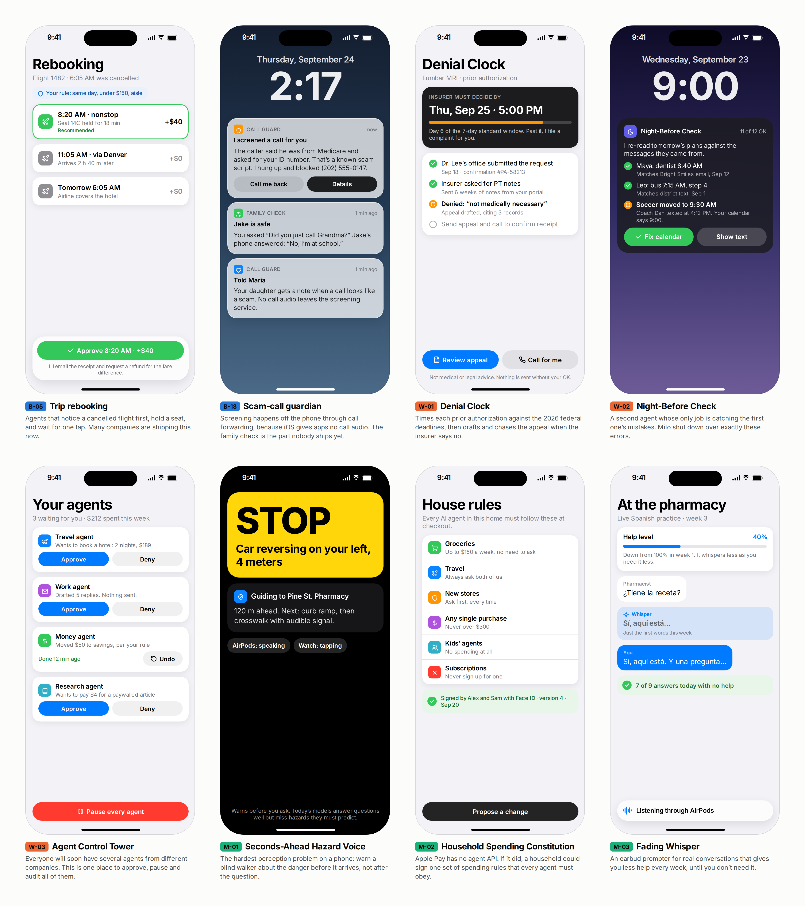

# Agentic iPhone: three books

Three connected books about phones that **plan and act for you**, written in September 2026, a week after iOS 27 shipped Siri AI as a beta. Each one reads as Markdown here on GitHub and as a PDF.

| | Book | The question it answers | Read |
|---|---|---|---|
| 1 | **[Agentic iOS: an idea atlas](#book-1-agentic-ios-an-idea-atlas)** | What agentic apps can you build on today's iPhone, and what stops the rest? 85 ideas in three tiers, the walls they hit, and how to build inside them. | [Online](#book-1-agentic-ios-an-idea-atlas) · [PDF, 325 pages](books/agentic-ios-idea-atlas.pdf) |
| 2 | **[iOS 27 in 7 Days](learn/README.md)** | How do you get an experienced iOS developer's mental model in a week? Swift 6.4, SwiftUI and Liquid Glass, data, App Intents and Siri AI, Foundation Models, Metal 4 and shipping, with a capstone app. | [Online](learn/README.md) · [PDF, 178 pages](learn/ios27-in-7-days.pdf) |
| 3 | **[The Agentic Phone](agentic-os/README.md)** | What would a phone look like if it were built for agents from the ground up? A home screen that is one conversation, apps as typed capabilities, and fixed code that decides what needs your OK. With a working simulator. | [Online](agentic-os/README.md) · [PDF, 201 pages](books/the-agentic-phone.pdf) · [Simulator](agentic-os/prototype/) |

Read them in any order. If you're new to iOS, start with book 2. If you want ideas to build, start with book 1. If you want to argue about where phones go next, start with book 3.

## Book 3 at a glance: The Agentic Phone

Today, Siri reaches into apps one declared action at a time. The Agentic Phone designs the alternative. Its home screen is **the Line**, one conversation you type or talk into. Apps become **capability packs**: typed actions such as `audio.setVolume` or `alarms.create`, each with an **effect class** (read, reversible, consequential, irreversible). Between the model that plans and every capability sits **the Gate**, deterministic code that allows, asks or denies. The model never approves its own actions. Everything lands in a **ledger** with an Undo where undo is possible, and incoming messages are read in **quarantine**, so instructions hidden inside them are data, not commands.

The [simulator](agentic-os/prototype/) is a single HTML file, [`the-line.html`](agentic-os/prototype/the-line.html), that runs in any browser with nothing to install: 26 system capabilities, three autonomy modes, grants, Face ID for payments, spend caps, voice input, and a message that tries to hijack the assistant. Try "Set an alarm for sleep", "Change the headphone level" or "Pay Sam $80". The book has 15 chapters and a manifest appendix, backed by [157 sourced research items](agentic-os/research/).

## Book 2 at a glance: iOS 27 in 7 Days

A seven-day plan for building the mental model of an iOS developer with five years' experience. It targets iOS 27 only, with no backward compatibility.

| Day | Topic |
|---|---|
| 0 | [Mental models](learn/00-mental-models.md): how the platform thinks |
| 1 | [Swift 6.4 and concurrency](learn/day1-swift-and-concurrency.md) |
| 2 | [SwiftUI, Liquid Glass and design](learn/day2-swiftui-liquid-glass-design.md) |
| 3 | [Data, lifecycle and the system](learn/day3-data-lifecycle-system.md) |
| 4 | [App Intents, Siri AI and system surfaces](learn/day4-app-intents-siri-system-surfaces.md) |
| 5 | [Apple Intelligence and on-device ML](learn/day5-apple-intelligence-and-ml.md) |
| 6 | [Metal 4: graphics and compute](learn/day6-metal4-graphics-and-compute.md) |
| 7 | [Ship like a senior](learn/day7-ship-like-a-senior.md) |

Plus a [capstone app](learn/capstone-errand.md) built across the week, five [cheat sheets](learn/cheatsheets/), and a [glossary](learn/glossary.md) of 219 terms. Every API was checked against Apple's documentation, and each chapter had an independent review.

## Book 1: Agentic iOS, an idea atlas

An atlas of iPhone apps that plan and act for you, not just chat. It has three tiers:

- **B · Being built now**: what companies and indie developers are shipping in 2025–2026, and how it's going.
- **W · Whitespace**: apps that today's iPhone could run, but almost nobody is building.
- **M · Moonshots**: apps worth wanting that are still genuinely hard, and the specific wall each one hits.

Every idea gets a card with the moment it helps, how the agent works (with a diagram), which iOS frameworks it would use, what makes it hard, how it could go wrong, the **unsaid assumptions** it depends on, and the **unknown unknowns** nobody has answered yet.

<!-- BEGIN GENERATED:stats -->
| Tier | Ideas | What it means |
|---|---|---|
| **B · Being built now** | [26](ideas/README.md#being-built-now-26) | Shipping or in active development in 2025–2026. Proven demand; the race is on execution. |
| **W · Whitespace** | [33](ideas/README.md#whitespace-33) | Feasible on today's iPhone, but almost nobody is building it. The unclaimed ground. |
| **M · Moonshots** | [26](ideas/README.md#moonshots-26) | Worth wanting, genuinely hard. Blocked by platform walls, trust, physics, or unsolved research. |
| **Total** | **85** | across 12 categories |
<!-- END GENERATED:stats -->

## Flagship ideas

Eight ideas that best show what each tier looks like. Each has a deep dive and a mockup.

<!-- BEGIN GENERATED:flagships -->
| | Idea | Tier | Why it's interesting |
|---|---|---|---|
| B-05 | [**Trip booking and rebooking agents**](ideas/building-now/B-05-trip-rebooking-agents.md) Agents that search and book trips and, when a flight dies, propose a rebooking before you reach the desk. | Building now | The pattern the whole iPhone agent industry converged on: cloud does the work, the Lock Screen asks for the OK. |
| B-18 | [**Scam-call guardian agents**](ideas/building-now/B-18-scam-call-guardians.md) An AI screens unknown callers, flags scam scripts and cloned voices, and alerts family before money moves. | Building now | Where agents protect instead of act, and where iOS walls hurt the most (no call audio for third parties). |
| W-01 | [**Denial Clock**](ideas/whitespace/W-01-denial-clock.md) Times your prior auths against the insurer's legal deadlines, then runs the appeal when the answer is no. | Whitespace | New 2026 federal deadlines give a patient-side agent something rare: hard rules to hold an insurer to. |
| W-02 | [**Night-Before Check**](ideas/whitespace/W-02-night-before-check.md) A separate checker agent that re-verifies tomorrow's family plans against the original messages each evening. | Whitespace | A direct answer to why Milo shut down: a second agent whose only job is to catch the first one's mistakes. |
| W-03 | [**Agent Control Tower**](ideas/whitespace/W-03-agent-control-tower.md) One iPhone inbox to approve, pause and audit every AI agent that acts for you, whoever made it. | Whitespace | People already run agents from several companies at once. Nobody offers one place to see, approve and stop all of them. |
| M-01 | [**Seconds-Ahead Hazard Voice**](ideas/moonshot/M-01-seconds-ahead-hazard-voice.md) Warns a blind walker about the reversing car or open trench before they reach it, not after they ask. | Moonshots | The hardest perception problem on a phone, with the highest stakes: warn before the danger, not after the question. |
| M-02 | [**Household Spending Constitution**](ideas/moonshot/M-02-household-spending-constitution.md) One set of spending rules, signed with Face ID, that every AI agent in your home must follow at checkout. | Moonshots | Apple Pay has no agent API. This is what a household's rules for AI spending could look like if it did. |
| M-03 | [**Fading Whisper**](ideas/moonshot/M-03-fading-whisper.md) An earbud prompter for real conversations in a new language that gives you less help every week. | Moonshots | An assistant designed to make itself unnecessary: less help every week until you don't need it. |
<!-- END GENERATED:flagships -->

The screens were designed in Figma ([Agentic iOS Apps — Idea Atlas](https://www.figma.com/design/FWoProYYQvSGluivc9NX5m)). More on the patterns behind them: **[Agent UI patterns](docs/ui-patterns.md)**.

## What counts as "agentic"

An app is agentic when it takes several steps toward a goal on your behalf: it reads, decides, acts, checks, and remembers. A chatbot that answers questions isn't. An app that watches your flight, finds a new one when it's cancelled, holds a seat, and asks you to approve the fare difference is.

How much it does before asking you is the most important design choice. Every card names its rung on this ladder:

## The walls

iOS is the hardest platform to build an agent on. A third-party app can't read or tap other apps, can't read your texts or the Mail app, can't hear phone calls, and can't run forever in the background. So most serious agents run their loop in the cloud and use the iPhone to brief, show and ask.

Full list with workarounds and sources: **[docs/the-walls.md](docs/the-walls.md)**.

## All ideas

<!-- BEGIN GENERATED:all-ideas -->
### B · Being built now

_Shipping or in active development in 2025–2026. Proven demand; the race is on execution._

- **[B-01](ideas/building-now/B-01-cloud-errand-agents.md) Cloud-computer errand agents** — Tell one app a goal; it works in a cloud browser and pings your iPhone for logins and the Pay button.
- **[B-02](ideas/building-now/B-02-phone-call-errand-agents.md) Phone-call errand agents** — An agent phones businesses from a cloud number to get quotes, hold slots and wait on hold, then reports back.
- **[B-03](ideas/building-now/B-03-inbox-triage-drafts.md) Inbox triage-and-draft agents** — An agent sorts your mail, writes replies in your voice and leaves them in Drafts for you to send.
- **[B-04](ideas/building-now/B-04-scheduling-negotiators.md) Scheduling negotiator agents** — CC or text an assistant; it trades times with the other side, sends the invite and chases replies.
- **[B-05](ideas/building-now/B-05-trip-rebooking-agents.md) Trip booking and rebooking agents** — Agents that search and book trips and, when a flight dies, propose a rebooking before you reach the desk.
- **[B-06](ideas/building-now/B-06-price-watch-auto-buy.md) Price-watch auto-buy agents** — Set a target price once; the agent watches the item and buys when it drops, within a budget you set.
- **[B-07](ideas/building-now/B-07-money-autopilot.md) Money autopilot agents** — Link your accounts; the agent plans goals and moves money within your limits, then texts you what it did.
- **[B-08](ideas/building-now/B-08-bill-fighting-agents.md) Bill-fighting and cancel agents** — An agent calls, emails and chats with companies to lower bills, cancel subscriptions and chase refunds.
- **[B-09](ideas/building-now/B-09-health-record-readers.md) Health-record reading assistants** — Assistants that read Apple Health and medical records to explain labs and prep you for appointments.
- **[B-10](ideas/building-now/B-10-wearable-training-coaches.md) Wearable-driven training coaches** — Coaches that rewrite today's workout from last night's sleep, HRV and strain, then nudge you on the wrist.
- **[B-11](ideas/building-now/B-11-meeting-memory-capture.md) Meeting and memory capture** — Your phone, Watch or a pendant records the conversation; the agent writes notes, to-dos and follow-ups.
- **[B-12](ideas/building-now/B-12-family-logistics-agents.md) Family logistics agents** — A household agent that turns school emails, flyers and texts into shared calendars, chores and grocery orders.
- **[B-13](ideas/building-now/B-13-messaging-native-agents.md) Messaging-native personal agents** — A personal agent you text in iMessage or WhatsApp; it watches your accounts and texts you first.
- **[B-14](ideas/building-now/B-14-self-hosted-agent-node.md) Self-hosted agents, iPhone as node** — Run your own agent on a home server; the iPhone app lends it the camera, location and your approvals.
- **[B-15](ideas/building-now/B-15-on-phone-app-builders.md) On-phone app builders** — Describe an app on your iPhone; an agent writes it, builds it on cloud Macs and sends it to TestFlight.
- **[B-16](ideas/building-now/B-16-carplay-voice-agents.md) CarPlay voice agents** — Talk to an AI assistant through CarPlay; it answers, drafts and plans, then hands follow-ups to your phone.
- **[B-17](ideas/building-now/B-17-ai-conversation-tutors.md) AI conversation tutors** — Speak with an AI character that adapts mid-conversation; strong at talk, weak at planning your practice week.
- **[B-18](ideas/building-now/B-18-scam-call-guardians.md) Scam-call guardian agents** — An AI screens unknown callers, flags scam scripts and cloned voices, and alerts family before money moves.
- **[B-19](ideas/building-now/B-19-blind-assist-scene-agents.md) Blind-assist scene agents** — Point the camera and an AI reads, describes and answers questions, then hands off to a person if needed.
- **[B-20](ideas/building-now/B-20-voice-home-errands-agents.md) Voice home-and-errands agents** — Say what you need and a voice assistant books the ride, the table or the repair through partner services.
- **[B-21](ideas/building-now/B-21-apple-built-in-agents.md) Apple's built-in agents** — Siri AI chains app actions, the Phone app waits on hold and screens callers, and Passwords can reset logins.
- **[B-22](ideas/building-now/B-22-safari-shopping-extensions.md) Safari shopping-extension agents** — A Safari extension checks the product page you're on against new and resale prices, and applies coupons.
- **[B-23](ideas/building-now/B-23-adhd-task-breakdown.md) ADHD task-breakdown planners** — Apps that turn a brain dump or a screenshot into small steps, well-timed reminders and check-ins.
- **[B-24](ideas/building-now/B-24-medical-bill-dispute.md) Medical-bill dispute tools** — Photograph an itemized bill; the tool flags suspect charges and writes the dispute letter and call script.
- **[B-25](ideas/building-now/B-25-pocket-agent-supervision.md) Pocket supervision of work agents** — Hand a task to a work agent from your phone, watch it run elsewhere, and approve or reject risky steps.
- **[B-26](ideas/building-now/B-26-offline-on-device-llm.md) Offline on-device LLM apps** — Run open models entirely on your iPhone; a few now add tool calling, Shortcuts actions and local APIs.

### W · Whitespace

_Feasible on today's iPhone, but almost nobody is building it. The unclaimed ground._

- **[W-01](ideas/whitespace/W-01-denial-clock.md) Denial Clock** — Times your prior auths against the insurer's legal deadlines, then runs the appeal when the answer is no.
- **[W-02](ideas/whitespace/W-02-night-before-check.md) Night-Before Check** — A separate checker agent that re-verifies tomorrow's family plans against the original messages each evening.
- **[W-03](ideas/whitespace/W-03-agent-control-tower.md) Agent Control Tower** — One iPhone inbox to approve, pause and audit every AI agent that acts for you, whoever made it.
- **[W-04](ideas/whitespace/W-04-really-you-check.md) Really-You Check** — One tap during a scary call pings the relative's own phone: 'Did you just call Grandma?'
- **[W-05](ideas/whitespace/W-05-dread-opener.md) Dread Opener** — Reads the letter you've avoided for weeks, tells you how bad it really is, and does all but the last tap.
- **[W-06](ideas/whitespace/W-06-accommodations-booked-ahead.md) Accommodations Booked Ahead** — Requests the ASL interpreter, captioner or language interpreter you're owed, then chases it until confirmed.
- **[W-07](ideas/whitespace/W-07-deaf-first-call-agent.md) Deaf-First Call Agent** — Sits through phone trees and hold music, handles routine questions, then hands you the call in captions.
- **[W-08](ideas/whitespace/W-08-paper-round-trip.md) Paper Round-Trip** — Reads the letter aloud, fills the form with you by voice, then mails or faxes it back before the deadline.
- **[W-09](ideas/whitespace/W-09-pause-and-ask-errands.md) Pause-and-Ask Errands** — A web-errand agent built for VoiceOver: it does the task and stops at every real choice instead of guessing.
- **[W-10](ideas/whitespace/W-10-co-sign-not-guardian.md) Co-Sign, Not Guardian** — Runs errands for people with cognitive disabilities under their own rules for when a supporter co-signs.
- **[W-11](ideas/whitespace/W-11-paratransit-trip-keeper.md) Paratransit Trip Keeper** — Books next-day paratransit rides from your calendar, cancels in time, and fights wrongful no-show strikes.
- **[W-12](ideas/whitespace/W-12-agent-janitor.md) Agent Janitor** — Checks what your agents actually did and fixes their mistakes while the undo window is still open.
- **[W-13](ideas/whitespace/W-13-canary-garden.md) Canary Garden** — Plants harmless trap instructions in your own calendar and inbox to test whether your agents can be hijacked.
- **[W-14](ideas/whitespace/W-14-agent-doorman.md) Agent Doorman** — A front desk for other people's AI agents: it answers, negotiates or turns them away so you don't have to.
- **[W-15](ideas/whitespace/W-15-two-house-handoff.md) Two-House Handoff** — Each co-parent has an agent; the two agents settle swaps, kid gear and cost splits within the parenting plan.
- **[W-16](ideas/whitespace/W-16-ulysses-money-pact.md) Ulysses Money Pact** — Set money rules for your future self now; the agent holds you to them when a charming stranger asks.
- **[W-17](ideas/whitespace/W-17-ballot-cure-watch.md) Ballot Cure Watch** — Watches your mail ballot's status and, if it's flagged, gets the cure form signed and in before the deadline.
- **[W-18](ideas/whitespace/W-18-refill-runway.md) Refill Runway** — Runs the monthly relay between you, your prescriber and pharmacies so a controlled med never runs out.
- **[W-19](ideas/whitespace/W-19-ghost-network-buster.md) Ghost Network Buster** — Calls down your plan's therapist list to find who is really taking patients, and files the gap if nobody is.
- **[W-20](ideas/whitespace/W-20-chart-check.md) Chart Check** — Reads the note your doctor's AI scribe wrote about you, flags what's wrong, and drafts the correction.
- **[W-21](ideas/whitespace/W-21-discharge-scramble.md) Discharge Scramble** — Told to pick a nursing home by tomorrow? It calls every one for a bed and watches Medicare appeal deadlines.
- **[W-22](ideas/whitespace/W-22-errand-immersion.md) Errand Immersion** — Turns errands you already have into target-language practice: preps the phrases, cues you, then debriefs.
- **[W-23](ideas/whitespace/W-23-collector-line.md) Collector Line** — A separate number your AI answers when debt collectors, and their voice bots, call about a debt.
- **[W-24](ideas/whitespace/W-24-coverage-clock.md) Coverage Clock** — When your flight slips, a Live Activity shows which card and airline protections apply, then files the claims.
- **[W-25](ideas/whitespace/W-25-shadow-file-auditor.md) Shadow File Auditor** — Pulls the little-known reports that set your rent, insurance and bank access, and disputes the errors.
- **[W-26](ideas/whitespace/W-26-benefits-keeper.md) Benefits Keeper** — Keeps Medicaid and SNAP from lapsing over paperwork: logs hours, reads notices and files proof on time.
- **[W-27](ideas/whitespace/W-27-leak-bill-detective.md) Leak Bill Detective** — Turns a shocking water bill into a found leak, a fixed pipe, and the utility's leak credit.
- **[W-28](ideas/whitespace/W-28-should-this-be-free.md) Should This Be Free?** — Before you pay for a car repair, it checks recalls, the emissions warranty and quiet coverage extensions.
- **[W-29](ideas/whitespace/W-29-step-free-scout.md) Step-Free Scout** — For wheelchair users: it calls venues about access, then reroutes you live when a station elevator breaks.
- **[W-30](ideas/whitespace/W-30-shelf-price-witness.md) Shelf Price Witness** — Catches checkout overcharges by matching shelf tags you photographed to your receipt, then claims the refund.
- **[W-31](ideas/whitespace/W-31-deactivation-defense-file.md) Deactivation Defense File** — Keeps a gig worker's own evidence ledger and drafts the appeal when a platform's algorithm cuts them off.
- **[W-32](ideas/whitespace/W-32-between-clients-wage-check.md) Between-Clients Wage Check** — For home-care aides: logs the drive between clients and checks each paycheck for unpaid travel time.
- **[W-33](ideas/whitespace/W-33-stuck-invoice-detective.md) Stuck Invoice Detective** — Finds out why a big client hasn't paid (no PO, vendor not set up, wrong portal) and fixes that step.

### M · Moonshots

_Worth wanting, genuinely hard. Blocked by platform walls, trust, physics, or unsolved research._

- **[M-01](ideas/moonshot/M-01-seconds-ahead-hazard-voice.md) Seconds-Ahead Hazard Voice** — Warns a blind walker about the reversing car or open trench before they reach it, not after they ask.
- **[M-02](ideas/moonshot/M-02-household-spending-constitution.md) Household Spending Constitution** — One set of spending rules, signed with Face ID, that every AI agent in your home must follow at checkout.
- **[M-03](ideas/moonshot/M-03-fading-whisper.md) Fading Whisper** — An earbud prompter for real conversations in a new language that gives you less help every week.
- **[M-04](ideas/moonshot/M-04-voiceover-map-agent.md) Agent That Reads VoiceOver's Map** — An on-device agent that works any app through its accessibility tree, the way VoiceOver does, for blind users.
- **[M-05](ideas/moonshot/M-05-assistive-agent-pass.md) Assistive Agent Pass** — Lets a disabled person's agent past CAPTCHAs and bot walls, the way sites must already admit a screen reader.
- **[M-06](ideas/moonshot/M-06-proxy-passport.md) Proxy Passport** — A scoped, revocable 'you may act for me' credential your agent shows pharmacies, insurers and agencies.
- **[M-07](ideas/moonshot/M-07-context-passport.md) Context Passport** — Each piece of your data carries where it came from, and no agent can send it somewhere it doesn't belong.
- **[M-08](ideas/moonshot/M-08-trial-inbox.md) Trial Inbox** — Flips trial matching: sponsors' agents query your private eligibility profile, and your phone answers.
- **[M-09](ideas/moonshot/M-09-decade-memory.md) Decade Memory That Moves** — Personal memory that learns you for a decade, survives every phone and model upgrade, and resists poisoning.
- **[M-10](ideas/moonshot/M-10-agent-mistake-warranty.md) Agent Mistake Warranty** — Signs what your agents may do, checks what they actually did, and chases the refund when they overstep.
- **[M-11](ideas/moonshot/M-11-agent-will.md) Agent Will** — Tells every agent acting in your name what to do after you die: stop buying, hand off, say goodbye.
- **[M-12](ideas/moonshot/M-12-household-agent-treaty.md) Household Agent Treaty** — Each family member's own agent negotiates the week with the others, without pooling private calendars.
- **[M-13](ideas/moonshot/M-13-blackout-mode-agent.md) Blackout Mode Agent** — When a disaster cuts service, it plans on the phone, drafts tiny satellite messages, and queues the rest.
- **[M-14](ideas/moonshot/M-14-sextortion-first-responder.md) Sextortion First Responder** — A private guide for a teen facing sextortion at 1 a.m.: don't pay, keep proof, report, find an adult.
- **[M-15](ideas/moonshot/M-15-zero-cloud-exit-planner.md) Zero-Cloud Exit Planner** — A plan for safely leaving an abusive home that lives only on your phone and works alongside an advocate.
- **[M-16](ideas/moonshot/M-16-mid-call-voice-stand-in.md) Mid-Call Voice Stand-In** — Speaks for people who can't talk fast, in their own banked voice, inside a live call, then hands back.
- **[M-17](ideas/moonshot/M-17-2am-fever-triage.md) 2 a.m. Fever Triage** — With a sick child at 2 a.m., it gathers the facts, gets a licensed nurse on the line, and follows through.
- **[M-18](ideas/moonshot/M-18-med-pass-witness.md) Med-Pass Witness** — Camera glasses watch a family caregiver give each dose, check it against the list, and prep refills.
- **[M-19](ideas/moonshot/M-19-fourth-trimester-sentinel.md) Fourth Trimester Sentinel** — Watches blood pressure and warning signs for six weeks after birth and gets the OB team on the line fast.
- **[M-20](ideas/moonshot/M-20-exam-room-advocate.md) Exam Room Advocate** — Sits in on your parent's appointment, keeps the agenda, and turns what the doctor said into next steps.
- **[M-21](ideas/moonshot/M-21-bot-to-bot-dispute-desk.md) Bot-to-Bot Dispute Desk** — Your agent argues a refund or claim directly with the company's AI, using signed evidence.
- **[M-22](ideas/moonshot/M-22-consumer-agent-union.md) Consumer Agent Union** — Thousands of personal agents pool private proof of the same unfair fee and bargain with the company as one.
- **[M-23](ideas/moonshot/M-23-kiosk-hands.md) Kiosk Hands** — Glasses watch a touchscreen and guide a blind user's finger, step by step, through any kiosk.
- **[M-24](ideas/moonshot/M-24-pocket-public-adjuster.md) Pocket Public Adjuster** — After a fire or flood, it rebuilds what you owned and argues the contents claim with your insurer.
- **[M-25](ideas/moonshot/M-25-worker-side-dispatch-agent.md) Worker-Side Dispatch Agent** — Works for the driver or per-diem nurse, not the platform: screens every offer and bargains back.
- **[M-26](ideas/moonshot/M-26-scope-creep-catcher.md) Scope Creep Catcher** — Hears 'while you're here, could you also...' on the job and gets a change order signed before you start it.
<!-- END GENERATED:all-ideas -->

The full sortable index with scores is in **[ideas/README.md](ideas/README.md)**.

## Read more

| Doc | What's in it |
|---|---|
| [The landscape, September 2026](docs/landscape-2026.md) | Who is shipping what, a timeline, what's working and what isn't |
| [The walls](docs/the-walls.md) | Every technical, policy, money and security wall, with workarounds |
| [Reference architecture](docs/reference-architecture.md) | How to build an agentic iPhone app inside the walls, with diagrams |
| [Unsaid and wrong assumptions](docs/assumptions.md) | The beliefs that sink agent products, and the open questions |
| [Agent UI patterns](docs/ui-patterns.md) | Mockups of approval, status, receipt and guardrail screens |
| [How this atlas was made](docs/method.md) | Sources, scoring, and the limits of this snapshot |
| [iOS 27 in 7 days](learn/README.md) | The learning hub: mental models, APIs and a capstone app, as chapters and a [PDF](learn/ios27-in-7-days.pdf) |
| [The Agentic Phone](agentic-os/README.md) | The third book: an agentic phone OS designed from the ground up, with a [browser simulator](agentic-os/prototype/) and its own [research](agentic-os/research/) |
| [Research notes](research/README.md) | The raw findings behind the atlas, with confidence tags and sources |

## Repository layout

| Path | What's there |
|---|---|
| [`ideas/`](ideas/README.md), [`docs/`](docs/), [`data/`](data/) | Book 1: generated idea cards, the terrain chapters, and `ideas.json`, the source of truth |
| [`learn/`](learn/README.md) | Book 2: chapters, cheat sheets, capstone, glossary, PDF |
| [`agentic-os/`](agentic-os/README.md) | Book 3: chapters, research, assets, and the [simulator](agentic-os/prototype/) |
| [`books/`](books/) | The PDFs of books 1 and 3 |
| [`research/`](research/README.md) | The research behind book 1 |
| [`scripts/`](scripts/) | `build.py` (cards and charts), `pdf/build.mjs` (all three PDFs), `check_mermaid.mjs` (diagram check), `appledoc.py` (Apple docs lookup) |

## Contributing

Found something wrong, or an idea that belongs here? See [CONTRIBUTING.md](CONTRIBUTING.md). Everything under `ideas/` is generated from [`data/ideas.json`](data/ideas.json) by `scripts/build.py`.

## License

Text, data and images: [CC BY 4.0](LICENSE). Scripts: [MIT](LICENSE-CODE).

Apple, iPhone, Siri, and other product names are trademarks of their owners. This project isn't affiliated with or endorsed by Apple or any company named here.
