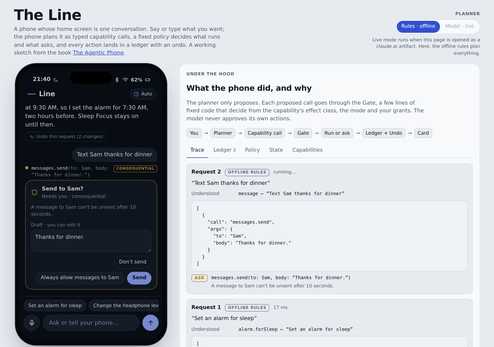

# The Agentic Phone

**A design for what comes after apps.** This is the third book in this repository. It designs a phone operating system from the ground up whose home screen is a single conversation. You type or talk; the phone plans the request as typed capability calls; fixed code decides what runs and what needs your OK; and every action lands in a ledger with an undo.

Nobody ships this phone yet, and Apple doesn't have the infrastructure or the APIs for it. Every piece has precedent, though: typed action registries (App Intents and app schemas, Android AppFunctions, MCP), supervised agents that operate apps, permission modes and checkpoints from coding agents, and prompt-injection defenses from security research. The book arranges those pieces around a conversation instead of a grid of icons. It argues the result is buildable in principle and says how, what it costs, and where it could go wrong.

**Read it:** [as chapters](#contents) · as a PDF: [`books/the-agentic-phone.pdf`](../books/the-agentic-phone.pdf) · **Try it:** [the simulator](prototype/)

## The idea in one screen

| Today | The agentic phone |
|---|---|
| A grid of apps is the front door | **The Line**, one conversation, is the front door |
| An app is a program with screens | An app is a **capability pack**: typed actions, cards to show results, and optionally a full-screen **surface** |
| Siri reaches into apps one declared action at a time | A **planner** turns what you said into capability calls |
| Each app decides when to ask you | **The Gate**, deterministic code, decides from each capability's **effect class** (read, reversible, consequential, irreversible), your **mode** and your **grants**. The model never approves itself. |
| Undo depends on the app | Every action is in the **ledger**, with an Undo wherever undo is possible and an honest "Final" where it isn't |
| Incoming messages and web pages go wherever the app sends them | Untrusted content is read in **quarantine**. Instructions inside it are data, never commands. |

## Contents

| | Chapter | What it covers |
|---|---|---|
| | [Preface](chapters/00-preface.md) | Why the phone feels static, the Siri bottleneck, and what this book is and isn't |
| 1 | [From apps to intents](chapters/01-the-case.md) | Viv to Siri AI; Rabbit, Humane, Doubao, Honor, Gemini; what failed and why now |
| 2 | [Twelve principles](chapters/02-principles.md) | The rules the design follows, each with evidence and what it rules out |
| 3 | [A day with the agentic phone](chapters/03-a-day.md) | From 6:30 AM to night, scene by scene, with what happens under the hood |
| 4 | [The Line](chapters/04-the-line.md) | The home screen: composer, receipts, cards, threads, modes, notifications, surfaces |
| 5 | [Architecture](chapters/05-architecture.md) | The whole stack, and one request traced end to end |
| 6 | [Capabilities: the new app model](chapters/06-capabilities.md) | The manifest, effect classes, undo and compensation, discovery, fallbacks |
| 7 | [Cards: generated interfaces](chapters/07-cards.md) | A fixed component catalog versus generated code; live binding; accessibility |
| 8 | [Voice](chapters/08-voice.md) | Latency, turn-taking, barge-in, read-back, wake words, earcons |
| 9 | [Trust, safety and undo](chapters/09-trust.md) | Threat model, the Gate, grants, quarantine, the ledger, spend caps, overreliance |
| 10 | [Memory](chapters/10-memory.md) | Personal context with provenance, editing, forgetting and poisoning defenses |
| 11 | [Models and compute](chapters/11-models.md) | On-device and private cloud, routing, latency, energy, cost, evaluation |
| 12 | [Developers and the economy](chapters/12-developers.md) | What an app becomes, ranking, payments, review, antitrust, opt-outs |
| 13 | [How to build it today](chapters/13-building-it.md) | Five build paths, from a web simulator to an AOSP fork, with the exact walls |
| 14 | [The simulator](chapters/14-the-simulator.md) | A walkthrough of the working prototype in this folder |
| 15 | [Open problems, and what Apple could do](chapters/15-open-problems.md) | What nobody has solved, and specific asks mapped to Apple's existing technology |
| A | [Capability manifest reference](chapters/appendix-a-manifest.md) | Every manifest field, the effect classes, and the Gate's decision table |

## The simulator

[`prototype/`](prototype/) is a working sketch of the Line in the browser. Open `index.html`; there's nothing to install.

It has 26 system capabilities with effect classes, the Gate with three modes and grants, a ledger with per-action and per-request undo, live cards, voice input, and simulated events, including a message that tries to hijack the assistant. The planner is either offline rules or a live model that sees the capabilities as tools. Either way, every call goes through the same Gate. Try "Set an alarm for sleep", "Change the headphone level", "Connect to Bluetooth", "Pay Sam $80".

## Research

The book's claims about the real world come from four sourced research files in [`research/`](research/), each item rated verified, likely or uncertain:

| File | Items | Covers |
|---|---|---|
| [`prior-art.json`](research/prior-art.json) | 38 | Agent phones, gadgets and assistants from Viv to rabbitOS 3, Doubao, Honor YOYO, Gemini screen automation and Siri AI |
| [`architecture.json`](research/architecture.json) | 43 | LLM-as-OS, MCP and its peers, generative UI, capability security, prompt-injection defenses, memory, scheduling |
| [`interaction.json`](research/interaction.json) | 43 | Coding-agent interaction patterns, voice, direct manipulation versus delegation, accessibility, trust |
| [`build-paths.json`](research/build-paths.json) | 33 | What iOS, Android and Linux let you build today; models and costs; benchmarks |

The research snapshot is dated September 24, 2026.

## Related books in this repository

- **[Agentic iOS: an idea atlas](../README.md)** — 85 agentic iPhone app ideas that can be built inside today's walls, plus moonshots that can't ([PDF](../books/agentic-ios-idea-atlas.pdf)).
- **[iOS 27 in 7 Days](../learn/README.md)** — the platform those ideas run on, as a seven-day course ([PDF](../learn/ios27-in-7-days.pdf)).

This book is the other side of both: the atlas asks what agents can do on the phone we have, and this book asks what phone agents need.
