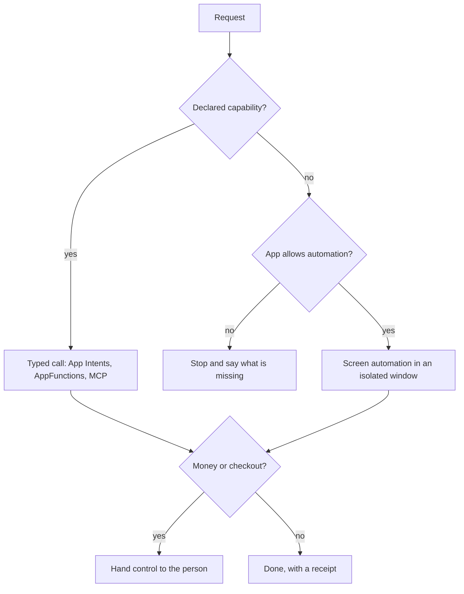
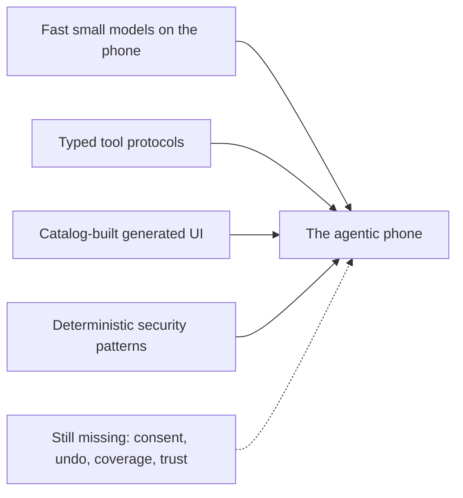

# 1. From apps to intents

The idea behind this book is old. For at least a decade, companies have tried to replace "find the app, then find the screen" with "say what you want." Most of those attempts failed, and they failed in ways that teach something. This chapter walks through the record: the first assistant platforms, the slow work of getting apps to declare what they can do, and the 2024–2026 wave of AI gadgets, agent phones and platform agents. It ends with what changed recently enough to make a different design possible, and what is still missing.

The rest of the book designs against these lessons. Where this chapter says "the agentic phone," it means the book's proposal: a phone whose home screen is a conversation called **the Line**, whose apps become typed **capabilities** the agent can call, and whose safety rests on a deterministic **Gate** between the model and every action. The [preface](00-preface.md) introduces the vocabulary. [Chapter 2](02-principles.md) turns this history into principles.

## Wave 1: assistants as a layer (2011–2018)

Apple introduced Siri as a beta on the iPhone 4S on October 4, 2011 ([Apple](https://www.apple.com/newsroom/2011/10/04Apple-Launches-iPhone-4S-iOS-5-iCloud/)). Google unveiled Google Assistant at I/O on May 18, 2016 ([TechCrunch](https://techcrunch.com/2016/05/18/google-unveils-google-assistant-a-big-upgrade-to-google-now/)). Both began as a voice layer over a phone that was otherwise organized around apps, and both could act only where someone had wired them in.

Two more ambitious attempts from the same period matter more for this book.

**Viv**, built by Siri's creators, promised a single conversational interface that would understand intent and "write code to effect that intent" across third-party services, by generating a program over a graph of services that developers supplied. Samsung acquired Viv in October 2016. Its technology folded into Bixby with limited impact ([TechCrunch](https://techcrunch.com/2016/10/05/samsung-acquires-viv-a-next-gen-ai-assistant-built-by-creators-of-apples-siri), [Wikipedia](https://en.wikipedia.org/wiki/Viv_(software))).

**Facebook M** was a concierge inside Messenger that booked and bought things for you. Hard requests went to hidden human "M Trainers." The human-powered version reached only about 2,000 users, and Facebook shut M down in January 2018 because the human cost didn't scale ([TechCrunch](https://techcrunch.com/2018/01/08/facebook-is-shutting-down-its-standalone-personal-assistant-m/), [Wikipedia](https://en.wikipedia.org/wiki/M_(virtual_assistant))).

Neither failed on language. Viv failed on coverage: an assistant is only as useful as the services it can reach, and every service had to be integrated by hand. M failed on unit economics: each hard request cost a human's time. Large language models solve the language part of the problem. They solve neither coverage nor cost per task on their own, and any new design has to plan for both from the first day.

On Android, the 2016 assistant is now being retired. Google has begun replacing Google Assistant with Gemini on Android phones, starting September 4, 2026, according to [9to5Google](https://9to5google.com/2026/08/04/google-assistant-september-2026-shutdown/).

## Apps learn to declare what they can do (2016–2026)

While assistants struggled for coverage, Apple built a structured way for apps to expose actions. The sequence is worth knowing because it is the closest thing to a capability layer on a phone today.

- **SiriKit** (iOS 10) let apps handle standard system intents "such as playing music or sending a text message," in fixed domains; Apple's sample code covers ride booking, payments, workouts and audio ([Apple](https://developer.apple.com/documentation/sirikit)). If your app's action wasn't in a domain, Siri couldn't reach it.
- **Siri Shortcuts** (iOS 12) let apps "donate" actions each time the user performs them, so Siri can suggest them and users can attach voice phrases or chain them in the Shortcuts app ([Donating Shortcuts](https://developer.apple.com/documentation/sirikit/donating-shortcuts), [INVoiceShortcutCenter](https://developer.apple.com/documentation/intents/invoiceshortcutcenter)). The user did the composing.
- **App Intents** (iOS 16) let any app declare its actions and data types in code, so the compiler can generate what Siri, Spotlight, Shortcuts, widgets and the Action button need to discover and run them ([Apple](https://developer.apple.com/documentation/appintents)). Apple's documentation now describes SiriKit as providing "legacy support" and points developers to App Intents for Apple Intelligence and Siri AI ([Apple](https://developer.apple.com/documentation/sirikit)).
- **App schemas** group intents into domains such as Mail, Messages, Photos and Calendar. When an email app conforms an intent to `.mail.createDraft`, "the system knows it can invoke that intent to create a new email draft in that app" ([Apple](https://developer.apple.com/documentation/appintents/app-schema-domains)). At WWDC26, Apple added entities indexed into a system semantic index, and Xcode now flags missing companion schemas: an app that adopts `sendMessage` must also adopt `draftMessage`, because confirmation needs a draft ([WWDC26 session 240](https://developer.apple.com/videos/play/wwdc2026/240/)). That last rule encodes "preview before you commit" in the type system, an idea the agentic phone takes further ([Chapter 6](06-capabilities.md)).

Apple then tried to put a planner on top. At WWDC in June 2024 it promised a personal Siri that could use personal context, see the screen, and act in and across apps through App Intents. In March 2025 it said the work would take "longer than we thought" and pulled the features from iOS 18. It added fine print to its marketing and faced false-advertising class actions ([MacRumors](https://www.macrumors.com/2025/03/07/apple-intelligence-siri-features-delayed/), [CNBC](https://www.cnbc.com/2025/03/07/apple-delays-siri-ai-improvements-to-2026.html), [MacRumors](https://www.macrumors.com/2025/03/12/apple-website-siri-features-fine-print/)). Apple didn't publish a technical reason. The lesson this book draws is an inference: the platform owner, with a typed intent system and full control of the OS, still couldn't ship reliable cross-app actions on its own schedule. The protocol was never the hard part.

The second attempt shipped last week. Apple announced **Siri AI** at WWDC on June 8, 2026 and released it with iOS 27 on September 14 as an English (US) beta for iPhone 15 Pro and later. It has its own chat-style app with a text box, a mic, attachments and conversation history synced over iCloud. It searches personal context across Messages, Mail and Photos, understands the screen and the camera view, and takes actions in and across apps ([Apple, June](https://www.apple.com/newsroom/2026/06/apple-introduces-siri-ai-a-profoundly-more-capable-and-personal-assistant/), [Apple, September](https://www.apple.com/newsroom/2026/09/siri-ai-a-profoundly-more-capable-and-personal-assistant-is-here/)). Its EU launch is delayed because of the Digital Markets Act ([Apple](https://www.apple.com/newsroom/2026/06/due-to-dma-siri-ai-delayed-in-eu-for-ios-27-and-ipados-27/)). According to secondary reporting, App Intents is now the only integration path for apps, requests route across on-device models, Private Cloud Compute and a custom Google Gemini model, and "Extensions" let users pick a third-party model provider ([TechTimes](https://www.techtimes.com/articles/318005/20260608/wwdc-2026-app-intents-replaces-sirikit-gemini-siri-migration-clock-starts.htm), [The Next Web](https://thenextweb.com/news/apple-wwdc-2026-siri-ai-gemini-ios-27)).

Siri AI matters to this book in two ways. The largest phone platform has committed to chat as a first-class surface and to a typed intent registry as the action layer, which is the direction this book takes. And it is still an assistant sitting over an app grid, which is the part this book changes. Whether a structured registry at this scale reaches the coverage Viv and SiriKit never did is an open question nobody can answer yet.

## Wave 2: gadgets that tried to replace the phone (2023–2026)

The first products of the LLM era tried to skip the phone entirely.

**Humane Ai Pin.** Unveiled in November 2023 and shipped in April 2024, it was a $699 lapel pin with a $24 monthly plan, no apps, voice and gesture input, and a laser display projected onto the palm ([TechCrunch](https://techcrunch.com/2023/11/09/humanes-ai-pin/)). Its CosmOS routed each request through an orchestration layer Humane called the "AI Bus," which chose among models, services and device functions without any app model ([Om Malik](https://om.co/2024/10/23/humane-has-a-plan-for-its-ai-first-operating-system/)). Reviews were brutal; Marques Brownlee called it "the worst product I've ever reviewed… for now" ([Dexerto](https://www.dexerto.com/tech/marques-brownlee-slams-humane-ai-pin-as-the-worst-product-hes-ever-reviewed-2646829/)). It overheated, answered slowly and was hard to read in sunlight. Returns outpaced sales from May to August 2024 ([Digital Trends](https://www.digitaltrends.com/phones/humane-ai-pin-more-returns-than-new-sales-report/)), and the charge case was recalled for fire risk ([CPSC](https://www.cpsc.gov/Recalls/2025/Humane-Recalls-Charge-Case-Accessory-for-Ai-Pin-Due-to-Lithium-Battery-Fire-Hazard)). HP bought Humane's assets for $116 million in February 2025, and every Pin stopped working on February 28 ([TechCrunch](https://techcrunch.com/2025/02/18/humanes-ai-pin-is-dead-as-hp-buys-startups-assets-for-116m)).

**Rabbit r1.** Announced at CES in January 2024, it was a $199 pocket device designed with Teenage Engineering and pitched around a "Large Action Model" that would operate services for you ([Rabbit](https://www.rabbit.tech/newsroom/introducing-r1), [Wikipedia](https://en.wikipedia.org/wiki/Rabbit_r1)). Reviews found it slow and its integrations unreliable, and people discovered its launcher ran as an Android app on ordinary phones. Third-party investigations reported that the service actions were largely scripted browser automation rather than a learned model; Rabbit disputed that ([Maui Mauricio](https://mauimauricio.live/blog/rabbit-r1-coffeezilla-and-the-lost-lam)). In mid-2024 a hacker group found hard-coded API keys in its code that could have exposed every r1 response ([Android Authority](https://www.androidauthority.com/rabbit-r1-security-flaw-3455555/)). Rabbit later added "teach mode," where you demonstrate a web task once and replay it. On September 22, 2026 it launched rabbitOS 3, a software agent reached from a browser, Telegram or iMessage that can drive up to five of your computers with models you choose, and told WIRED it had stopped making r1 and ruled out an r2 ([SiliconANGLE](https://siliconangle.com/2026/09/23/rabbit-returns-with-os3-a-personal-ai-agent-that-can-access-files-and-connect-computers/), [TechSpot](https://www.techspot.com/news/113954-rabbit-launches-os3-agentic-ai-platform-desktop-telegram.html)).

**Wearables.** The Friend pendant listened all day and texted commentary to your phone; reviewers found it slow, reporting replies that took 7 to 10 seconds ([Fortune](https://fortune.com/2025/10/03/friend-ai-necklace-review-avi-schiffmann/)). Memory pendants were absorbed by platforms: Amazon bought Bee in July 2025 ([TechCrunch](https://techcrunch.com/2025/07/22/amazon-acquires-bee-the-ai-wearable-that-records-everything-you-say/)) and Meta bought Limitless in December 2025 ([AI Business](https://aibusiness.com/speech-recognition/meta-acquires-limitless)).

The pattern is clear. A new device that can't reach your real apps, accounts and sensors loses to the phone that already has them. A screenless, voice-only device loses on every task that involves choosing from options, and on privacy when you have to talk in public. A cloud-only device dies with the vendor's servers. Rabbit's own pivot says it plainly: the agent moved onto devices people already own. The agentic phone therefore has to be the phone itself, with a real display, and it has to keep working offline for the basics ([Chapter 11](11-models.md)).

## The app-less phone that kept an app drawer

The next idea was to keep the phone and replace the home screen.

Brain Technologies' "Natural AI" generated an interface for each request instead of routing you into an app. Its founder's line was "you don't go to apps, apps come to you." Brain.ai dates the product to 2021, from its own materials. At MWC in February 2024, Deutsche Telekom showed a concept "app-less AI Phone" built on it, whose home screen was a prompt that "predicts and generates the next interface contextually" ([GlobeNewswire](https://www.globenewswire.com/news-release/2024/02/15/2830140/0/en/Deutsche-Telekom-and-Brain-ai-Unveil-Revolutionary-App-less-Phone-at-Mobile-World-Congress.html)). Swiping up still revealed a normal app drawer ([Android Police](https://www.androidpolice.com/telekom-concept-phone-go-app-free-not-entirely/)).

What Telekom actually shipped a year later was different. The T Phone 3 (August 2025, €149, with 18 months of Perplexity Pro) is an ordinary Android phone where a magenta lock-screen button opens the Perplexity Assistant, which answers questions and acts on preinstalled apps ([Deutsche Telekom](https://www.telekom.com/en/media/media-information/archive/deutsche-telekom-at-mwc-2025-ai-phone-flying-base-stations-and-self-healing-networks-1088708), [Light Reading](https://www.lightreading.com/smartphones-devices/deutsche-telekom-s-ai-phone-is-now-on-sale-in-ten-markets)). It sells in about ten markets, with no evidence of breakout adoption.

Nothing followed a similar route. Its Essential Key captures screenshots and voice notes into an AI-organized space, and Essential Apps generates small personal widgets from a sentence ([9to5Google](https://9to5google.com/2025/09/30/nothing-essential-ai-app-generator-promises/)). An AI-native OS is a later promise, reportedly for the first half of 2027 ([9to5Google](https://9to5google.com/2025/09/16/nothing-will-make-its-own-os-for-phones-and-beyond-first-ai-native-devices-in-2026/)).

"App-less" became "app-optional" every time. The workable part turned out to be one gesture from the lock screen to an agent, deep hooks into the default apps, and generated task-specific UI. The agentic phone keeps all three and makes apps a fallback you open deliberately (a **surface**) instead of the front door.

## Wave 3: agents that drive other apps' screens

If apps won't expose actions, an agent can operate them the way a person does: read the screen, tap, type. Phone makers hold the system permissions that make this possible, and several shipped it.

**Honor YOYO.** MagicOS 9 (October 2024) upgraded Honor's assistant into an agent that operates third-party apps. The launch demo: "order a hot latte" opens your usual delivery app, picks your usual shop, places the order, then asks you to verify payment ([Android Authority](https://www.androidauthority.com/honor-magic-os-9-0-ai-agent-3493067/)). Honor later claimed more than 3,000 scenarios on the Magic8 ([Honor](https://www.honor.com/global/news/honor-magic8-china-launch/)). The exact mechanism, screen control versus partner APIs, has not been fully disclosed. Other Chinese phone makers reportedly shipped similar system agents: vivo's PhoneGPT, Xiaomi's HyperOS 3 "Super XiaoAi," and OPPO's Agent Matrix ([Gizmochina](https://www.gizmochina.com/2025/08/28/xiaomi-unveils-hyperos-3-everything-you-need-to-know/), [GSMArena](https://www.gsmarena.com/oppo_coloros_16_may_2026_update-news-73057.php)). The details of each come from trade press and haven't been independently tested.

**Doubao, first generation.** In early December 2025, ByteDance sold about 30,000 engineering units of a ZTE Nubia phone with its Doubao assistant. The assistant held the system-level `INJECT_EVENTS` permission, normally reserved for the phone maker, so it could read any app's screen and inject taps and swipes, bypassing app APIs. Within days WeChat forcibly logged users out for an "abnormal login environment," Taobao, Alipay and bank apps blocked it or warned users, and ByteDance suspended banking, payment and gaming automation ([Business Standard](https://www.business-standard.com/world-news/bytedance-ai-phone-doubao-nubia-zte-app-blocks-user-control-china-125120800459_1.html), [SCMP](https://www.scmp.com/business/china-business/article/3335404/bytedances-agentic-ai-smartphone-dials-digital-backlash-chinas-top-apps)). Apps treat screen control without consent as a bot or an attack, and they can detect and block it.

**Doubao, second generation.** On September 16, 2026, ByteDance and Nubia launched the NaviX Ultra (from RMB 5,999) with a rebuilt approach: apps that expose MCP or A2A-style interfaces are called directly, and screen control is the fallback ([TechNode](https://technode.com/2026/09/17/nubia-navix-ultra-second-generation-doubao-phone-launches/), [Pandaily](https://pandaily.com/bytedance-doubao-phone-agent-mcp-a2a-gui-fallback)). For the fallback, ByteDance reportedly published SAEP, a protocol that lets an app declare which pages may be read, which actions may be automated and which areas are off-limits, with a 30-day public notice period; Doubao stops if an app opts out. Coverage also reports that only three apps had opened MCP interfaces at launch, so screen control is still the main path. Those specifics come from secondary coverage.

**Zhipu Open-AutoGLM.** In December 2025 Zhipu open-sourced a 9-billion-parameter "phone use" model and framework that operates Android over ADB: screenshot in, taps and swipes out. It includes a confirmation callback for sensitive operations and manual takeover for logins and verification codes ([GitHub](https://github.com/zai-org/Open-AutoGLM)). Screen-operating models are becoming a commodity.

**Huawei HarmonyOS 6** (October 2025) took the API-first route instead. Its HarmonyOS Agent Framework has developers declare intents and services into an OS registry, and the Xiaoyi assistant routes requests to them, with an agent hub of more than 80 agents ([TechNode](https://technode.com/2025/10/22/huawei-launches-harmonyos-6-with-ai-agent-framework-and-file-sharing-with-apple-devices/)). Huawei is reportedly paying to seed it through its Tiangong Initiative ([Yicai](https://www.yicaiglobal.com/news/huawei-launches-tiangong-initiative-to-invest-usd141-million-in-harmonyos-ai-ecosystem)). Little independent evaluation of its reliability exists.

## Wave 3, continued: the platforms

**Samsung and Google.** On the Galaxy S25 (January 2025), one Gemini prompt could chain actions across Samsung's own Calendar, Notes, Reminder and Clock apps ([Droid Life](https://www.droid-life.com/2025/01/23/google-gemini-galaxy-s25-apps-features/)). The Galaxy S26 (on sale March 11, 2026) offers a choice of agents, Gemini, Perplexity or Bixby ([Samsung](https://news.samsung.com/global/samsung-unveils-galaxy-s26-series-the-most-intuitive-galaxy-ai-phone-yet)). Google built two layers for them. **AppFunctions**, in Android 16, lets apps expose functions with a name, a description and a JSON Schema that authorized agents can discover and run on the device; Google likens it to MCP ([Android Developers](https://developer.android.com/ai/appfunctions)). **Screen automation** lets Gemini operate unmodified apps such as Uber, DoorDash and Starbucks inside a "secure, virtual window" that can't reach the rest of the device, with the screen processed in the cloud. You can watch it work. It stops before checkout and hands control back with a strong vibration ([Google](https://blog.google/innovation-and-ai/products/gemini-app/android-multi-step-tasks/), [9to5Google](https://9to5google.com/2026/02/25/gemini-automation-android/)). It went live on the S26 and Pixel 10 in March 2026 as a US and Korea beta with a curated app list, and early testers hit a bug that locked them in a fullscreen automation preview until they rebooted ([9to5Google](https://9to5google.com/2026/03/12/gemini-android-app-automation-galaxy-s26-rollout/)). This is the reference architecture to beat: structured functions first, supervised screen automation in isolation second, a human at the payment step.

**OpenAI.** ChatGPT agent (July 2025) runs tasks on its own sandboxed virtual computer and asks before consequential actions ([OpenAI](https://openai.com/index/introducing-chatgpt-agent/)). The Apps SDK (October 2025) lets services such as Spotify, Zillow and Booking.com render interactive UI inside the chat, built on MCP ([Axios](https://www.axios.com/2025/10/06/openai-chatgpt-app-devday)). The agentic browser, ChatGPT Atlas, launched in October 2025 and stopped working in August 2026; OpenAI folded its browser-agent features back into ChatGPT and Codex ([OpenAI](https://openai.com/index/introducing-chatgpt-atlas/), [MacRumors](https://www.macrumors.com/2026/07/10/openais-chatgpt-atlas-browser-shutting-down/)). While hardening Atlas, OpenAI wrote that prompt injection "may never be fully solved" ([TechCrunch](https://techcrunch.com/2025/12/22/openai-says-ai-browsers-may-always-be-vulnerable-to-prompt-injection-attacks/)). OpenAI also acquired Jony Ive's io in May 2025 ([Fortune](https://fortune.com/2025/05/22/openai-sees-visions-of-jony-ive/)); reports describe the first device as a screen-free home speaker, and Apple sued OpenAI and io over trade secrets in July 2026 ([9to5Mac](https://9to5mac.com/2026/07/30/jony-ives-first-openai-hardware-device-sounds-rather-like-a-homepad/), [Fortune](https://fortune.com/2026/07/10/apple-openai-lawsuit-trade-secrets-theft-allegations/)). A single analyst report in April 2026 claimed OpenAI is planning an agent-first smartphone for 2028 ([TechCrunch](https://techcrunch.com/2026/04/27/openai-could-be-making-a-phone-with-ai-agents-replacing-apps/)). OpenAI hasn't confirmed it, and this book treats it as unverified.

**Microsoft.** In November 2025 Windows leadership described Windows as "evolving into an agentic OS." The experimental features give each agent its own Windows account and desktop session (Agent Workspace), expose apps through MCP-based connectors, and are off by default and enabled only by an administrator, because Microsoft warns that cross-prompt injection could lead to data theft or malware installation ([Microsoft](https://support.microsoft.com/en-us/windows/ai/ai-features/experimental-agentic-features), [Windows Central](https://www.windowscentral.com/microsoft/windows-11/microsoft-warns-security-risks-agentic-os-windows-11-xpia-malware)). The "agentic OS" framing drew heavy public backlash ([Computerworld](https://www.computerworld.com/article/4094314/singin-the-agentic-windows-blues.html)).

**Amazon and Meta.** Alexa+ became available to everyone in the US in February 2026, free with Prime. It routes requests to specialized "experts" that call partner APIs such as OpenTable and Uber, with browser-style navigation for sites without APIs ([TechCrunch](https://techcrunch.com/2026/02/04/alexa-amazons-ai-assistant-is-now-available-to-everyone-in-the-u-s/), [Amazon](https://www.aboutamazon.com/news/devices/new-alexa-tech-generative-artificial-intelligence)). Meta's Muse agent gives each user a dedicated, isolated Linux VM with its own browser, where the agent can keep working after you close the app ([MarkTechPost](https://www.marktechpost.com/2026/09/08/meta-introduces-muse-a-personal-ai-agent-that-runs-on-its-own-dedicated-secure-cloud-computer/)). Yesterday Meta unveiled Muse Charm, a keychain-sized handheld for it, which still has a small screen ([TechCrunch](https://techcrunch.com/2026/09/23/meta-made-a-tamagotchi-like-wearable-for-its-muse-ai-agent/)).

**The courts.** Amazon sued Perplexity over its Comet browser agent, which shopped on Amazon in the user's logged-in session while, Amazon alleged, presenting itself as Chrome. A district court enjoined Comet in March 2026. On August 4, 2026 the Ninth Circuit vacated the injunction, holding that the access was by the user, employing the assistant as a tool ([CNBC](https://www.cnbc.com/2026/03/10/amazon-wins-court-order-to-block-perplexitys-ai-shopping-agent.html), [Justia](https://law.justia.com/cases/federal/appellate-courts/ca9/26-1444/26-1444-2026-08-04.html), [Cooley](https://www.cooley.com/news/insight/2026/2026-08-06-ninth-circuit-rules-on-ai-agent-access-to-third-party-websites-under-cfaa)). That is legal cover for user-directed agents in one US circuit. It isn't commercial peace.

**Browser agents and their numbers.** Anthropic's Claude for Chrome shipped as a research preview in August 2025 with per-site permissions, mandatory confirmation before high-risk actions, and blocked categories such as financial services. Anthropic published red-team results: attack success fell from 23.6% to 11.2% with its mitigations in autonomous mode ([Anthropic](https://claude.com/blog/claude-for-chrome)). The residual rate is the point. Model-level defenses reduce injection. They don't end it.

## Chat as the shell

Two signals from outside the phone industry point at the Line directly.

**OpenClaw** (formerly Clawdbot and Moltbot) is a self-hosted agent you talk to over WhatsApp, Telegram or Discord. It runs commands, manages files and automates a browser on your computer, keeps memory, and acts on a schedule. It went viral in late January 2026 and gathered more than 100,000 GitHub stars in about a week, followed by security alarms over broad host access and exposed instances ([Wikipedia](https://en.wikipedia.org/wiki/OpenClaw), [CNBC](https://www.cnbc.com/2026/02/02/openclaw-open-source-ai-agent-rise-controversy-clawdbot-moltbot-moltbook.html)). People want a persistent, proactive thread they can reach from anywhere. They should not get it by giving an agent root.

**Mercury OS** (2019), Jason Yuan's design concept, imagined an OS with no apps or folders: you state an intention, and the system assembles modules into task-scoped flows ([UX Collective](https://uxdesign.cc/introducing-mercury-os-f4de45a04289)). It had no working intent engine. It supplied the vocabulary for an agent OS's output layer years before models could fill it in.

## What research measured

Three results put numbers on the choice between operating screens and calling typed functions.

- **Typed device tools beat screen puppetry.** PalmClaw (July 2026) runs an agent entirely on the phone and exposes device functions as typed tools with explicit arguments and results. Against the strongest screen-operating baseline it reported an 11.5% relative gain in task success and a 94.9% reduction in completion time ([arXiv](https://arxiv.org/abs/2607.13027)).
- **Long tasks still fail about half the time.** AndroidWorld, the standard phone-agent benchmark, is saturated above 90% ([Hugging Face](https://huggingface.co/papers/2405.14573)). On the harder MobileWorld, with 201 long cross-app tasks averaging 27.8 steps, the best agent framework reached 51.7% and the best end-to-end model 20.9%. Models struggled specifically with asking the user questions and with MCP calls ([Hugging Face](https://huggingface.co/papers/2512.19432)).
- **What's on the screen can steer the agent.** AgentHazard found that third-party content such as ads and user posts misled every mobile agent tested, at average rates of 42.0% in a dynamic environment and 36.1% in a static one ([arXiv](https://arxiv.org/abs/2507.04227)).

## The whole record at a glance

| Product | When | How it acted | Outcome | Lesson for the agentic phone |
|---|---|---|---|---|
| Viv | 2016 | Generated programs over a service graph | Bought by Samsung, folded into Bixby | Plan service coverage and cost per task first |
| Facebook M | 2015–2018 | AI plus hidden human trainers | Shut down | Humans in the loop don't scale as the engine |
| Siri to App Intents | 2011–2024 | Fixed domains, then declared app actions | Wide adoption, narrow reach | Typed intents work; coverage is the fight |
| Humane Ai Pin | 2024–2025 | Cloud "AI Bus," no apps, no screen | Bricked, assets sold for $116M | Be the phone, with a screen, offline basics |
| Rabbit r1 | 2024–2026 | Cloud automation of a few services | Discontinued; became rabbitOS 3 | Real capability APIs beat scripted automation |
| DT T Phone concept | 2024 | Generated interface, app drawer behind it | Stayed a concept | App-less becomes app-optional |
| Honor YOYO | 2024– | OEM-privileged app operation | Shipping in China | Curated tasks, pause at payment, preference memory |
| Doubao gen 1 | Dec 2025 | `INJECT_EVENTS` screen control | Blocked by WeChat, Alipay, banks | No consent means blocking |
| Doubao gen 2 | Sept 2026 | MCP/A2A first, consented screen fallback | Just launched | Structured first, fallback with an opt-out protocol |
| Gemini on Android | 2025–2026 | AppFunctions plus isolated screen automation | Limited beta | Isolation, supervision, handoff at checkout |
| ChatGPT agent, Apps SDK | 2025 | Sandboxed VM; MCP apps rendered in chat | Large scale | Apps render inside the conversation |
| Windows agentic features | 2025– | Agent accounts, MCP connectors | Experimental, off by default | Separate agent identity; don't overclaim |
| Siri AI | Sept 2026 | Chat app, App Intents, tiered models | English (US) beta | Chat plus a typed registry, still over apps |
| OpenClaw | 2026 | Messaging-native agent with host access | Viral, then security alarms | The thread is the shell; scope the agent |

## Why these attempts failed

Across 38 products and prototypes, the same failure modes repeat. Each has a direct consequence for the design.

**1. The gadget loses to the phone.** Humane was bricked, Rabbit stopped making hardware, and the memory pendants were bought by platforms. Whoever owns the device people already carry, with its permissions, sensors and accounts, wins. The agentic phone is therefore a phone OS, and the agent is its center.

**2. "App-less" becomes "app-optional."** The T Phone concept kept an app drawer, the shipping T Phone is Android with an assistant button, Nothing's Essential is an overlay, and Gemini and Siri sit above apps. Apps survive as fallbacks, as rendered surfaces inside chat, and as providers of capabilities. The agentic phone plans for that: apps become capability packs with optional surfaces ([Chapter 6](06-capabilities.md)).

**3. Operating other apps' screens without consent gets you blocked, or sued.** Doubao's first generation lasted days against WeChat, Alipay and the banks. Amazon sued Perplexity. The answers now appearing are consent protocols: Doubao's SAEP, Google's per-session approval rules for screen automation, and Amazon's demand that agents identify themselves. The agentic phone uses declared capabilities first and keeps screen automation as a supervised last resort that apps can opt out of ([Chapter 6](06-capabilities.md), [Chapter 12](12-developers.md)).

**4. Latency and reliability are the product.** Humane's slow answers, Friend's reported 7-to-10-second replies, Rabbit's broken integrations and Gemini's automation lockups destroyed trust quickly, and MobileWorld shows realistic multi-app tasks failing about half the time. Setting the volume or an alarm should never involve a model driving a screen. In the agentic phone, system verbs are typed local capabilities with near-instant feedback ([Chapter 5](05-architecture.md)).

**5. Overpromising gets punished.** Rabbit's "Large Action Model," Apple's advertised Siri features, Humane's launch and Microsoft's "agentic OS" post each became the story. The agentic phone ships narrow verbs that work and says plainly what it can't do ([Chapter 4](04-the-line.md) on discovery).

**6. Coverage and incentives decide adoption.** Viv and Alexa skills hit the coverage wall, M hit the cost wall, and apps that make money from attention, ads or payments resist being bypassed. What worked gave participants something back: branded interactive UI inside ChatGPT, API partnerships and a Prime bundle for Alexa+, Huawei's developer funds. The agentic phone needs an explicit deal with developers ([Chapter 12](12-developers.md)).

**7. Prompt injection is structural.** OpenAI says it "may never be fully solved," Anthropic's mitigations cut attack success to 11.2% but not to zero, AgentHazard misled every agent it tested, and Microsoft ships its agentic features off by default because of it. The agentic phone can't depend on the model resisting injection. It separates instructions from content and gates actions in deterministic code ([Chapter 9](09-trust.md)).

Two findings run the other way, and the design keeps them. **Payments always get a human gate**: Gemini stops at checkout, Honor asks you to verify payment, AutoGLM has sensitive-operation callbacks, Claude for Chrome confirms purchases. **The agent gets its own sandbox and identity**: Gemini's virtual window, Windows' agent accounts, Meta's per-user VM, ChatGPT agent's virtual computer.

The diagram below shows the architecture the industry is converging on, which the agentic phone adopts and extends.

## Why now

If the idea is a decade old and most attempts failed, what is different in September 2026? Four things, none of which existed together three years ago.

### Small models on the phone are fast enough to route

Apple's on-device model has about 3 billion parameters and a small context per session: Apple's technote says 4,096 tokens, and the iOS 27 sample in WWDC26 session 241 prints 8,192, so apps are told to read `contextSize` at runtime. Apple's 2024 report measured about 0.6 ms per prompt token to first token and about 30 tokens per second on an iPhone 15 Pro ([Apple](https://machinelearning.apple.com/research/introducing-apple-foundation-models), [Apple](https://developer.apple.com/documentation/technotes/tn3193-managing-the-on-device-foundation-model-s-context-window)). Google's Gemma 4 E2B, measured with LiteRT-LM, reaches a 0.3-second time to first token and 52.1 tokens per second on a Galaxy S26 Ultra GPU, and 56.5 tokens per second on an iPhone 17 Pro GPU ([Hugging Face](https://huggingface.co/litert-community/gemma-4-E2B-it-litert-lm)). Those are short-burst benchmarks, so sustained heat and battery matter. They are still fast enough for the on-device work the agentic phone needs most: classifying a request, filling a capability's arguments, and running "turn it down a bit" without a network. Harder planning can go to a private cloud. In iOS 27, apps get Private Cloud Compute's 32K-token model under a daily request limit ([Apple](https://developer.apple.com/documentation/foundationmodels/adding-server-side-intelligence-with-private-cloud-compute)). [Chapter 11](11-models.md) covers routing.

### Actions have typed, shared protocols

In 2022 each assistant had its own integration format. Today the action layer is converging on schema-described tools:

- **MCP** began in November 2024 as a JSON-RPC protocol exposing tools with JSON Schema inputs. It has since added tool hints such as `readOnlyHint` and `destructiveHint`, structured output, and a way for a server to ask the user for input mid-task ([MCP 2025-06-18](https://modelcontextprotocol.io/specification/2025-06-18)). The 2026-07-28 revision made the core stateless, added "input required" round trips that suit confirmations, cacheable tool lists, and a Tasks extension for long-running work ([MCP blog](https://blog.modelcontextprotocol.io/posts/2026-07-28/)). MCP Apps, its first official extension, lets tools declare UI templates in advance that hosts render in sandboxes ([MCP blog](https://blog.modelcontextprotocol.io/posts/2026-01-26-mcp-apps/)).
- **AppFunctions** on Android and **App Intents with app schemas** on iOS turn apps into on-device capability providers, as described above.
- **A2A** handles agent-to-agent delegation, with published "Agent Cards" and stateful tasks ([A2A](https://a2a-protocol.org/latest/specification/)).

PalmClaw's 94.9% time reduction is the measured payoff of calling typed tools instead of driving screens. A capability registry can now be an OS service built on a shared format, which is the core of [Chapter 6](06-capabilities.md).

### Generated interfaces work, if they are built from parts

Google's Generative UI research found that people preferred a generated interactive page over plain markdown 82.8% of the time, but generating one often takes a minute or two ([Google Research](https://research.google/blog/generative-ui-a-rich-custom-visual-interactive-user-experience-for-any-prompt/), [arXiv](https://arxiv.org/abs/2604.09577)). A2UI takes the faster route: the agent sends a declarative description, and the client renders it from a catalog of pre-approved native components, so no generated code runs ([A2UI](https://a2ui.org/)). Together these support the agentic phone's **cards**: instant, accessible UI from a fixed component catalog for most turns, with rare generated surfaces for rich tasks ([Chapter 7](07-cards.md)).

### Security has patterns you can build

In 2023 Simon Willison proposed the dual-LLM pattern: a privileged model that plans and calls tools but never sees untrusted content, and a quarantined model that reads untrusted content but has no tools ([Willison](https://simonwillison.net/2023/Apr/25/dual-llm-pattern/)). In 2025 he named the "lethal trifecta": private data, untrusted content and the ability to communicate externally, together ([Willison](https://simonwillison.net/2025/Jun/16/the-lethal-trifecta/)). A phone assistant has all three by default. CaMeL, from Google DeepMind and ETH Zurich, compiles the user's request into a restricted program, tracks where every value came from, and checks policy before each tool call. It solved 77% of AgentDojo tasks with provable security, against 84% undefended ([arXiv](https://arxiv.org/abs/2503.18813)). Apple's WWDC26 security session cites the trifecta directly and prescribes deterministic gates keyed to typed side-effect metadata, with model-level defenses second ([WWDC26 session 347](https://developer.apple.com/videos/play/wwdc2026/347/)). The agentic phone's **quarantine** and **Gate** are assembled from these ([Chapter 9](09-trust.md)).

The market moved too. Apple put chat at the center of Siri, Google is retiring Assistant for Gemini, Samsung lets people choose their agent, and a US appeals court treated a user-directed agent as the user's tool. The question is no longer whether phones get agents. It is what an OS looks like when the agent is its center.

## What's still missing

Every shipping system is an assistant layered over apps. The pieces above exist separately. These don't exist yet at all, or exist only as research:

1. **An OS built around the conversation.** No shipping phone makes the conversation the home screen, the capability the unit of software, and the ledger the record of everything done. Siri AI and Gemini are the closest, and both sit over an app grid.
2. **A shared model of what an action does.** MCP's hints are just hints from servers that may be untrusted. Apple derives risk from schemas, which is closer. A 2026 survey of 21 agent permission systems found none that combines low user effort, formally grounded policies and deterministic enforcement, and found commercial agents relying on per-action prompts or opaque model reviewers ([arXiv](https://arxiv.org/abs/2607.13718)). The agentic phone's **effect classes** and **Gate** are a proposal for this gap ([Chapter 9](09-trust.md), [Appendix A](appendix-a-manifest.md)).
3. **Undo that reaches past the device.** Local settings can be rolled back. A sent message, a payment or a booking can only be compensated, and no platform has a standard for declaring compensations. The idea is old: sagas pair each step of a long transaction with a compensating action ([Garcia-Molina and Salem, 1987](https://doi.org/10.1145/38713.38742)). Nobody has applied it to phone actions.
4. **Safe reading of untrusted content.** Prompt injection is unsolved in the model. Memory makes it worse: GhostWriter planted instructions in agent memory through email and calendar content with about 98% success and triggered them later about 60% of the time ([arXiv](https://arxiv.org/abs/2607.06595)).
5. **Consent and economics with apps.** SAEP is days old and Android's per-app automation controls are early. There is no agreed deal on attribution, revenue share or ranking between an agent and the apps it calls.
6. **Reliability on long tasks.** MobileWorld's roughly 50% success is the honest ceiling today for open-ended cross-app work.
7. **Discovery.** A blank prompt hides what the system can do, a problem that hurt Alexa skills and Humane. Microsoft's human-AI guidelines put "make clear what the system can do" first ([Microsoft Research](https://www.microsoft.com/en-us/research/wp-content/uploads/2019/01/Guidelines-for-Human-AI-Interaction-camera-ready.pdf)).
8. **Agent identity.** Services want to know when an agent is acting. There is no standard way for an agent to identify itself, carry a user's mandate, or prove it.

## What this book takes from the record

| Lesson | Design decision in the agentic phone | Where |
|---|---|---|
| Be the phone, not a gadget | A full phone OS with the agent at its center and offline basics | [Ch. 5](05-architecture.md), [Ch. 11](11-models.md) |
| App-less becomes app-optional | Apps become capability packs with optional surfaces | [Ch. 6](06-capabilities.md) |
| Structured first, screens last | Typed capabilities; supervised screen automation with app opt-out | [Ch. 6](06-capabilities.md) |
| Chat is the universal shell | The Line: one thread, with background threads that have states | [Ch. 4](04-the-line.md) |
| Generated UI needs a grammar | Cards from a fixed, accessible component catalog | [Ch. 7](07-cards.md) |
| Payments always get a human | Irreversible actions always ask, with Face ID and spend caps | [Ch. 9](09-trust.md) |
| Injection is structural | Quarantine for content; a deterministic Gate for actions | [Ch. 9](09-trust.md) |
| Memory makes one-sentence commands work | A visible, editable memory with provenance and forgetting | [Ch. 10](10-memory.md) |
| Incentives decide coverage | An explicit developer deal, discovery rules, an opt-out protocol | [Ch. 12](12-developers.md) |
| Overpromising is punished | Narrow verbs that work, and plain answers about limits | [Ch. 2](02-principles.md), [Ch. 15](15-open-problems.md) |

[Chapter 3](03-a-day.md) shows what a day with the result looks like. You can try the everyday part of it now in [the simulator](../prototype/).

## Assumptions and unknowns

- **The design assumes app developers will publish capabilities** if the platform gives them something back. Doubao's second generation reportedly launched with three MCP partners. Nobody knows yet what it takes to get WeChat, Alipay, Amazon or a bank to cooperate, or what they will charge.
- **It assumes typed registries can close the coverage gap** that sank Viv, SiriKit and Alexa skills. Siri AI is the first test at a billion-device scale, and it is days old.
- **It assumes small on-device models stay good enough** for routing and argument filling under sustained use. The published numbers are short bursts on flagship phones.
- **It assumes deterministic gating plus quarantine contains prompt injection well enough** for everyday use. Research shows these reduce the problem without closing it, and the gap between "reduced" and "safe enough" hasn't been measured on phones.
- **It assumes the legal climate stays workable.** The Ninth Circuit ruling covers one circuit and one legal theory. Liability for an agent's wrong purchase or misdirected message under consumer and banking rules is unsettled.
- **Unknown:** whether OpenAI's reported agent-first phone exists. The only source is one analyst report.
- **Unknown:** whether people want the conversation as their home screen, or only as one more way in. The evidence so far comes from power users (OpenClaw), niche devices, and assistants layered over apps.

## Sources

- Apple Newsroom, iPhone 4S and Siri (2011): https://www.apple.com/newsroom/2011/10/04Apple-Launches-iPhone-4S-iOS-5-iCloud/
- TechCrunch, Google Assistant unveiled (2016): https://techcrunch.com/2016/05/18/google-unveils-google-assistant-a-big-upgrade-to-google-now/
- 9to5Google, Assistant shutdown on Android (2026): https://9to5google.com/2026/08/04/google-assistant-september-2026-shutdown/
- TechCrunch, Samsung acquires Viv: https://techcrunch.com/2016/10/05/samsung-acquires-viv-a-next-gen-ai-assistant-built-by-creators-of-apples-siri
- Wikipedia, Viv: https://en.wikipedia.org/wiki/Viv_(software)
- TechCrunch, Facebook shuts down M: https://techcrunch.com/2018/01/08/facebook-is-shutting-down-its-standalone-personal-assistant-m/
- Wikipedia, M: https://en.wikipedia.org/wiki/M_(virtual_assistant)
- Apple Developer, SiriKit: https://developer.apple.com/documentation/sirikit
- Apple Developer, Donating Shortcuts: https://developer.apple.com/documentation/sirikit/donating-shortcuts
- Apple Developer, INVoiceShortcutCenter: https://developer.apple.com/documentation/intents/invoiceshortcutcenter
- Apple Developer, App Intents: https://developer.apple.com/documentation/appintents
- Apple Developer, App schema domains: https://developer.apple.com/documentation/appintents/app-schema-domains
- Apple WWDC26 session 240: https://developer.apple.com/videos/play/wwdc2026/240/
- Apple WWDC26 session 347: https://developer.apple.com/videos/play/wwdc2026/347/
- MacRumors, Siri features delayed: https://www.macrumors.com/2025/03/07/apple-intelligence-siri-features-delayed/
- CNBC, Apple delays Siri: https://www.cnbc.com/2025/03/07/apple-delays-siri-ai-improvements-to-2026.html
- MacRumors, fine print: https://www.macrumors.com/2025/03/12/apple-website-siri-features-fine-print/
- Apple Newsroom, Siri AI announced: https://www.apple.com/newsroom/2026/06/apple-introduces-siri-ai-a-profoundly-more-capable-and-personal-assistant/
- Apple Newsroom, Siri AI released: https://www.apple.com/newsroom/2026/09/siri-ai-a-profoundly-more-capable-and-personal-assistant-is-here/
- Apple Newsroom, Siri AI EU delay: https://www.apple.com/newsroom/2026/06/due-to-dma-siri-ai-delayed-in-eu-for-ios-27-and-ipados-27/
- TechTimes, App Intents replaces SiriKit: https://www.techtimes.com/articles/318005/20260608/wwdc-2026-app-intents-replaces-sirikit-gemini-siri-migration-clock-starts.htm
- The Next Web, WWDC 2026 Siri AI and Gemini: https://thenextweb.com/news/apple-wwdc-2026-siri-ai-gemini-ios-27
- TechCrunch, Humane Ai Pin: https://techcrunch.com/2023/11/09/humanes-ai-pin/
- Om Malik, Humane's AI-first OS: https://om.co/2024/10/23/humane-has-a-plan-for-its-ai-first-operating-system/
- Dexerto, MKBHD review: https://www.dexerto.com/tech/marques-brownlee-slams-humane-ai-pin-as-the-worst-product-hes-ever-reviewed-2646829/
- Digital Trends, Humane returns: https://www.digitaltrends.com/phones/humane-ai-pin-more-returns-than-new-sales-report/
- CPSC, Humane charge case recall: https://www.cpsc.gov/Recalls/2025/Humane-Recalls-Charge-Case-Accessory-for-Ai-Pin-Due-to-Lithium-Battery-Fire-Hazard
- TechCrunch, HP buys Humane assets: https://techcrunch.com/2025/02/18/humanes-ai-pin-is-dead-as-hp-buys-startups-assets-for-116m
- Rabbit, Introducing r1: https://www.rabbit.tech/newsroom/introducing-r1
- Wikipedia, Rabbit r1: https://en.wikipedia.org/wiki/Rabbit_r1
- Maui Mauricio, Rabbit and the lost LAM: https://mauimauricio.live/blog/rabbit-r1-coffeezilla-and-the-lost-lam
- Android Authority, Rabbit security flaw: https://www.androidauthority.com/rabbit-r1-security-flaw-3455555/
- SiliconANGLE, rabbitOS 3: https://siliconangle.com/2026/09/23/rabbit-returns-with-os3-a-personal-ai-agent-that-can-access-files-and-connect-computers/
- TechSpot, rabbitOS 3: https://www.techspot.com/news/113954-rabbit-launches-os3-agentic-ai-platform-desktop-telegram.html
- Fortune, Friend review: https://fortune.com/2025/10/03/friend-ai-necklace-review-avi-schiffmann/
- TechCrunch, Amazon acquires Bee: https://techcrunch.com/2025/07/22/amazon-acquires-bee-the-ai-wearable-that-records-everything-you-say/
- AI Business, Meta acquires Limitless: https://aibusiness.com/speech-recognition/meta-acquires-limitless
- GlobeNewswire, Deutsche Telekom and Brain.ai: https://www.globenewswire.com/news-release/2024/02/15/2830140/0/en/Deutsche-Telekom-and-Brain-ai-Unveil-Revolutionary-App-less-Phone-at-Mobile-World-Congress.html
- Android Police, T Phone concept: https://www.androidpolice.com/telekom-concept-phone-go-app-free-not-entirely/
- Deutsche Telekom, MWC 2025: https://www.telekom.com/en/media/media-information/archive/deutsche-telekom-at-mwc-2025-ai-phone-flying-base-stations-and-self-healing-networks-1088708
- Light Reading, AI Phone on sale in ten markets: https://www.lightreading.com/smartphones-devices/deutsche-telekom-s-ai-phone-is-now-on-sale-in-ten-markets
- 9to5Google, Nothing Essential Apps: https://9to5google.com/2025/09/30/nothing-essential-ai-app-generator-promises/
- 9to5Google, Nothing OS plans: https://9to5google.com/2025/09/16/nothing-will-make-its-own-os-for-phones-and-beyond-first-ai-native-devices-in-2026/
- Android Authority, Honor MagicOS 9 agent: https://www.androidauthority.com/honor-magic-os-9-0-ai-agent-3493067/
- Honor, Magic8 launch: https://www.honor.com/global/news/honor-magic8-china-launch/
- Gizmochina, HyperOS 3: https://www.gizmochina.com/2025/08/28/xiaomi-unveils-hyperos-3-everything-you-need-to-know/
- GSMArena, ColorOS 16 update: https://www.gsmarena.com/oppo_coloros_16_may_2026_update-news-73057.php
- Business Standard, Doubao blocked: https://www.business-standard.com/world-news/bytedance-ai-phone-doubao-nubia-zte-app-blocks-user-control-china-125120800459_1.html
- SCMP, Doubao backlash: https://www.scmp.com/business/china-business/article/3335404/bytedances-agentic-ai-smartphone-dials-digital-backlash-chinas-top-apps
- TechNode, NaviX Ultra: https://technode.com/2026/09/17/nubia-navix-ultra-second-generation-doubao-phone-launches/
- Pandaily, Doubao MCP/A2A with GUI fallback: https://pandaily.com/bytedance-doubao-phone-agent-mcp-a2a-gui-fallback
- GitHub, Open-AutoGLM: https://github.com/zai-org/Open-AutoGLM
- TechNode, HarmonyOS 6: https://technode.com/2025/10/22/huawei-launches-harmonyos-6-with-ai-agent-framework-and-file-sharing-with-apple-devices/
- Yicai, Tiangong Initiative: https://www.yicaiglobal.com/news/huawei-launches-tiangong-initiative-to-invest-usd141-million-in-harmonyos-ai-ecosystem
- Droid Life, Gemini on Galaxy S25: https://www.droid-life.com/2025/01/23/google-gemini-galaxy-s25-apps-features/
- Samsung, Galaxy S26: https://news.samsung.com/global/samsung-unveils-galaxy-s26-series-the-most-intuitive-galaxy-ai-phone-yet
- Android Developers, AppFunctions: https://developer.android.com/ai/appfunctions
- Google, Android multi-step tasks: https://blog.google/innovation-and-ai/products/gemini-app/android-multi-step-tasks/
- 9to5Google, Gemini automation: https://9to5google.com/2026/02/25/gemini-automation-android/
- 9to5Google, S26 rollout: https://9to5google.com/2026/03/12/gemini-android-app-automation-galaxy-s26-rollout/
- OpenAI, ChatGPT agent: https://openai.com/index/introducing-chatgpt-agent/
- Axios, Apps in ChatGPT: https://www.axios.com/2025/10/06/openai-chatgpt-app-devday
- OpenAI, ChatGPT Atlas: https://openai.com/index/introducing-chatgpt-atlas/
- MacRumors, Atlas shutting down: https://www.macrumors.com/2026/07/10/openais-chatgpt-atlas-browser-shutting-down/
- TechCrunch, prompt injection may never be solved: https://techcrunch.com/2025/12/22/openai-says-ai-browsers-may-always-be-vulnerable-to-prompt-injection-attacks/
- Fortune, OpenAI and io: https://fortune.com/2025/05/22/openai-sees-visions-of-jony-ive/
- 9to5Mac, first io device: https://9to5mac.com/2026/07/30/jony-ives-first-openai-hardware-device-sounds-rather-like-a-homepad/
- Fortune, Apple sues OpenAI and io: https://fortune.com/2026/07/10/apple-openai-lawsuit-trade-secrets-theft-allegations/
- TechCrunch, reported OpenAI phone: https://techcrunch.com/2026/04/27/openai-could-be-making-a-phone-with-ai-agents-replacing-apps/
- Microsoft Support, experimental agentic features: https://support.microsoft.com/en-us/windows/ai/ai-features/experimental-agentic-features
- Windows Central, XPIA warning: https://www.windowscentral.com/microsoft/windows-11/microsoft-warns-security-risks-agentic-os-windows-11-xpia-malware
- Computerworld, agentic Windows backlash: https://www.computerworld.com/article/4094314/singin-the-agentic-windows-blues.html
- TechCrunch, Alexa+ available to all: https://techcrunch.com/2026/02/04/alexa-amazons-ai-assistant-is-now-available-to-everyone-in-the-u-s/
- Amazon, Alexa+ technology: https://www.aboutamazon.com/news/devices/new-alexa-tech-generative-artificial-intelligence
- MarkTechPost, Meta Muse: https://www.marktechpost.com/2026/09/08/meta-introduces-muse-a-personal-ai-agent-that-runs-on-its-own-dedicated-secure-cloud-computer/
- TechCrunch, Muse Charm: https://techcrunch.com/2026/09/23/meta-made-a-tamagotchi-like-wearable-for-its-muse-ai-agent/
- CNBC, Amazon wins order against Comet: https://www.cnbc.com/2026/03/10/amazon-wins-court-order-to-block-perplexitys-ai-shopping-agent.html
- Justia, Ninth Circuit opinion 26-1444: https://law.justia.com/cases/federal/appellate-courts/ca9/26-1444/26-1444-2026-08-04.html
- Cooley, Ninth Circuit on agent access: https://www.cooley.com/news/insight/2026/2026-08-06-ninth-circuit-rules-on-ai-agent-access-to-third-party-websites-under-cfaa
- Anthropic, Claude for Chrome: https://claude.com/blog/claude-for-chrome
- Wikipedia, OpenClaw: https://en.wikipedia.org/wiki/OpenClaw
- CNBC, OpenClaw rise and controversy: https://www.cnbc.com/2026/02/02/openclaw-open-source-ai-agent-rise-controversy-clawdbot-moltbot-moltbook.html
- UX Collective, Introducing Mercury OS: https://uxdesign.cc/introducing-mercury-os-f4de45a04289
- PalmClaw (arXiv 2607.13027): https://arxiv.org/abs/2607.13027
- AndroidWorld: https://huggingface.co/papers/2405.14573
- MobileWorld: https://huggingface.co/papers/2512.19432
- AgentHazard (arXiv 2507.04227): https://arxiv.org/abs/2507.04227
- Apple ML Research, Apple Foundation Models (2024): https://machinelearning.apple.com/research/introducing-apple-foundation-models
- Apple TN3193, on-device context window: https://developer.apple.com/documentation/technotes/tn3193-managing-the-on-device-foundation-model-s-context-window
- Hugging Face, Gemma 4 E2B LiteRT-LM: https://huggingface.co/litert-community/gemma-4-E2B-it-litert-lm
- Apple Developer, Private Cloud Compute for apps: https://developer.apple.com/documentation/foundationmodels/adding-server-side-intelligence-with-private-cloud-compute
- MCP specification 2025-06-18: https://modelcontextprotocol.io/specification/2025-06-18
- MCP blog, 2026-07-28 release: https://blog.modelcontextprotocol.io/posts/2026-07-28/
- MCP blog, MCP Apps: https://blog.modelcontextprotocol.io/posts/2026-01-26-mcp-apps/
- A2A specification: https://a2a-protocol.org/latest/specification/
- Google Research, Generative UI: https://research.google/blog/generative-ui-a-rich-custom-visual-interactive-user-experience-for-any-prompt/
- Generative UI paper (arXiv 2604.09577): https://arxiv.org/abs/2604.09577
- A2UI: https://a2ui.org/
- Simon Willison, dual LLM pattern: https://simonwillison.net/2023/Apr/25/dual-llm-pattern/
- Simon Willison, the lethal trifecta: https://simonwillison.net/2025/Jun/16/the-lethal-trifecta/
- CaMeL (arXiv 2503.18813): https://arxiv.org/abs/2503.18813
- How Agents Ask for Permission (arXiv 2607.13718): https://arxiv.org/abs/2607.13718
- Garcia-Molina and Salem, Sagas (1987): https://doi.org/10.1145/38713.38742
- GhostWriter (arXiv 2607.06595): https://arxiv.org/abs/2607.06595
- Microsoft Research, Guidelines for Human-AI Interaction: https://www.microsoft.com/en-us/research/wp-content/uploads/2019/01/Guidelines-for-Human-AI-Interaction-camera-ready.pdf
