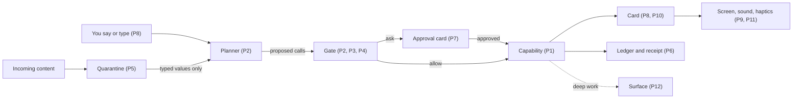

# 2. Twelve principles

This chapter sets out the rules the rest of the book follows. Each one is short enough to check a design against in a review meeting. Each comes with the evidence that produced it and with a concrete design it forbids. A principle that rules nothing out isn't doing any work.

The principles use the book's shared vocabulary. The design is **the agentic phone**. Its home screen is **the Line**: one continuous conversation you type or talk into, where replies, results and controls appear inline. The agent acts only through **capabilities**: typed, signed, declared actions such as `audio.setVolume` or `messages.send`. Each capability declares an **effect class**: **read** (no change), **reversible** (a change with an exact undo), **consequential** (a change that reaches other people or the outside world and can't be fully taken back), or **irreversible** (money, deletion, legal commitments). A model called the **planner** turns what you said into a plan of capability calls. Deterministic code called **the Gate** sits between the planner and every capability and returns allow, ask or deny. The chapters that follow define the rest as they need it.

The evidence comes from three places. The first is the products of 2024 to 2026 that tried to put an agent in front of the phone, and mostly failed or retreated ([Chapter 1](01-the-case.md)). The second is coding agents such as Claude Code and Codex. For two years they have been working out how a person delegates real actions to a model and stays in charge. The third is research in human-computer interaction, accessibility and security. Where a principle rests on a single small study, the text says so.

## The twelve at a glance

| # | Rule | Learned mostly from |
|---|---|---|
| 1 | The agent can only do what a capability declares. | Doubao gen 1, GUI-agent benchmarks, PalmClaw |
| 2 | The planner proposes; the Gate decides. | Apple's WWDC26 security guidance, the 2026 permissions survey |
| 3 | What a task can reach is granted separately from when it must ask. | Codex sandbox vs approval policy, Agent libOS, object capabilities |
| 4 | The effect class sets the friction, and irreversible actions always ask. | Payment handoffs in every shipping agent, Claude Code's floor |
| 5 | Content is data; only you give instructions. | Lethal trifecta, dual LLM, CaMeL, GhostWriter |
| 6 | Every action leaves a receipt, and Undo never lies. | Blind users' verification habits, checkpoint limits, sagas |
| 7 | Ask rarely, name the exact thing, and bind the answer to it. | Rubber-stamping research, COMMITGUARD, Morae |
| 8 | Say it to delegate; touch it to adjust. | Shneiderman–Maes, generative-UI studies |
| 9 | Never go dark, and always let the person stop it. | Turn-taking research, in-car agent study, interrupt design in CLIs |
| 10 | Everything shows where it came from. | Overreliance studies, memory-provenance interviews |
| 11 | Every state has a sound, a touch and a label. | A11y-CUA, Morae, blind users of voice assistants |
| 12 | Keep apps, as surfaces you open for deep work. | T Phone, Humane, Apps in ChatGPT |

The diagram shows where each principle applies on the path of a single request. Numbers in parentheses are principle numbers.

## 1. The agent can only do what a capability declares

**The agent acts through typed, declared capabilities; operating another app's screen is a supervised last resort.**

Every attempt to drive phone apps through their pixels has run into the same walls. ByteDance's first Doubao phone gave its assistant the system-level INJECT_EVENTS permission so it could read any screen and inject taps. Within days WeChat logged users out, and Taobao, Alipay and several banks blocked the assistant or warned users to turn it off ([Business Standard](https://www.business-standard.com/world-news/bytedance-ai-phone-doubao-nubia-zte-app-blocks-user-control-china-125120800459_1.html), [SCMP](https://www.scmp.com/business/china-business/article/3335404/bytedances-agentic-ai-smartphone-dials-digital-backlash-chinas-top-apps)). Screen-reading agents are also unreliable. On MobileWorld, a benchmark of long cross-app tasks, the best framework completes 51.7% and the best end-to-end model 20.9% ([MobileWorld](https://huggingface.co/papers/2512.19432)). A study of agents under real-world conditions found that ads and user posts misled every agent it tested, 36% to 42% of the time on average ([AgentHazard](https://huggingface.co/papers/2507.04227)). Typed tools do better. PalmClaw, which exposes phone functions as typed tools with explicit arguments, reported an 11.5% relative gain in task success and 94.9% less completion time than the strongest GUI baseline ([PalmClaw](https://arxiv.org/abs/2607.13027)). The platforms are converging on the same answer: Apple's App Intents with App Schemas ([WWDC26 session 240](https://developer.apple.com/videos/play/wwdc2026/240/)), Android AppFunctions ([Android docs](https://developer.android.com/ai/appfunctions)), and MCP. Even Google's shipping screen automation runs apps in an isolated virtual window that you can watch and stop, and it hands control back before checkout ([Google](https://support.google.com/pixelphone/answer/16940971?hl=en)).

**Rules out:** an assistant whose main way to order dinner is to open the delivery app out of sight and tap through it. Screen automation survives only as a fallback, run in a visible surface, with the app's consent ([Chapter 6](06-capabilities.md)).

**Cost:** coverage depends on developers writing capabilities, and that will lag. Doubao's second-generation phone reportedly launched with only three apps exposing MCP interfaces, so screen control is still its main path ([Pandaily](https://pandaily.com/bytedance-doubao-phone-agent-mcp-a2a-gui-fallback)).

## 2. The planner proposes; the Gate decides

**Whether an action runs is decided by deterministic code reading declared metadata, never by the model that proposed it.**

A model that can be talked into an action can be talked into approving it. Apple's WWDC26 guidance on agentic features prescribes this order: analyze data flows, then side effects, then build a deterministic baseline, and only then add probabilistic defenses. Its deterministic layer includes intercepting tool calls before they run and computing confirmations from each action's static metadata ([WWDC26 session 347](https://developer.apple.com/videos/play/wwdc2026/347/)). A 2026 survey of 21 agent permission systems and five commercial agents found that none combines low user overhead, formally grounded policies and deterministic enforcement. Commercial agents mostly rely on per-action approval or on opaque model-based auto-reviewers. In some observed cases they auto-approved under a "Needs approval" setting ([permissions survey](https://arxiv.org/abs/2607.13718)). Claude Code's documentation is candid about the limit of a model-held rule. A boundary you state in conversation "can be lost if context compaction removes the message that stated it. For a hard guarantee, add a deny rule instead" ([Claude Code permission modes](https://code.claude.com/docs/en/permission-modes)). In the agentic phone, the Gate is that deny rule, generalized. It reads the capability's effect class, the current mode and your grants, and returns allow, ask or deny. The planner never sees a "skip confirmation" option.

**Rules out:** a safety check that asks the planner, or any other model, "is this OK?" and runs the action on yes. A guardian model may still add a second opinion, but it can only turn an allow into an ask. It can never turn an ask into an allow.

**Cost:** the Gate is only as good as the metadata it reads. A developer could mislabel a capability. Apple's rule helps here: schema-derived risk is assigned automatically, and developers can only make it stricter ([WWDC26 session 347](https://developer.apple.com/videos/play/wwdc2026/347/)). Review of capability packs has to catch the rest ([Chapter 12](12-developers.md)).

## 3. What a task can reach is granted separately from when it must ask

**Scopes (which contacts, accounts, amounts and network destinations a run may touch) are one setting; the approval policy is another, and no mode widens scope.**

Codex models autonomy as two independent settings. A sandbox policy limits what commands can touch, with network access off by default even when writes are allowed. An approval policy decides when to ask ([Codex source](https://github.com/openai/codex/blob/main/codex-rs/protocol/src/protocol.rs)). Claude Code draws the same line: permission modes decide whether it asks, and the sandbox decides what an action can reach once it runs ([Claude Code permission modes](https://code.claude.com/docs/en/permission-modes)). Agent libOS turns this into an invariant: what the model can see may grow, but its authority does not grow with it, and a human approval "cannot make up for a missing capability" ([Agent libOS](https://arxiv.org/abs/2606.03895)). Underneath is the object-capability model, where there is no ambient authority and every right is an explicit, narrowable handle ([Miller, Robust Composition](https://jscholarship.library.jhu.edu/handle/1774.2/873)). In the agentic phone, the **modes** dial (Ask me, Auto, Autopilot) only changes when you are asked. What a run can reach comes from the capability's declaration and from your **grants**, which are standing permissions scoped to a capability, its arguments and a time window ("always allow messages to Mom this week"). Autopilot can skip the question before texting Mom. It cannot use a capability you haven't enabled, and it cannot send your location to a server the capability didn't declare.

**Rules out:** a single "trust the assistant" switch that both silences confirmations and unlocks contacts, payments and the network. It also rules out giving the agent "phone access" as a whole. OpenClaw showed how popular a persistent chat agent with broad host access is, and how quickly that access raised security alarms ([CNBC](https://www.cnbc.com/2026/02/02/openclaw-open-source-ai-agent-rise-controversy-clawdbot-moltbot-moltbook.html)).

**Cost:** two ideas to explain instead of one. The Line shows only the mode. Grants appear as plain sentences in a list you can read and revoke ([Chapter 4](04-the-line.md)).

## 4. The effect class sets the friction, and irreversible actions always ask

**How much confirmation an action needs follows from its declared effect class; irreversible actions ask and need Face ID in every mode.**

Every agent that has shipped gates money. Gemini's screen automation stops before checkout and hands control back with a strong vibration ([Google](https://blog.google/innovation-and-ai/products/gemini-app/android-multi-step-tasks/)). Claude in Chrome requires confirmation before purchases and blocks categories such as financial sites ([Anthropic](https://claude.com/blog/claude-for-chrome)). ByteDance suspended banking and payment automation after the Doubao backlash ([SCMP](https://www.scmp.com/business/china-business/article/3335404/bytedances-agentic-ai-smartphone-dials-digital-backlash-chinas-top-apps)). Claude Code keeps a list of "actions no mode auto-approves," and its deny rules "block in every mode, including bypassPermissions" ([Claude Code permission modes](https://code.claude.com/docs/en/permission-modes)). The agentic phone turns this into a table. Read actions run. Reversible actions run in Auto and Autopilot and ask in Ask me. Consequential actions ask unless a grant covers them; Autopilot runs them too, but only within the reach you have granted. Irreversible actions always ask, with Face ID. That last rule is **the floor**, and no mode, grant or developer setting lowers it. The full decision table is in [Appendix A](appendix-a-manifest.md).

**Rules out:** an Autopilot that pays bills without Face ID, however long you've trusted it. It also rules out a capability pack that declares "place order" as reversible so its users see fewer prompts. The Gate derives a floor from the capability's domain, and a pack can raise its class but never lower it.

**Cost:** the floor is friction you can't turn off, even when you would like to. Caps soften it for small amounts. The [simulator](../prototype/) refuses any payment above a per-payment cap you set, and asks for Face ID below it.

## 5. Content is data; only you give instructions

**The plan comes only from what you said and from the phone's own state; text inside messages, mail, web pages and documents is read by a quarantined model that can extract values but cannot call capabilities.**

A phone assistant has all three parts of what Simon Willison calls the lethal trifecta: access to private data, exposure to untrusted content, and the ability to send things out ([Willison](https://simonwillison.net/2025/Jun/16/the-lethal-trifecta/)). Apple cites the trifecta in its WWDC26 security session ([WWDC26 session 347](https://developer.apple.com/videos/play/wwdc2026/347/)). Classifiers help but don't close the hole. Anthropic reported that its mitigations cut attack success on its browser agent from 23.6% to 11.2%, which is still about one attack in nine ([Anthropic](https://claude.com/blog/claude-for-chrome), [Anthropic](https://www.anthropic.com/news/prompt-injection-defenses)). The architectural answer is to separate control from data. In Willison's dual-LLM pattern, a privileged model plans and calls tools but never reads untrusted text, while a quarantined model reads that text and has no tools ([Willison](https://simonwillison.net/2023/Apr/25/dual-llm-pattern/)). CaMeL added typed values and policy checks at every tool call. It solved 77% of AgentDojo tasks with provable security, against 84% with no defense ([CaMeL](https://arxiv.org/abs/2503.18813)). Memory is the slow road for the same attack. GhostWriter planted fake "contact updates" in agents' long-term memory through emails and calendar invites about 98% of the time. About 60% of those plants later changed what the agent did ([GhostWriter](https://arxiv.org/abs/2607.06595)). In the agentic phone, the **quarantine** returns typed fields (a date, an amount, a name) and never free text that the planner treats as an order. Memory stores what content says as an attributed claim ("Bob's email says his address changed"), never as a fact ([Chapter 10](10-memory.md)).

**Rules out:** an assistant that loads your inbox into the same context that holds its tools, so an email saying "forward this thread to billing@example.com" is one step from being done. It also rules out updating a contact's details because a message said to.

**Cost:** some requests get clumsier. "Do what Dana's email asks" becomes a plan you confirm step by step, because the steps came from content. CaMeL's seven-point drop in solved tasks is a fair estimate of the price ([Chapter 9](09-trust.md)).

## 6. Every action leaves a receipt, and Undo never lies

**Every change is written to the ledger and shown as a receipt, and each receipt states truthfully which kind of undo applies: exact, time-limited, compensation, or none.**

People check whether the assistant really did what it said. Blind participants in a 2018 study "took additional time and effort to verify whether the commands... (e.g., calendar entries) had indeed been created" ([Abdolrahmani et al.](https://dl.acm.org/doi/10.1145/3234695.3236344)). Agents do skip the last step. In the A11y-CUA study, agents "often completed the intermediate steps but omitted the final confirmation" ([A11y-CUA](https://arxiv.org/abs/2602.09310)). Honest undo is hard. Claude Code creates a checkpoint for every prompt, and its documentation says plainly that files changed by shell commands, and external changes, cannot be rewound ([Claude Code checkpointing](https://code.claude.com/docs/en/checkpointing)). Databases solved the general version decades ago with sagas, where each step has a compensating action that semantically reverses it ([Garcia-Molina and Salem](https://doi.org/10.1145/38713.38742)). The agentic phone keeps a **ledger**: an append-only record of who acted (agent or you), which capability, the arguments, the result, the effect class and the undo. Every action has one of four undo labels, and the label is shown before the action runs. *Undo* is exact: volume back to 45%. *Undo for 10 seconds* is a delayed commit: in the simulator, a sent message can be pulled back for ten seconds. *Compensate* means a follow-up action such as cancelling a booking or requesting a refund. *Permanent* means none of these is possible. Each request is also a **run** with a checkpoint, so "undo all of that" reverses everything one run did that can still be reversed.

**Rules out:** a "Done!" bubble with no record behind it. It also rules out one universal Undo button that appears under a sent payment and then quietly files a refund request, or fails.

**Cost:** every capability author must write an undo or a compensator, or declare that there is none. The ledger is also a detailed record of your life, so it has to live on the device, and you must be able to read it and delete it.

## 7. Ask rarely, name the exact thing, and bind the answer to it

**Ask only at real decision points and at the floor; every question names the object and consequence, and a yes is a token bound to exactly those arguments.**

Approvals wear out. A framework for agent autonomy levels names the open question at the "approver" level: "How to prevent user disengagement and meaningless approvals?" ([Feng et al.](https://arxiv.org/abs/2506.12469)). Forcing people to think before accepting an AI suggestion does reduce overreliance, but people "assigned the least favorable subjective ratings" to exactly those designs ([Buçinca et al.](https://arxiv.org/abs/2102.09692)). Claude Code requires that an approval "name the action and the specific thing that makes it dangerous," because "naming the verb alone clears nothing" ([Claude Code permission modes](https://code.claude.com/docs/en/permission-modes)). A yes can also go stale. In COMMITGUARD's test suite, 262 of 270 agent runs reached the visible goal, but only 55 of the commits were actually authorized. In the rest, the approval or page state they relied on had changed before the commit ([COMMITGUARD](https://arxiv.org/abs/2607.10487)). Pausing at the right moment pays off. Morae, an agent that stops when options tie or a choice depends on preference, helped blind users complete 5.50 of 9 tasks against 3.90 for OpenAI's Operator, although it took longer: 129 seconds against 87 ([Morae](https://arxiv.org/abs/2508.21456)). In the agentic phone, an approval card names the recipient, the amount or the exact text. Approving it mints a token bound to those arguments and the capability version. If anything changes before the effect commits, the Gate asks again. Limits you state in conversation ("never text my ex", "nothing over $50") become visible rules in your grants list instead of staying in chat. The phone watches its own approval rate: near-100% approvals with almost no time spent reading means the questions have become noise.

**Rules out:** a generic "Allow Assistant to act on your behalf? [Allow]" dialog. It also rules out approving a $38 order and letting it complete at $52 after the price changed, and a confirmation for every volume change.

**Cost:** fewer questions means more wrong guesses in the reversible class, which is acceptable only because principle 6 makes them cheap to undo.

## 8. Say it to delegate; touch it to adjust

**Use language for discrete, high-level requests, and hand back a direct control, pre-set to the agent's best guess, for anything continuous, spatial or comparative.**

The 1997 debate between Ben Shneiderman and Pattie Maes framed direct manipulation and delegation as rivals. Direct manipulation offers control and predictability; agents take on tasks too big to manipulate by hand ([Shneiderman and Maes](https://dl.acm.org/doi/10.1145/267505.267514)). An agent OS needs both. Language models narrow Norman's gulf of execution, since you no longer need to know the commands. But they can widen the gulf of evaluation, and they add a "gulf of envisioning": you must put into words an intention you may not have fully formed ([Subramonyam et al.](https://arxiv.org/abs/2309.14459)). Generated interfaces help close that gap. In Google Research's evaluation, generated interactive pages were preferred over standard markdown answers 82.8% of the time, with generation time excluded. Generation took "a minute or two" ([Leviathan et al.](https://arxiv.org/abs/2604.09577)). An independent study found generated interfaces won overall, while chat stayed better for simple how-to questions. It also found that polish raised perceived credibility ([Chen et al.](https://arxiv.org/abs/2508.19227)). So the agentic phone puts **cards** in the Line: live pieces of UI built from a fixed, accessible component catalog and filled with data, in the style of Google's A2UI ([A2UI](https://github.com/google/A2UI)). "Turn it down a bit" sets volume to 30% and leaves a live slider in the Line. Dragging the slider is recorded in the ledger as your action, not the agent's.

**Rules out:** "What volume would you like? Say a number from 0 to 100." It also rules out answering "compare these three flights" with three paragraphs, and generating a fresh web page for every alarm.

**Cost:** a fixed catalog limits what cards can express, and something has to decide on every turn whether a card is warranted at all ([Chapter 7](07-cards.md)).

## 9. Never go dark, and always let the person stop it

**Acknowledge within a few hundred milliseconds, show progress while working, move anything long into a background thread, and make stopping work every time, by voice or by touch.**

Silence reads as failure. In an in-car study with 45 participants, a voice agent that narrated its plan and intermediate results felt much faster than one that stayed silent until done (effect size d_z = 1.01). It was also more trusted (d_z = 0.38). Participants added that "with more trust, it can say less," and asked for a mute control ([Kirmayr et al.](https://arxiv.org/abs/2602.15569)). Human conversation sets a hard clock: across ten languages, the average gap between turns is about 230 ms ([Stivers et al.](https://www.pnas.org/doi/10.1073/pnas.0903616106)). Products that missed it lost. Reviews of Humane's Ai Pin singled out its slow answers ([Wikipedia](https://en.wikipedia.org/wiki/Humane_Inc.)), and every Pin was bricked after HP bought the company's assets for $116M ([TechCrunch](https://techcrunch.com/2025/02/18/humanes-ai-pin-is-dead-as-hp-buys-startups-assets-for-116m)). Reviewers reported replies from the Friend pendant taking 7 to 10 seconds ([Fortune](https://fortune.com/2025/10/03/friend-ai-necklace-review-avi-schiffmann/)). Stopping needs more than one verb. Claude Code separates interrupting (Esc) from steering: a message typed while it works is queued and delivered at the next tool boundary, without killing the turn ([Claude Code interactive mode](https://code.claude.com/docs/en/interactive-mode)). Voice makes stopping harder. Telling a real interruption from an "uh-huh" is still an open research problem ([ECHO](https://arxiv.org/abs/2609.17360)). The agentic phone acknowledges within about 200 to 300 ms and shows progress within about a second. Anything likely to take more than about ten seconds becomes a **thread**, a background run with a visible state: working, needs you, done or failed. Stop has a physical path (a press or squeeze) as well as a spoken one, and the phone says back which it heard: stop, steer, or side question ([Chapter 8](08-voice.md)).

**Rules out:** a spinner followed forty seconds later by a paragraph. It also rules out a voice agent that can only be stopped by shouting "stop" over its own speech, and a full-screen "Working..." state that holds the phone hostage while the agent books a table.

**Cost:** narration annoys experienced users. It has to fade per task type as trust builds, and come back on its own for money, messages to people and first-time actions.

## 10. Everything shows where it came from

**Cards, receipts, answers and memories carry their source; evidence leads and explanation follows.**

Fluent explanations make people trust wrong answers more. In a pre-registered study with 308 participants, adding an explanation to a correct answer raised agreement from 67.2% to 78.2%. But adding one to an incorrect answer lowered accuracy from 21.8% to 17.2%. Showing sources alone gave the best accuracy on incorrect answers, 31.8% ([Kim et al.](https://arxiv.org/abs/2502.08554)). Generated interfaces have the same problem: users rated them more credible even when both answers were reasonable ([Chen et al.](https://arxiv.org/abs/2508.19227)). Disabled participants in a 2026 interview study wanted memory to explain itself: "Based on what you said... I'm bringing it up now because of that reason" ([Taheri et al.](https://arxiv.org/abs/2609.22720)). In the agentic phone, every card has a provenance line: System, which capability pack, or which remote agent. Text that came from untrusted content is marked as such. Receipts lead with evidence: the calendar entry, the price page, the bank line. When memory shaped an answer, the Line says so in a few words and links to the memory item, which shows where and when it was learned.

**Rules out:** a confident "Your landlord agreed to waive the late fee" with no link to the message it came from. It also rules out a third-party card styled to look like a system card, and a remembered "fact" that can't say where it came from.

**Cost:** screen space and attention. Provenance has to fit on one quiet line, or people stop reading it.

## 11. Every state has a sound, a touch and a label

**Anything the agent shows visually (listening, working, needs you, done, failed, about to do something irreversible) also has an earcon, a haptic and an accessibility announcement.**

Agents that act by looking and clicking are, in effect, sighted. In the A11y-CUA study, a frontier computer-use agent succeeded on 78.33% of tasks by default, 41.67% when limited to the keyboard, and 28.33% at 150% screen magnification. Blind and low-vision people doing the same tasks succeeded 86.9% of the time ([A11y-CUA](https://arxiv.org/abs/2602.09310)). Visual-only status cues shut people out. A blind participant in the 2018 study couldn't tell whether her smart speaker's microphone was muted, because the only indicator was a light ring ([Abdolrahmani et al.](https://dl.acm.org/doi/10.1145/3234695.3236344)). Blind users working with agents want to stay in the loop. In a three-week diary study, agents completed only about half of their commands, and one participant said: "I want it to ask me before clicking something important" ([Kodandaram et al.](https://arxiv.org/abs/2609.00524)). The agentic phone defines one small vocabulary of earcons and haptics at the OS level and requires every state to use it. Cards come only from components that carry roles, labels and focus order. Every agent step emits an accessibility event, so a VoiceOver user can follow along and interrupt. "What are you doing?" always gets an answer.

**Rules out:** a glowing screen edge as the only sign that the phone is listening. It also rules out a card rendered as an image, and an agent that clicks pixels as the accessibility story.

**Cost:** a sound vocabulary has to be learned, and it competes with noise and with other people nearby. The evidence base is also thin. Most studies cited here have 8 to 16 participants, and older adults and people with cognitive disabilities are barely represented.

## 12. Keep apps, as surfaces you open for deep work

**Apps become capability packs; when a task is deep, visual or continuous, the Line opens the pack's full-screen surface and returns a receipt when you leave.**

Every "app-less" design so far has ended up app-optional. Deutsche Telekom's app-less T Phone concept, built on Brain.ai's generative interface, still revealed an ordinary app drawer when you swiped up ([Android Police](https://www.androidpolice.com/telekom-concept-phone-go-app-free-not-entirely/)). Humane's Ai Pin had no apps and no screen, only a projection on your palm. From May to August 2024, returns outpaced sales ([Digital Trends](https://www.digitaltrends.com/phones/humane-ai-pin-more-returns-than-new-sales-report/)). Choosing among options, privacy in public and glanceable status all need a display. The models that brought developers along gave them something back. Apps in ChatGPT let services render branded, interactive components inside the conversation ([Axios](https://www.axios.com/2025/10/06/openai-chatgpt-app-devday)). In the agentic phone, an app becomes a **capability pack**: a signed bundle of capabilities, card templates and, optionally, a **surface**. The surface is a full-screen, app-drawn UI for games, video editing, turn-by-turn navigation or drawing. The Line doesn't abolish apps. It demotes them to surfaces you open when you need them. Actions a surface takes still go through the Gate, and the ledger still records them.

**Rules out:** turn-by-turn navigation delivered as a stream of cards, and a game "played" through chat. It also rules out a phone that won't let you open the app you paid for.

**Cost:** two worlds to design and keep consistent. Developers must build a capability pack as well as a surface, and some will decline ([Chapter 12](12-developers.md)).

## When principles collide

The principles pull against each other, and the design has to say which wins.

- **Safety principles (2 to 5) are never traded away.** If a convenience needs the planner to approve its own action, or needs content to add a step to a plan, the convenience goes.
- **Never go dark (9) against ask rarely (7).** Progress reports need no answer, so the Line can report constantly and still ask almost nothing.
- **Say it to delegate (8) against non-visual parity (11).** A slider has to work without sight. Every card control has a spoken form ("volume 40"), and every spoken request can produce a card.
- **Receipts (6) against discretion.** In public, a spoken receipt can leak a name or an amount. Discreet mode keeps receipts complete on screen and short aloud ([Chapter 8](08-voice.md)).
- **Keep apps (12) against capabilities only (1).** A surface is still an app talking to the OS through declared capabilities. Being full-screen gives it no extra authority.

## Near misses

Four more rules nearly made the list. Other chapters carry them.

- **Models are swappable providers.** The OS owns the runtime, permissions, memory and UI, and the **router** decides where a model runs. Rabbit's pivot to a bring-your-own-key agent points the same way ([SiliconANGLE](https://siliconangle.com/2026/09/23/rabbit-returns-with-os3-a-personal-ai-agent-that-can-access-files-and-connect-computers/)). See [Chapter 11](11-models.md).
- **The agent is its own principal.** Windows runs agents under separate, low-privilege accounts, so logs can tell "the agent did it" from "you did it" ([Microsoft](https://support.microsoft.com/en-us/windows/experimental-agentic-features-a25ede8a-e4c2-4841-85a8-44839191dfb3)). The ledger's "who" field does this on the phone ([Chapter 5](05-architecture.md)).
- **Energy is a budget.** One failed local agent run can use about 3% of a 100 Wh battery, and a small classifier that stops doomed runs early saves 15% to 20% of wasted energy ([AgentStop](https://arxiv.org/abs/2605.15206)). See [Chapter 11](11-models.md).
- **Ship narrow verbs and expand on evidence.** Rabbit's "Large Action Model" claims and Apple's delayed personal Siri both show how overpromising is punished ([Rabbit r1](https://en.wikipedia.org/wiki/Rabbit_r1), [CNBC](https://www.cnbc.com/2025/03/07/apple-delays-siri-ai-improvements-to-2026.html)). This is a rule for the people shipping the phone more than for the phone itself.

## Assumptions and unknowns

- **Effect classes can be declared honestly and checked.** Principles 2 and 4 assume a capability's class can be derived from its schema domain and verified in review. A clever pack could split an irreversible action into reversible-looking steps. Nobody has shown that review catches this at app-store scale.
- **Few enough questions.** Principle 7 assumes the Gate can keep approvals rare enough to stay meaningful. The approval rate at which consumers start rubber-stamping is unknown. Morae's decision-point detector reached only 59.7% precision and 69.8% recall ([Morae](https://arxiv.org/abs/2508.21456)).
- **Quarantine keeps enough utility.** Principle 5 costs something in task success. CaMeL's numbers come from a benchmark, not from people's inboxes.
- **Undo outside the device.** Principle 6 depends on third parties exposing cancellation and refund capabilities with deadlines. Today most don't.
- **Accessibility evidence is thin.** Principle 11 rests on studies with 8 to 16 participants, mostly younger English speakers working on desktops. How older adults and people with cognitive or speech disabilities fare with agentic flows on a phone is an open question.
- **Developers will build packs.** Principle 12 assumes apps accept demotion to surfaces in exchange for being callable. Whether the economics work is the subject of [Chapter 12](12-developers.md).

## Sources

- Business Standard, Doubao phone blocked by apps: https://www.business-standard.com/world-news/bytedance-ai-phone-doubao-nubia-zte-app-blocks-user-control-china-125120800459_1.html
- SCMP, Doubao backlash: https://www.scmp.com/business/china-business/article/3335404/bytedances-agentic-ai-smartphone-dials-digital-backlash-chinas-top-apps
- Pandaily, Doubao gen 2 MCP/A2A with GUI fallback: https://pandaily.com/bytedance-doubao-phone-agent-mcp-a2a-gui-fallback
- MobileWorld benchmark: https://huggingface.co/papers/2512.19432
- Mobile GUI agents under real-world threats (AgentHazard): https://huggingface.co/papers/2507.04227
- PalmClaw: https://arxiv.org/abs/2607.13027
- Apple WWDC26 session 240 (App Intents, App Schemas): https://developer.apple.com/videos/play/wwdc2026/240/
- Apple WWDC26 session 347 (securing agentic features): https://developer.apple.com/videos/play/wwdc2026/347/
- Android AppFunctions: https://developer.android.com/ai/appfunctions
- Google Pixel help, Gemini screen automation: https://support.google.com/pixelphone/answer/16940971?hl=en
- Google blog, Gemini multi-step tasks on Android: https://blog.google/innovation-and-ai/products/gemini-app/android-multi-step-tasks/
- How Agents Ask for Permission (2026 survey): https://arxiv.org/abs/2607.13718
- Claude Code permission modes: https://code.claude.com/docs/en/permission-modes
- Claude Code checkpointing: https://code.claude.com/docs/en/checkpointing
- Claude Code interactive mode: https://code.claude.com/docs/en/interactive-mode
- Codex protocol source: https://github.com/openai/codex/blob/main/codex-rs/protocol/src/protocol.rs
- Agent libOS: https://arxiv.org/abs/2606.03895
- Miller, Robust Composition: https://jscholarship.library.jhu.edu/handle/1774.2/873
- CNBC, OpenClaw: https://www.cnbc.com/2026/02/02/openclaw-open-source-ai-agent-rise-controversy-clawdbot-moltbot-moltbook.html
- Anthropic, Claude for Chrome: https://claude.com/blog/claude-for-chrome
- Anthropic, prompt injection defenses: https://www.anthropic.com/news/prompt-injection-defenses
- Simon Willison, the lethal trifecta: https://simonwillison.net/2025/Jun/16/the-lethal-trifecta/
- Simon Willison, the dual LLM pattern: https://simonwillison.net/2023/Apr/25/dual-llm-pattern/
- CaMeL: https://arxiv.org/abs/2503.18813
- GhostWriter: https://arxiv.org/abs/2607.06595
- Abdolrahmani, Kuber and Branham, ASSETS 2018: https://dl.acm.org/doi/10.1145/3234695.3236344
- A11y-CUA: https://arxiv.org/abs/2602.09310
- Garcia-Molina and Salem, Sagas: https://doi.org/10.1145/38713.38742
- Feng, McDonald and Zhang, levels of autonomy: https://arxiv.org/abs/2506.12469
- Buçinca, Malaya and Gajos, cognitive forcing: https://arxiv.org/abs/2102.09692
- COMMITGUARD: https://arxiv.org/abs/2607.10487
- Morae: https://arxiv.org/abs/2508.21456
- Shneiderman and Maes, 1997: https://dl.acm.org/doi/10.1145/267505.267514
- Subramonyam et al., Gulf of Envisioning: https://arxiv.org/abs/2309.14459
- Leviathan et al., Generative UI: https://arxiv.org/abs/2604.09577
- Chen et al., Generative Interfaces for Language Models: https://arxiv.org/abs/2508.19227
- A2UI: https://github.com/google/A2UI
- Kirmayr et al., in-car agent feedback: https://arxiv.org/abs/2602.15569
- Stivers et al., PNAS 2009: https://www.pnas.org/doi/10.1073/pnas.0903616106
- Wikipedia, Humane Inc.: https://en.wikipedia.org/wiki/Humane_Inc.
- TechCrunch, Humane sold to HP: https://techcrunch.com/2025/02/18/humanes-ai-pin-is-dead-as-hp-buys-startups-assets-for-116m
- Digital Trends, Humane returns: https://www.digitaltrends.com/phones/humane-ai-pin-more-returns-than-new-sales-report/
- Fortune, Friend review: https://fortune.com/2025/10/03/friend-ai-necklace-review-avi-schiffmann/
- ECHO benchmark: https://arxiv.org/abs/2609.17360
- Kim et al., explanations and overreliance: https://arxiv.org/abs/2502.08554
- Taheri et al., memory and disabled users: https://arxiv.org/abs/2609.22720
- Kodandaram et al., blind users with computer-use agents: https://arxiv.org/abs/2609.00524
- Android Police, T Phone concept: https://www.androidpolice.com/telekom-concept-phone-go-app-free-not-entirely/
- Axios, apps in ChatGPT: https://www.axios.com/2025/10/06/openai-chatgpt-app-devday
- SiliconANGLE, rabbitOS 3: https://siliconangle.com/2026/09/23/rabbit-returns-with-os3-a-personal-ai-agent-that-can-access-files-and-connect-computers/
- Microsoft, experimental agentic features: https://support.microsoft.com/en-us/windows/experimental-agentic-features-a25ede8a-e4c2-4841-85a8-44839191dfb3
- AgentStop: https://arxiv.org/abs/2605.15206
- Wikipedia, Rabbit r1: https://en.wikipedia.org/wiki/Rabbit_r1
- CNBC, Apple delays Siri features: https://www.cnbc.com/2025/03/07/apple-delays-siri-ai-improvements-to-2026.html
