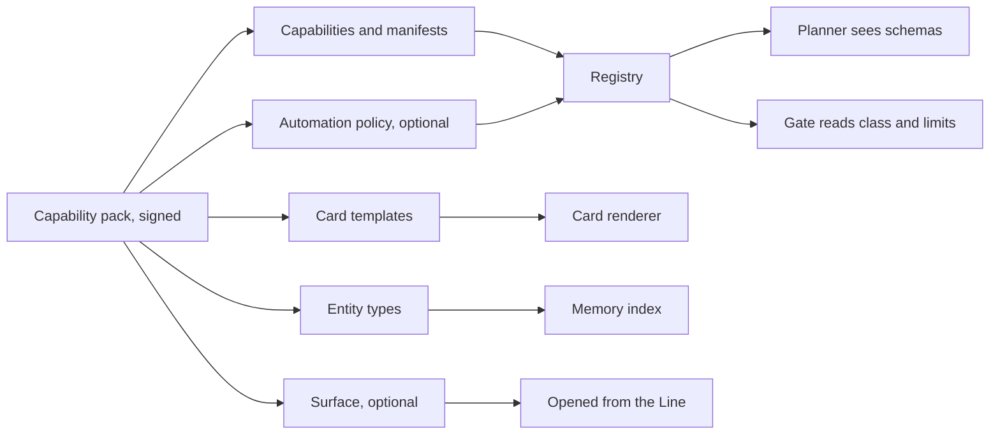
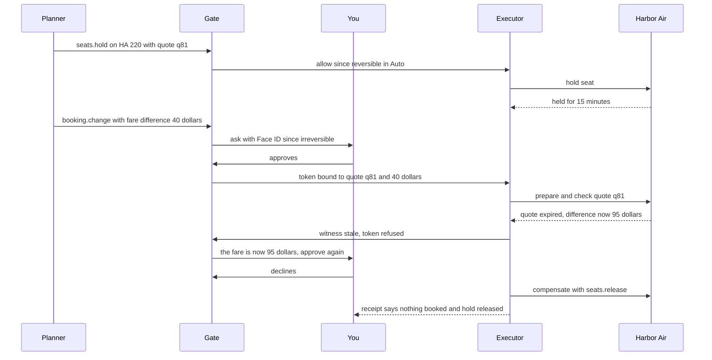
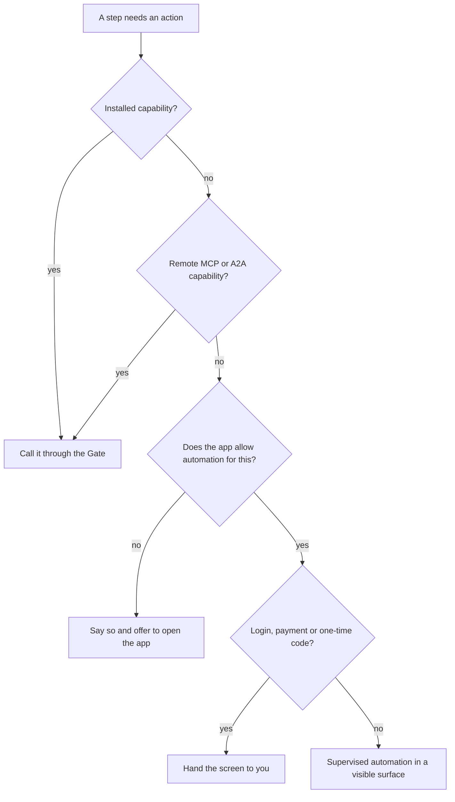

# 6. Capabilities: the new app model

An app today is a set of screens: you open it, find the right one, and work the controls in order. An agent can imitate that, slowly and unreliably, and apps can detect it and block it. What the agent needs is what sits underneath the screens: a list of what the app can do, written so that code can check it.

In the agentic phone that list is made of **capabilities**. A capability is a typed, signed, declared action or query that the system or an app registers: `audio.setVolume`, `alarms.create`, or `order.place` from a pizza place. Each one comes with a **manifest**, a declaration of what it takes, what it returns, what it changes, how to undo it, what data it sends off the phone, and which cards show its results. The agent can call capabilities. It can do nothing else.

[Chapter 5](05-architecture.md) described the registry that holds manifests, and [Chapter 9](09-trust.md) how the Gate uses them. This chapter covers the manifest itself: its fields, effect classes and undo, versions and names, today's standards, and what happens when no capability exists. [Appendix A](appendix-a-manifest.md) is the field-by-field reference.

## What an app becomes

In the agentic phone, an app becomes a **capability pack**: a signed bundle of capabilities, card templates, entity types for the personal index, and optionally a **surface**, the full-screen UI an app draws for work that doesn't fit in a card (a game, a map in navigation, a video editor).

| An app today | A capability pack |
|---|---|
| Screens and buttons you operate | Capabilities the agent calls, and cards you can operate directly |
| Its own confirmation dialogs | A declared effect class; the OS draws every approval |
| Its own undo, if it has one | A declared undo or compensator that the ledger can run |
| Data locked inside the app | Entity types contributed to the phone's personal index |
| An icon on the home screen | An entry in "what can you do?", and a surface you can open |
| A privacy policy you don't read | A declared list of what leaves the phone, enforced by the OS |



Parts of this already ship. Android's AppFunctions let apps "behave like on device MCP servers", with a schema the OS indexes ([Android AppFunctions](https://developer.android.com/ai/appfunctions)). Apple's app schemas put an app's actions and content into "the app toolbox, which Apple Intelligence draws on to service requests" ([Apple](https://developer.apple.com/documentation/appintents/making-actions-and-content-discoverable-by-apple-intelligence)). ByteDance's second-generation Doubao phone calls apps that expose MCP or A2A-style interfaces first and falls back to operating screens only when they don't ([Pandaily](https://pandaily.com/bytedance-doubao-phone-agent-mcp-a2a-gui-fallback), [TechNode](https://technode.com/2026/09/17/nubia-navix-ultra-second-generation-doubao-phone-launches/)).

The pack doesn't abolish the app; it demotes the app's screens to a surface you open when you need one ([Chapter 4](04-the-line.md)). [Chapter 12](12-developers.md) covers what this does to the app business.

## The manifest

Here is a small manifest, for the system's alarm capability. The format is a proposal; [Appendix A](appendix-a-manifest.md) defines every field.

```json
{
  "id": "alarms.create",
  "version": "1.4.0",
  "implements": "alarm.create",
  "publisher": "system",
  "title": "Create an alarm",
  "describe": {
    "person": "Sets an alarm.",
    "planner": "Create an alarm at a local time (HH:MM, 24-hour) with an optional short label."
  },
  "input": {
    "time":  { "type": "string", "format": "hh:mm" },
    "label": { "type": "string", "maxLength": 40, "x-freeText": true }
  },
  "output": { "alarm": { "$entity": "std.Alarm" } },
  "effect": { "class": "reversible", "kinds": ["write-local"] },
  "undo": { "kind": "exact", "via": "alarms.delete" },
  "lock": "allowed",
  "data": { "egress": [], "memory": "none" },
  "cards": { "result": "system.clock/alarm" },
  "receipt": "Alarm {time} · {untilText}"
}
```

Every field is there because some component reads it:

| Group | Fields | Why it's there | Who reads it |
|---|---|---|---|
| Identity | `id`, `version`, `publisher`, signature | Unsigned calls are denied; approvals bind to a version | Registry, Gate, ledger |
| Descriptions | `title`, `describe.person`, `describe.planner`, `examples` | The planner chooses by description; people ask "what can you do?" | Planner, the Line |
| Schemas | `input`, `output`, `implements`, entity types | Arguments are checked before anything runs; cards bind to typed output | Planner, Gate, cards |
| Effect | `effect.class`, `effect.kinds`, `effect.raiseWhen`, `reason` | The Gate's main input, and the reason on an approval card | Gate |
| Undo | `undo.kind`, `undo.via`, `undo.windowSec`, `undo.deadline` | The receipt's Undo, rollback, saga compensation | Executor, ledger |
| Commit | `commit.witnesses`, `commit.conditional`, `commit.status` | An approval holds only while what you approved is still true | Executor |
| Access | `lock`, `limits.hard`, `limits.rate` | What runs on a locked phone; what is refused before asking | Gate |
| Data | `data.egress`, `x-sensitive`, `data.outputIntegrity`, `data.memory` | Flow checks, labels, what may be remembered | Gate, quarantine, memory |
| Execution | `run.where`, `run.duration`, `run.cancel` | Where it runs; whether it becomes a thread | Router, scheduler |
| Presentation | `cards`, `preview`, `receipt`, `speak` | Instant cards, drafts before commit | Card renderer, voice |
| Reach | `requires`, `bindings` | What the pack's code may call; one manifest on many platforms | Gate, executor |

Four choices shape the rest of the format.

**Rules are data, not code.** In [the simulator](../prototype/), capabilities in `os.js` carry JavaScript functions: `riskFor` raises the effect class for some arguments, and `check` enforces hard limits such as the Wallet's $50 per-payment cap. That works when one author wrote everything. On a real phone the Gate can't run a pack's code to decide whether that pack's call is safe. So the manifest states those rules as data, small expressions over the arguments and over entity attributes the OS resolves itself (`device.paired == false`, `amount > wallet.perPaymentCap`), and the Gate evaluates them. A rule can raise a class or deny a call. None can lower a class.

**Two descriptions.** The planner's description is a way to slip it instructions, so it is kept short, linted and reviewed, apart from the friendly one people see. Neither can change what the Gate allows ([Chapter 9](09-trust.md)).

**Undo is declared before the call,** so the approval card and the receipt can state it honestly: "Undo", "Undo for 10 seconds", "Cancel for credit until Saturday 11:10 AM", or "Can't be undone".

**One contract, many bindings.** The manifest describes the capability; `bindings` says how each platform carries it out: a system service, a user-installed shortcut on today's iPhone, an AppFunction, a remote MCP tool. [Chapter 13](13-building-it.md) binds one `bluetooth.setPower` manifest five ways.

## Effect classes, from the developer's side

Every capability declares one **effect class**: **read** (no change), **reversible** (a change with an exact undo), **consequential** (it reaches other people or the outside world and can't be fully taken back), or **irreversible** (money, deletion, legal commitments). [Chapter 9](09-trust.md) covers how the Gate uses classes. This section covers how a capability gets one.

**The verb sets a minimum.** Each standard verb has a minimum class: `message.send` is at least consequential, `order.place` irreversible. A pack can declare a stricter class, never a weaker one. Apple works this way already: intents that adopt a schema inherit its side-effect metadata, and developers can only make the risk stricter ([WWDC26 session 347](https://developer.apple.com/videos/play/wwdc2026/347/)).

**Effect kinds say why.** The manifest lists what the capability does in a fixed vocabulary: `write-local`, `write-remote`, `communicate`, `share`, `physical`, `spend`, `delete`, `legal`, `security`. Each kind has a minimum class (`spend` is irreversible, `communicate` consequential), and the capability's class is the highest of the verb's minimum, the kinds' minimums and its own declaration. Kinds also feed the floor: a `communicate` call to someone you've never contacted, or any `security` change, needs Face ID whatever the class ([Appendix A](appendix-a-manifest.md) has the table).

**Arguments can raise it.** `bluetooth.connect` is reversible for a paired device and consequential for a new one, because pairing lets a device reconnect later without asking. A flight change with a fare difference spends money and becomes irreversible. The manifest declares these as `raiseWhen` rules.

**Hints aren't classes.** MCP tools can carry annotations such as `readOnlyHint` and `destructiveHint`, but the MCP schema itself says they are hints, and "clients should never make tool use decisions based on ToolAnnotations received from untrusted servers" ([MCP schema](https://github.com/modelcontextprotocol/modelcontextprotocol/blob/main/schema/2025-06-18/schema.ts)). So hints can only raise a remote tool's class. A remote tool with no standard verb and no reviewed manifest is treated as consequential.

The class and the undo are separate axes. The class sets the friction before the call. The undo kind sets what the receipt can promise afterward.

| Capability | Class | Undo kind | Why |
|---|---|---|---|
| `audio.setVolume` | reversible | exact | The OS restores the old level |
| `bluetooth.connect`, paired device | reversible | exact | Disconnect |
| `bluetooth.connect`, new device | consequential | exact on the phone | Unpair; the reason is that the device could reconnect later |
| `messages.send` | consequential | window, 10 s | A delayed send; after that it's delivered |
| `booking.change`, no fare difference | consequential | compensable | Cancel for credit, on the airline's terms |
| `order.place` | irreversible | compensable | Cancel within the restaurant's window |
| `wallet.pay` | irreversible | none | Money can't be pulled back |

A reversible class doesn't make a capability harmless. The alarm's `label` is free text the planner fills in, and text stored today can come back into a later context, where it reads like anything else ([Chapter 9](09-trust.md) gives Apple's example). That is why the alarm manifest marks `label` as `x-freeText`: the stored value keeps the provenance label of wherever it came from.

## Undo, compensation and sagas

The ledger can only undo what the manifest says it can. There are four kinds, and [Chapter 9](09-trust.md) describes how each looks in a receipt. On the manifest side:

- **Exact.** For state the OS owns (volume, Focus), the executor snapshots and restores it. For a pack's state, `undo.via` names the inverse capability (`alarms.delete`). The simulator's undo, a closure over the previous state, is this kind.
- **Window.** `undo.windowSec` holds the effect before it leaves the phone. Undo within 10 seconds, and the message never went.
- **Compensable.** `undo.via` names a capability that semantically reverses the effect (`order.cancel`), with a `deadline` and a `cost`. The compensator has its own class and passes the Gate like any call. Apple's Messages domain pairs `unsendMessage` with `sendMessage` ([Apple](https://developer.apple.com/documentation/appintents/app-schema-domain-messages)); in these terms unsend is a compensator, since the recipient may already have read the message.
- **None.** The receipt says "Can't be undone", and the approval card said so first.

Multi-step requests need more than per-step undo. A **saga**, from database research, is a long transaction made of local steps, each paired with a compensating action, so a failure partway through runs the compensators of completed steps in reverse order instead of holding locks ([Garcia-Molina and Salem](https://doi.org/10.1145/38713.38742)); SagaLLM applies the idea to LLM planning ([SagaLLM](https://doi.org/10.14778/3750601.3750611)). The executor keeps a saga log per run and applies the ordering rules in [Chapter 9](09-trust.md). The manifests supply the pieces: compensators, classes and witnesses.

### Worked example: a canceled flight

Friday morning, your 2:10 PM flight to Denver is canceled, and you're meeting Maya there for dinner. The phone is in Auto.

```
› my denver flight got canceled. get me on the next one and tell maya
● trips.list(upcoming: true)
  └ Harbor Air 212 · SFO → DEN · Fri 2:10 PM · Canceled
● booking.alternatives(booking: HX7Q2P) · Harbor Air
  └ 3 options · prices held for 10 min
[4:05 PM · nonstop · no fare difference]  [6:40 PM · nonstop · +$40]  [Sat 8:15 AM · no fare difference]
› the 4:05
● seats.hold(flight: HA 218, quote: q_81) · Harbor Air
  └ Seat 14C held until 11:22 AM                            [Release]
◆ Needs you · consequential — Change HX7Q2P to HA 218, Fri 4:05 PM, seat 14C. No fare difference. Cancel for credit until Sat 11:10 AM. [Keep as is] [Change]
› change
● booking.change(booking: HX7Q2P, flight: HA 218) · Harbor Air
  └ Rebooked · HA 218 · Fri 4:05 PM · seat 14C              [Cancel for credit · until Sat 11:10 AM]
● calendar.update(event: Flight to Denver, time: 16:05)
  └ Moved to 4:05 PM                                        [Undo]
◆ Needs you · consequential — Send to Maya: "My flight got canceled. I'm on the 4:05 now, landing 7:40. Dinner at 8:30?" [Don't send] [Send]
```

The run is a saga with six steps:

| Step | Capability | Class | Compensator |
|---|---|---|---|
| 1 | `trips.list` | read | none needed |
| 2 | `booking.alternatives` | read | none needed; returns quote `q_81`, the witness |
| 3 | `seats.hold` | reversible | `seats.release`; the hold also expires by itself |
| 4 | `booking.change` | consequential, irreversible if the fare rises | `booking.cancel`, for credit, within 24 hours |
| 5 | `calendar.update` | reversible | exact |
| 6 | `messages.send` | consequential | 10-second window |

Whatever order the planner proposes, the executor enforces the saga's shape: reads first, the reversible hold next, the commit only after earlier steps have settled, and steps that depend on it afterward. If you decline the message to Maya, steps 4 and 5 simply stand.

Now suppose you had picked the 6:40 flight at +$40. The fare difference makes `booking.change` irreversible, so the Gate asks with Face ID. Then the quote goes stale before the commit:



Four manifest entries made this work. `booking.change` names the quote as a witness, so the executor re-checks it at commit, and declares `raiseWhen: fareDifference > 0 → irreversible`. `seats.hold` names its compensator, `seats.release`. And `booking.change` names a status capability, `booking.get`, so if the network drops after the change is sent, the executor asks the airline what happened instead of sending it again. Agent libOS calls such outcomes "ambiguous" and never replays external effects blindly ([Agent libOS](https://arxiv.org/abs/2606.03895)).

Compensators can fail too; then the run becomes a thread marked "compensation pending" that needs you.

**Where Harbor Air's capabilities come from.** From the airline's pack if it's installed; otherwise from its remote agent over A2A. An A2A server publishes an Agent Card, conventionally at `/.well-known/agent-card.json`, listing skills, endpoint and authentication schemes; cards can be signed; and tasks have states including `input-required` ([A2A specification](https://github.com/a2aproject/A2A/blob/main/docs/specification.md)). The registry turns each skill into a remote capability, classes it by the standard verb it claims, and sends everything the airline's agent says to the quarantine.

## Versioning and commit-time authorization

Capabilities change: a pack adds a field, a service adds a fee. The manifest's `version` follows semantic versioning, and each kind of change has a defined effect on your grants and approvals:

| Change | Version bump | Effect |
|---|---|---|
| Fix a description, add an example | patch | None |
| Add an optional input or output field, add a card template | minor | Grants keep working |
| Raise the class, add a hard limit or a `raiseWhen` rule | minor | Grants that no longer cover the call ask again |
| Lower the class, add an egress sink or an effect kind, change what a field means, remove a field | major | New review; grants lapse and must be given again; pending approvals fail |

Approvals bind to the exact `id@version`; grants bind to `id@major`. A run keeps the versions it started with; if a pack updates mid-run, the run finishes on the old version or stops and asks.

Remote capabilities change without an install step. MCP's 2026-07-28 specification lets list responses carry `ttlMs` and `cacheScope` ([MCP 2026-07-28](https://blog.modelcontextprotocol.io/posts/2026-07-28/)), so the registry refreshes on that schedule and compares. A remote tool whose change would be a major version is treated as new: the planner can't use it until it has been reviewed or you've approved it once.

**Commit-time fields.** An approval is a token bound to the exact call ([Chapter 9](09-trust.md) lists what it binds). The manifest tells the executor what to re-check when the effect happens:

- **Witnesses:** values that must still hold, such as a fare quote, a cart total or an event's revision.
- **Conditional writes:** whether the service accepts "only if still version N". If not, the capability is marked unbound and gated more heavily.
- **Token lifetime,** in minutes, and whether a retry with the same **idempotency** key is safe.
- **Status:** the capability that answers "did that go through?"

The case for this comes from COMMITGUARD, a 2026 study: agents reached the visible goal in 262 of 270 runs, but only 55 were authorized commits, because the grounds for the commit had gone stale. Prompt warnings and single checks didn't fix it; re-checking atomically at commit did ([COMMITGUARD](https://arxiv.org/abs/2607.10487)).

## Naming and discovery

**Ids.** System capabilities use short, reserved namespaces: `audio`, `display`, `bluetooth`, `wifi`, `alarms`, `messages`, `phone`, `wallet`. Third-party ids start with the publisher's reverse domain name: `com.harborair.booking.change`, `com.cornerpizza.order.place`. No pack can register a capability in a reserved namespace.

**Standard verbs.** The OS defines verbs such as `message.send`, `alarm.create`, `ride.request`, `order.place` and `booking.change`, each with fixed parameters and a minimum class, and a capability declares which verb it `implements`. The planner plans in verbs where it can, and the registry resolves the verb and a provider to a capability id. This generalizes Apple's schemas: "a person can set an alarm on different apps that support the `createAlarm` schema with the same phrases" ([Apple](https://developer.apple.com/documentation/appintents/app-schema-domain-clock)). Apple Intelligence "only uses the properties that each schema defines", and extra properties must be optional ([Apple](https://developer.apple.com/documentation/appintents/making-actions-and-content-discoverable-by-apple-intelligence)). The agentic phone does the same: a pack's extra parameters are optional, used only when you mention them.

**Verb groups.** Apple requires an app that supports any schema in its Mail, Clock or Messages domains to support all of them, checked by Xcode at build time ([Apple](https://developer.apple.com/documentation/appintents/making-actions-and-content-discoverable-by-apple-intelligence)); it flags `sendMessage` without `draftMessage` because confirmation needs a draft ([WWDC26 session 240](https://developer.apple.com/videos/play/wwdc2026/240/)). The agentic phone uses groups to make preview and undo mandatory: `message.send` requires `message.draft`; `order.place` requires `order.status` and `order.cancel`; `booking.change` requires `booking.get`. A pack missing a companion doesn't install.

**Choosing a provider.** When several packs implement a verb, a provider you name wins ("from Corner Pizza"), then memory ("your usual"), then a choice card. The planner never silently picks a provider for a consequential or irreversible call. How that choice card is ordered, and who may pay to be on it, is [Chapter 12](12-developers.md)'s question.

**What you see.** The Line shows a capability's short name, which is the verb when it implements one, and its provider (`● order.place(cart: 41) · Corner Pizza`). The ledger stores the full id and version. "What can you do?" is answered from the installed manifests' titles and examples, so it's always true ([Chapter 4](04-the-line.md)). When nothing matches, the phone says so. In [the simulator](../prototype/), try "Order a pizza": no capability matches, and it says it can't, rather than pretending.

## System and third-party capabilities

Capabilities come from four kinds of source, and the manifest's trust depends on which.

| | System | Capability pack | Remote (MCP, A2A) | Screen automation |
|---|---|---|---|---|
| Who writes the manifest | OS vendor | Developer, reviewed at install | Derived by the registry from the tool list or Agent Card | The OS, one synthetic manifest |
| Effect class | Set by the OS | Declared, never below the verb's minimum | From standard verbs and hints, only upward; consequential if unknown | Consequential at least, per step |
| Undo | Exact for OS state | Declared, compensators checked in review | Declared by the server, unverified | Usually none |
| Integrity of results | High | The pack's level; free text low | Low | Low: screen content goes through quarantine |
| Runs as | A privileged system service | The pack, as its own principal | A remote principal | An isolated virtual display |

**Some capabilities are system-only:** switching radios, pairing without a prompt, secure settings. Android already reserves these; the permission to "pair bluetooth devices without user interaction" is "Not for use by third-party applications" ([Android](https://developer.android.com/reference/android/Manifest.permission)). Some kinds are system-mediated even when a pack implements the verb: every `spend` goes through the Wallet's payment sheet.

**Packs are principals.** A pack's code holds only the capabilities its manifest `requires`, shown at install. If a food-delivery pack asks for your contacts, that's a call the Gate evaluates, not a right it inherits ([Chapter 9](09-trust.md)).

**Remote capabilities fill gaps.** Google's Android guidance offers remote MCP servers alongside AppFunctions for reach across platforms ([Android](https://developer.android.com/ai/intelligence-system)). The price is trust: a remote manifest is derived, and its results are low-integrity data.

## Examples: three system capabilities and a food order

The alarm manifest above is the simplest case. `audio.setVolume` is much the same: reversible, undone from a snapshot, allowed on a locked phone, with a slider card bound to the volume. It is also a capability no app has today; on iOS, "Only the user can directly set the system volume" ([Apple](https://developer.apple.com/documentation/avfaudio/avaudiosession/outputvolume)). `bluetooth.connect` is the interesting one, because the same capability has two classes. In [the simulator](../prototype/), try "Connect to Bluetooth" and pick the speaker you haven't paired:

```
› connect the JBL speaker
● bluetooth.list()
  └ Paired: AirPods Pro, Car audio, Kitchen speaker · Nearby: JBL Flip 6
◆ Needs you · consequential — Pair JBL Flip 6? Pairing a new device (JBL Flip 6) lets it connect again later without asking. [Cancel] [Pair]
› pair
● bluetooth.connect(device: JBL Flip 6)
  └ Paired and connected JBL Flip 6                          [Undo]
Connected. Next time I'll connect it without asking.
```

The reason on the card comes from the capability, not the model: `whyRisky` in the simulator, the `reason` template in the manifest.

**A food order from a third-party pack.** Corner Pizza, a local restaurant, ships a small pack: `menu.search` and `menu.usual` (read), `cart.build` (reversible), `order.place` (irreversible), `order.status` and `order.cancel`. Its `order.place` manifest declares the kinds `spend` and `write-remote`, the witnesses `cart.version` and `cart.total`, a two-minute compensator, one egress sink (the restaurant's order endpoint, which receives items, address and phone number), and a memory policy that lets the phone remember what you ordered.

```
› order my usual from corner pizza
● menu.usual() · Corner Pizza
  └ Large margherita, garlic knots · last ordered Sep 12
● cart.build(items: usual, deliver_to: Home) · Corner Pizza
  └ Cart 41 · $23.80 incl. delivery · 35–45 min
◆ Needs you · irreversible — Order from Corner Pizza: large margherita, garlic knots, to Home. $23.80 on Visa ··42. Cancel free for 2 min. [Cancel] [Pay with Face ID]
  (Face ID)
● order.place(cart: 41, total: 23.80) · Corner Pizza
  └ Ordered · arriving 7:25–7:35 PM                          [Cancel order · 1:58]
```

The OS drew the approval from the manifest's `preview` template; the pack can't draw approval chrome. Had the total changed between the tap and the commit, the stale `cart.total` witness would have triggered a new ask ([Chapter 9](09-trust.md) shows that sequence). The full manifest is in [Appendix A](appendix-a-manifest.md).

The same restaurant could instead run a remote MCP server with an MCP Apps menu. MCP Apps declares UI templates ahead of time as `ui://` resources, renders them in sandboxed iframes, and sends any tool call the UI starts through host approval and the same audit path as a model's call ([MCP Apps](https://blog.modelcontextprotocol.io/posts/2026-01-26-mcp-apps/)). On the agentic phone the menu is a sandboxed card, and "Add to cart" is a `cart.build` call through the Gate ([Chapter 7](07-cards.md)).

## How this relates to what exists

Each of today's formats covers part of the manifest.

| Standard | Status | What maps onto the manifest | What the manifest adds |
|---|---|---|---|
| Apple App Intents and app schemas | Shipping; no public API lets one app's agent call another app's intents | Intent as capability; schema as standard verb; entities, including [`IndexedEntity`](https://developer.apple.com/documentation/appintents/indexedentity); [`IntentAuthenticationPolicy`](https://developer.apple.com/documentation/appintents/intentauthenticationpolicy) as `lock`; [`UndoableIntent`](https://developer.apple.com/documentation/appintents/undoableintent) (iOS 26) as exact undo; [`LongRunningIntent`](https://developer.apple.com/documentation/appintents/longrunningintent) (iOS 27) as long-running; snippets and `requestConfirmation` as cards; schema side-effect metadata as the minimum class | User-visible effect classes, compensators with deadlines, witnesses, egress, one cross-app ledger, any planner the OS trusts |
| Android AppFunctions | Android 16+; library at 1.0.0-alpha12 on Sept 23, 2026 ([notes](https://developer.android.com/jetpack/androidx/releases/appfunctions)); "only a limited number of apps and system agents" can use the full pipeline in preview ([Android](https://developer.android.com/ai/appfunctions)) | Function name, plain-language description, schemas for parameters and return value, OS indexing | Effect class, undo, egress, cards |
| MCP tools | Open standard; 2026-07-28 spec ([MCP](https://blog.modelcontextprotocol.io/posts/2026-07-28/)) | `name`, `description`, `inputSchema`, `outputSchema`, annotations as hints, `ttlMs` and `cacheScope`, the Tasks extension, `input_required` | Verified classes, signatures, egress, undo |
| MCP Apps | First official MCP extension | `ui://` templates rendered in a sandbox | Catalog-first cards; templates as a fallback tier |
| A2A | Open specification | Agent Card skills, auth schemes, signatures; tasks with `input-required` | Effect classes per skill; results treated as untrusted |

Apple's row is the richest, and it keeps growing: iOS 27's `OwnershipProvidingEntity` makes the system ask for confirmation when an intent acts on shared or public entities ([Apple](https://developer.apple.com/documentation/appintents/ownershipprovidingentity)), which is close to raising a class by argument. What Apple lacks is the arrangement: Siri is the only planner that can call other apps' intents, and each app's confirmations and undo are its own ([Chapter 5](05-architecture.md)).

The proposal follows: a developer writes one manifest and generates the rest (an App Intent, an AppFunction, an MCP tool definition), each recorded under `bindings`. The effect, undo, commit and data fields have no home in today's formats, so they travel as extensions. [Chapter 15](15-open-problems.md) makes this an ask of Apple and Google.

## When there is no capability: supervised screen automation

Most apps won't ship capability packs soon. Doubao's second-generation phone reportedly launched with only three apps exposing MCP interfaces, so screen control is still its main path ([Pandaily](https://pandaily.com/bytedance-doubao-phone-agent-mcp-a2a-gui-fallback)). The agentic phone keeps screen automation as the last rung of a ladder:



The design copies what has shipped. Gemini's screen automation runs the target app in a "secure, virtual window" that can't reach the rest of the device, lets you watch or take over, and stops before checkout ([Google](https://blog.google/innovation-and-ai/products/gemini-app/android-multi-step-tasks/)). Android's Computer Control, reserved for OEM-preloaded assistants, runs target apps "on a virtual device, similar to casting", one session at a time, after a system consent dialog ([Android Computer Control](https://developer.android.com/ai/computer-control)). Zhipu's open-source AutoGLM hands logins and verification codes back to you ([Open-AutoGLM](https://github.com/zai-org/Open-AutoGLM/blob/main/README_en.md)).

In the agentic phone, automation is one synthetic capability, `automation.run(app, goal)`, with a manifest the OS writes: consequential at minimum, no undo unless the app's own applies, and low-integrity results, since everything on screen goes through the quarantine. Each tap and typed field is a step the Gate checks ([Chapter 9](09-trust.md) has the rules). The fallback is slower and weaker than a capability and should look it: typed device tools took 94.9% less time than the strongest GUI baseline in PalmClaw's evaluation ([PalmClaw](https://arxiv.org/abs/2607.13027)), and the best framework completes 51.7% of MobileWorld's long cross-app tasks ([MobileWorld](https://huggingface.co/papers/2512.19432)).

```
› book a table for two at lark tomorrow at 8
◆ Needs you · consequential — Lark has no capability, but allows automation. Use its app in a window you can watch? [No] [Go ahead]
› go ahead
● automation.run(app: Lark, goal: table for 2, Sat 8:00 PM)   supervised
  └ 6 steps · stopped at "Confirm reservation"
◆ Needs you · consequential — Confirm a table for 2 at Lark, Sat 8:00 PM. [Cancel] [Confirm]
```

### An opt-out protocol

Automation without consent gets blocked. Within days of ByteDance's first Doubao phone, WeChat logged its users out and Alipay, Taobao and banks blocked it or warned users off ([SCMP](https://www.scmp.com/business/china-business/article/3335404/bytedances-agentic-ai-smartphone-dials-digital-backlash-chinas-top-apps)). Amazon sued Perplexity, alleging among other things that its Comet browser agent disguised itself as Chrome rather than identifying itself ([Payments Dive](https://www.paymentsdive.com/news/amazon-sues-perplexity-ai-shopping-agents/804923/)). The Ninth Circuit vacated the resulting injunction in August 2026, holding that the access was by the user, employing the assistant as a tool ([Cooley](https://www.cooley.com/news/insight/2026/2026-08-06-ninth-circuit-rules-on-ai-agent-access-to-third-party-websites-under-cfaa)). That is legal cover for the user's agent, not commercial peace with the app.

ByteDance's answer for its second phone is SAEP, a screen-automation protocol. According to Pandaily's secondary coverage, it lets an app declare which pages may be read, which actions may be automated and which areas are off-limits, with a 30-day public notice period; Doubao stops if an app opts out, and officials likened it to robots.txt for agents ([Pandaily](https://pandaily.com/bytedance-doubao-phone-agent-mcp-a2a-gui-fallback)).

The agentic phone adopts the same idea as an `automation` block that an app can ship in its package, even an app with no capabilities at all:

```json
"automation": {
  "default": "deny",
  "allow": [
    { "screens": ["menu", "cart"], "actions": ["read", "tap", "type"] },
    { "screens": ["reservations"], "actions": ["read", "tap", "type"] }
  ],
  "never": ["payment", "account", "messages"],
  "identify": true,
  "noticeDays": 30,
  "prefer": "com.larkbistro.reservation.create"
}
```

- **Screens are named by the app,** the way it labels controls for accessibility. The engine reads the label before each step; an unlabeled screen gets the most restrictive rule that could apply.
- **Some areas are always off.** Login, payment and one-time-code screens are handed to you, whatever the policy says.
- **The agent identifies itself.** An automation session tells the app it is an agent acting for its user, so the app can log it, rate-limit it, or offer a lighter flow. Not identifying itself was part of Amazon's complaint against Comet.
- **Changes give notice.** A policy change takes effect after `noticeDays`, so your routines don't break overnight.
- **`prefer` points to a capability** the app would rather you use.
- **No policy means supervised, not free:** reading and navigation are allowed, always visible, never on the screens above, and every step goes through the Gate.

What it costs: apps can opt out wholesale, and some will. Then the Line says "Lark doesn't allow automation. Want me to open it?", which is honest and less useful. The protocol also helps only if many phone makers honor the same file. What app makers will want in exchange is [Chapter 12](12-developers.md)'s subject.

## What this costs

- **Developer work.** Every capability needs a manifest, an honest class, a working compensator and card templates. Tools can generate the schemas, as the AppFunctions compiler and Xcode's schema templates do; classes and compensators take judgment.
- **Review at scale.** Manifests, planner descriptions and templates need App Store–scale review, and nobody knows how to review a description for hidden instructions ([Chapter 15](15-open-problems.md)).
- **Coverage.** The catalog will lag, and the fallback is slow and fragile.
- **Rigidity.** Standard verbs make capabilities predictable and interchangeable, and lag new kinds of action.
- **A bigger trusted base.** The rule language for `raiseWhen` and hard limits runs inside the Gate, so it must stay small enough to verify.

## Assumptions and unknowns

- **Honest declarations.** The design assumes most developers declare classes and compensators correctly, and that review and runtime monitoring catch the rest. An action with no standard verb relies on the developer's judgment.
- **Services that support commit-time checks.** Witnesses need quotes, versions or holds. Many services offer none, so their capabilities stay unbound.
- **Who governs the verbs.** Apple governs its schema domains alone. A cross-platform vocabulary would need a neutral body; none exists.
- **Expressive but small rules.** Nobody has shown a rule language expressive enough for real `raiseWhen` conditions and small enough to verify.
- **Screen labels.** The opt-out protocol assumes apps label screens honestly, including payment screens.
- **Whether super-apps and banks accept any automation protocol.** SAEP is new, and WeChat, Alipay and the banks haven't said.
- **One manifest for all platforms.** The design assumes App Intents, AppFunctions and MCP tool definitions can be generated from one source. No such format exists yet.
- **A2A in practice.** The Agent Card, task states and signatures come from the current specification. How many airlines, banks and other services will run A2A agents is unknown.

## Sources

- [Android AppFunctions](https://developer.android.com/ai/appfunctions)
- [AppFunctions release notes](https://developer.android.com/jetpack/androidx/releases/appfunctions)
- [Android intelligence system overview](https://developer.android.com/ai/intelligence-system)
- [Android Computer Control](https://developer.android.com/ai/computer-control)
- [Android Manifest.permission](https://developer.android.com/reference/android/Manifest.permission)
- [Apple, Making actions and content discoverable by Apple Intelligence](https://developer.apple.com/documentation/appintents/making-actions-and-content-discoverable-by-apple-intelligence)
- [Apple, Clock schema domain](https://developer.apple.com/documentation/appintents/app-schema-domain-clock)
- [Apple, Messages schema domain](https://developer.apple.com/documentation/appintents/app-schema-domain-messages)
- [Apple IntentAuthenticationPolicy](https://developer.apple.com/documentation/appintents/intentauthenticationpolicy)
- [Apple UndoableIntent](https://developer.apple.com/documentation/appintents/undoableintent)
- [Apple LongRunningIntent](https://developer.apple.com/documentation/appintents/longrunningintent)
- [Apple OwnershipProvidingEntity](https://developer.apple.com/documentation/appintents/ownershipprovidingentity)
- [Apple IndexedEntity](https://developer.apple.com/documentation/appintents/indexedentity)
- [Apple AVAudioSession outputVolume](https://developer.apple.com/documentation/avfaudio/avaudiosession/outputvolume)
- [Apple WWDC26 session 240](https://developer.apple.com/videos/play/wwdc2026/240/)
- [Apple WWDC26 session 347](https://developer.apple.com/videos/play/wwdc2026/347/)
- [MCP 2026-07-28 release](https://blog.modelcontextprotocol.io/posts/2026-07-28/)
- [MCP schema, 2025-06-18 (tool annotations)](https://github.com/modelcontextprotocol/modelcontextprotocol/blob/main/schema/2025-06-18/schema.ts)
- [MCP Apps](https://blog.modelcontextprotocol.io/posts/2026-01-26-mcp-apps/)
- [A2A specification](https://github.com/a2aproject/A2A/blob/main/docs/specification.md)
- [Agent libOS](https://arxiv.org/abs/2606.03895)
- [COMMITGUARD: commit-time authorization](https://arxiv.org/abs/2607.10487)
- [Garcia-Molina and Salem, Sagas (1987)](https://doi.org/10.1145/38713.38742)
- [SagaLLM](https://doi.org/10.14778/3750601.3750611)
- [PalmClaw](https://arxiv.org/abs/2607.13027)
- [MobileWorld](https://huggingface.co/papers/2512.19432)
- [Google, Gemini multi-step tasks on Android](https://blog.google/innovation-and-ai/products/gemini-app/android-multi-step-tasks/)
- [Gemini screen automation help](https://support.google.com/pixelphone/answer/16940971?hl=en)
- [Open-AutoGLM README](https://github.com/zai-org/Open-AutoGLM/blob/main/README_en.md)
- [TechNode, nubia NaviX Ultra launch](https://technode.com/2026/09/17/nubia-navix-ultra-second-generation-doubao-phone-launches/)
- [Pandaily on Doubao gen 2 and SAEP](https://pandaily.com/bytedance-doubao-phone-agent-mcp-a2a-gui-fallback)
- [SCMP on the Doubao gen 1 backlash](https://www.scmp.com/business/china-business/article/3335404/bytedances-agentic-ai-smartphone-dials-digital-backlash-chinas-top-apps)
- [Payments Dive on Amazon's suit against Perplexity](https://www.paymentsdive.com/news/amazon-sues-perplexity-ai-shopping-agents/804923/)
- [Cooley on the Ninth Circuit ruling in Amazon v. Perplexity](https://www.cooley.com/news/insight/2026/2026-08-06-ninth-circuit-rules-on-ai-agent-access-to-third-party-websites-under-cfaa)
