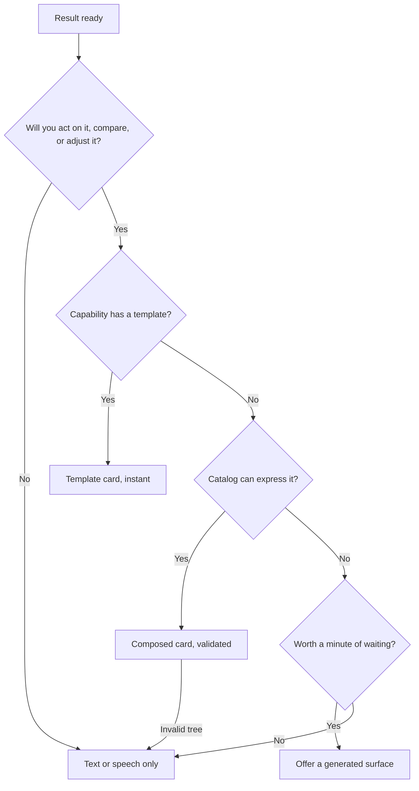
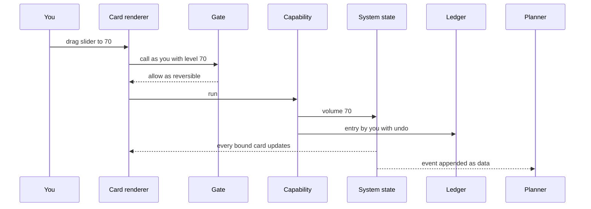
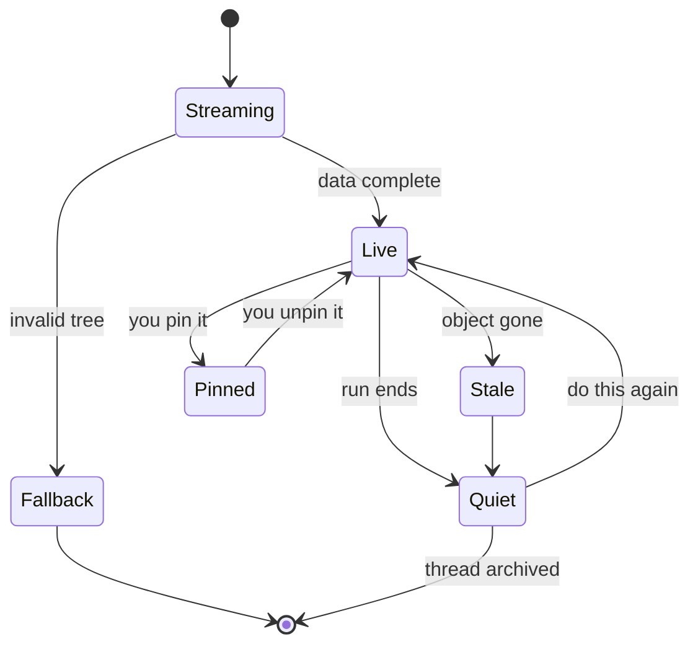

# 7. Cards: generated interfaces

"Change the headphone level" has no number in it. A voice assistant has to guess, or ask a question you then answer in words. In the agentic phone, the answer shows up in the conversation as a small, live control:

```
› change the headphone level
● bluetooth.connect(device: AirPods Pro)
  └ Connected AirPods Pro · battery 80%            [Undo]
Where do you want it?
  ┌ Volume · AirPods Pro ──────────────────────────┐
  │ ○──────────────●────────────────────  45%      │
  └ System · Audio ────────────────────────────────┘
```

That box is a **card**: a piece of UI the agent places in **the Line** (the home screen, one continuous conversation you type or talk into), built from a fixed, accessible **component catalog** and filled with data. The slider is not a picture of a slider. Drag it and the volume changes, the change is written to the ledger as yours, and any other card showing the volume moves with it. You didn't give a number, so the agent didn't guess one. It handed you the control.

This chapter is about how cards get made. A model can write an interface as code, or it can fill a catalog of trusted components with data. Shipping products do both, and there is measured evidence about what each costs. The agentic phone uses the catalog by default and allows generated code only in a sandbox, labeled, usually inside a **surface** (a full-screen, app-drawn UI for deep or continuous work). The chapter explains that choice, then designs the parts: the catalog, a card's anatomy, live binding, ephemeral and pinned cards, accessibility, theming, the handoff to a surface, and latency.

You can try the cards described here in [the simulator](../prototype/). "Change the headphone level" produces the exchange above. "Set a timer" with no duration produces choice chips.

## Three ways to put UI in a conversation

Systems that show interactive results inside a chat fall into three tiers, a split this book's architecture research draws from A2UI, MCP Apps and Google's Generative UI work.

**Tier 1: declarative components from a trusted catalog.** The model sends structure and data, and the client draws them with its own native widgets. No model-written code runs. Google's open [A2UI](https://github.com/google/A2UI) protocol (spec [v0.9.1](https://a2ui.org/specification/v0.9.1-a2ui/) by mid-2026) is the clearest example: agents describe a component tree and a data model in JSON, and can only ask for components from a catalog the client owns. The project calls this "safe like data, expressive like code" ([a2ui.org](https://a2ui.org/)). The component list is flat, with ID references, so a model can stream it and the client can render it progressively. Android ships a Jetpack Compose renderer, and Google's documentation calls the catalog "a contract that defines the specific UI elements, properties, and functions available to the agent", rendered "without executing arbitrary code", with schema validation and two-way data binding back to the agent ([Android developers](https://developer.android.com/develop/ui/compose/agentic)).

A2UI describes the UI but not the live channel between agent and card. [AG-UI](https://docs.copilotkit.ai/ag-ui/concepts/state), an event protocol from CopilotKit, supplies it: standard events for run lifecycle, streamed text, tool calls and shared state, where state moves as a snapshot followed by JSON Patch deltas ([CopilotKit](https://www.copilotkit.ai/blog/master-the-17-ag-ui-event-types-for-building-agents-the-right-way)).

**Tier 2: pre-declared code templates, filled with data.** A tool ships its own HTML and JavaScript, declared ahead of time and run in a sandbox. [MCP Apps](https://blog.modelcontextprotocol.io/posts/2025-11-21-mcp-apps/) is the cross-vendor standard. A tool points at a `ui://` resource of bundled HTML, so a host can prefetch, cache and security-review it before any model calls the tool. The UI runs in a sandboxed iframe with a declared Content Security Policy and talks to the host over JSON-RPC through `postMessage`. Any tool call the UI starts needs host approval and goes through the same audit and consent path as a tool call from the model. MCP Apps became the first official MCP extension on January 26, 2026, co-authored by MCP maintainers from Anthropic and OpenAI with the creators of MCP-UI ([MCP blog](https://blog.modelcontextprotocol.io/posts/2026-01-26-mcp-apps/)). OpenAI's [Apps SDK](https://developers.openai.com/apps-sdk), which puts tools plus inline UI inside ChatGPT, reportedly converged on the same extension after launch ([Inkeep](https://inkeep.com/blog/anthropic-openai-mcp-apps-extension)).

**Tier 3: interfaces the model writes from scratch.** The model generates a whole page or app per request. Google Research's Generative UI system does this for almost any prompt and shipped in the Gemini app and Search AI Mode in November 2025 ([Google Research](https://research.google/blog/generative-ui-a-rich-custom-visual-interactive-user-experience-for-any-prompt/)). Claude Artifacts render model-written code in a sandboxed panel as persistent objects, and the "Imagine with Claude" research preview in 2025 reportedly generated the interface itself as the user interacted ([Anthropic](https://www.anthropic.com/news/claude-sonnet-4-5)).

| | Tier 1: catalog components | Tier 2: declared templates | Tier 3: generated code |
|---|---|---|---|
| Who writes the UI code | The OS or client | The app developer, ahead of time | The model, per request |
| What the model sends | Structure and data | Data for a known template | Code |
| Speed | As fast as native widgets | Fast once cached | Often a minute or two |
| Runtime errors | Schema-validated, rejected before render | Developer's bugs, sandboxed | Occasional JS, CSS and HTML errors |
| Accessibility | Inherited from the catalog | Up to the developer | Unknown until tested |
| Spoofing risk | Low: only catalog parts can appear | Contained by the sandbox | High without strict framing |
| Expressiveness | Bounded by the catalog | Anything the template does | Nearly anything |
| Examples | A2UI, AG-UI state | MCP Apps, OpenAI Apps SDK | Google Generative UI, Artifacts, Imagine |

## What the evidence says

The case for generated UI is strong when you ignore time. In the Google Research study, raters compared pre-generated results on 100 LMArena prompts, so generation time was not a factor. Generative UI was preferred over standard markdown answers 82.8% of the time, and 90.5% of the time on information-seeking prompts ([arXiv 2604.09577](https://arxiv.org/abs/2604.09577)). It was still rated below pages built by human experts (Elo 1736 against 1800), though the authors report it was at least comparable in about half of cases. The ability depends heavily on the model: Gemini 2.0 Flash-Lite produced errors in 60% of outputs, Gemini 3 in none ([project page](https://generativeui.github.io)). The paper states the costs plainly: generation "can often take a minute or two", streaming cuts perceived wait by about half, and JavaScript, CSS and HTML errors "can occasionally occur", even with post-processors that fix CSS and strip hallucinated assets.

An independent study from Stanford and Georgia Tech reached a similar verdict with more nuance ([Chen et al., arXiv 2508.19227](https://arxiv.org/abs/2508.19227)). Generated interfaces beat the plain chat replies of two commercial assistants in 84% and 69% of comparisons. On 380 real queries from 76 participants the margin was much narrower: 50.8% wins, 8.2% ties, 41.1% losses. The win rate was 93.8% for data analysis and visualization but 50.0% for advanced AI and machine learning questions. The authors found that conversational replies "outperform for easy and basic 'how-to' queries where additional tools impose unnecessary cognitive load". They list three problems: refinement added "latency of up to several minutes", the system generated interfaces "for all queries, even when interaction is unnecessary", and generated interfaces "may create accessibility barriers". They also found that the polished, tool-like look made answers seem more credible, even when both answers were reasonable.

Older research explains the pattern. In a 1997 debate, Shneiderman argued that direct manipulation "affords the user control and predictability", while Maes argued that people need agents to delegate to ([ACM](https://dl.acm.org/doi/10.1145/267505.267514)). A phone needs both. Subramonyam and colleagues show that language models narrow Norman's gulf of execution, since you no longer need to know the commands, but can widen the gulf of evaluation, because it is harder to check what happened ([arXiv 2309.14459](https://arxiv.org/abs/2309.14459)). Cards close that gulf: a preview before a change, a receipt after it, and a representation you can check at a glance, such as a calendar diff in place of a paragraph.

The conclusion the book draws from all of this: rich, interactive answers beat paragraphs, but a minute of generation time is unacceptable for "turn it down", and every generated interface arrives with unknown accessibility and a credibility boost it may not deserve. Most of the value should therefore come from fast, trusted components, with generation saved for the rare task worth waiting for.

## The agentic phone's choice: catalog first

In the agentic phone, every card comes from one of three sources, in order of preference.

1. **Capability templates.** Each **capability** (a typed, signed action or query an app or the system registers) declares the card templates that display its results, keyed to its output schema. A template is a declarative tree of catalog components with data bindings. The template for `audio.setVolume` is a slider bound to the volume. Templates ship inside a **capability pack** (what an app becomes), are reviewed with it, and are cached on the phone, so they render instantly and work offline.
2. **Composed cards.** When no template fits, for example when the answer combines three capabilities, the planner model composes a card from catalog components, A2UI-style. The OS validates the tree against the catalog schema before drawing anything, and a malformed tree falls back to text.
3. **Sandboxed code.** Two kinds, both labeled. A remote service's declared MCP Apps template renders in a framed, sandboxed card, so existing MCP services work. And for a task worth the wait, such as a trip planner or a study aid, the agent can offer to build a small generated app, which opens as a surface. Either can call only the capabilities routed to it, every call goes through the Gate, and neither can draw system chrome.

The Line also decides whether a turn needs UI at all. The Chen study found that generating an interface for every query is a mistake. A short factual answer or a simple how-to should stay as text or speech.



What this costs. The catalog must be designed and governed by someone, and anything the catalog can't express either waits for a new component or falls into the slow, less safe generated tier. Nobody knows yet whether a catalog can cover the large majority of turns (charts, maps, editors, simulations) well enough to make code generation rare; the architecture research lists this as an open question. What could go wrong: the catalog becomes a bottleneck and developers push everything into generated surfaces to escape it, or the platform owner uses catalog control to favor its own services. [Chapter 12](12-developers.md) takes up that second risk.

## The component catalog

The catalog is a small set of native components, each with a data schema, a set of operations, and an accessibility contract. Capability templates, composed cards and pack-supplied cards all draw from it. Packs cannot add raw drawing code to the catalog. They can propose new components through platform review, the way new system controls are added today.

The first rows below match the card types in [the simulator](../prototype/), which renders them from the `card` objects its capabilities return. The later rows are proposed.

| Component | Shows | You can | In the simulator |
|---|---|---|---|
| Info | A title and label/value rows: weather, device status, a new reminder | Read, copy | `info` |
| Slider | A continuous value: volume, brightness | Drag; the change goes through the capability | `slider` |
| Segmented | One of a few modes: ring, vibrate, silent | Tap | `segmented` |
| Toggle | An on/off state: Bluetooth, Wi-Fi, Focus, Low Power | Flip | `toggle` |
| List | Items with a per-row action: Bluetooth devices, alarms, events | Tap a row's action (Connect, Pair, Turn off) | `list` |
| Device | One accessory with status and battery | Disconnect | `device` |
| Alarm | A time, label and on/off switch | Toggle, change the time | `alarm` |
| Timer | A countdown | Pause, cancel | `timer` |
| Media | What's playing and where | Play, pause | `media` |
| Draft | A message before it leaves the phone | Edit, then approve or discard | `draft` |
| Call | A call in progress | End, mute | `call` |
| Choice chips | Two to four concrete options for a clarifying question | Tap one | `chips` |
| Receipt | What was done, by whom, effect class, Undo | Undo, open details | Ledger rows |
| Approval | The exact effect waiting for you | Approve, deny, edit | "Needs you" row (OS chrome, not a catalog part) |
| Compare table | Options side by side: flights, plans, products | Sort, pick | Proposed |
| Map | Places, a route, a pin | Pan, move the pin, open navigation | Proposed |
| Chart | A series over time: spending, sleep, battery | Scrub, change range | Proposed |
| Form | A few typed fields | Fill, submit | Proposed |
| Media grid | Photos or files | Select, open | Proposed |
| Document | A shared list, note or itinerary | Edit alongside the agent | Proposed |
| Progress | A background thread's steps | Stop, steer | Agent view ([Chapter 4](04-the-line.md)) |

**Choice chips** answer what Subramonyam and colleagues call the "gulf of envisioning": people often haven't formed a precise intent, and concrete options help more than an open question ([arXiv 2309.14459](https://arxiv.org/abs/2309.14459)). **Draft** follows a rule Apple already enforces: Xcode flags a messaging app that adopts the `sendMessage` schema without the companion `draftMessage`, because confirmation needs a draft ([WWDC26 session 240](https://developer.apple.com/videos/play/wwdc2026/240/)). In the agentic phone, every **consequential** capability (one whose effect reaches other people and can't be fully taken back) that sends content must declare a draft template. **Approval** is not available to packs or models at all; it belongs to the OS, as described under theming below.

## Anatomy of a card

Every card has the same five parts, whichever tier produced it.

```
┌─────────────────────────────────────────────────────┐
│ [icon]  Volume · AirPods Pro                    ⋯   │  1 header
├─────────────────────────────────────────────────────┤
│  ○──────────────────●───────────────────   55%      │  2 body: bound components
│                                                     │
│  [ Mute ]                     [ Open Sound ]        │  3 controls
├─────────────────────────────────────────────────────┤
│ System · Audio · by the agent at 9:41 PM   [Undo]   │  4 provenance and receipt
└─────────────────────────────────────────────────────┘
   5 (not drawn) accessibility label, spoken summary, earcon, lifetime
```

1. **Header.** An icon and a title that names the object, not the action ("Volume · AirPods Pro", not "I changed your volume").
2. **Body.** One or more catalog components, each bound to a piece of live state.
3. **Controls.** Direct-manipulation controls. Every control maps to a capability call and nothing else.
4. **Provenance and receipt.** Who produced the card (the OS, which capability pack, or "Generated"), who made the change (the agent or you), when, the effect class if something changed, and the Undo. The book's architecture research makes this a principle: visible provenance lets people calibrate trust and spot phishing inside generated UI. The simulator's capabilities carry a `provider` field ("System · Audio", "Weather (capability pack)") for this line.
5. **Metadata you don't see.** An accessibility label and value, a one-sentence spoken summary for voice and screen readers, an earcon, and a lifetime.

Here is what a template for the volume card might look like on the wire. It is illustrative, written in the spirit of A2UI's flat component lists; it is not the A2UI schema.

```json
{
  "card": "c_7f2",
  "template": "system.audio/volume",
  "provenance": { "by": "System · Audio", "run": "r_118", "generated": false },
  "components": [
    { "id": "h", "type": "header", "icon": "volume",
      "title": { "text": "Volume · ", "bind": "/audio/output/name" } },
    { "id": "s", "type": "slider", "min": 0, "max": 100, "step": 5, "unit": "%",
      "value": { "bind": "/audio/volume" },
      "onChange": { "capability": "audio.setVolume", "arg": "level" } },
    { "id": "r", "type": "receipt", "ledgerEntry": "l_4410" }
  ],
  "a11y": { "label": "Media volume, AirPods Pro", "adjustable": true },
  "speak": "Volume is 55 percent on your AirPods.",
  "lifetime": "run"
}
```

Two properties matter. The card holds no values of its own, only bindings to paths in system state. And the only thing a control can do is name a capability and an argument. It cannot run code, open a URL, or call anything the Gate hasn't seen.

## Live binding

A screenshot of a slider would be worse than useless: it would show 55% after you pressed the hardware volume buttons and the real value became 70%. Cards in the agentic phone are live views. They subscribe to the state they display and write back only through capabilities.

In the simulator, the volume card carries `bind: { cap: 'audio.setVolume', arg: 'level' }`, and a drag runs that capability with `who: 'you'`, so the ledger records it as your action, not the agent's. In the agentic phone, that call also passes through the Gate, like any call from the planner. This follows the rule MCP Apps adopted for UI-initiated tool calls: a card must not be a side door around permissions. A pack's card that could call a capability directly would let the pack do, through a button, what its manifest doesn't allow.



Four rules follow from the design.

**State flows down, calls flow up.** A card never edits state directly. If the hardware buttons, another card or a background run change the volume, every bound card updates.

**Your edits win.** If you drag the alarm to 7:15 while a run is moving it to 7:30, your write lands and the agent's pending write is dropped and re-planned. The agent learns of your change as an appended event, the way AG-UI treats user edits to shared state as authoritative.

**Stale is visible.** If the object is deleted or out of reach, the card says so ("Deleted · Undo", "Out of range") and disables its controls.

**Bindings are grants.** A card's ability to read and write is a scoped grant tied to the run that created it, and it expires with the run. A pinned card keeps a narrow read binding and asks before writing.

What this costs: the card renderer becomes a privileged OS component holding live subscriptions. It has to suspend bindings for cards scrolled out of view to stay cheap.

## Hand back the control

The most common card is not an answer. It is a control set to the agent's best guess. The interaction research turns the Shneiderman–Maes debate into a rule: use language for discrete, high-level delegation, and direct manipulation for continuous values, spatial selection and fine adjustment. The agent does the coarse step, then hands back a control that already reflects its guess ([Shneiderman and Maes](https://www.cs.umd.edu/users/ben/papers/Shn-Maes-v4n6-1997.pdf)).

```
› it's too bright
● display.setBrightness(delta: -20)
  └ Brightness 70% → 50%                           [Undo]
  ┌ Brightness ────────────────────────────────────┐
  │ ○───────────────────●───────────────  50%      │
  └ System · Display ──────────────────────────────┘
```

The agent took a step and showed the slider, so "a bit more" costs one drag, not another sentence. When there is no sensible default, the agent asks with a card. In the simulator, "set a timer" returns three chips ("5 minutes", "10 minutes", "25 minutes") instead of a question you have to answer in words.

Real decision points get the same treatment. The Morae study found that in real tasks, 13% presented multiple options and 19% were underspecified, and that agents otherwise "pick an arbitrary option" ([Peng et al., UIST 2025](https://arxiv.org/abs/2508.21456)). In the agentic phone, the agent stops when options tie on the criterion you stated, when a required field is missing, or when the choice is a matter of taste, and shows a compact choice card. You can say "just pick" for a category, and that becomes a visible rule.

## Ephemeral and pinned cards

Google's Generative UI paper imagines "an infinite catalog, where the right ephemeral interface is generated on the spot" ([arXiv 2604.09577](https://arxiv.org/abs/2604.09577)). Human-AI interaction guidelines push the other way. Microsoft's G14 says "update and adapt cautiously" and limit disruptive changes ([Amershi et al.](https://www.microsoft.com/en-us/research/wp-content/uploads/2019/01/Guidelines-for-Human-AI-Interaction-camera-ready.pdf)). Some participants in the Chen study preferred chat because it was familiar. The interaction research found no direct empirical comparison of ephemeral and persistent generated UI, so the design below is a reasoned guess, not a tested result.

In the agentic phone, cards are **ephemeral by default**. A card stays live while its run is active, then goes quiet: it keeps its last values, marked with a time, and its controls become "Do this again" shortcuts that start a new run.

You can **pin** a card. It moves to a pinned strip at the top of the Line, keeps a read binding to its state, freezes its layout, changes that layout only with your approval ("Want me to add a column for tips?"), and asks before writing unless you grant it permission.

Repeated requests for the same thing should converge on the same card. Ask for "my spending this week" every Sunday and you should get the same chart in the same place, so spatial memory works. The OS caches a composed tree the first time and reuses it.



What pinning costs: a pinned card is a standing read grant, and a strip of pinned cards is a home screen of widgets under another name. If people pin freely, the Line grows the clutter it was meant to remove. The design caps the strip at a handful of cards and suggests unpinning those you haven't looked at in weeks.

## Accessibility is part of the contract

Accessibility is where tier-3 generation is weakest and where the catalog pays for itself.

The evidence is recent and specific. In A11y-CUA, a CHI 2026 study, a frontier computer-use agent completed 78.33% of everyday tasks by default, 41.67% when limited to the keyboard, and 28.33% at 150% magnification. Blind and low-vision participants completed 86.9% of the same tasks. Agents "often completed the intermediate steps but omitted the final confirmation" and "lacked robust focus tracking", while blind users followed "a consistent verify-before-commit routine" ([arXiv 2602.09310](https://arxiv.org/abs/2602.09310)). In Morae, blind participants completed an average of 5.50 of 9 tasks with an agent that paused at decision points and showed the options as accessible UI, compared with 3.90 for OpenAI's Operator and 2.60 for TaxyAI. They made more choices that matched their preferences, all of them preferred it, and it was slower: 129.4 seconds against 86.6 for Operator. Its choice interfaces used properly labeled radio buttons and text fields with header levels for screen reader navigation, plus distinct earcons for clicking, typing, needing input and success ([arXiv 2508.21456](https://arxiv.org/abs/2508.21456)). A three-week diary study of blind screen-reader users found that current agents completed about half of 1,258 everyday commands. About a fifth of one agent's partial completions came from dropping part of the request, such as setting the font but not the size. One participant said: "I want it to ask me before clicking something important" ([arXiv 2609.00524](https://arxiv.org/abs/2609.00524)).

The agentic phone builds these findings into the catalog. Each component ships with an accessibility contract:

- **Role, label, value and actions** for VoiceOver and Switch Control. A slider is adjustable in steps; a list row exposes its action as a named custom action.
- **Heading level and focus order**, so a screen reader user can jump between cards and within one.
- **Dynamic Type, contrast and Reduce Motion** behavior, tested once per component, not per card.
- **A spoken summary**, the `speak` field above, which is also what the voice pipeline says ([Chapter 8](08-voice.md)).
- **An earcon and haptic** for each state change: working, needs you, done, failed, about to do something irreversible. Earcons come from Abdolrahmani and colleagues' finding that short sounds bridge visual and non-visual status ([ACM](https://dl.acm.org/doi/10.1145/3234695.3236344)).
- **Localization** of every string through the platform, including units and time formats.

Because the contract lives in the component, a composed card is accessible by construction. The OS only has to check that the composition is sensible, for example that a card has a header and that its reading order follows the visual order.

A card arriving in the Line is announced once, briefly ("Volume card, 55 percent"), and does not steal focus while you are typing or while VoiceOver is reading something else. A receipt that finishes a request states completion explicitly and reads back any constraint it could not meet ("Font set to Arial. I couldn't set size 14 in this app."), because the diary study found dropped constraints and missing confirmations were a main failure.

Generated surfaces get no exemption. Before a generated surface opens, the OS runs automated checks: every interactive element has a role and label, focus order exists, text scales. A surface that fails is shown with a warning and an offer to describe its content in the Line instead. Automated checks catch missing labels. They don't catch a confusing layout, so generated surfaces remain the least accessible tier, one more reason to keep them rare.

## Theming, brand and reserved chrome

Cards use the system's typography, spacing, color roles, dark mode and Dynamic Type. A capability pack can set an accent color and an icon, and its name appears in the provenance line. It cannot change fonts, layout or chrome. This costs brands something. How a pizza place or an airline keeps an identity when it no longer draws its own screens is a business question, and [Chapter 12](12-developers.md) takes it up.

Some UI is never drawn by a pack or a model. The **approval sheet**, the Face ID prompt, payment and identity screens, and system status belong to the OS and render in a reserved style that catalog components cannot imitate. Apple's WWDC26 guidance on agentic features already moves this way. App Intents get risk-based confirmations that the system computes from each action's metadata and current state, and developers can only make an action's risk stricter ([WWDC26 session 347](https://developer.apple.com/videos/play/wwdc2026/347/)). The architecture research adds the matching rule for generated UI: the sandbox must stop generated interfaces from drawing OS chrome.

```
◆ Needs you · consequential — Send to Mom: "Running late, sorry." [Don't send] [Send]
```

In the agentic phone, the approval is the only place the Send button for a consequential action can appear, and it always names the exact object: the recipient, the words, the amount ([Chapter 9](09-trust.md) covers the flow). The card renderer enforces this. A pack's draft card can show the message and offer Edit, but its "Send" routes to the OS approval sheet.

Polish is a trust problem too. Beyond the Chen finding on credibility, Kim and colleagues found that fluent explanations raised agreement with wrong answers as well as right ones, while sources lowered overreliance ([arXiv 2502.08554](https://arxiv.org/abs/2502.08554)). Cards therefore lead with evidence: a compare table shows where each price came from, and a summary card links the email it summarizes.

## When a card should become a surface

The Line doesn't abolish apps. It demotes them to surfaces you open when you need them. A card should hand off to a surface when the work needs one of these:

| Need | Example | Why a card fails |
|---|---|---|
| Continuous, precise input | Drawing, photo retouching, scrubbing video | Needs the full screen and fine gestures |
| Real-time, full-screen output | Turn-by-turn navigation, a game, a video call | Must hold the screen and update constantly |
| Long dwell | Reading a long document, editing a presentation | You stay for minutes, not seconds |
| Large collections | Browsing a whole photo library | A card holds a few dozen items at most |
| A generated app | "Build me a trip planner" | Tier-3 code only runs sandboxed in a surface |

The handoff is a button on the card ("Open in Maps", "Open editor"), or the agent asks. A surface is still bound by its pack's capabilities: the Gate applies to every action it takes, and leaving it writes a receipt back into the Line.

```
› trim the first ten seconds off the beach video
● photos.trimVideo(item: IMG_2231, start: 00:10)
  └ Trimmed · 1:24 → 1:14                          [Undo]
  ┌ Beach · Sep 20 ────────────────────────────────┐
  │ ▶  ▕▔▔[==========================]▔▔▏ 0:10–1:24│
  └ Photos ─────────────────── [Open in editor] ───┘
› actually, let me cut it myself
Opening the editor.
  └ Photos editor closed · 2 edits                 [Undo all]
```

The first request fits a card: one trim, with handles you can nudge. The second is continuous, visual work, so it becomes a surface. When you close the surface, its edits come back as one receipt.

## Streaming and latency

Gaps between turns in human conversation average roughly 200 to 300 milliseconds ([Stivers et al.](https://www.pnas.org/doi/10.1073/pnas.0903616106)). From that, the interaction research sets a budget: an acknowledgement within about 300 milliseconds, substantive content or progress within about a second, and a background task with visible progress for anything over about 10 seconds. Cards have to fit it.

- **Template cards** render as soon as the capability returns. The receipt line can appear before the body loads.
- **Composed cards** stream. A2UI-style flat lists let the renderer draw the header and skeleton first and fill bindings as data lands.
- **Generated surfaces** take a minute or more, so they run as a background thread ("Building a trip planner. I'll tell you when it's ready.") while the Line stays usable. The surface opens only after it passes validation and the accessibility check.
- **Declared templates are prefetched** at install, since MCP Apps and capability packs declare UI ahead of time.

The model matters too. Since Generative UI quality depends on model strength, the small on-device model fills templates, which is mostly slot filling, and only a strong cloud model writes surfaces. [Chapter 11](11-models.md) covers the routing.

## Design rules

1. **Decide per turn whether UI is warranted.** Use a card when you'll compare, adjust, act on or check something; otherwise answer in text or speech.
2. **Catalog by default, code by exception.** Templates first, composed cards second, sandboxed code last, always labeled.
3. **Cards are bound, not painted.** Every value is a binding and every control is a capability call.
4. **No side doors.** A tap on a card goes through the Gate and into the ledger as "by you".
5. **Hand back the control.** Do the coarse step, then show a control set to the best guess, or two to four options.
6. **Ephemeral by default, pinned by choice.** The same need should get the same card.
7. **Accessibility lives in the components.** Receipts announce completion and read back unmet constraints.
8. **The OS owns approval, identity and payment chrome.**
9. **Provenance on every card.** Label generated UI permanently.
10. **Show something within a second.** Anything over about 10 seconds becomes a background thread.

## Assumptions and unknowns

- **Catalog coverage.** The design assumes a catalog of a few dozen components can express the large majority of turns. Nobody has measured this for phone tasks, and the answer decides how often people meet the slow, less accessible generated tier.
- **Catalog governance.** Someone must decide which components exist. If it is the platform owner alone, the catalog becomes a lever for self-preferencing. How packs propose components and who reviews them is not designed here.
- **Ephemeral versus pinned.** No study directly compares ephemeral and persistent generated UI. The "ephemeral by default, pin to keep" rule is a reasoned default and needs field testing.
- **Accessibility of generated surfaces.** Automated checks catch missing labels, not confusing structure. Whether generated surfaces can be made reliably usable with VoiceOver is open.
- **Credibility from polish.** Cards look authoritative. Whether provenance lines and source links counter the credibility boost that Chen and colleagues observed is untested for phone cards.
- **Live-binding cost.** Keeping many live bindings cheap in memory and energy on a phone is assumed, not measured.
- **Standards.** The design leans on A2UI-style catalogs and MCP Apps templates. Both are young (A2UI was still pre-1.0 in mid-2026), and a phone platform may need its own dialect, which would fragment the ecosystem.

## Sources

- A2UI: [GitHub](https://github.com/google/A2UI), [a2ui.org](https://a2ui.org/), [v0.9.1 spec](https://a2ui.org/specification/v0.9.1-a2ui/)
- Android agentic UI with A2UI and Compose: [developer.android.com](https://developer.android.com/develop/ui/compose/agentic)
- AG-UI: [state concepts](https://docs.copilotkit.ai/ag-ui/concepts/state), [event types](https://www.copilotkit.ai/blog/master-the-17-ag-ui-event-types-for-building-agents-the-right-way)
- MCP Apps: [proposal](https://blog.modelcontextprotocol.io/posts/2025-11-21-mcp-apps/), [launch](https://blog.modelcontextprotocol.io/posts/2026-01-26-mcp-apps/), [Inkeep on the Anthropic and OpenAI collaboration](https://inkeep.com/blog/anthropic-openai-mcp-apps-extension)
- OpenAI Apps SDK: [developers.openai.com](https://developers.openai.com/apps-sdk)
- Google Research Generative UI: [blog](https://research.google/blog/generative-ui-a-rich-custom-visual-interactive-user-experience-for-any-prompt/), [paper](https://arxiv.org/abs/2604.09577), [project page](https://generativeui.github.io)
- Claude Artifacts and Imagine with Claude: [Anthropic](https://www.anthropic.com/news/claude-sonnet-4-5)
- Chen et al., Generative Interfaces for Language Models: [arXiv 2508.19227](https://arxiv.org/abs/2508.19227)
- Shneiderman and Maes, Direct manipulation vs. interface agents: [ACM](https://dl.acm.org/doi/10.1145/267505.267514), [PDF](https://www.cs.umd.edu/users/ben/papers/Shn-Maes-v4n6-1997.pdf)
- Subramonyam et al., gulfs of execution, evaluation and envisioning: [arXiv 2309.14459](https://arxiv.org/abs/2309.14459)
- Amershi et al., Guidelines for Human-AI Interaction: [PDF](https://www.microsoft.com/en-us/research/wp-content/uploads/2019/01/Guidelines-for-Human-AI-Interaction-camera-ready.pdf)
- Apple WWDC26 App Schemas: [session 240](https://developer.apple.com/videos/play/wwdc2026/240/); agentic security: [session 347](https://developer.apple.com/videos/play/wwdc2026/347/)
- A11y-CUA: [arXiv 2602.09310](https://arxiv.org/abs/2602.09310)
- Morae: [arXiv 2508.21456](https://arxiv.org/abs/2508.21456)
- Blind users with computer-use agents, diary study: [arXiv 2609.00524](https://arxiv.org/abs/2609.00524)
- Abdolrahmani et al., earcons and non-visual status: [ACM](https://dl.acm.org/doi/10.1145/3234695.3236344)
- Kim et al., explanations and overreliance: [arXiv 2502.08554](https://arxiv.org/abs/2502.08554)
- Conversational turn gaps: [Stivers et al., PNAS 2009](https://www.pnas.org/doi/10.1073/pnas.0903616106)
