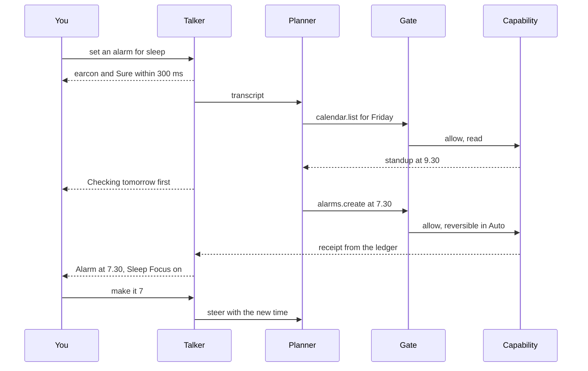
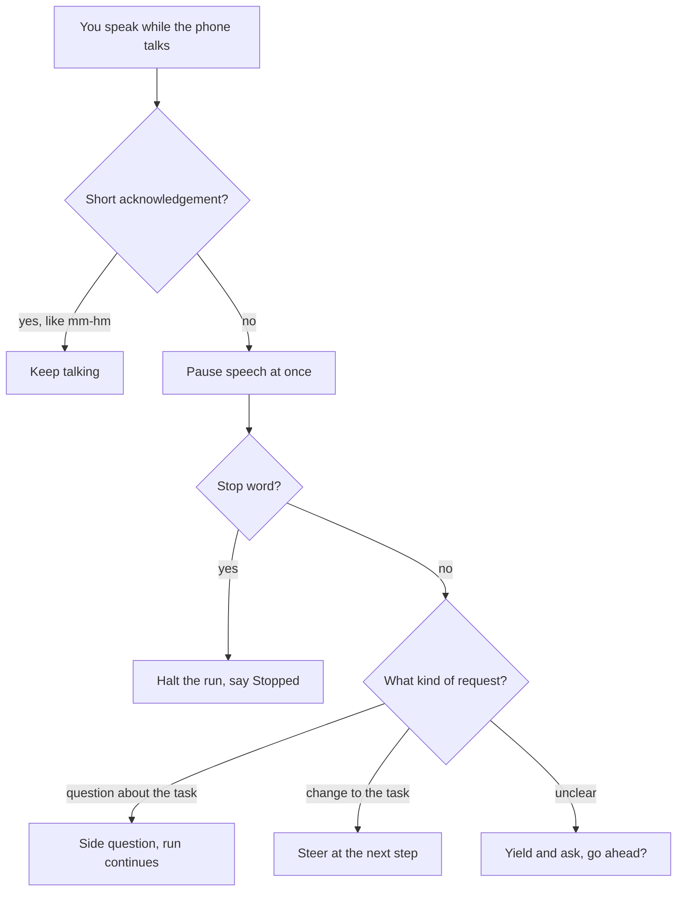
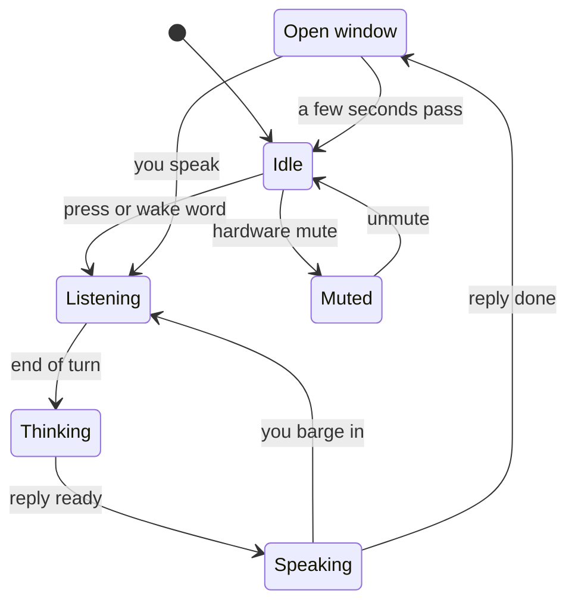

# 8. Voice

Half of the Line is spoken. Voice uses the same **Line**, the same **capabilities**, the same **Gate** and the same **ledger** as typing, and a spoken request produces the same steps and receipts. What changes is everything around the request: how fast the phone must respond, how it knows you have finished, what happens when you both talk at once, how you confirm something without a screen, and who else is listening.

This chapter designs that layer. It starts with time, because time is where voice products have failed. It then covers turn-taking, confirmation, activation, earbuds, sound and privacy, and ends with the speech components you could build it from today. [Chapter 4](04-the-line.md) describes the screen these spoken turns land on. [Chapter 9](09-trust.md) covers the security model that voice must not weaken.

One constraint frames all of it. The agentic phone is voice-first where voice helps, and never voice-only. Humane's Ai Pin had no screen, only a projection on the palm, and its reviewers found it slow and hard to read in sunlight. HP bought the company's assets for $116M, and every Pin was bricked ([TechCrunch](https://techcrunch.com/2025/02/18/humanes-ai-pin-is-dead-as-hp-buys-startups-assets-for-116m), [Wikipedia](https://en.wikipedia.org/wiki/Humane_Inc.)). Choosing among options, checking a detail and keeping things private in public all need a display. Voice gets you into the Line fast. The screen is still there when you need it.

## The latency budget

People expect a reply about as fast as another person gives one. A study of ten languages found "a general avoidance of overlapping talk and a minimization of silence" ([Stivers et al.](https://www.pnas.org/doi/10.1073/pnas.0903616106)). The Moshi paper puts the average gap between turns at 230 ms across those languages ([Défossez et al.](https://arxiv.org/abs/2410.00037)). Machines have caught up with that clock only recently. OpenAI said GPT-4o responds to audio "in as little as 232 milliseconds, with an average of 320 milliseconds" ([OpenAI](https://openai.com/index/hello-gpt-4o/)). Moshi reports 160 ms in theory and 200 ms in practice, against "a typical global latency of several seconds" for pipelines that chain recognition, a language model and speech synthesis ([Défossez et al.](https://arxiv.org/abs/2410.00037)). On screens, Jakob Nielsen's limits have held for decades: about 0.1 s feels instant, 1 s keeps your flow of thought, and 10 s is the limit of attention ([Nielsen Norman Group](https://www.nngroup.com/articles/response-times-3-important-limits/)). The research for this book could not re-fetch that page, so treat the numbers as the long-standing rule of thumb they are.

Products that missed the clock lost. Reviewers reported the Friend pendant taking 7 to 10 seconds to reply ([Fortune](https://fortune.com/2025/10/03/friend-ai-necklace-review-avi-schiffmann/)). Slow answers were among the first complaints about Humane.

The agentic phone sets a four-tier budget. The tiers are design targets consistent with the evidence above. No single study establishes 300 ms as the point where voice feels instant.

| Tier | Deadline | What you get | Example |
|---|---|---|---|
| 0 | At once (under ~0.1 s) | Mic-open sound and haptic when you press or the wake word fires | A short rising tone |
| 1 | ~200–300 ms after you stop | An acknowledgement: a backchannel, an earcon, or a word | "Sure." |
| 2 | ~1 s | The answer, or a progress statement | "Setting 7:30." / "Checking tomorrow first." |
| 3 | ~10 s | If not done, the run becomes a thread and the voice gives the floor back | "I'll keep at the flight and tell you when it's done." |

The budget decides the architecture. The **planner** can't meet tier 1. On a 2026 flagship, a small on-device model such as Gemma 4 E2B takes about 0.3 s just to produce its first token ([Google, LiteRT-LM benchmarks](https://huggingface.co/litert-community/gemma-4-E2B-it-litert-lm)). Apple's 2024 report measured its on-device model at about 0.6 ms per prompt token before the first output token on an iPhone 15 Pro ([Apple](https://machinelearning.apple.com/research/introducing-apple-foundation-models)). So a prompt of a thousand tokens costs about 0.6 s before anything comes out. Tier 1 has to come from something smaller and faster than the planner. There are two such paths:

- **A fast front end.** A small conversational layer produces the acknowledgement while the planner works (see the next section).
- **A fast path for system verbs.** "Louder", "flashlight on" and "pause" map straight to `audio.setVolume`, `flashlight.set` and `media.pause` through a small on-device intent classifier. The Gate still checks each call. No large model is involved, and the result arrives inside tier 2. Research on phone agents points the same way: deterministic system actions should be direct local tool calls with near-instant feedback, not model-planned sessions ([Chapter 1](01-the-case.md)).

## Talker and thinker

Full-duplex speech models remove turns altogether. Moshi models your audio and its own as two parallel streams, so it can listen while it speaks, handle overlap and backchannel. Its authors note that overlapping speech makes up 10% to 20% of spoken time in human conversation, and that their design "removes the concept of speaker turns" ([Défossez et al.](https://arxiv.org/abs/2410.00037)).

The agentic phone splits voice into two roles:

- **The talker** is a fast conversational front end. It holds the floor, acknowledges, backchannels, detects barge-in, reads approvals and receipts aloud, and answers side questions from what it already knows. It can be a full-duplex speech model or a small cascaded one.
- **The thinker** is the planner. It turns your words into capability calls, and the Gate checks each one.

The talker has no capabilities. It can't call `messages.send` any more than a card can call it without the Gate. The talker also speaks about results only from the ledger. If the ledger has no receipt for an action, the talker can't say it happened. The [simulator](../prototype/)'s live planner is told the same thing: "Only say something happened if a tool returned success." A voice layer that could claim success on its own would undo principle 6 ([Chapter 2](02-principles.md)).



Voice and execution run on separate clocks. OpenAI says its gpt-realtime model can "continue a fluid conversation while waiting on results" of long-running function calls ([OpenAI](https://openai.com/index/introducing-gpt-realtime/)). While the thinker books, searches or waits on an airline, the talker can say what is happening, ask the next clarifying question, or take a side question. Results arrive with an earcon when they're ready.

Voice-first also means pointing. Gemini Live lets you interrupt mid-response and share your camera or screen, and it can highlight things on the screen while it talks about them ([Google](https://blog.google/products-and-platforms/products/gemini/gemini-live-updates-august-2025/)). When the talker mentions a card ("the 7:30 slot"), the Line highlights that card, so a glance confirms what the ear heard.

## Knowing when you've finished

A fixed silence timeout cuts people off. In a study of 14 blind users of voice assistants, four found the timeouts frustrating: "You have to be pretty quick with that one [the calendar], otherwise it'll cut you off" ([Abdolrahmani et al.](https://dl.acm.org/doi/10.1145/3234695.3236344)). Production systems have moved to semantic end-of-turn detection. According to OpenAI's Realtime documentation, as quoted in search results, its semantic mode "uses a turn detection model (in conjunction with VAD) to semantically estimate whether the user has finished speaking". It waits longer when speech trails off with "uhhm", and an "eagerness" setting controls how quickly it jumps in ([OpenAI](https://developers.openai.com/api/docs/guides/realtime-vad)). Open models do this too. Kyutai's 1B speech-to-text model includes semantic voice-activity detection ([Kyutai](https://github.com/kyutai-labs/delayed-streams-modeling)).

The agentic phone uses three layers:

1. **Semantic end-of-turn by default.** The recognizer judges whether the sentence is complete, not just whether the room went quiet.
2. **Personal calibration.** The phone learns your pause patterns over time. A setting, "Give me more time", makes it more patient.
3. **Hold to talk as a guarantee.** While you hold the button, the phone never decides you've finished. This is the mode for long messages, and for people who stutter, have dysarthria or aphasia, or simply speak slowly.

An early cutoff costs less in the agentic phone than in older assistants, because anything consequential is read back before it runs. If the phone stops listening after "text Sam I'm running", the read-back ("Texting Sam: 'I'm running.' Send?") exposes the mistake before anything leaves the phone.

## Barge-in, backchannels and the three verbs

When you speak while the phone is talking, it has to decide what you meant. "Mm-hm" means keep going. "No, the other one" means stop and listen. Telling these apart is still an open research problem. The ECHO benchmark, published this month, frames the task as distinguishing "interruptions that require yielding the floor from backchannels that permit continued speaking" ([ECHO](https://arxiv.org/abs/2609.17360)). Another paper argues that stop-or-continue is too simple, and that a system sometimes has to keep speaking while taking in what the listener said ([Continue, Adapt, or Yield](https://arxiv.org/abs/2609.13117)). A third reports that Moshi-derived models "can begin speaking inappropriately during prolonged user pauses" ([Spurious Onsets](https://arxiv.org/abs/2609.13445)). All three come from abstracts read for this book, not full papers.

Because detection is unreliable, the design never depends on it for control:



- **Short acknowledgements don't interrupt.** "Mm-hm", "okay" and "right" while the phone is talking are treated as backchannels.
- **Anything else pauses speech immediately.** Pausing wrongly costs a second. Talking over someone costs trust.
- **When unsure, yield.** The talker stops and says "Go ahead?"
- **Stop has a path that involves no model.** The words "stop", "wait" and "cancel" are matched by a small on-device keyword spotter. A long press on the side button, or a press on the earbud stem, stops everything without any speech at all. Coding agents give the same guarantee with a key: Esc interrupts Claude Code in every mode ([Claude Code interactive mode](https://code.claude.com/docs/en/interactive-mode)).

Voice keeps the three verbs from [Chapter 4](04-the-line.md). **Stop** halts the run. **Steer** ("actually, use the Visa") is queued into the running task at the next step. A **side question** ("wait, which hotel was that?") is answered without changing the run. The costs differ, so the talker always says which one it heard: "Okay, stopping" or "Got it, I'll use the Visa".

## Talking while tools run

Silence while the agent works reads as failure. In an in-car study with 45 participants, a voice agent that narrated its plan and intermediate results felt much faster than a silent one (effect size d_z = 1.01). Participants also trusted it more, found the experience better, and reported lower task load ([Kirmayr et al.](https://arxiv.org/abs/2602.15569)). The interviews set the limits. Participants said "with more trust, it can say less" and asked for a mute control. They agreed that ambiguity needs clarification no matter how much you trust the agent. And they found chunked updates easier than one long report at the end: "It's the same information, but a complete dump is harder to absorb."

The agentic phone narrates on that pattern:

- **Say the plan in one sentence, then the steps as they finish.** "I'll check tomorrow, then set the alarm." Then "Standup's at 9:30. Alarm at 7:30."
- **Narration fades with trust.** The phone counts successful runs per task type and shortens its narration as they add up. The tenth "set an alarm for sleep" gets one sentence.
- **Detail comes back on its own** for money, for messages to people, for first-time actions and for anything ambiguous.
- **"Quieter" and "mute" always work.** Muted, the phone uses earcons and haptics alone and still speaks approvals, because those need you.
- **Timing respects what you're doing.** Participants wanted less speech during music, podcasts or with passengers ([Kirmayr et al.](https://arxiv.org/abs/2602.15569)). The talker holds non-urgent announcements for a pause in the audio, or reduces them to an earcon.

A spoken turn is written to the Line like a typed one, so you can glance at the screen later and see what was said and done:

```
› (voice) find a table for four at Nori tomorrow around 7:30
Sure, checking Nori.
● restaurants.search(name: Nori, day: Fri, time: 19:30, party: 4)
  └ 7:30 PM available · $40 deposit, refundable until 3 PM Fri
They have 7:30. There's a forty-dollar deposit you can get back until 3 tomorrow. Book it?
◆ Needs you · consequential — Book Nori, Fri 7:30 PM, 4 people, $40 deposit [Don't book] [Book]
› (voice) yes, book it
● restaurants.book(name: Nori, day: Fri, time: 19:30, party: 4)
  └ Booked Nori · Fri 7:30 PM · 4 people     [Cancel booking · free until 3 PM Fri]
Booked. Friday at 7:30, Nori, four people.
```

## Read-back and confirmation

Voice assistants of the Siri and Alexa era failed blind users in specific ways. Fixing one error meant dictating the whole message again. Assistants read private details aloud: one participant whispered a contact's name at work, and "Siri loudly voiced his name, revealing to her coworkers that she was making a personal call". Speech rate couldn't be changed. And people "took additional time and effort to verify whether the commands... had indeed been created" ([Abdolrahmani et al.](https://dl.acm.org/doi/10.1145/3234695.3236344)). An earlier study found that "user expectations were dramatically out of step with the operation of the systems" ([Luger and Sellen](https://dl.acm.org/doi/10.1145/2858036.2858288)).

The agentic phone's spoken confirmations follow four rules:

- **Short and specific.** "Texting Sam: 'running late.' Send?" It names the recipient and the words, and nothing else.
- **Edit the fragment, not the whole.** "Change late to ten minutes late" edits the draft in place. So does "make it Wednesday".
- **A receipt you don't need to check.** After the action: "Added: Dentist, Tuesday 3 PM, in Calendar." It names the object, the time and the place it went.
- **Discreet mode.** When you whisper, or when you turn it on, the phone withholds names and amounts aloud ("Message sent") and shows them on the screen or watch. Speech rate and verbosity are adjustable at any time ("talk faster").

How you confirm by voice depends on the **effect class**:

| Effect class | With the phone in view | Earbuds only | Head nod accepted? |
|---|---|---|---|
| **Read** | Just answers | Just answers | Not needed |
| **Reversible** | Acts, then a spoken receipt; "undo" works | Same | Yes, when asked a yes/no question |
| **Consequential** | Read-back naming the object, then a spoken yes that answers it ("send", "yes, book it") or a tap | Read-back, then a spoken yes | No. A shake still means no |
| **Irreversible** | Read-back, then Face ID on the phone | Can't finish by ear. "It's on your phone for Face ID." | No |

A spoken yes counts only as the answer to the read-back just given. It is bound to that exact text or amount, like a tapped approval ([Chapter 4](04-the-line.md)). If the planner changes anything after the read-back, the phone reads it back again. Voice alone never approves an irreversible action. A voice can be overheard, and it can come from someone else in the room.

Plans need special care by ear, because audio has no scrollback. A multi-step plan is spoken as one sentence ("Three steps: ask the dentist for next week, move the appointment when they reply, and remind you the day before") followed by "Want the details?" During the run, "where are we?" answers "Step 2 of 3: waiting for the dentist's office."

## Activation: wake word, push-to-talk and the side button

Wake words fail both ways. Eight of the 14 blind participants in the 2018 study reported assistants not responding to the wake word, or activating unexpectedly. "Their experiences had led to them favoring physically-activating Siri." One turned the wake word off altogether. Another kept the phone in a pocket "to muffle the microphone". Three switched their smart speaker's mic off at social gatherings ([Abdolrahmani et al.](https://dl.acm.org/doi/10.1145/3234695.3236344)). A PETS 2020 study characterized misactivations in which smart speakers "activate, transmit, and/or record audio from their environment when the wake word is not spoken" ([Dubois et al.](https://moniotrlab.khoury.northeastern.edu/publications/smart-speakers-study-pets20/)). The research for this book didn't retrieve its rates, so none are given here.

Dedicated agent devices chose buttons. Rabbit's r1 had a push-to-talk button ([Rabbit](https://www.rabbit.tech/newsroom/introducing-r1)). ByteDance's second-generation Doubao phone has an AI key: press for a prompt window, hold for voice, double-press for a video call with the assistant ([TechNode](https://technode.com/2026/09/17/nubia-navix-ultra-second-generation-doubao-phone-launches/)). On the iPhone, the side button belongs to Siri, with one exception. In Japan, an app can register a voice-based conversational experience that launches when you press and hold the side button. It uses the `activate` schema in the App Intents Assistant domain and needs the Side Button Access entitlement. It works only when the Apple Account's region is Japan and the phone is physically in Japan ([Apple](https://developer.apple.com/documentation/appintents/launching-your-voice-based-conversational-app-from-the-side-button-of-iphone), [Apple](https://developer.apple.com/documentation/appintents/app-schema-domain-assistant)). MacRumors reported the feature arrived in iOS 26.2 in response to Japan's Mobile Software Competition Act ([MacRumors](https://www.macrumors.com/2025/11/17/ios-26-2-iphone-users-japan-siri/)). For the agentic phone, the lesson is that a hardware button reserved for the assistant is both technically easy and a matter of competition law.

The agentic phone's activation design:

- **Explicit activation is the default.** Hold the side button, tap the voice button in the composer, or press an earbud stem. Holding the side button is also the long-press stop from the previous section, so one button both starts and stops the agent.
- **A wake word is opt-in**, detected on the device, and nothing leaves the phone before it fires.
- **Listening is always visible, audible and felt.** A glow alone isn't enough. The mic-open tone and haptic are mandatory.
- **A hardware mute you can check without looking.** Switching it gives a distinct haptic, and asking "is the mic on?" gets a spoken answer. A blind participant in the 2018 study couldn't tell whether her speaker was muted, because the only indicator was a light ring ([Abdolrahmani et al.](https://dl.acm.org/doi/10.1145/3234695.3236344)).
- **A short open window after the phone speaks.** You can answer "yes" or "make it 7" without pressing again. A closing tone marks the end of the window.



## Earbuds and head gestures

Earbuds make the Line ambient: you can use it walking, cooking or driving. Apple already supports a silent yes and no. "AirPods Pro users can simply nod their head yes or gently shake their head no to respond to Siri announcements" ([Apple Newsroom](https://www.apple.com/newsroom/2024/06/airpods-introduce-convenient-ways-to-communicate-and-interact/)). The feature requires Announce Calls or Announce Notifications, and AirPods Pro 2 or later, or AirPods 4 or later ([Apple Support](https://support.apple.com/guide/airpods/use-controls-and-gestures-with-your-airpods-devb2c431317/web)).

In the agentic phone, earbuds are a first-class way into the Line:

- **A stem press talks, a long press stops.**
- **Only interrupt-now items are announced.** Triage ([Chapter 4](04-the-line.md)) decides what reaches your ears. Everything else waits for the screen.
- **A nod answers low-stakes yes/no questions**: "Your 3 PM moved to 4. Keep it?" It never approves a consequential or irreversible action. A nod along to music can't send a message. A shake always means no, because declining is always safe.
- **Irreversible actions hand off to the phone.** "It's on your phone for Face ID" is the whole answer.

## Earcons and non-visual parity

Every state the Line shows has a sound and a haptic. The 2018 study recommended that "short bursts of audio (earcons) could be used to bridge the gap between the visual and non-visual representation of notifications and alerts" ([Abdolrahmani et al.](https://dl.acm.org/doi/10.1145/3234695.3236344)). Morae, the agent that pauses at decision points for blind users, used distinct sounds for clicking, typing, needing clarification and success ([Morae](https://arxiv.org/abs/2508.21456)). Completion needs its own clear signal. In the A11y-CUA study, agents "often completed the intermediate steps but omitted the final confirmation" ([A11y-CUA](https://arxiv.org/abs/2602.09310)).

The agentic phone defines one small vocabulary at the OS level. Capability packs can't add to it or override it.

| State | Earcon | Haptic | Spoken on request |
|---|---|---|---|
| Listening | Short rising tone | One light tap | "Listening." |
| Stopped listening | Short falling tone | None | — |
| Working | One soft tone at the start, then silence | None | "Working on the flight: step 2 of 4." |
| Needs you | Three-note chime | Two taps | "One thing needs you: send to Mom?" |
| Done | Resolved two-note tone | One firm tap | The receipt |
| Failed | Low two-note tone | One long buzz | What failed and the next step |
| About to do something irreversible | A distinct tone that nothing else uses | One heavy tap | The amount and recipient |

Three rules go with the table:

- **Any state can be asked for.** "What are you doing?", "what's waiting for me?" and "is the mic on?" always get an answer.
- **The agent and the screen reader share one voice queue.** When VoiceOver is on, the talker's speech and VoiceOver's announcements go through the same queue, so they never talk over each other. Every agent step also emits an accessibility event, so a VoiceOver user can follow along and interrupt at their own focus.
- **The sounds stay few.** Seven states, seven sounds. A vocabulary people can't learn is noise.

## Privacy: always listening, bystanders and speaking in public

An always-on microphone is a social act, not just a technical one. The Friend pendant listened all day. Its subway ad campaign was widely defaced, and testers stopped wearing it in public ([Wikipedia](https://en.wikipedia.org/wiki/Friend_(product)), [Fortune](https://fortune.com/2025/10/03/friend-ai-necklace-review-avi-schiffmann/)). Speaking to a phone in public is also a privacy cost of its own, as the whispered contact name above shows.

The agentic phone's privacy rules for voice:

- **Nothing is heard before activation.** Wake-word detection, if you turn it on, runs on the device. No audio is stored or sent before it fires.
- **Recognition runs on the device by default.** After activation, the **router** decides where speech is recognized. The default is on-device. If it has to use a server, it uses a private cloud tier with no retention, such as Apple's Private Cloud Compute ([Chapter 11](11-models.md)). The Line shows which one was used.
- **Audio is thrown away.** The Line keeps the transcript, which you can edit or delete. It keeps no recording. A misfire leaves a one-line entry ("Activated at 3:12 PM, nothing understood") that you can delete.
- **No ambient listening.** The phone doesn't transcribe conversations around you. Recording other people is a separate capability. It has its own on-screen indicator, and the ledger records when it was on. The same goes for camera and screen sharing into the agent, which Gemini Live treats as a strong privacy surface with a visible indicator and one-tap stop ([Google Support](https://support.google.com/gemini/answer/15274899?hl=en&co=GENIE.Platform%3DiOS)).
- **Discreet by context.** Discreet mode turns on when you whisper, and you can make it the default outside home.
- **Voice is not a password.** A spoken yes approves consequential actions only as an answer to a read-back. It never approves irreversible ones.

## The speech stack

Everything above can be built from parts that exist in 2026. Two architectures are possible:

- **Cascaded.** Streaming recognition feeds the talker and the planner, and local speech synthesis speaks. This is buildable today on both platforms.
- **Full-duplex.** A speech-to-speech model such as Moshi acts as the talker. The planner stays text-based.

In both, the planner, the Gate, quarantine and the ledger work on text and typed values, so security doesn't depend on which speech model you pick.

| Part | Options (as of September 2026) | Notes |
|---|---|---|
| On-device recognition, platform | Apple SpeechAnalyzer (iOS 26); ML Kit GenAI speech recognition on Android | Free, fast, private. Least control over end-of-turn. ([Apple](https://developer.apple.com/documentation/speech/speechanalyzer), [Android](https://developer.android.com/ai/gemini-nano)) |
| On-device recognition, open | WhisperKit (large-v3-turbo, 626 MB on iOS); Kyutai STT 1B (English and French, 0.5 s delay, semantic VAD, tested on an iPhone 16 Pro); sherpa-onnx (offline ASR, VAD and diarization on Android, iOS and HarmonyOS) | WhisperKit's real-time streaming is in the commercial SDK, and its Android port is archived. Kyutai's weights are CC-BY 4.0. ([argmax](https://github.com/argmaxinc/argmax-oss-swift), [Kyutai](https://github.com/kyutai-labs/delayed-streams-modeling), [sherpa-onnx](https://github.com/k2-fsa/sherpa-onnx)) |
| Speech synthesis | TTSKit with Qwen3-TTS (0.6B, about 1 GB; 1.7B, about 2.2 GB); sherpa-onnx TTS; platform voices | Keep synthesis local for latency. ([argmax](https://github.com/argmaxinc/argmax-oss-swift)) |
| Full-duplex talker | Moshi (open); Unmute, which wraps any text model with Kyutai's speech-to-text and text-to-speech | Moshi-derived models can start speaking during long pauses. ([Moshi](https://github.com/kyutai-labs/moshi), [Unmute](https://github.com/kyutai-labs/unmute)) |
| Cloud realtime | OpenAI gpt-realtime | Keeps talking while function calls run. Audio leaves the device. ([OpenAI](https://openai.com/index/introducing-gpt-realtime/)) |
| Browser | Web Speech API | What [the simulator](../prototype/)'s voice button uses. |

The research for this book found that a voice-first home screen needs streaming recognition with semantic end-of-turn detection more than it needs a bigger language model. Use platform recognition where it exists. Use sherpa-onnx or Kyutai's 1B model for an offline, cross-platform path, and keep synthesis on the device. [Chapter 13](13-building-it.md) puts these parts into the build paths.

## Assumptions and unknowns

- **Barge-in in the real world.** The design assumes backchannel detection works well enough in quiet rooms. How reliable it gets in noise, with accents, with atypical, dysarthric or older speech, and with other people talking nearby is unknown. The physical stop is the fallback, and it needs a button the OS reserves.
- **Eyes-free plans.** Nobody has shown how to present, navigate and revise a multi-step plan through earbuds without overloading working memory. The one-sentence-then-details pattern is a guess.
- **A spoken yes as consent.** The design binds a spoken yes to a read-back and never uses it for irreversible actions. It doesn't check whose voice said yes. Whether phones should verify the speaker, and how well they could, is open.
- **Head gestures in motion.** How often a nod is detected by mistake while walking, running or listening to music isn't known. That is why nods are limited to low-stakes questions.
- **Sustained latency and heat.** The on-device timings cited are short-burst benchmarks. A voice session that runs recognition, a talker and a planner for minutes may run hotter and slower.
- **The side button.** Only an OS vendor can reserve the side button for an agent. Today, on the iPhone, a third party can do it only in Japan.
- **Who the evidence covers.** The voice studies cited here have 14 to 45 participants, mostly English speakers. How older adults and people with speech or cognitive impairments fare with semantic end-of-turn and full-duplex agents is barely studied. Hold-to-talk is the safe default until it is.
- **Bystanders.** The norms for voice agents around people who didn't consent, such as a visitor in your kitchen or a colleague in the next seat, aren't settled, legally or socially.

## Sources

- Stivers et al., PNAS 2009: https://www.pnas.org/doi/10.1073/pnas.0903616106
- Défossez et al., Moshi: https://arxiv.org/abs/2410.00037
- OpenAI, Hello GPT-4o: https://openai.com/index/hello-gpt-4o/
- OpenAI, Introducing gpt-realtime: https://openai.com/index/introducing-gpt-realtime/
- OpenAI, Realtime VAD guide: https://developers.openai.com/api/docs/guides/realtime-vad
- Nielsen Norman Group, response time limits: https://www.nngroup.com/articles/response-times-3-important-limits/
- Fortune, Friend review: https://fortune.com/2025/10/03/friend-ai-necklace-review-avi-schiffmann/
- Wikipedia, Friend (product): https://en.wikipedia.org/wiki/Friend_(product)
- TechCrunch, Humane sold to HP: https://techcrunch.com/2025/02/18/humanes-ai-pin-is-dead-as-hp-buys-startups-assets-for-116m
- Wikipedia, Humane Inc.: https://en.wikipedia.org/wiki/Humane_Inc.
- Google LiteRT-LM, Gemma 4 E2B benchmarks: https://huggingface.co/litert-community/gemma-4-E2B-it-litert-lm
- Apple Machine Learning Research, Apple foundation models: https://machinelearning.apple.com/research/introducing-apple-foundation-models
- Google, Gemini Live updates (August 2025): https://blog.google/products-and-platforms/products/gemini/gemini-live-updates-august-2025/
- Google Support, Gemini Live sharing: https://support.google.com/gemini/answer/15274899?hl=en&co=GENIE.Platform%3DiOS
- Abdolrahmani, Kuber and Branham, ASSETS 2018: https://dl.acm.org/doi/10.1145/3234695.3236344
- Luger and Sellen, CHI 2016: https://dl.acm.org/doi/10.1145/2858036.2858288
- Dubois et al., PETS 2020: https://moniotrlab.khoury.northeastern.edu/publications/smart-speakers-study-pets20/
- ECHO benchmark: https://arxiv.org/abs/2609.17360
- Continue, Adapt, or Yield: https://arxiv.org/abs/2609.13117
- Spurious onsets in full-duplex speech LLMs: https://arxiv.org/abs/2609.13445
- Kirmayr et al., in-car agent feedback: https://arxiv.org/abs/2602.15569
- Claude Code interactive mode: https://code.claude.com/docs/en/interactive-mode
- Rabbit, introducing r1: https://www.rabbit.tech/newsroom/introducing-r1
- TechNode, nubia NaviX Ultra: https://technode.com/2026/09/17/nubia-navix-ultra-second-generation-doubao-phone-launches/
- Apple, launching a voice-based conversational app from the side button: https://developer.apple.com/documentation/appintents/launching-your-voice-based-conversational-app-from-the-side-button-of-iphone
- Apple, Assistant app schema domain: https://developer.apple.com/documentation/appintents/app-schema-domain-assistant
- MacRumors, iOS 26.2 side button in Japan: https://www.macrumors.com/2025/11/17/ios-26-2-iphone-users-japan-siri/
- Apple Newsroom, AirPods head gestures: https://www.apple.com/newsroom/2024/06/airpods-introduce-convenient-ways-to-communicate-and-interact/
- Apple Support, AirPods controls and gestures: https://support.apple.com/guide/airpods/use-controls-and-gestures-with-your-airpods-devb2c431317/web
- Morae: https://arxiv.org/abs/2508.21456
- A11y-CUA: https://arxiv.org/abs/2602.09310
- Apple SpeechAnalyzer: https://developer.apple.com/documentation/speech/speechanalyzer
- Android Gemini Nano and ML Kit GenAI: https://developer.android.com/ai/gemini-nano
- argmax-oss-swift (WhisperKit, TTSKit): https://github.com/argmaxinc/argmax-oss-swift
- Kyutai delayed-streams-modeling (Kyutai STT): https://github.com/kyutai-labs/delayed-streams-modeling
- Kyutai Unmute: https://github.com/kyutai-labs/unmute
- Kyutai Moshi: https://github.com/kyutai-labs/moshi
- sherpa-onnx: https://github.com/k2-fsa/sherpa-onnx
