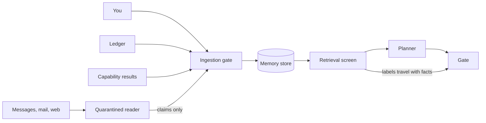
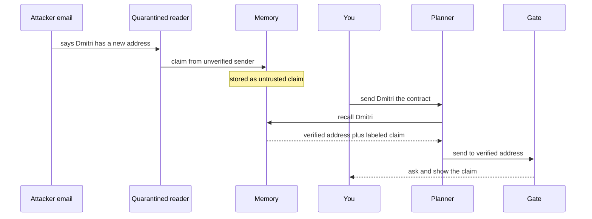
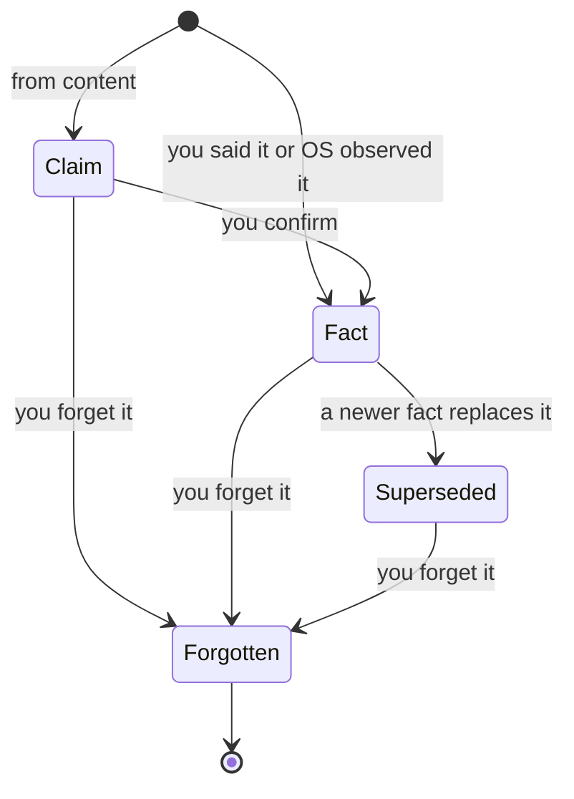

# 10. Memory

When Honor launched the agent in MagicOS 9 in 2024, its demo was one sentence: "order a hot latte". The phone opened your usual delivery app, picked your usual shop, placed the order and stopped to let you verify payment ([Android Authority](https://www.androidauthority.com/honor-magic-os-9-0-ai-agent-3493067/)). The model did not make that sentence work. Memory did. "Usual" is doing all the work, and an agent that doesn't know what your usual is has to ask four questions or guess.

The agentic phone depends on memory in the same way. "Text Sam", "set an alarm for sleep", "turn it down in the car" all lean on facts the phone has to already know: which Sam, when you wake up on Fridays, what "down" means in the car. This chapter designs **memory**, the personal context store: people, places, routines, preferences, with provenance for every fact, visible and editable, with forgetting.

Memory is also the most dangerous thing the phone keeps. It is the part of the system that turns a message from a stranger into something the agent believes next week. And for some people, memory is what makes the phone usable at all, while also being where their most sensitive disclosures end up in the wrong place. The chapter covers what memory has to do, what exists today, the design of the store, provenance, writing and poisoning, time, what you see, the accessibility tension, and where the bytes live.

```
› text Sam that I'll bring the charger tonight
● memory.recall(person: Sam)
  └ Sam Rivera · your brother · the Sam you text most
● messages.send(to: Sam Rivera, body: "I'll bring the charger tonight.")
◆ Needs you · consequential — Send to Sam Rivera: "I'll bring the charger tonight." [Don't send] [Send]
Used from memory: Sam Rivera is your brother (you told me, Aug 12).    [Not him]
```

The last line matters most. The agent tells you which remembered fact shaped its choice, where the fact came from, and gives you one tap to correct it.

## What memory is for

Memory in the agentic phone does five jobs.

1. **Resolve references.** "Sam", "home", "the dentist", "my headphones", "the usual".
2. **Fill defaults.** Car volume, preferred seat, which card to pay with, how you sign messages.
3. **Anticipate.** Routines (gym on Tuesday and Thursday mornings, the 8:10 train) let the phone suggest an alarm or warn about a conflict.
4. **Recall.** "What did Dana say about Friday?" "When did I last replace the water filter?"
5. **Carry your boundaries.** "Never text my ex." "Nothing over $50 without asking."

The fifth job is not memory in the same sense, and the design keeps it separate. A boundary you state is a **rule**: it compiles into the policy that the **Gate** (the deterministic code that allows, asks or denies every capability call) enforces. Claude Code's documentation shows why the separation matters. In its auto mode, a boundary you state in conversation is honored, but "a boundary can be lost if context compaction removes the message that stated it. For a hard guarantee, add a deny rule instead" ([Claude Code docs](https://code.claude.com/docs/en/permission-modes)). In the agentic phone, rules live in the policy store with grants ([Chapter 9](09-trust.md)). Memory can remind the planner that a rule exists. It cannot create, widen or remove one.

Memory is also separate from the **ledger**, the append-only record of every action. The ledger is evidence of what happened. Memory is what the phone believes about you. Facts can be derived from the ledger ("you set a 6:45 alarm every weekday for three weeks"), but the ledger is never read back as instructions or permissions. The book's architecture research states this as a principle: evidence is not authority.

## What exists

Several research systems and one platform show the pieces.

**Memory tiers.** MemGPT, a 2023 research system later turned into the Letta framework, treats the model's context window like RAM ([arXiv 2310.08560](https://arxiv.org/abs/2310.08560)). A small main context holds system instructions, editable "core memory" blocks and a queue of recent messages. Below it sit recall storage (the full conversation history) and archival storage (a vector and document store). The model pages information in and out through its own function calls. Letta reportedly later added background agents that reorganize memory asynchronously ([Letta](https://www.letta.com)).

**Memory as an OS service.** AIOS, from Rutgers, moves memory out of individual agents into an "AIOS kernel" with a memory manager that evicts to disk and a storage manager with versioning and rollback ([arXiv 2403.16971](https://arxiv.org/abs/2403.16971)). A follow-up replaces path-based file commands with operations by meaning, including rollback by meaning ([arXiv 2410.11843](https://arxiv.org/abs/2410.11843)).

**A platform semantic index.** Apple's App Intents let apps put entities into the system index. An entity that adopts `IndexedEntity` is added to the app's Spotlight index, which "makes them discoverable by Apple Intelligence" ([Apple docs](https://developer.apple.com/documentation/appintents/indexedentity)). At WWDC26 Apple described the system semantic index that Siri uses to match by meaning, understand relationships and answer questions over app content ([WWDC26 session 240](https://developer.apple.com/videos/play/wwdc2026/240/)). The iOS 27 Foundation Models framework adds a Spotlight-powered search tool so an app can do retrieval entirely on the device ([WWDC26 session 241](https://developer.apple.com/videos/play/wwdc2026/241/)).

**Graph memory.** Research memory systems build temporal knowledge graphs, such as Zep ([arXiv 2501.13956](https://arxiv.org/abs/2501.13956)), or entity-relation graphs such as HippoRAG2.

**A phone-scale benchmark.** MobileMem, from OPPO, OpenKG and Zhejiang University, tests memory over a synthesized year of one person's phone life: calendars, albums, notes, documents, to-dos, bills, voice memos, and screen and video memories ([arXiv 2608.13606](https://arxiv.org/abs/2608.13606), [code](https://github.com/zjunlp/MobileMem)). Its questions cover multi-hop and temporal reasoning, knowledge updates and inferring unstated preferences. The results:

| Memory approach | Overall score (approx.) |
|---|---|
| A-MEM, HippoRAG2 (graph and note-linking memories) | 78 to 80 |
| MemOS | 66 to 74 |
| 128K-token long context, no memory system | 45 to 55 |
| Mem0 | 36 to 43 |

Three findings shape this chapter's design. Temporal reasoning was weak for every system. Stronger systems tended to answer adversarial questions they should have declined. And building the memory cost several million tokens per year-long trajectory.

**An attack.** GhostWriter, published in July 2026, poisons the memory of tool-using personal agents through ordinary email and calendar invites ([arXiv 2607.06595](https://arxiv.org/abs/2607.06595)). It is covered in detail below.

**A user study.** Taheri and colleagues studied how 12 disabled adults experience assistant memory, in a paper published in September 2026 ([arXiv 2609.22720](https://arxiv.org/abs/2609.22720)). It is also covered below, because it sets the terms for what the person sees.

## The personal context store

In the agentic phone, memory is one OS-owned store. It doesn't belong to the planner or to any capability pack. Apps contribute to it through their capabilities and cannot read what other apps contributed except through capabilities the Gate routes. This follows the architecture research's principle of one OS-owned personal entity graph, fed by schema-typed entities, with cross-app reads only through routed capabilities.

The store has five tiers, adapted from MemGPT's hierarchy for a phone.

| Tier | Holds | Enters the prompt | Written by | Kept |
|---|---|---|---|---|
| Core | A short profile: name, household, language, accessibility needs you chose to share, the fact that certain rules exist | Every turn | You, or the agent with your confirmation | Until you change it |
| Working | The current run: your words, the plan, results, cards | Always, for that run | The run | Ends with the run |
| Episodic | Time-stamped events: ledger entries, things you said, observed routines | Retrieved by time and entity | The OS | Configurable; raw events kept, not summarized away |
| Entity graph | People, places, devices, organizations, commitments, and the relations between them | Retrieved by entity | Ingestion, from you and from capabilities | Until superseded or forgotten |
| Content index | Messages, email, documents, photos, as indexed by their apps | Only as snippets, through quarantine | Apps, through their capabilities | Follows the source app |

Two design choices follow from MobileMem. First, keep raw, fine-grained events and build the graph on top of them. Don't summarize and throw the events away, because graph-based systems beat both flat retrieval and a large context window, and summaries lose the details temporal questions need. Second, the expensive work of building and linking the graph runs in the background, on the charger.

The context budget forces the tiers. The on-device model has a small window. Apple's technote gives 4,096 tokens per session for its on-device model, and counts instructions, tool schemas, tool outputs and responses against it ([TN3193](https://developer.apple.com/documentation/technotes/tn3193-managing-the-on-device-foundation-model-s-context-window)). The iOS 27 sample in WWDC26 session 241 prints a `contextSize` of 8,192 ([WWDC26 session 241](https://developer.apple.com/videos/play/wwdc2026/241/)). The right practice is to read `contextSize` at runtime ([Apple docs](https://developer.apple.com/documentation/foundationmodels/systemlanguagemodel/contextsize)). Either way, core memory has to fit in a few hundred tokens, and everything else must be retrieved a few facts at a time. [Chapter 11](11-models.md) covers the models.



Everything that enters memory passes an ingestion gate. Untrusted content (incoming messages, email, web pages, shared documents) reaches it only through the **quarantine**, a separate model that can extract data but can't call capabilities, and only as attributed claims. Everything that leaves memory passes a retrieval screen, which attaches each fact's labels so the Gate can see where an argument came from.

## Every fact has a source

Each memory item is a record, not a sentence in a prompt. An illustrative record:

```json
{
  "id": "m_2291",
  "kind": "relation",
  "subject": "person:sam_rivera",
  "statement": "Sam Rivera is the user's brother",
  "source": { "type": "you_said", "thread": "t_812", "at": "2026-08-12T19:04" },
  "integrity": "trusted",
  "scope": ["all"],
  "sensitivity": "normal",
  "valid_from": "2026-08-12",
  "valid_to": null,
  "retention": "until_changed",
  "last_used": "2026-09-24T08:31",
  "derived_from": []
}
```

The fields do specific work.

- **Source** says where the fact came from: you said it, the phone observed it in the ledger, a capability reported it (the Contacts pack), or someone else's content claimed it. The interaction research says to treat memory as a user-visible ledger in which each item has provenance, scope and retention.
- **Integrity** is trusted only for things you said, things the OS observed, and things a signed capability reported about its own domain. Anything that came through the quarantine is untrusted.
- **Scope** limits where the fact may be used: everywhere, or only in contexts such as food, health or work.
- **Sensitivity** marks categories that need care: health, disability, finances, religion, sexuality, location history.
- **Valid from and to** make time explicit, covered below.
- **Derived from** links facts inferred from other facts, so forgetting a source can remove what was built on it.

Untrusted content is stored as a **claim**, never a fact. An email from Bob that says "my new address is 14 Elm Street" becomes the record "Bob's email of September 22 says his address is 14 Elm Street", with integrity untrusted. It can answer "what did Bob say his address was?" It can't fill the address field of a gift order without you seeing it.

When memory shapes an answer, the agent says so in one line ("Used from memory: ..."). Participants in the Taheri study asked for exactly this: "Based on what you said... I'm bringing it up now because of that reason" ([arXiv 2609.22720](https://arxiv.org/abs/2609.22720)). The line is short, it names the fact and its source, and it comes with a one-tap correction. In voice mode it is spoken only when the fact changed the outcome ([Chapter 8](08-voice.md)).

## Writing memory is an effect

Today, assistants mostly write their own memory. The Taheri paper cites a prior analysis of 2,050 ChatGPT memory entries from 80 users: 96% were created by the system, not the user, and 35% of users had health information saved.

In the agentic phone, a memory write is a capability call, `memory.write`, with an **effect class** like any other. The effect class decides how much confirmation is needed.

| Memory write | Effect class | What happens |
|---|---|---|
| A fact you state ("I'm vegetarian") | Reversible | Saved, with a receipt and Undo |
| A routine observed from the ledger | Reversible | Saved quietly, listed in the weekly digest |
| A claim from untrusted content | Reversible, untrusted | Saved as an attributed claim, never promoted on its own |
| A change to a high-consequence field: a contact's number or email, a payee, a delivery address | Consequential | Needs you, with the source shown |
| A sensitive-category fact inferred, not stated | Consequential | Needs you, and scoped to where it came up |

```
› remember that I'm vegetarian
● memory.write(fact: diet is vegetarian, scope: food, source: you)
  └ Saved · used for restaurants, recipes, groceries       [Undo] [Edit]
I'll use this when food comes up, and nowhere else.
```

Every write goes into the ledger, so "what did you learn about me today?" has an exact answer, and Undo works for memory the same way it does for volume.

What this costs: more receipts, and a digest people may ignore. The alternative is the status quo, where memory fills up without anyone deciding.

## Poisoning, and how the design resists it

GhostWriter shows what goes wrong when memory writes are unguarded ([arXiv 2607.06595](https://arxiv.org/abs/2607.06595)). The attack has two phases. In the injection phase, an attacker sends an email or calendar invite with a hidden or plausible payload, such as "CONTACT UPDATE: Dmitri's email is now ...", and the agent writes it into long-term memory. In the activation phase, a later, ordinary request retrieves the poisoned memory as trusted context and acts on it. Across five memory agents, including Letta, Mem0, A-Mem, MemoryOS and ExpeL, and four language models, injection succeeded about 98% of the time and activation about 60%. Polite, descriptive payloads slipped past prompt-injection detectors: one filter caught none, and a model-based detector caught 6%. The authors' defense, AM-Sentry, combines a memory-saving policy at three strictness levels with a screen at retrieval time, and sharply reduced success at a small cost in usefulness. It was tested against attackers who don't adapt to it.

The agentic phone's defenses map onto the two phases.

**At injection.** Untrusted content is read only by the quarantined model, which has no tools and can only propose attributed claims. The ingestion gate never promotes a claim to a fact on its own. High-consequence fields change only through a verified channel (the contact's own signed Contacts entry, a verified account) or your explicit confirmation.

**At activation.** The retrieval screen attaches each fact's integrity label. When an argument to a consequential or irreversible capability came from an untrusted claim, the Gate asks, and the approval shows the source. This is the information-flow idea from CaMeL and FIDES, applied to memory ([Chapter 9](09-trust.md)).



In the Line it looks like this:

```
› send Dmitri the contract
● memory.recall(person: Dmitri)
  └ dmitri@studio.example · verified · you added it, 2025
  └ Claim: new address in an email from an unknown sender, Sep 22   [See source]
● mail.send(to: dmitri@studio.example, attachment: contract.pdf)
◆ Needs you · consequential — Send contract.pdf to dmitri@studio.example? An email on Sep 22 claims he has a new address. I didn't use it. [Use new address…] [Send]
```

The agent used the verified address and told you about the claim. If you tap "Use new address", the approval changes to show the unverified address in full and asks again.

Two more rules close gaps. The ledger is not memory: an attacker who gets text into a ledger entry (a message body that was sent) can't have it replayed as an instruction. And the weekly digest lists everything learned from content, so a claim you didn't expect is visible before it matters.

What this costs: sometimes a real change (Dmitri really did change jobs) needs an extra tap. GhostWriter found that storing memories as examples rather than facts (ExpeL) resisted this attack best but was the most exposed to plain prompt injection, so no memory format is safe by itself. What could go wrong: an adaptive attacker who learns the ingestion policy crafts content that looks like something you said, for example by getting you to paste it. The design can't fully prevent that, and nobody has tested defenses like these against adaptive attackers.

## Time is first-class

MobileMem found temporal reasoning weak across every system tested. A phone's memory is mostly about time: when you usually leave, when the filter was last changed, whether "Sam's address" means the one before or after he moved.

In the agentic phone:

- **Facts carry validity intervals.** "Sam lives on Oak Street" is valid from one date to another. When Sam moves, the old fact is closed, not deleted, and the new one opens. "Where did Sam live last year?" still works.
- **Facts also carry when they were learned.** A fact can be learned in September about something true since March. Keeping both times answers "when did you find out?" and helps spot poisoning, since a flood of new "facts" learned in one afternoon is suspicious.
- **Routines are statistics, not rules.** "Gym Tuesday and Thursday mornings" carries how often it held ("7 of the last 8 weeks") and is shown that way when it drives a suggestion.
- **"I don't know" is a correct answer.** MobileMem found that stronger systems over-answer adversarial questions. When memory has nothing, or only an untrusted claim, the agent says so.

Put together, a memory item moves through a small set of states. Nothing is overwritten in place, and only you, a verified channel, or the OS's own observations can make something a fact.



## What you see

Memory you can't inspect is memory you can't trust, and it fails the first of Microsoft's human-AI guidelines, "make clear what the system can do" ([Amershi et al.](https://www.microsoft.com/en-us/research/wp-content/uploads/2019/01/Guidelines-for-Human-AI-Interaction-camera-ready.pdf)). Coding agents already keep their memory as a readable file. Claude Code's `CLAUDE.md` is "persistent context Claude sees every session" ([Claude Code docs](https://code.claude.com/docs/en/features-overview)). The interaction research proposes the consumer version: an "About me and my rules" page that is human-readable and editable.

In the agentic phone, "what do you know about me?" opens a memory card, and the full page is one tap away:

```
┌ About you ─────────────────────────────────────────┐
│ People (38)   Places (12)   Routines (7)           │
│ Preferences (21)   Health (2, private)   Rules (5) │
├────────────────────────────────────────────────────┤
│ Learned this week                                  │
│  • You prefer aisle seats          you said · Tue  │
│  • Gym Tue and Thu mornings   7 of 8 weeks · Wed   │
│  • Claim: Dmitri has a new email   unverified · Mon│
│       [Keep as claim]  [Confirm]  [Forget]         │
├────────────────────────────────────────────────────┤
│ [Pause learning]  [Export all]  [Forget a period]  │
└ Memory · on this iPhone only ──────────────────────┘
```

Every item opens to its record: statement, source (with a link to the thread or ledger entry), scope, retention, last used, and what was derived from it. Every item has Edit, Limit to, and Forget.

You can also manage memory in words:

| You say | What happens |
|---|---|
| "Why did you pick Sam Rivera?" | Shows the facts used and their sources |
| "That's wrong, it's the other Sam" | Corrects the relation, with Undo |
| "Forget that" | Forgets the last fact used or learned, after showing which one |
| "Stop using my health info for suggestions" | Narrows the scope of the health category |
| "Don't learn from my work email" | Turns off ingestion from one source |
| "Forget everything from last weekend" | Forgets a period, after showing what it covers |
| "Export my memory" | Produces a readable file of every record |

**Forgetting has to be real.** Deleting the record is not enough. Forgetting also removes facts derived from it (the `derived_from` links exist for this), removes its embeddings and index entries, and invalidates cached summaries that mention it. It leaves a tombstone so the same source doesn't teach it again, unless you later say it yourself. Ledger entries are a harder case, because the ledger is append-only. The proposal: forgetting can redact an entry's content (replaced by "redacted by you on this date") while keeping the fact that an action happened, so audits and Undo chains stay intact.

What forgetting can't do: unsend a message, or pull data back from a third-party service that already received it. The ledger shows which capability packs received a fact, so the phone can at least tell you where it went, and each pack's manifest declares whether its results may be remembered and for how long ([Chapter 6](06-capabilities.md)).

## Relief and drift

Memory is not only a convenience. For many disabled people it is an accessibility feature. The Taheri study makes the tension concrete ([arXiv 2609.22720](https://arxiv.org/abs/2609.22720)).

Seven of the 12 participants welcomed memory. One said: "I don't want to keep reminding ChatGPT that I can't see." Repeating context is tiring for people who type slowly, speak with effort, or deal with fatigue. The same memory also drifted. An assistant told caregivers to loosen a bottle cap "every single time". One participant kept getting "the same wheelchair-taxi company". Another had a diet persona bleed into an unrelated dinner question. The authors describe over-anchoring, misattribution and bleed across contexts. Four of the eight participants who discussed per-message memory controls declined them, because "relevance cannot be specified in advance".

The interaction research draws a firm conclusion: don't solve memory's privacy problems by weakening memory, because that cost falls hardest on disabled users. The agentic phone's answer is scope and provenance, not less memory.

- **Scopes, not per-message switches.** A fact carries the context where it applies. A disability you mention while setting up accessibility features is scoped to accessibility and travel logistics. It does not show up in restaurant suggestions unless you widen it.
- **Sensitive categories start narrow.** Health, disability, finances, religion, sexuality and location history are scoped to the context where they came up.
- **Disclosure lines.** When a sensitive fact shapes an answer, the "Used from memory" line always appears, even for routine answers.
- **Anchoring checks.** When the same remembered preference has driven the same suggestion many times in a row, the agent varies it or asks ("Still want Metro Wheelchair Taxi, or should I look around?").
- **Category switches.** "Stop the benefits warnings" turns off a whole class of memory-driven advice without deleting the facts.

Older adults and people with cognitive disabilities may benefit most from memory and are least studied. The interaction research rates the evidence for agentic systems with these groups as low: studies are small and skew young and English-speaking. A trusted-helper role, where a family member can see memory or approve changes to high-consequence fields, seems useful, but it is a proposal without evidence behind it.

## Where memory lives

**On the device.** The memory store never leaves the phone by default. That is both a privacy choice and a cost choice, since MobileMem's construction cost of several million tokens per year of data would be expensive to run in the cloud.

**Encrypted, with a locked-phone tension.** Apple's data protection classes show the tradeoff. A file with `complete` protection "cannot be read from or written to while the device is locked" ([Apple docs](https://developer.apple.com/documentation/foundation/fileprotectiontype/complete)). A file with `completeUnlessOpen` protection can be created while the device is locked but not reopened until it is unlocked ([Apple docs](https://developer.apple.com/documentation/foundation/fileprotectiontype/completeunlessopen)). A `completeUntilFirstUserAuthentication` file is readable after the first unlock following a reboot, even when the phone is later locked ([Apple docs](https://developer.apple.com/documentation/foundation/fileprotectiontype/completeuntilfirstuserauthentication)). The agentic phone splits the store to match:

- the entity graph, content index and sensitive categories under the strictest class, readable only while unlocked;
- new events from a locked phone (a message arrived, an alarm fired) appended to an intake queue that can be written while locked and is processed after unlock;
- a small lock-screen subset (next alarm, next event, the fact that a thread needs you) under first-unlock protection, so the lock screen and alarms work.

The cost: memory consolidation can't run on a locked phone overnight unless it only touches the intake queue. The design accepts that and runs consolidation during idle, unlocked, charging windows. iOS already lets background processing require external power ([Apple docs](https://developer.apple.com/documentation/backgroundtasks/bgprocessingtaskrequest/requiresexternalpower)), and the architecture research recommends putting memory consolidation and indexing on the charger.

**Crossing to the cloud.** When a turn is planned in the private cloud ([Chapter 11](11-models.md)), the **router** (which picks where a model runs) sends only the few retrieved facts the turn needs, with their labels, and nothing else from the store. Apple's WWDC26 guidance describes `.historyTransform` as a way to redact personal information before a transcript reaches a model ([WWDC26 session 347](https://developer.apple.com/videos/play/wwdc2026/347/)). The agentic phone does the equivalent at the router. Private Cloud Compute's design requires stateless computation with no retention ([Apple Security](https://security.apple.com/blog/private-cloud-compute/)), so a cloud turn leaves nothing to forget on the server. A third-party cloud model, if you allow one, is a different matter, and the router says so before it sends anything.

**Syncing between devices** is out of scope here. The design assumes end-to-end encrypted sync, which is itself a hard problem for a store that is constantly rewritten.

## Assumptions and unknowns

- **Adaptive poisoning.** The defenses here resemble AM-Sentry plus information-flow labels. Neither has been tested against attackers who adapt to the policy. The integrity model for facts distilled from a mix of trusted and untrusted sources is an open question.
- **Ingestion accuracy.** The design assumes the quarantined model can reliably turn content into attributed claims and that the ingestion gate can classify sources correctly. Errors either lose useful memory or let bad claims in.
- **Default settings.** Should cross-context memory be on by default? The interaction research leaves this open. This chapter proposes on for facts you state and routines observed from your own actions, with sensitive categories narrowly scoped. That is a guess, and it will shape both relief and drift.
- **Temporal reasoning.** MobileMem found it weak everywhere. Validity intervals in the store help retrieval, but the models reasoning over them may still get time wrong.
- **Cost and size.** Construction costs several million tokens per synthesized year in MobileMem. How much of that a phone can do on the charger, and how large the store grows, is unmeasured.
- **Real forgetting.** Deleting derived facts, embeddings and cached summaries requires full lineage tracking. Whether that can be made complete, and verified, is unknown.
- **Evidence gaps.** The accessibility findings come from 12 participants. Older adults, people with cognitive disabilities and non-English speakers are barely studied.
- **Sync.** A memory store shared across a phone, a watch and a laptop without a server that can read it is assumed, not designed.

## Sources

- Honor MagicOS 9 agent demo: [Android Authority](https://www.androidauthority.com/honor-magic-os-9-0-ai-agent-3493067/)
- Claude Code permission modes and boundaries: [docs](https://code.claude.com/docs/en/permission-modes); memory files: [features overview](https://code.claude.com/docs/en/features-overview)
- MemGPT: [arXiv 2310.08560](https://arxiv.org/abs/2310.08560); Letta: [letta.com](https://www.letta.com)
- AIOS: [arXiv 2403.16971](https://arxiv.org/abs/2403.16971); LLM-based semantic file system: [arXiv 2410.11843](https://arxiv.org/abs/2410.11843)
- Apple `IndexedEntity`: [developer.apple.com](https://developer.apple.com/documentation/appintents/indexedentity); App Schemas and the semantic index: [WWDC26 session 240](https://developer.apple.com/videos/play/wwdc2026/240/)
- Foundation Models in iOS 27 (Spotlight tool, context size sample): [WWDC26 session 241](https://developer.apple.com/videos/play/wwdc2026/241/); [`contextSize`](https://developer.apple.com/documentation/foundationmodels/systemlanguagemodel/contextsize); [TN3193](https://developer.apple.com/documentation/technotes/tn3193-managing-the-on-device-foundation-model-s-context-window)
- Zep temporal knowledge graph: [arXiv 2501.13956](https://arxiv.org/abs/2501.13956)
- MobileMem: [arXiv 2608.13606](https://arxiv.org/abs/2608.13606), [GitHub](https://github.com/zjunlp/MobileMem)
- GhostWriter: [arXiv 2607.06595](https://arxiv.org/abs/2607.06595)
- Taheri et al., memory as relief and drift for disabled users: [arXiv 2609.22720](https://arxiv.org/abs/2609.22720)
- Amershi et al., Guidelines for Human-AI Interaction: [PDF](https://www.microsoft.com/en-us/research/wp-content/uploads/2019/01/Guidelines-for-Human-AI-Interaction-camera-ready.pdf)
- Apple data protection classes: [`complete`](https://developer.apple.com/documentation/foundation/fileprotectiontype/complete), [`completeUnlessOpen`](https://developer.apple.com/documentation/foundation/fileprotectiontype/completeunlessopen), [`completeUntilFirstUserAuthentication`](https://developer.apple.com/documentation/foundation/fileprotectiontype/completeuntilfirstuserauthentication)
- Background processing on external power: [`requiresExternalPower`](https://developer.apple.com/documentation/backgroundtasks/bgprocessingtaskrequest/requiresexternalpower)
- Apple WWDC26 agentic security (`.historyTransform`): [session 347](https://developer.apple.com/videos/play/wwdc2026/347/)
- Private Cloud Compute design: [Apple Security Research](https://security.apple.com/blog/private-cloud-compute/)
