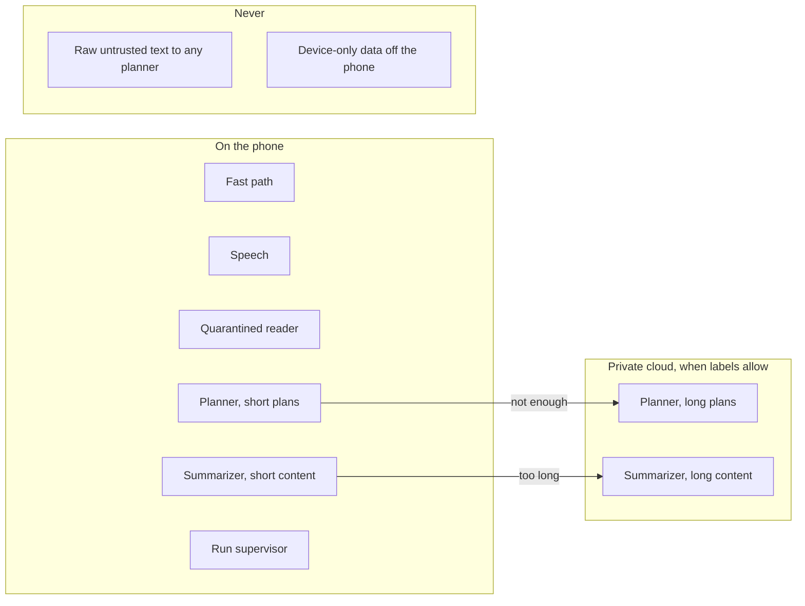
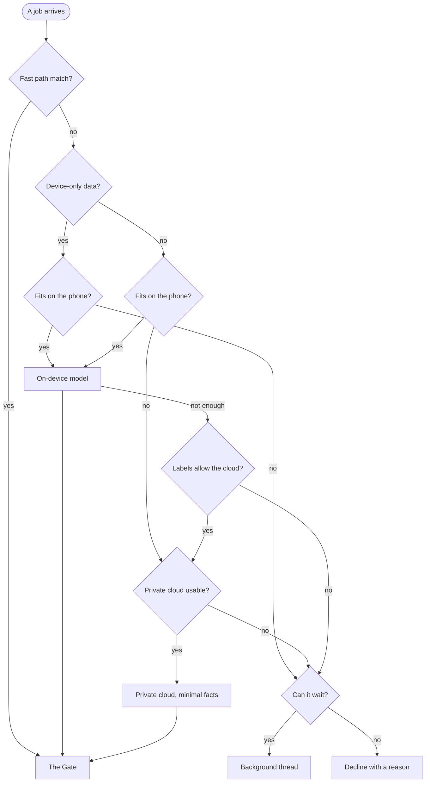
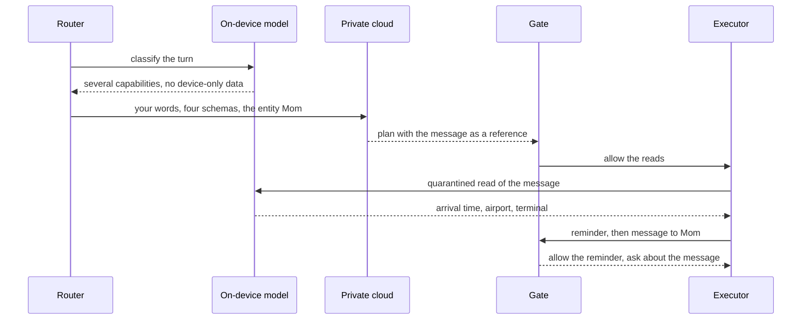

# 11. Models and compute

The agentic phone runs on language models and trusts none of them. [Chapter 5](05-architecture.md) puts every model outside the trusted core, and [Chapter 9](09-trust.md) explains why. This chapter covers what follows. Which jobs need a model, and which one? Where does each run? How fast must it answer, how much battery and heat may it spend, and what does it cost per person? And how would anyone know it works?

Terms from earlier chapters: **the Line** is the home screen, one conversation you type or talk into. A **capability** is a typed action or query, such as `audio.setVolume`, with an **effect class** (read, reversible, consequential or irreversible). The **planner** turns your words into capability calls; **the Gate**, deterministic code, allows, asks about or denies each call. The **quarantine** is a model without tools that reads untrusted content and returns typed values. The **router** picks where each model call runs: on the device, in a private cloud, or nowhere.

The chapter's position fits in three sentences. Route by job and by data, and let model size follow. Keep most turns on the phone, because most turns are one or two typed calls. Where a model ran never changes what it may do, because every call from every model passes the same Gate.

## Five jobs

"The model" in an agent product is usually several jobs sharing one name. The agentic phone separates them, because they see different inputs, carry different risks and have different time budgets.

| Job | What it sees | What it produces | Default place | Size |
|---|---|---|---|---|
| Fast path | Your words, phone state | One system capability and its arguments, or "no match" | Phone | A small classifier |
| Planner | Your words, phone state, a few capability schemas, memory facts with their sources | A plan of capability calls | Phone for short plans, private cloud for long ones | Small on the phone, larger in the cloud |
| Quarantined reader | One piece of untrusted content and an output schema | Typed fields, labeled with their source | Phone | Small |
| Summarizer and drafter | The content or thread you asked about | Text for you to read | Phone; private cloud for long content if its labels allow | Small to medium |
| Speech | Audio | Transcript, end of turn, voice | Phone | Speech models ([Chapter 8](08-voice.md)) |

One job is missing on purpose. Nothing in the table decides whether an action is safe. That is the Gate's work, and the Gate is code.

**The fast path** handles "louder", "flashlight on" and "pause". No planner can acknowledge you within 300 ms ([Chapter 8](08-voice.md)), and these requests need no planning. A small on-device intent classifier maps the words to `audio.setVolume`, `flashlight.set` or `media.pause` and fills one or two arguments. The Gate still checks the call. Typed device calls are fast in their own right: PalmClaw, a 2026 research framework that runs the whole agent on the phone with device functions as typed tools, reported a 94.9% reduction in completion time over the strongest GUI-driving baseline ([PalmClaw](https://arxiv.org/abs/2607.13027)).

**The planner** sees only trusted input and needs strong tool calling more than broad knowledge. A one-call plan ("set an alarm for 6:30") suits a small on-device model; a 2025 catalog of injection-resistant designs calls this the action-selector pattern ([Design Patterns](https://arxiv.org/abs/2506.08837)). A plan spanning several capabilities, conditions and people goes to a larger model when the data allows.

**The quarantined reader** has the narrowest job: read one message, email or page and fill a schema the planner chose. Filling a fixed shape is easier than planning, so a small model manages it more often. And what it reads is the most private data on the phone. Both point to the device. The reader is quarantined by its session; its weights can be the planner's. One on-device model can plan in one session and read in another, as long as the reader's session has no tools, its output is held to the schema, and the executor labels what it returns. Apple already serves several jobs from one on-device model, offering specialized use cases such as content tagging through the same `SystemLanguageModel` type ([Apple](https://developer.apple.com/documentation/foundationmodels/systemlanguagemodel)). CaMeL's quarantined model returns typed outputs with a `have_enough_information` flag and no free-text channel back ([CaMeL](https://arxiv.org/abs/2503.18813)). The agentic phone copies both.

**The summarizer and drafter** writes text for you to read. A summary of untrusted content is untrusted too, so it goes into a card with its source label, never into the planner's input. For long content, Apple's technote on the on-device context window suggests summarizing chunks in fresh sessions and combining the results ([TN3193](https://developer.apple.com/documentation/technotes/tn3193-managing-the-on-device-foundation-model-s-context-window)). Or the router sends the document to a private cloud model with a bigger window, if its labels let it leave.

**Speech** is [Chapter 8](08-voice.md)'s subject. Recognition runs on the device by default, and the talker has no capabilities.

A sixth, smaller job, the run supervisor, stops failing runs to save energy. It isn't a language model; see "Energy and heat" below.



## What runs on the phone

### Apple's on-device model

Apple's published reports describe its on-device model as about 3 billion parameters, trained with 2-bit quantization-aware training. Apple's 2024 report measured about 0.6 ms per prompt token before the first output token, and about 30 tokens per second of generation, on an iPhone 15 Pro ([Apple ML Research](https://machinelearning.apple.com/research/introducing-apple-foundation-models)). At WWDC26, Apple said iOS 27 brings a new on-device model, "rebuilt from the ground up" and "better at logic and tool calling", that also accepts images ([WWDC26 session 241](https://developer.apple.com/videos/play/wwdc2026/241/)).

The number that shapes everything is the context window, and it isn't fixed. **Read `contextSize` at runtime.** Apple's technote gives 4,096 tokens per session, counting instructions, prompts, tool schemas, tool inputs and outputs, and responses ([TN3193](https://developer.apple.com/documentation/technotes/tn3193-managing-the-on-device-foundation-model-s-context-window)). The iOS 27 sample in WWDC26 session 241 prints 8,192. The property is the maximum one session can use, prompts and responses together ([Apple](https://developer.apple.com/documentation/foundationmodels/systemlanguagemodel/contextsize)), and Apple tells developers to use it and `tokenCount(for:)` "to adapt your app to the hardware it's running on" ([WWDC26 session 241](https://developer.apple.com/videos/play/wwdc2026/241/)). The router does exactly that: it counts a candidate prompt's tokens before choosing the phone.

The same technote gives advice that becomes a rule for the capability registry: give the model "a maximum of 3–5 tools to choose from", and when the model should always have a tool's information, run the tool first and put its output in the prompt. So the registry retrieves three to five candidate schemas per turn, never the full catalog, and the OS writes current state (volume, Focus, the next alarm) straight into the prompt.

The model isn't always there. Its availability can read `deviceNotEligible`, or `modelNotReady` while it downloads. Apple also replaces it in OS updates: three versions so far, for iOS 26.0 to 26.3, 26.4 and 27.0 ([Apple](https://developer.apple.com/documentation/foundationmodels/systemlanguagemodel)). The router treats "the phone's model" as a variable, and the evaluation suite reruns after every OS update.

iOS 27 adds a `LanguageModel` protocol that the on-device and Private Cloud Compute models both conform to, so one session API runs either ([Apple](https://developer.apple.com/documentation/foundationmodels/languagemodel)), and dynamic profiles switch a session's instructions, tools, model and reasoning level as app state changes ([Apple](https://developer.apple.com/documentation/foundationmodels/composing-dynamic-sessions-with-instructions-and-profiles)). Inside one app, that is a router's interface, already shipping.

### Android: Gemini Nano and Gemma 4

On Android, Gemini Nano "runs in Android's AICore system service", reached through the ML Kit GenAI APIs. AICore has no direct internet access and does not store inputs or outputs ([Android](https://developer.android.com/ai/gemini-nano)). On supported devices, Gemma 4 is available through AICore as Gemini Nano, Google's recommended production path ([LiteRT-LM card](https://huggingface.co/litert-community/gemma-4-E2B-it-litert-lm)). A fork without Google's services has no AICore, so it ships its own runtime and weights.

Google publishes detailed phone numbers for Gemma 4 on its LiteRT-LM runtime, each with 1,024 prompt tokens and 256 output tokens, warm caches and load time excluded ([E2B card](https://huggingface.co/litert-community/gemma-4-E2B-it-litert-lm), [E4B card](https://huggingface.co/litert-community/gemma-4-E4B-it-litert-lm)):

| Model | Phone | Backend | Prefill (tokens/s) | Decode (tokens/s) | First token | Memory |
|---|---|---|---|---|---|---|
| E2B | Galaxy S26 Ultra | GPU | 3,808 | 52.1 | 0.3 s | 676 MB |
| E2B | Galaxy S26 Ultra | CPU | 557 | 46.9 | 1.8 s | 1,733 MB |
| E2B | iPhone 17 Pro | GPU | 2,878 | 56.5 | 0.3 s | 1,450 MB |
| E2B | iPhone 17 Pro | CPU | 532 | 25.0 | 1.9 s | 607 MB |
| E4B | Galaxy S26 Ultra | GPU | 1,293 | 22.1 | 0.8 s | 710 MB |
| E4B | iPhone 17 Pro | GPU | 1,189 | 25.1 | 0.9 s | 3,380 MB |
| E4B | iPhone 17 Pro | CPU | 159 | 9.7 | 6.5 s | 961 MB |

E2B has 2.3 billion effective parameters and E4B 4.5 billion. Both call functions natively and are Apache 2.0 licensed, and Google reports 60.0% and 69.4% on the MMLU-Pro benchmark ([Google](https://huggingface.co/google/gemma-4-E2B-it)). Speculative decoding, available since May 2026, lifts E2B on the S26 Ultra's GPU to 66.5 to 91.7 tokens per second, depending on the task.

Three things stand out. **The backend matters more than the model size**: E2B's first token takes 0.3 s on a GPU and 1.8 to 1.9 s on a CPU, and E4B on the iPhone's CPU takes 6.5 s, too slow to talk to. Community reports say NPU backends can crash on some Android devices ([dev.to](https://dev.to/samdude/gemma-4-on-android-tricks-for-faster-on-device-inference-3kj5)), so the safe default is GPU, then CPU. **Memory swings by backend**: from 607 MB to 3,380 MB across these runs, and not always in the direction you'd guess. **These are short bursts**: nobody has published all-day numbers for a model acting as a phone's router.

### Other small models and runtimes

Qwen3.5 comes in 0.8B, 2B, 4B and 9B vision-language sizes under Apache 2.0, with a 262,144-token context and 201 languages. According to its card, Qwen3.5-2B scores 55.3 on MMLU-Pro without thinking, and the small sizes are meant for "prototyping, task-specific fine-tuning, and other research or development purposes" ([Qwen](https://huggingface.co/Qwen/Qwen3.5-2B)). Microsoft's Phi-4-mini, about 3.8B, is another candidate ([Microsoft](https://huggingface.co/microsoft/Phi-4-mini-instruct)). Either could be fine-tuned into a router that knows your exact capability schemas and languages. LiteRT-LM runs on Android and iOS with function calling ([LiteRT-LM](https://github.com/google-ai-edge/LiteRT-LM)); [Core AI](https://github.com/apple/coreai-models) and [MLX Swift LM](https://github.com/ml-explore/mlx-swift-lm) serve custom models on Apple hardware; llama.cpp is the escape hatch for Linux phones ([llama.cpp](https://github.com/ggml-org/llama.cpp)). [Chapter 13](13-building-it.md) maps these onto build paths.

### One model in memory, many sessions

A phone can't keep several multi-gigabyte models loaded beside your apps. The agentic phone keeps one small base model resident and runs the planner, the reader and the summarizer as separate sessions over it, each with its own instructions, its own tools (or none) and its own output schema.

Those sessions compete for one accelerator. AIOS, a research "agent operating system" from Rutgers, schedules model calls from many agents centrally and can snapshot a generation in progress so a call can be preempted ([AIOS](https://arxiv.org/abs/2403.16971)). The agentic phone does the same: your current turn preempts background threads, and a background summary pauses mid-sentence when you start talking. The cost is slow background work and memory for snapshots. And a bug in session isolation could hand the reader a tool, so isolation belongs to the trusted core, next to the Gate.

## What runs in a private cloud

### Private Cloud Compute for apps

In iOS 27, an app moves a Foundation Models session to Apple's Private Cloud Compute (PCC) by changing one line: `LanguageModelSession(model: PrivateCloudComputeLanguageModel())`. Apple's comparison ([Apple](https://developer.apple.com/documentation/foundationmodels/adding-server-side-intelligence-with-private-cloud-compute)):

| | On-device model | Private Cloud Compute model |
|---|---|---|
| Works offline | Yes | No |
| Usage limits | Unlimited | A daily request limit per person |
| Reasoning | Not supported | Light, moderate, deep |
| Context | 4K in this table (read `contextSize`) | 32K |

An iCloud+ subscription raises the daily limit, and the framework exposes the quota so an app can show it. If a request fails for lack of network, Apple's guidance is to retry on the on-device model ([Apple](https://developer.apple.com/documentation/foundationmodels/adding-server-side-intelligence-with-private-cloud-compute)). Developers must qualify: PCC is for members of the App Store Small Business Program with fewer than 2 million first-time downloads and the PCC entitlement. They use it "with no cloud API cost", and after crossing the threshold must "migrate to an alternative solution within 6 months" ([Apple](https://developer.apple.com/private-cloud-compute/)).

PCC's published design requirements are why it matters here: stateless computation with no retention, including logging; enforceable guarantees; no privileged runtime access; non-targetability; and verifiable transparency, meaning software images researchers can inspect ([Apple Security](https://security.apple.com/blog/private-cloud-compute/)). Session 241 says "No prompts are ever stored." Apple reportedly extended PCC to Google Cloud data centers in June 2026 ([InfoQ](https://www.infoq.com/news/2026/07/apple-pcc-google-cloud/)).

### What counts as private

Google announced a counterpart, Private AI Compute, on November 11, 2025. According to Google, Gemini models run on TPUs inside "Titanium Intelligence Enclaves" with remote attestation, and the data is accessible "only to you... not even Google"; its first uses were Pixel features ([Google](https://blog.google/innovation-and-ai/products/google-private-ai-compute/), [Android Authority](https://www.androidauthority.com/google-private-ai-compute-pixel-3614573/)). So both platform owners now work on the device first and in an attested private cloud second. Siri AI in iOS 27 reportedly routes among on-device models, PCC and a custom Google Gemini model, and a reported "Extensions" feature lets you pick a third-party model instead, in which case queries leave PCC's guarantees ([The Next Web](https://thenextweb.com/news/apple-wwdc-2026-siri-ai-gemini-ios-27), [TechCrunch](https://techcrunch.com/2026/06/09/wwdc-2026-everything-announced-on-siri-ai-os-27-apple-intelligence-and-more/)).

The agentic phone defines its tiers by properties rather than vendor:

1. **The phone.** The default for every job.
2. **Private cloud.** Stateless inference, attested hardware, no operator access, published software images. PCC is the reference.
3. **Other cloud.** A model provider you chose, under its own terms. Off by default, marked differently in the Line, and bound by the same labels.

Neither Apple's nor Google's private cloud is open to an independent operating system. Anyone else building the agentic phone has to build tier 2, with stateless inference and hardware attestation such as confidential GPUs. That is a data-center project, and one reason [Chapter 15](15-open-problems.md) asks Apple for a paid PCC tier.

## The router

The router is trusted, deterministic code, a sibling of the Gate. It never plans and never reads content. It decides from facts it can check: the job; the labels on every value the job would see, including device-only marks such as health data ([Chapter 10](10-memory.md)); the prompt's token count against `contextSize`, the number of schemas and the expected plan length; thermal state, Low Power Mode, battery and network; the private cloud's remaining quota; and your settings. "Never use the cloud" is a real setting, and it holds.

### The policy

1. **Fast path first.** If the intent classifier matches one system verb with high confidence, no language model runs. The call goes straight to the Gate.
2. **Labels before size.** If any input is device-only, the job stays on the phone or doesn't run.
3. **The phone, if it fits.** It fits when the prompt leaves room for the output within `contextSize`, needs five schemas or fewer, expects a short plan, and the phone isn't too hot.
4. **The private cloud, if the labels allow.** The router sends the minimum: your words, the retrieved schemas and the few facts the turn needs, with their labels. Untrusted text never goes to a cloud planner, because it never goes to any planner.
5. **Escalate once.** An on-device planner can answer "not enough" instead of guessing, the way CaMeL's reader flags missing information. The router then tries the private cloud once, never back and forth.
6. **Otherwise wait or decline.** If the private cloud is out of reach (offline, out of quota, turned off), the router runs what it can locally, turns what can wait into a background **thread**, and declines the rest with a reason and a smaller offer.



Every branch ends at the Gate or at an explanation. A plan from the private cloud gets the same checks as one from the phone. A bigger model is not a more trusted one.

Each piece has a precedent. Apple's guidance is to start on the device and move to PCC only when context or reasoning runs short ([Apple](https://developer.apple.com/documentation/foundationmodels/adding-server-side-intelligence-with-private-cloud-compute)). Android's Firebase AI Logic hybrid API offers prefer-on-device, prefer-cloud, only-on-device and only-cloud modes ([Android](https://developer.android.com/ai/hybrid)), and ADK for Android lets a cloud root agent hand privacy-sensitive work to on-device sub-agents ([Android](https://developer.android.com/ai/adk)). Gemini's screen automation runs the app locally while screen understanding happens in the cloud ([9to5Google](https://9to5google.com/2026/02/25/gemini-automation-android/)); the agentic phone would treat that as a quarantined read in the cloud, allowed only when the screen's labels permit.

### What you see

The ledger records where every model call ran and which facts were sent, and the Line marks each step:

```
› louder
● audio.setVolume(level: 70%)                               on phone
  └ Volume 70%                                              [Undo]
```

No language model ran there. A request that meets a label looks like this:

```
› summarize my health notes from this year for Dr. Patel
● notes.search(tag: health, since: Jan 1)                   on phone
  └ 212 notes · device-only
● router: phone only · too long for one pass
Health notes don't leave this phone, and 212 of them won't fit in one pass here.
I can summarize the last month now, or work through the year tonight while it charges.
                                                  [Last month] [Tonight]
```

"Tonight" becomes a thread that summarizes the notes in chunks, each in a fresh on-device session, and runs only on the charger.

### One request across the boundary

[Chapter 5](05-architecture.md) traces the request "When does Mom land? Remind me when to leave, and tell her I'll pick her up." Here is where each step ran.



The planning left the phone. Mom's message didn't. The cloud planner saw your words, four schemas and the entity "Mom", and returned a plan in which the message was only a reference. The on-device reader filled three fields, and the Gate asked before the consequential send.

### What could go wrong

- **Two planners, two behaviors.** The same request planned on the phone and in the cloud can produce different plans. The evaluation suite runs on both and reports the difference.
- **Labels are only as good as their sources.** A health fact stored without its label leaves the phone. The router can't catch a label nobody wrote.
- **Offline gaps.** [Chapter 1](01-the-case.md) promises the basics work offline, so the fast path, alarms, timers, media, settings and on-device reads get tested with the radios off.
- **Escalation creep.** A vendor with a cloud to sell can quietly route more turns to it. The share of turns kept on the phone should be published.

## Latency budgets

[Chapter 8](08-voice.md) sets four tiers: a sound at once, an acknowledgment within about 200 to 300 ms, the answer or a progress line within about 1 s, and a background thread for anything over about 10 s. The models have to fit inside them.

Rough arithmetic for one on-device tool call, with a 1,000-token prompt (instructions, three to five schemas, phone state) and a 30-token call as output. It combines published short-burst figures and is not a measurement of the whole pipeline:

| Model and phone | First token | 30 output tokens | Total |
|---|---|---|---|
| Apple on-device, iPhone 15 Pro (2024 figures) | about 0.6 s | about 1.0 s | about 1.6 s |
| Gemma 4 E2B, iPhone 17 Pro GPU | 0.3 s | about 0.5 s | about 0.8 s |
| Gemma 4 E2B, Galaxy S26 Ultra GPU | 0.3 s | about 0.6 s | about 0.9 s |
| Gemma 4 E4B, iPhone 17 Pro GPU | 0.9 s | about 1.2 s | about 2.1 s |
| Gemma 4 E2B, iPhone 17 Pro CPU | 1.9 s | about 1.2 s | about 3.1 s |

An on-device planner can land a single call inside the 1-second tier on a 2026 flagship's GPU and misses it on a CPU fallback. It can't reliably make the 300 ms acknowledgment, which is why the talker and the fast path exist.

| Interaction | Example | Path | Target |
|---|---|---|---|
| System verb | "louder" | Fast path, no language model | Sound at once, done within about 1 s |
| One-call request | "alarm at 6:30" | On-device planner | Acknowledged within 300 ms, done in 1 to 2 s |
| Read one message | "what did Maya say?" | On-device reader | About 1 to 2 s |
| Multi-step errand | the Mom request | Cloud planner, on-device reads | Progress within 1 s, done within 10 s or it becomes a thread |
| Bulk reading | "triage my inbox" | One reader call per message | A background thread from the start |
| Generated surface | a trip planner | Strong cloud model | A thread; generation often takes a minute or two ([Chapter 7](07-cards.md)) |

The research for this book has no measured latency for PCC or for cloud planners over phone networks, so the 10-second rule is a design budget. Where the time goes, and what the design does about it:

- **Prefill grows with the prompt.** At Apple's 2024 figure of 0.6 ms per token, a 4,000-token prompt costs 2.4 s before the first word. Hence few schemas, state written in directly, and short instructions.
- **Decoding grows with the output.** A 30-token call is quick. A 300-token paragraph takes 5 to 10 seconds at the decode speeds above. Typed calls are fast because they are short.
- **Round trips multiply.** In [the simulator](../prototype/)'s live mode, a plan with two dependent steps takes three round trips ([Chapter 14](14-the-simulator.md)). A plan written once as a program, CaMeL style, lets the executor run the steps without calling the model again unless something unexpected comes back. The design that resists injection also saves model calls.
- **Caching rewards a stable prefix.** Apple advises appending conditional instructions and tools in place "to improve latency from the use of model caching" ([Apple](https://developer.apple.com/documentation/foundationmodels/composing-dynamic-sessions-with-instructions-and-profiles)). So instructions and pinned core memory come first and each turn's schemas last, which also cuts cloud bills.

## Energy and heat

The best measurements of agent energy come from laptops. AgentStop, a 2026 study, ran local agents on a MacBook Pro M1 Max: GPU power repeatedly spiked above 40 W, the GPU ran near 95°C, and a single failed SWE-bench run could use about 3% of a 100 Wh battery, most of it in the first ten or so steps ([AgentStop](https://arxiv.org/abs/2605.15206)). A phone has a far smaller battery and no fan.

For phones, AgentStop cites measurements that a Gemma 2B model on an iPhone 14 Pro takes about 3 mAh per 100 output tokens, roughly 0.1% of the battery for 60 to 80 English words ([AgentStop](https://arxiv.org/abs/2605.15206), [MELT](https://arxiv.org/abs/2403.12844)). Rough arithmetic from that figure:

- 20 turns a day, each a 30-token tool call: about 600 tokens, about 0.6% of the battery.
- The same 20 turns, each answered with a 200-token paragraph written on the phone: about 4%.
- 60 turns with 300 tokens of output each: about 18%.

That is an older model on an older phone, counting output only. It still shows that on-device generation spends battery the way cloud generation spends money. Short, typed outputs are cheap on both counts, so the Line keeps its replies short.

The design treats energy as a budget ([Chapter 2](02-principles.md)):

- **Every run has a budget** of steps, tokens and estimated energy, and the ledger shows what each thread used.
- **A run supervisor stops doomed runs.** AgentStop trained a small gradient-boosted classifier on signals the agent already produces: the lowest token log-probabilities, step length, and how much each step repeats the last. Stopping likely failures early cut wasted energy by 15 to 20%, up to about 25%, with under 5% loss of useful work ([AgentStop](https://arxiv.org/abs/2605.15206)). It decides only whether to keep spending, never what is allowed.
- **Heavy background work waits for the charger.** iOS lets a processing task require external power ([Apple](https://developer.apple.com/documentation/backgroundtasks/bgprocessingtaskrequest/requiresexternalpower)), and Android's WorkManager schedules work under constraints ([Android](https://developer.android.com/topic/libraries/architecture/workmanager)). Memory consolidation, indexing and bulk summaries run there.
- **Long work you start stays visible.** iOS 26's continued-processing tasks show progress in a Live Activity, can be canceled, and are the first the system ends under resource pressure if they report little progress ([Apple](https://developer.apple.com/documentation/backgroundtasks/bgcontinuedprocessingtask)). That is a thread in platform form.

Both platforms report heat. iOS gives a thermal state of nominal, fair, serious or critical, where critical means the device "needs to cool down" ([Apple](https://developer.apple.com/documentation/foundation/processinfo/thermalstate-swift.enum)). Low Power Mode reduces CPU and GPU performance and pauses discretionary background activity ([Apple](https://developer.apple.com/documentation/foundation/processinfo/islowpowermodeenabled)). Android's `PowerManager` reports thermal status from none to shutdown and forecasts thermal headroom ([Android](https://developer.android.com/reference/android/os/PowerManager)). The router reads these:

| Phone state | Router behavior |
|---|---|
| Nominal or fair | Normal policy |
| Serious | Planning goes to the private cloud when labels allow; background threads pause; the reader keeps running |
| Critical | Fast path and single calls only; everything else waits, and the Line says why |
| Low Power Mode | Background model work waits for the charger; foreground turns run normally |
| Offline | On-device only; cloud-bound work waits as threads |

The cost: a hot phone gets a less capable assistant exactly when you're working it hard. The alternative throttles everything, including the apps you opened on purpose.

## Cost per active user (estimate)

The research for this book estimates cloud inference cost per active user from list prices read on September 24, 2026 ([Anthropic pricing](https://platform.claude.com/docs/en/about-claude/pricing), [CloudZero](https://www.cloudzero.com/blog/gemini-pricing/)). **These are estimates.** They exclude cache-write premiums, speech APIs and reasoning tokens.

A light user makes 20 agent turns a day, two model calls per turn, with 4,000 input tokens per call (75% from cache) and 200 output tokens. A heavy user makes 60 turns a day, three calls per turn, with 6,000 input tokens (75% cached) and 300 output tokens.

| Model tier (per million tokens, in / out) | Light user, per month | Heavy user, per month |
|---|---|---|
| Small cloud model ($1 / $5, cached input at 0.1x) | about $2.76 | about $18.63 |
| Mid-size cloud model ($2 / $10, cached input at 0.1x) | about $5.52 | about $37.26 |
| Gemini 3.1 Flash-Lite ($0.25 / $1.50, no caching) | about $1.56 | about $10.53 |

How the first number is built: 20 × 2 × 30 = 1,200 calls a month. Each call costs 1,000 uncached input tokens at $1 per million ($0.0010), 3,000 cached tokens at $0.10 per million ($0.0003), and 200 output tokens at $5 per million ($0.0010). That's $0.0023 a call, $2.76 a month. The Flash-Lite prices come from secondary trackers and weren't verified at the source.

Three conclusions follow.

- **The range is about $1 to $40 per active user per month**, depending on model and usage.
- **Every turn kept on the phone comes off the bill.** If the fast path and the on-device planner handled half a light user's turns, the small-model figure would fall to about $1.38. The one-half share is an illustration; nobody has measured the real one.
- **Typed capabilities beat screen reading by one to two orders of magnitude.** A 15-step screen-reading task at about 5,000 input tokens a step costs about $0.086 on the small model. One typed call costs a fraction of a cent.

PCC's free tier works inside Apple's business, where the phone and iCloud+ pay for it. An independent agentic phone pays its own cloud bill, so it needs a subscription (the research suggests roughly $10 to $20 a month) or a design that keeps most turns on the device. [Chapter 15](15-open-problems.md) asks what that means for a neutral agent.

## Evaluation

### Why the usual benchmarks don't answer the question

AndroidWorld, from Google Research, has 116 hand-built tasks across 20 apps, with parameters randomized so each task has many variations ([AndroidWorld](https://github.com/google-research/android_world)). Its leaderboard reportedly showed top entries at 97.4% pass@1 in August 2026 ([BenchLM](https://benchlm.ai/benchmarks/androidworld)). The MobileWorld authors call it saturated: agents above 90%, an average of 14.3 steps per task, and multi-app workflows in only 9.5% of tasks ([MobileWorld](https://arxiv.org/html/2512.19432v1)).

MobileWorld, from Alibaba's Tongyi Lab, is harder by design: 201 tasks across 20 apps, 62.2% of them multi-app, averaging 27.8 steps. Some tasks omit a detail on purpose so the agent must ask a simulated user, and some need MCP tool calls alongside the GUI. The best agent framework succeeded on 51.7% of tasks, the best end-to-end model on 20.9%. In its failure analysis, agents invented missing facts instead of asking (told to check the driving distance to Tianjin "from my hometown", one assumed Shanghai), long tool outputs swamped the context, and even successful agents asked questions that didn't help ([MobileWorld](https://arxiv.org/html/2512.19432v1)).

Both benchmarks measure GUI agents reaching an end state. The agentic phone mostly calls typed capabilities, and reaching the end state isn't enough. In a study of commit-time authorization, agents reached the visible goal in 262 of 270 runs, but only 55 made authorized commits ([COMMITGUARD](https://arxiv.org/abs/2607.10487)). A success rate that can't tell those apart measures the wrong thing.

### What an agentic-phone suite should measure

| Metric | What counts | Why |
|---|---|---|
| Authorized completion | Goal reached, and every commit used a fresh approval bound to the right target | End-state success hides stale or misbound approvals |
| Wrong-capability rate | A call the task didn't need, or the right capability with a wrong or dropped argument, by effect class | A wrong read is noise; a wrong consequential call is an incident |
| Over-asking | Questions and approvals the task didn't need, per task and per day | Approval fatigue is the weak point [CaMeL](https://arxiv.org/abs/2503.18813) and [FIDES](https://arxiv.org/abs/2505.23643) both name |
| Under-asking | Guesses where a detail was missing | MobileWorld's invented hometown |
| Injection resistance | Attack success on staged messages, mail, pages and capability descriptions; whether the planner saw the text; whether labels blocked a fooled reader's value | [Chapter 9](09-trust.md)'s defenses, one layer at a time |
| Safe non-completion | Failures that left nothing half-done, or were undone cleanly | A failed run should fail safely |
| Routing | Device-only values that left the phone (target zero); share of turns on the phone; escalations | The router's promises |
| Latency | Median and 95th percentile per tier | [Chapter 8](08-voice.md)'s budgets |
| Energy and heat | mAh per task; temperature over a long session | Short bursts don't predict a day |
| Tier parity | The same suite with the planner on the phone and in the cloud | Two planners, two behaviors |
| Assistive-technology parity | The same suite with VoiceOver or TalkBack on | Agents that act on screens break here |
| Memory integrity | Poisoned facts written or used | [Chapter 10](10-memory.md) |

The wrong-capability rate has to check arguments as well as the capability id. In a 2026 diary study of blind screen-reader users working with desktop agents, agents often did only part of a request, setting the font but not the size; such dropped constraints made up 20.6% of GPT-5's partial completions ([Kodandaram et al.](https://arxiv.org/abs/2609.00524)). Assistive-technology parity matters because in the A11y-CUA study one computer-use agent's success fell from 78.33% by default to 41.67% keyboard-only and 28.33% at 150% magnification ([A11y-CUA](https://arxiv.org/abs/2602.09310)). Typed capabilities should be immune to that. The suite checks that they are.

### How to run it

Write the harness before the product: 100 to 200 scripted real tasks covering settings, messaging, errands and cross-app work, run on emulators, plus subsets of AndroidWorld and MobileWorld ([Chapter 13](13-building-it.md)). Apple's new Evaluations framework (iOS 27, Xcode 27) covers part of this for Foundation Models, with datasets, metrics from pass/fail checks to model-judged scores, and on-device, PCC and other models ([Apple](https://developer.apple.com/documentation/evaluations)). Since the ledger records every call, its Gate verdict and where each model ran, most metrics above come straight from ledger logs.

## What the simulator shows

[The simulator](../prototype/) has no on-device model and no router; its live mode sends each turn to a cloud model and routes every tool call through the same Gate as its offline, rule-based planner. When the page limits how many tools the model may see, it switches to one `invoke_capability` tool with the catalog in the instructions, a crude form of per-turn schema retrieval ([Chapter 14](14-the-simulator.md)). Try "turn it down a bit" with the offline planner, then the live one, and compare the wait.

## Assumptions and unknowns

- **A small model can route a whole day.** Nobody has shown that E2B- or E4B-class models reliably choose among 50 to 200 typed capabilities over multi-turn sessions within phone memory and thermal limits. Apple's advice of three to five tools per request puts the burden on retrieval.
- **The on-device context size.** Apple's technote says 4,096 tokens; the iOS 27 sample prints 8,192. The design reads `contextSize` at runtime, but a prompt budget tuned on one phone may not fit another.
- **Sustained performance.** Every on-device number here is a short burst with warm caches. All-day battery and heat data for a phone's router don't exist.
- **Old energy figures, no cloud latency figures.** The per-token phone measurement is an older model on an older phone, output only, and the research has no latency numbers for PCC or cloud planners over phone networks.
- **Labels in the cloud.** The design assumes labels travel with values into the private cloud and back. Nobody has shown that with guarantees someone else can verify.
- **An independent private cloud.** Whether a third party can run a cloud with PCC's properties at a price that fits the cost estimate is open.
- **Prices move.** The cost table rests on one day's list prices, two from secondary trackers. The cheaper Gemini 2.5 Flash-Lite ($0.10 / $0.40) is reportedly retiring on October 16, 2026.
- **Benchmarks.** AndroidWorld's 97.4% comes from a secondary leaderboard. No public benchmark yet measures authorized completion, over-asking or routing on a phone.

## Sources

- Apple models and APIs: [Apple Foundation Models 2024 report](https://machinelearning.apple.com/research/introducing-apple-foundation-models), [SystemLanguageModel](https://developer.apple.com/documentation/foundationmodels/systemlanguagemodel), [contextSize](https://developer.apple.com/documentation/foundationmodels/systemlanguagemodel/contextsize), [TN3193 context window](https://developer.apple.com/documentation/technotes/tn3193-managing-the-on-device-foundation-model-s-context-window), [LanguageModel](https://developer.apple.com/documentation/foundationmodels/languagemodel), [Composing dynamic sessions](https://developer.apple.com/documentation/foundationmodels/composing-dynamic-sessions-with-instructions-and-profiles), [Private Cloud Compute for developers](https://developer.apple.com/documentation/foundationmodels/adding-server-side-intelligence-with-private-cloud-compute), [PCC eligibility](https://developer.apple.com/private-cloud-compute/), [Evaluations](https://developer.apple.com/documentation/evaluations), [WWDC26 session 241](https://developer.apple.com/videos/play/wwdc2026/241/)
- Private cloud: [Apple Security on PCC](https://security.apple.com/blog/private-cloud-compute/), [InfoQ on PCC in Google Cloud](https://www.infoq.com/news/2026/07/apple-pcc-google-cloud/), [Google Private AI Compute](https://blog.google/innovation-and-ai/products/google-private-ai-compute/), [Android Authority](https://www.androidauthority.com/google-private-ai-compute-pixel-3614573/), [The Next Web on Siri AI](https://thenextweb.com/news/apple-wwdc-2026-siri-ai-gemini-ios-27), [TechCrunch on WWDC 2026](https://techcrunch.com/2026/06/09/wwdc-2026-everything-announced-on-siri-ai-os-27-apple-intelligence-and-more/)
- Android and open models: [Gemini Nano](https://developer.android.com/ai/gemini-nano), [Firebase AI Logic hybrid](https://developer.android.com/ai/hybrid), [ADK for Android](https://developer.android.com/ai/adk), [Gemma 4 E2B LiteRT-LM card](https://huggingface.co/litert-community/gemma-4-E2B-it-litert-lm), [Gemma 4 E4B LiteRT-LM card](https://huggingface.co/litert-community/gemma-4-E4B-it-litert-lm), [Gemma 4 E2B model card](https://huggingface.co/google/gemma-4-E2B-it), [Qwen3.5-2B](https://huggingface.co/Qwen/Qwen3.5-2B), [Phi-4-mini-instruct](https://huggingface.co/microsoft/Phi-4-mini-instruct), [9to5Google on Gemini automation](https://9to5google.com/2026/02/25/gemini-automation-android/)
- Runtimes: [LiteRT-LM](https://github.com/google-ai-edge/LiteRT-LM), [Gemma 4 on Android tips](https://dev.to/samdude/gemma-4-on-android-tricks-for-faster-on-device-inference-3kj5), [Core AI models](https://github.com/apple/coreai-models), [MLX Swift LM](https://github.com/ml-explore/mlx-swift-lm), [llama.cpp](https://github.com/ggml-org/llama.cpp)
- Energy, heat and scheduling: [AgentStop](https://arxiv.org/abs/2605.15206), [MELT](https://arxiv.org/abs/2403.12844), [AIOS](https://arxiv.org/abs/2403.16971), [BGContinuedProcessingTask](https://developer.apple.com/documentation/backgroundtasks/bgcontinuedprocessingtask), [requiresExternalPower](https://developer.apple.com/documentation/backgroundtasks/bgprocessingtaskrequest/requiresexternalpower), [ProcessInfo.ThermalState](https://developer.apple.com/documentation/foundation/processinfo/thermalstate-swift.enum), [isLowPowerModeEnabled](https://developer.apple.com/documentation/foundation/processinfo/islowpowermodeenabled), [Android PowerManager](https://developer.android.com/reference/android/os/PowerManager), [WorkManager](https://developer.android.com/topic/libraries/architecture/workmanager)
- Security patterns: [CaMeL](https://arxiv.org/abs/2503.18813), [FIDES](https://arxiv.org/abs/2505.23643), [Design Patterns for Securing LLM Agents](https://arxiv.org/abs/2506.08837), [COMMITGUARD](https://arxiv.org/abs/2607.10487), [PalmClaw](https://arxiv.org/abs/2607.13027)
- Cost: [Anthropic pricing](https://platform.claude.com/docs/en/about-claude/pricing), [Gemini API pricing](https://ai.google.dev/gemini-api/docs/pricing), [CloudZero on Gemini pricing](https://www.cloudzero.com/blog/gemini-pricing/)
- Evaluation and accessibility: [AndroidWorld](https://github.com/google-research/android_world), [AndroidWorld leaderboard](https://benchlm.ai/benchmarks/androidworld), [MobileWorld paper](https://arxiv.org/html/2512.19432v1), [MobileWorld site](https://tongyi-mai.github.io/MobileWorld/), [A11y-CUA](https://arxiv.org/abs/2602.09310), [Kodandaram et al.](https://arxiv.org/abs/2609.00524)
