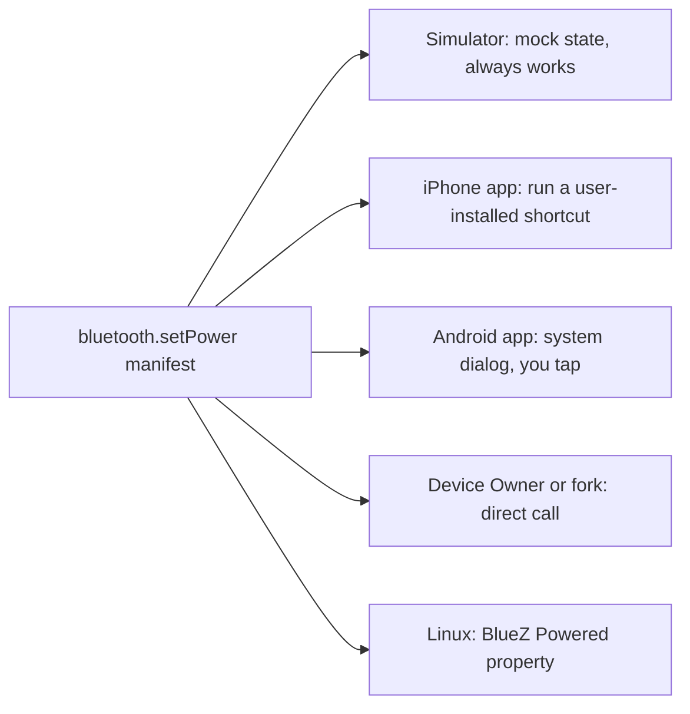
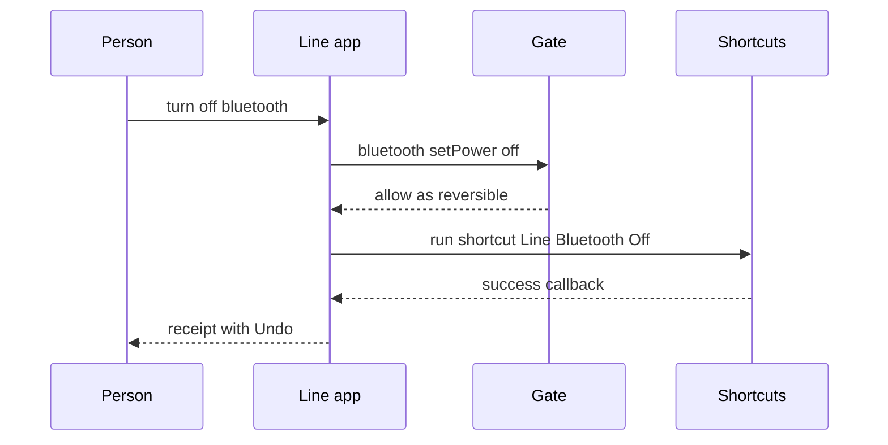
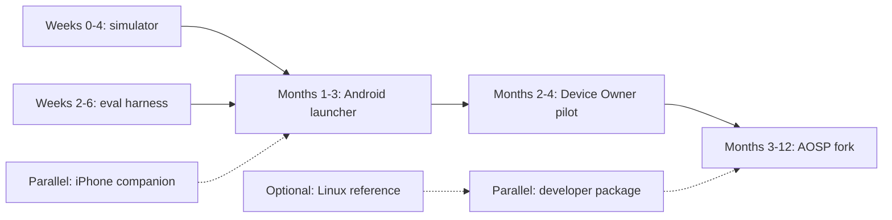

# 13. How to build it today

Earlier chapters describe the agentic phone as though a platform owner had already decided to ship it. No platform owner has. This chapter is for readers who want to build a working piece of it this year, without asking Apple or Google for permission. It covers what each route lets you build, what it costs, and what it can and can't prove.

There are five realistic routes. In rising order of fidelity and cost, they are:

1. a web simulator
2. an iPhone app inside today's walls
3. an Android launcher that is also the default assistant
4. privileged Android: a Device Owner fleet, then a fork of the Android Open Source Project (AOSP)
5. a Linux phone

Most of the agentic phone is ordinary software that you write yourself on any of these routes: **the Line** (the conversational home screen), the capability registry, **the Gate** (the deterministic policy check that answers allow, ask or deny for every action), the **ledger** of actions with Undo, **cards**, **memory**, and the **router** that chooses where a model runs. The platform decides three other things:

- **Entry.** Can you own the home screen and a hardware button?
- **System reach.** Can you change volume, Bluetooth, Wi-Fi and other settings?
- **App reach.** Can you call other apps' functions, or operate their screens?

The five paths differ mainly in how much of those three you get. The companies that went furthest show where the real limits are. Rabbit's launcher [turned out to run on stock Android](https://www.androidauthority.com/rabbit-r1-is-an-android-app-3438805/). ByteDance's Doubao assistant was given system-level input injection on a ZTE phone, and WeChat [started logging users out](https://www.yicaiglobal.com/news/wechat-some-chinese-banking-apps-reportedly-restrict-devices-with-bytedances-new-ai-voice-assistant). Drawing pixels is easy once you are the device maker. The hard parts are other platforms' defenses against automation, and reliability. On MobileWorld, a benchmark of long cross-app tasks, the best agent framework [completes 51.7%](https://tongyi-mai.github.io/MobileWorld/).

## One rule that makes the paths add up

Write each capability's schema once. Then bind it separately on each path.

A **capability** in this book is a typed, declared action with an **effect class**: read, reversible, consequential or irreversible (see [Chapter 6](06-capabilities.md)). The manifest for `bluetooth.setPower` should be identical in the simulator, the iPhone app and the Android fork. The Gate's decision table stays the same too. Only the binding underneath changes, along with what the ledger records about how the action was carried out.



The same request looks different on each binding. On the iPhone app, the Line hands off to Shortcuts:

```
› turn off bluetooth
● bluetooth.setPower(on: false)  · via Shortcuts
  └ Ran "Line: Bluetooth Off" · Bluetooth is off          [Undo]
Done. iOS doesn't let apps switch Bluetooth directly, so I used your Line shortcut.
```

On a stock Android phone, the platform makes you finish the action yourself:

```
› turn off wifi
● wifi.setPower(on: false)
  └ Android doesn't let apps switch Wi-Fi. Opened the Wi-Fi panel.
◆ Needs you · system panel — Flip the Wi-Fi switch in the panel above. [Cancel]
```

On a Device Owner phone or a fork, it's one step:

```
› turn off wifi
● wifi.setPower(on: false)
  └ Wi-Fi is off                                          [Undo]
```

The Android research proposes a useful way to organize this. Put every OS capability in one of three tiers [by the permission it needs](https://developer.android.com/reference/android/Manifest.permission):

1. normal-permission tools that any app can call
2. tools that need special access the user grants (notification access, Do Not Disturb, exact alarms)
3. privileged tools that exist only on a Device Owner phone or a fork (radio toggles, pairing without a prompt, secure settings)

The tier tells you which binding to write, and it also sets a lower bound on confirmation. The simulator implements every tier as a mock. Each later path turns more of the mocks into real calls.

## Path 1: the web simulator

**What it is.** A browser app that plays the phone: a chat-and-voice home screen, a registry of typed capabilities over a mocked device state, the Gate, the ledger, and cards. This repository already contains one. [The simulator](../prototype/) in `agentic-os/prototype/` is this path. It has about two dozen system capabilities, each tagged with an effect class: volume, ringer, brightness, Bluetooth (including pairing), Wi-Fi, airplane mode, Focus, alarms, timers, flashlight, Low Power Mode, media, calendar, reminders, messages, calls, Wallet payments with a per-payment cap, weather and device status. It also has:

- the Gate, with three **modes** and **grants**
- a ledger with Undo for each action and a checkpoint for each request
- cards bound to live state
- an offline rule-based planner, plus a live planner that calls the same capabilities as model tools through the same Gate
- voice input through the Web Speech API
- simulated events: low battery, AirPods connecting, a message from Mom, and a message that contains a prompt-injection attempt

[Chapter 14](14-the-simulator.md) walks through it.

**What you can do.** You can test every question in the design that doesn't depend on real hardware:

- when to confirm
- how interrupting and steering feel
- how Undo reads in a receipt
- whether people understand modes
- how an injection attempt shows up in the Line

The research recommends adding a Wizard-of-Oz console, where a hidden human plays the agent or the device, plus mocked services with realistic delays and failures. You can also run a real local model in the browser. Gemma 4 E2B runs on WebGPU through LiteRT-LM and reportedly [decodes at 73 tokens per second on a MacBook Pro M4 Max](https://huggingface.co/litert-community/gemma-4-E2B-it-litert-lm). Two open standards cover the cards. [A2UI](https://developer.android.com/develop/ui/compose/agentic) renders agent-described UI from a component catalog. [MCP Apps](https://blog.modelcontextprotocol.io/posts/2026-01-26-mcp-apps/) renders sandboxed HTML views for tools.

**What you can't do.** There are no real notifications, sensors, battery drain, or social pressure from daily use. Latency measured on a laptop is not phone latency. Nothing touches a real app.

**Effort and cost.** One or two engineers for two to four weeks, about 0.5 to 2 engineer-months. The only running cost is model spend during testing. The research lists the simulator's strengths as cheap, fast, runs anywhere, fully instrumented, and safe for testing destructive actions.

**What it proves.** The simulator can prove that the interaction design works, the capability schemas and effect classes, the Gate's decision table, the ledger and Undo model, the card catalog, and how quarantine behaves on staged content. It proves nothing about reaching real capabilities or about daily use. In the simulator, try "Set an alarm for sleep", then "Undo".

## Path 2: an iPhone app inside today's walls

**What it is.** An ordinary App Store app with a chat-and-voice interface. It uses Apple's models as the brain and whatever system hooks Apple exposes. It can't be the phone's operating system, and it shouldn't claim to be. The research recommends presenting it as a companion.

**The walls.** Apple's documentation is explicit about most of them. The table maps each thing the agentic phone needs to what iOS 27 allows and to the nearest workaround.

| The agentic phone needs | What iOS allows a third-party app | Nearest workaround |
|---|---|---|
| The Line as the home screen | An app can't be the home screen or the default assistant. The one assistant hook, the [`.assistant` schema domain](https://developer.apple.com/documentation/appintents/app-schema-domains), works only in Japan | A person can put an App Shortcut on the Action button. In Japan only, the long-press of the side button can launch a voice app through the `.assistant` schema's `activate` intent. This needs the Side Button Access entitlement and an Apple Account region set to Japan, and the person must be in Japan ([Apple](https://developer.apple.com/documentation/appintents/launching-your-voice-based-conversational-app-from-the-side-button-of-iphone)) |
| `audio.setVolume` | [`AVAudioSession.outputVolume`](https://developer.apple.com/documentation/avfaudio/avaudiosession/outputvolume) is read-only: "Only the user can directly set the system volume." `MPVolumeSettingsAlertShow()` has been deprecated since iOS 11.3 | Put an [`MPVolumeView`](https://developer.apple.com/documentation/mediaplayer/mpvolumeview) slider in a card for the person to drag. Use `AVRoutePickerView` for AirPlay. Or run a Shortcuts "Set Volume" action |
| `bluetooth.setPower`, `wifi.setPower` | No API toggles system radios. [`openSettingsURLString`](https://developer.apple.com/documentation/uikit/uiapplication/opensettingsurlstring) only opens your own app's settings page | A user-installed shortcut with "Set Bluetooth" or "Set Wi-Fi", run through `shortcuts://x-callback-url/run-shortcut` ([Apple](https://support.apple.com/en-au/guide/shortcuts/use-x-callback-url-apdcd7f20a6f/8.0/ios/18.0)) |
| `bluetooth.pair` | [AccessorySetupKit](https://developer.apple.com/documentation/accessorysetupkit) (iOS 18) discovers and pairs your own app's Bluetooth or Wi-Fi accessories | None for other people's headphones |
| `alarms.create` | [AlarmKit](https://developer.apple.com/documentation/alarmkit/alarmmanager) (iOS 26): after `requestAuthorization()`, an app can schedule, snooze, pause and cancel its own alarms and countdowns | Alarms live in your app, not in Clock |
| `messages.send` | [`MFMessageComposeViewController`](https://developer.apple.com/documentation/messageui/mfmessagecomposeviewcontroller) fills in a draft "for a person's approval". The Messages app sends it only if the person does | Every send ends in Apple's own compose sheet, so the Gate's answer is always "ask" |
| Calling other apps' capabilities | No equivalent of Android's AccessibilityService. Apps are sandboxed ([App Review 2.5.2](https://developer.apple.com/app-store/review/guidelines/)). Siri AI is the planner, and a third-party agent can't call another app's App Intents | Be a tool that Siri calls: adopt [app schemas](https://developer.apple.com/documentation/appintents/app-schema-domains) with `AppIntent(schema:)` |
| Long background runs | An app intent gets 30 seconds in the background unless it adopts [`LongRunningIntent`](https://developer.apple.com/documentation/appintents/longrunningintent) and reports progress regularly | Model long runs as threads that report progress |

The Shortcuts bridge is the most useful workaround. It needs one-time setup: the person installs a bundle of shortcuts named for the Line, such as "Line: Bluetooth Off" and "Line: Wi-Fi On". After that, the app can run them by URL, and the x-callback-url convention returns the result to the app. The Gate still runs first. The ledger records that the action went through Shortcuts, and Undo runs the opposite shortcut.



The bridge is fragile. The person can rename or delete a shortcut. The app gives up control while the shortcut runs and learns the outcome only through the callback. And the bridge covers only what Shortcuts itself can do.

**Models.** Apple's on-device model has about 3 billion parameters and a small context: the [technote](https://developer.apple.com/documentation/technotes/tn3193-managing-the-on-device-foundation-model-s-context-window) says 4,096 tokens, the iOS 27 sample in WWDC26 session 241 prints 8,192, and apps should read `contextSize` at runtime and design for the smaller number. Instructions, tool schemas, tool outputs and responses all count against that budget, so an iPhone Line can load only the few capability schemas that matter for the current turn. For multi-step planning, [`PrivateCloudComputeLanguageModel`](https://developer.apple.com/documentation/foundationmodels/adding-server-side-intelligence-with-private-cloud-compute) offers a 32K context behind the same session API. It has a daily request limit. It is available to developers in the App Store Small Business Program with fewer than 2 million first-time downloads, "with no cloud API cost", and they must migrate within six months of crossing that threshold. [SpeechAnalyzer](https://developer.apple.com/documentation/speech/speechanalyzer) (iOS 26) handles on-device transcription.

**Effort and cost.** One or two engineers for three to six weeks, about 0.75 to 3 engineer-months. For an eligible small team, Private Cloud Compute makes cloud inference free within its quota. App Review is the other cost: guidelines [2.5.2 and 4.7](https://developer.apple.com/app-store/review/guidelines/) limit downloaded code, mini-apps and plug-ins, so an agent that extends itself is hard to ship.

**What it proves.** It can prove conversation design with real iPhone users, on-device routing under a small context budget, being called by Siri through App Intents, and the Gate and ledger for the few actions the app can take. It can't prove owning the home screen, reaching other apps, or controlling the system without a person's hand. The research's verdict is that on iOS the design "can only be simulated or approximated".

## Path 3: an Android launcher that is also the assistant

**What it is.** One ordinary app that asks the person to make it both the home screen and the default assistant. Android's [`RoleManager`](https://developer.android.com/reference/android/app/role/RoleManager) exposes `ROLE_HOME` and `ROLE_ASSISTANT`, both added in API 29. The assistant role runs through `VoiceInteractionService` and [`VoiceInteractionSession`](https://developer.android.com/reference/android/service/voice/VoiceInteractionSession). When the person triggers the assist gesture, the session can receive the foreground app's structure in `onHandleAssist`. It may also receive a screenshot in `onHandleScreenshot`, which "may be null if screenshots are disabled by the user, policy, or application". This is the cheapest way to put the Line on real phones as the thing you see when you unlock.

**What works and what doesn't.** Here are the system capabilities the Line uses most, checked against Android's permission model:

| Capability | Android API | Works for a normal app? |
|---|---|---|
| `audio.setVolume` | [`AudioManager.setStreamVolume`](https://developer.android.com/reference/android/media/AudioManager), with `MODIFY_AUDIO_SETTINGS` (normal permission) | Yes. It has no effect on fixed-volume devices. A change that would toggle Do Not Disturb needs notification-policy access |
| `alarms.create` | Alarm intent with `SET_ALARM` (normal) hands the alarm to the clock app. `SCHEDULE_EXACT_ALARM` / `USE_EXACT_ALARM` cover exact alarms | Yes |
| Reading incoming notifications | `NotificationListenerService`, which the person enables in Settings | Yes, after the person grants it |
| `bluetooth.setPower` | [`BluetoothAdapter.enable()` / `disable()`](https://developer.android.com/reference/android/bluetooth/BluetoothAdapter) "will always fail and return false" for apps targeting API 33 or higher | No. `ACTION_REQUEST_ENABLE` shows a system screen where the person can turn Bluetooth on |
| `wifi.setPower` | [`WifiManager.setWifiEnabled()`](https://developer.android.com/reference/android/net/wifi/WifiManager) always fails for apps targeting API 29 or higher | No. [`Settings.Panel`](https://developer.android.com/reference/android/provider/Settings.Panel) (API 29) opens a floating Wi-Fi or internet panel over the app |
| `bluetooth.pair` without a prompt | `BLUETOOTH_PRIVILEGED` is "Not for use by third-party applications" | No. `BLUETOOTH_SCAN` (a runtime permission) allows discovery and pairing when the person takes part |
| Secure settings, call control | `WRITE_SECURE_SETTINGS` and `MODIFY_PHONE_STATE` are not for third parties. `WRITE_SETTINGS` needs an explicit user grant | Mostly no |
| Other apps' functions | [AppFunctions](https://developer.android.com/ai/appfunctions): `EXECUTE_APP_FUNCTIONS` (API 36) has protection level normal, but "allowlist checks for AppFunctions API access are enforced at runtime" | Only if your app is allowlisted |
| Other apps' screens | AccessibilityService | Only with a Play policy declaration, or in a sideloaded build (see below) |
| OEM-style screen automation | [Computer Control](https://developer.android.com/ai/computer-control), which needs the privileged `ACCESS_COMPUTER_CONTROL` permission | No. It is reserved for AI assistants that the phone maker preloads |

For both the Bluetooth and Wi-Fi toggles, the documentation lists the same exemptions: "Device Owner (DO), Profile Owner (PO) and system apps". That one line is why path 4 exists.

**The cross-app walls in detail.** Three mechanisms could let the Line reach into other apps. On a stock phone each one is fenced.

- **AppFunctions** is Google's typed-function model. Apps annotate Kotlin functions, and the OS indexes a generated schema. Google says it lets apps "behave like on device MCP servers". In this experimental preview, "only a limited number of apps and system agents can access the entire pipeline". The Jetpack library reached [1.0.0-alpha12 on September 23, 2026](https://developer.android.com/jetpack/androidx/releases/appfunctions) and has no beta yet. Gemini's own integration was still a private preview in May 2026.
- **AccessibilityService** can read and operate any app, and open-source phone agents rely on it. Google Play [allows `isAccessibilityTool=true` only for apps that help people with disabilities](https://support.google.com/googleplay/android-developer/answer/10964491?hl=en). Every other app must file a declaration, show prominent disclosure and get affirmative consent. Android 17 also ties accessibility to Advanced Protection Mode. When the mode is on, apps not flagged as accessibility tools lose the permission. [Per reporting](https://www.androidauthority.com/android-17-beta-2-advanced-protection-mode-accessibility-apps-3648860/), Google's list of non-accessibility tools includes automation tools, assistants and launchers, which describes exactly this app.
- **Computer Control** is the right design for the long tail. [Google's preview documentation](https://developer.android.com/ai/computer-control) describes it: target apps run "on a virtual device, similar to casting", a session covers "up to six target apps", only one session is active at a time, and starting a session shows a system consent dialog. It works with "a limited set of target apps". [Gemini's screen automation](https://9to5google.com/2026/02/25/gemini-automation-android/) uses it on the Galaxy S26 and Pixel 10, and it stops before checkout to hand the task back. A third-party launcher can't use it.

**Distribution.** From [September 30, 2026](https://developer.android.com/developer-verification), certified Android devices in Brazil, Indonesia, Singapore and Thailand block normal installs, sideloading included, of apps from developers who haven't verified their identity with Google. ADB and an "advanced" flow remain. Google plans to expand this worldwide in 2027. The research recommends building two versions from day one: a Play-compliant launcher with limited tools, and a sideloaded build with full capabilities. OpenClaw already ships its Android node this way, because SMS, call log, photo and background-location capabilities exist [only in the non-Play version](https://github.com/openclaw/openclaw/tree/main/apps/android).

**Models.** Where a phone supports it, Gemini Nano [runs inside the AICore system service](https://developer.android.com/ai/gemini-nano) and developers reach it through the ML Kit GenAI APIs. Elsewhere you can ship Gemma 4 E2B with LiteRT-LM. On a Galaxy S26 Ultra's GPU it [measures](https://huggingface.co/litert-community/gemma-4-E2B-it-litert-lm) 3,808 tokens per second of prefill, 52.1 tokens per second of decode, 0.3 seconds to first token, and 676 MB of CPU memory, from a 2,583 MB model file. [Community reports](https://dev.to/samdude/gemma-4-on-android-tricks-for-faster-on-device-inference-3kj5) say NPU backends can crash on some devices, so fall back from GPU to CPU. The [Firebase AI Logic Hybrid API](https://developer.android.com/ai/hybrid) supports four routing modes: prefer on-device, prefer cloud, only on-device, only cloud.

**Other limits.** Some manufacturers' Android skins kill background services. The app can't replace the lock screen or system UI.

**Effort and cost.** One to three engineers for four to eight weeks to reach a prototype you could use every day, about 1 to 6 engineer-months. The running cost is cloud inference for planning (see the shared stack below).

**What it proves.** This is the first path that can show whether people will live in the Line, because it is the actual home screen on their actual phones. They get real notifications to triage, real alarms, media, volume, calendar and contacts, and voice from the assist gesture. It proves radios only halfway, as system panels the person finishes. It barely proves third-party capabilities, which are limited to intents, deep links and AppFunctions if you're allowlisted. It can't prove the lock screen, silent radio control, or supervised automation of the long tail.

## Path 4: privileged Android, a Device Owner fleet and then a fork

### Step 4a: Device Owner pilots

Both radio deprecations exempt Device Owner apps. From Android 13, a Device Owner can also set a restriction so that only it may toggle Wi-Fi. Device Owner is normally set up on a factory-reset phone, through QR or NFC enrollment, or with `adb dpm set-device-owner` on a device with no accounts ([Android enterprise docs](https://developer.android.com/work/dpc/dedicated-devices)). For a pilot of 10 to 100 dedicated test phones, this unlocks direct Bluetooth and Wi-Fi control and device policy without building an OS image. The phones keep stock security updates and Play services. It isn't a consumer path, because nobody turns their personal phone into a managed device. For a study, though, it closes the most visible gap in path 3. The research gives no separate effort estimate. Most of the work is provisioning and running the pilot on top of the path 3 app.

### Step 4b: an AOSP fork with the agent as a system app

**What it is.** Your own Android build, where the Line is a privileged system app plus a thin patch to SystemUI. System apps are exempt from the radio restrictions. They can also hold permissions marked "Not for use by third-party applications", such as `BLUETOOTH_PRIVILEGED`, `WRITE_SECURE_SETTINGS` and `MODIFY_PHONE_STATE`, once those permissions are [allowlisted for the privileged app](https://source.android.com/docs/core/permissions/perms-allowlist).

**What you can do.** This is the only path that delivers the whole thesis outside Apple and Google:

- The phone boots straight into the Line.
- The lock screen and notification shade are yours.
- Radios and pairing are direct calls.
- You control the AppFunctions caller allowlist, so every app that adopts AppFunctions becomes a capability provider for the Line at no extra cost.
- You can build a virtual-display automation service modeled on Computer Control: a consent dialog, a small cap on the number of apps, a stop before payment, and a hand-back to the person.

**Where to start.** Start from an existing ROM on Pixels, not raw AOSP.

- [LineageOS 23](https://www.howtogeek.com/lineageos-23-based-on-android-16-is-finally-here/) (Android 16) reportedly shipped for more than 100 devices. That breadth is good for demos on cheap phones.
- GrapheneOS supports Pixels. Motorola [announced a long-term partnership](https://9to5google.com/2026/03/01/motorola-confirms-grapheneos-partnership-for-a-future-smartphone-porting-features/) with it for future devices. Its hardened security story suits a privacy-first agent, but its threat model is hostile to an all-powerful agent, so expect to maintain a fork rather than send changes upstream.

**What it costs.**

- **Release cadence.** From 2026, Google [publishes AOSP source only twice a year](https://www.androidauthority.com/aosp-source-code-schedule-3630018/), a major release in Q2 and a minor one in Q4. Android 17 came out on June 16, 2026. Forks can rebase only on those drops.
- **Google services.** A custom build ships without Google Mobile Services unless licensed.
- **App compatibility.** Hardware-attested integrity checks used by banking apps and some super-apps can fail.
- **Installation.** Every user has to unlock the bootloader and flash the phone.
- **Staff.** The research estimates three to six engineers for six to twelve months to reach a stable Pixel-only build, or 18 to 72 engineer-months, plus one or two engineers per supported device family after that.

**The cautionary precedent.** ZTE's nubia M153 gave ByteDance's Doubao assistant `INJECT_EVENTS`, a permission "typically reserved for system components". That let Doubao read screens and simulate touches across apps. WeChat users were [force-logged out](https://www.yicaiglobal.com/news/wechat-some-chinese-banking-apps-reportedly-restrict-devices-with-bytedances-new-ai-voice-assistant), some banking apps restricted the device, and Doubao stopped operating WeChat. A fork gives you the same power, and the same reaction is waiting for you. The research concludes that an agentic phone needs negotiated interfaces (AppFunctions, MCP, partner deals) and an automation identity it declares openly, not only control at the pixel level. [Chapter 12](12-developers.md) covers the economics and the opt-out protocols.

**What it proves.** On real hardware it can prove nearly every part of the design: home, lock screen, notifications, radios, pairing, typed third-party capabilities, supervised automation for the long tail, and the Gate and ledger across all of them. It can't prove that consumers would install it, or that the apps they depend on will keep working.

## Path 5: a Linux phone as the reference implementation

**What it is.** A Linux phone distribution, where every system service is already a documented D-Bus interface and you have root. postmarketOS 26.06 [shipped on June 21, 2026](https://postmarketos.org/blog/2026/07/06/pmOS-update-2026-06/) with Plasma Mobile 6.7. Phosh and Ubuntu Touch are the other current shells. The research found no integrated LLM assistant in these projects' 2026 release notes.

**What you can do.** Generate capability schemas mechanically from D-Bus introspection. BlueZ exposes Bluetooth as `org.bluez.Adapter1`, with a read-write `Powered` property and a `StartDiscovery` method, and `org.bluez.Device1`, with `Connect` and `Pair` ([BlueZ docs](https://github.com/bluez/bluez/blob/master/doc/org.bluez.Adapter.rst)). NetworkManager, ModemManager, GeoClue and the freedesktop Notifications spec follow the same pattern. [xdg-desktop-portal](https://github.com/flatpak/xdg-desktop-portal) shows how to put a consent broker between a sandboxed caller and a system service, which is a working model of the Gate. llama.cpp and whisper.cpp run natively.

**What you can't do.** You can't run useful user tests. Few phones are supported, modem and camera support is weak, power management is immature, and there's no WhatsApp, banking or ride-hailing. Results won't generalize to consumer behavior.

**Effort and cost.** One or two engineers for two to three months to build a D-Bus tool broker and a chat shell on one device, about 2 to 6 engineer-months.

**What it proves.** It shows that the architecture in [Chapter 5](05-architecture.md) is complete and small: capabilities introspected, typed and gated, with no policy exceptions hiding anywhere. It is the clearest reference implementation and the weakest test bed.

## Not a sixth path: custom hardware

Humane and Rabbit tried to prove the idea with new devices. HP bought Humane's assets for $116 million, and the AI Pin [stopped working on February 28, 2025](https://www.axios.com/2025/02/18/humane-ai-pin-shut-down-hp). Rabbit's r1 runs an operating system [based on AOSP](https://en.wikipedia.org/wiki/Rabbit_r1). New hardware added cost and risk without solving app access or reliability. The research concludes that an agentic phone is software, and should be proven as an Android launcher or fork on ordinary phones before anyone builds a device.

## The shared stack

These pieces are the same on every path, or nearly so.

**Models.** [Chapter 11](11-models.md) covers these in depth. The short version for builders:

| Role | iPhone | Android (stock) | Fork or Linux |
|---|---|---|---|
| Local router and slot filler | Foundation Models, about 3B, 4K context | Gemini Nano through ML Kit where available, or Gemma 4 E2B on LiteRT-LM | Gemma 4 E2B or E4B on LiteRT-LM (no AICore without Google services). llama.cpp on Linux |
| Harder local steps | Core AI or MLX for custom models | Gemma 4 E4B: [22.1 tokens/s decode](https://huggingface.co/litert-community/gemma-4-E4B-it-litert-lm) on an S26 Ultra GPU | Same |
| Planner | Private Cloud Compute (32K) or a cloud model | A small cloud model | A small cloud model |

Qwen3.5 (0.8B to 9B) and Phi-4-mini are candidates for [fine-tuning a router](https://huggingface.co/Qwen/Qwen3.5-2B) on your exact capability schemas. The benchmarks above are short bursts. Nobody has published sustained all-day thermal and battery data for these models acting as a phone's router.

**Speech.** Use the platform's speech recognizer where there is one: [SpeechAnalyzer](https://developer.apple.com/documentation/speech/speechanalyzer) on iOS, ML Kit GenAI speech recognition on Android. For an offline cross-platform path, use [sherpa-onnx](https://github.com/k2-fsa/sherpa-onnx) or Kyutai's [1B streaming STT](https://github.com/kyutai-labs/delayed-streams-modeling), which has a 0.5-second delay and semantic voice activity detection. [Chapter 8](08-voice.md) explains why end-of-turn detection matters more than model size.

**Capability sources.** Accept three kinds, in order of preference:

1. local typed functions (App Intents or AppFunctions shaped)
2. remote MCP servers with [MCP Apps](https://github.com/modelcontextprotocol/ext-apps) views, for services that have no app on the phone
3. supervised GUI automation, as a last resort

Bootstrap coverage by wrapping popular services' existing intents, web APIs and MCP servers.

**Evaluation.** Write the eval harness before the product. Single-app benchmarks are nearly solved: AndroidWorld's leaderboard reportedly [tops out at 97.4%](https://benchlm.ai/benchmarks/androidworld). Cross-app work isn't. On MobileWorld the best framework reaches 51.7% and the best end-to-end model 20.9%. Drive emulators with [mobile-mcp](https://github.com/mobile-next/mobile-mcp) or [Mobilerun](https://github.com/droidrun/mobilerun). Log success, latency, tokens, and whether each turn ran on-device or in the cloud.

**Running cost.** The research estimates cloud inference cost per active user from list prices read on September 24, 2026. The estimates exclude cache-write premiums, speech APIs and thinking tokens.

- **Light user:** 20 requests a day, two model calls each, 4K input tokens with 75% cache hits, 200 output tokens. About $2.76 a month on a small cloud model priced at $1 in and $5 out per million tokens. About $5.52 on a mid-size model at $2 and $10 ([Anthropic pricing](https://platform.claude.com/docs/en/about-claude/pricing)). About $1.56 on Gemini 3.1 Flash-Lite without caching. That last price [comes from secondary trackers](https://www.cloudzero.com/blog/gemini-pricing/) and wasn't verified at the source.
- **Heavy user:** about $18.63, $37.26 and $10.53 a month on the same three models.
- **Typed call versus screen reading:** a 15-step screen-reading task costs about $0.086 on the small model, while one typed function call costs a fraction of a cent.

The conclusion is simple. Every turn moved on-device cuts cost proportionally, and typed capabilities beat screen reading by one to two orders of magnitude.

## The paths compared

| | 1. Simulator | 2. iPhone app | 3. Android launcher | 4. Device Owner / fork | 5. Linux phone |
|---|---|---|---|---|---|
| Team and time | 1–2 eng, 2–4 weeks | 1–2 eng, 3–6 weeks | 1–3 eng, 4–8 weeks | Fork: 3–6 eng, 6–12 months, then 1–2 per device family | 1–2 eng, 2–3 months |
| Engineer-months | 0.5–2 | 0.75–3 | 1–6 | 18–72 for the fork | 2–6 |
| Running cost | Model spend in tests | Free PCC tier if eligible, else cloud | Cloud planner, $1–40 per user per month (estimate) | Same, plus test phones and OTA pipeline | Local models only |
| Owns the home screen | Simulated | No | Yes | Yes, plus lock screen on a fork | Yes |
| Volume and alarms | Simulated | Person drags volume; own alarms only | Yes | Yes | Yes |
| Bluetooth and Wi-Fi | Simulated | Via Shortcuts bridge | Person finishes in a system panel | Direct | Direct |
| Other apps | Simulated | No; be Siri's tool | Intents, deep links, AppFunctions if allowlisted | AppFunctions as caller, virtual-display automation | Few apps exist |
| Hardest wall | No reality | Apple's sandbox | Play policy and Google's allowlists | App integrity checks, AOSP cadence | No users |

And what each path can prove:

| Part of the agentic phone | 1 | 2 | 3 | 4 | 5 |
|---|---|---|---|---|---|
| The Line as the daily home screen | Mock | No | Yes | Yes | Yes, no users |
| Voice from a hardware button | No | Japan only; Action button shortcut | Assist gesture | Yes | Yes |
| System capabilities | Mock | Partly | Mostly | Yes | Yes |
| Third-party capabilities | Mock | Only as Siri's tool | Thin | Yes | Thin |
| Supervised GUI fallback | No | No | Sideloaded build only | Yes | Not needed |
| Gate, modes, grants, ledger, Undo | Yes | For the app's own actions | Yes | Yes | Yes |
| Quarantine on real incoming content | Staged | Only content the app receives | Yes, via notification access | Yes | Partly |
| On-device router on phone hardware | No | Yes | Yes | Yes | Yes |
| Daily-use retention, trust, battery, cost | No | Partly | Yes | Yes, in a pilot | No |

## A recommended sequence

The research proposes an order that spends money only after the cheaper path has answered its questions.



1. **Weeks 0 to 4: the simulator.** Build the chat-and-voice home screen, a typed registry for system services (`audio.setVolume`, `bluetooth.connect`, `wifi.set`, `alarm.create`, `notifications.summarize`, `location.share`), each tagged with its tier and confirmation policy, catalog-based cards, and a Wizard-of-Oz console. Use it to test confirmation, interruption and recovery. This repository's [simulator](../prototype/) covers most of this step.
2. **Weeks 2 to 6: the eval harness, before the product.** Script 100 to 200 real tasks covering settings, messaging, errands and cross-app work. Run them against Android emulators through mobile-mcp or Mobilerun, plus subsets of AndroidWorld and MobileWorld.
3. **Months 1 to 3: the Android launcher (path 3) on stock Pixel and Galaxy phones**, with a local router, a small cloud planner, system panels for radios, and accessibility-based GUI fallback only in the sideloaded build.
4. **Months 2 to 4: a Device Owner pilot with 20 to 100 people on dedicated phones.** Measure daily-use retention, trust incidents, battery and cost per user.
5. **Months 3 to 12: the fork (step 4b)**, from LineageOS or GrapheneOS on Pixels, rebased on each Q2 and Q4 AOSP drop.
6. **In parallel: the developer package**: typed functions with standard domain verbs, entity schemas, a card component catalog, declared effect classes, and optional remote MCP endpoints. [Chapter 6](06-capabilities.md) and [Appendix A](appendix-a-manifest.md) define the manifest.
7. **In parallel: the iPhone companion (path 2), for reach.**
8. **Throughout: privacy and security.** Keep the router, redaction and personal index on the device. Run any cloud tier as stateless, attested inference, following the Private Cloud Compute pattern. Treat all screen and notification text as untrusted. [Chapter 9](09-trust.md) has the details.
9. **Optional: the Linux reference (path 5)**, as a clean diagram of the architecture.

Each step has a question that decides whether to take the next one.

- **After the simulator:** do people understand modes and Undo? If they don't, a real phone won't help.
- **After the launcher:** do people keep using the Line as their home screen after two weeks? If they don't, a fork is premature.
- **After the pilot:** is the cost per user and the rate of trust incidents acceptable?

## Open-source starting points

No credible open-source "chat as launcher" reference exists yet. The research found only small, early projects. Open source does supply parts, though:

| Need | Project | Notes |
|---|---|---|
| Local model runtime | [LiteRT-LM](https://github.com/google-ai-edge/LiteRT-LM), [llama.cpp](https://github.com/ggml-org/llama.cpp), [MLX Swift LM](https://github.com/ml-explore/mlx-swift-lm), [MLC LLM](https://github.com/mlc-ai/mlc-llm), [ExecuTorch](https://github.com/pytorch/executorch) | LiteRT-LM supports function calling. Its Kotlin, Python and C++ bindings are stable, and Swift and JS are in preview |
| Reference on-device AI app | [Google AI Edge Gallery](https://github.com/google-ai-edge/gallery) | Android |
| Speech | [argmax-oss-swift](https://github.com/argmaxinc/argmax-oss-swift) (WhisperKit, TTSKit), [sherpa-onnx](https://github.com/k2-fsa/sherpa-onnx), Kyutai [STT](https://github.com/kyutai-labs/delayed-streams-modeling) and [Moshi](https://github.com/kyutai-labs/moshi) | WhisperKitAndroid is archived |
| Cards | [A2UI](https://a2ui.org/specification/v0.9.1-a2ui/) with Android's Compose renderer, [MCP Apps](https://github.com/modelcontextprotocol/ext-apps) | Catalog-rendered and sandboxed-HTML UI respectively |
| Typed app functions | [android/appfunctions](https://github.com/android/appfunctions) samples | Library is still alpha |
| Test harness, host-side phone drivers | [mobile-mcp](https://github.com/mobile-next/mobile-mcp), [Mobilerun](https://github.com/droidrun/mobilerun), [mobile-use](https://github.com/minitap-ai/mobile-use), [Android-MCP](https://github.com/CursorTouch/Android-MCP) | Their tool vocabularies (list elements, tap, type, launch) make a good starting schema for the Line's GUI-fallback capability |
| GUI perception and action models | [Open-AutoGLM](https://github.com/zai-org/Open-AutoGLM), [UI-TARS](https://github.com/bytedance/UI-TARS), [Mobile-Agent](https://github.com/X-PLUG/MobileAgent), [AppAgent](https://github.com/TencentQQGYLab/AppAgent) | All assume a host computer driving the phone. AutoGLM-Phone-9B recommends a GPU with 24 GB or more of VRAM |
| On-phone agents and launcher experiments | [blurr](https://github.com/Ayush0Chaudhary/blurr), [Lumenberg](https://github.com/lottieyael/Lumenberg), [jenny-android-ai-agent](https://github.com/flagdizero/jenny-android-ai-agent), [OpenClaw's Android node](https://github.com/openclaw/openclaw/tree/main/apps/android) | OpenClaw's node, where the phone acts as a capability server for an agent, is the most battle-tested pattern to borrow |

## Assumptions and unknowns

- **The Android plan assumes Google's allowlists stay roughly where they are.** Whether Google will open the AppFunctions caller allowlist or Computer Control to non-OEM default assistants, and when, is unknown. Both are preview-only and gated as of September 2026.
- **Nobody knows whether Computer Control is in the public Android 17 AOSP drop** or lives in Google-only components. That decides whether a fork can reuse it or has to reimplement virtual-display automation.
- **Nobody knows how banking apps, super-apps and ride-hailing apps will treat agent-driven sessions**, on forks or on stock Android (Play Integrity verdicts, bot detection). WeChat's reaction to Doubao is the only large data point.
- **Local models are assumed good enough to route.** Nobody has shown that E2B- or E4B-class models can reliably choose among 50 to 200 typed capabilities over multi-turn sessions, within phone RAM and thermal limits, for a whole day. The published numbers are short bursts.
- **The Gemini Flash-Lite prices in the cost estimate come from secondary trackers.** Gemini cache-read pricing wasn't verified. All cost numbers are estimates.
- **The iPhone path assumes today's walls.** The reported iOS 27 "Extensions" system, or EU Digital Markets Act interoperability rules, could let a third-party assistant become the default or get deeper hooks outside Japan. Neither has happened.
- **Nobody has settled the right cross-platform manifest.** It could extend AppFunctions schemas or App Intents schemas, pair MCP tool lists with A2UI catalogs, or be a new neutral format.
- **Friction for sideloaded builds wasn't re-checked.** Android's "restricted settings" for sideloaded apps (accessibility and notification-listener grants) and the 2026–2027 developer-verification rollout could make sideloaded builds harder to use. The current behavior wasn't re-verified.
- **The engineer-month figures are simple products of the research's team-size and duration ranges.** They aren't independent estimates.

## Sources

- Android: [RoleManager](https://developer.android.com/reference/android/app/role/RoleManager), [VoiceInteractionSession](https://developer.android.com/reference/android/service/voice/VoiceInteractionSession), [AudioManager](https://developer.android.com/reference/android/media/AudioManager), [BluetoothAdapter](https://developer.android.com/reference/android/bluetooth/BluetoothAdapter), [WifiManager](https://developer.android.com/reference/android/net/wifi/WifiManager), [Settings.Panel](https://developer.android.com/reference/android/provider/Settings.Panel), [Manifest.permission](https://developer.android.com/reference/android/Manifest.permission), [dedicated devices](https://developer.android.com/work/dpc/dedicated-devices), [privileged permission allowlisting](https://source.android.com/docs/core/permissions/perms-allowlist)
- AppFunctions and Computer Control: [AppFunctions](https://developer.android.com/ai/appfunctions), [AppFunctions releases](https://developer.android.com/jetpack/androidx/releases/appfunctions), [android/appfunctions](https://github.com/android/appfunctions), [Computer Control](https://developer.android.com/ai/computer-control), [Android intelligence system](https://developer.android.com/ai/intelligence-system), [9to5Google on Gemini automation](https://9to5google.com/2026/02/25/gemini-automation-android/), [Android Authority on the Pixel 10 rollout](https://www.androidauthority.com/gemini-screen-task-automation-pixel-10-rollout-3649980/), [Android Central on the Galaxy S26](https://www.androidcentral.com/apps-software/gemini-screen-automation-rolling-out-for-galaxy-s26)
- Accessibility policy: [Play accessibility policy](https://support.google.com/googleplay/android-developer/answer/10964491?hl=en), [Play user data policy update](https://support.google.com/googleplay/android-developer/answer/17134731?hl=en-GB), [Android Authority on Android 17 Advanced Protection](https://www.androidauthority.com/android-17-beta-2-advanced-protection-mode-accessibility-apps-3648860/), [The Hacker News](https://thehackernews.com/2026/03/android-17-blocks-non-accessibility.html)
- Distribution: [Android developer verification](https://developer.android.com/developer-verification), [The Hacker News on the deadline](https://thehackernews.com/2026/06/google-sets-sept-30-deadline-for.html), [OpenClaw Android node](https://github.com/openclaw/openclaw/tree/main/apps/android)
- Forks: [LineageOS changelog](https://lineageos.org/Changelog-30/), [How-To Geek on LineageOS 23](https://www.howtogeek.com/lineageos-23-based-on-android-16-is-finally-here/), [9to5Google on Motorola and GrapheneOS](https://9to5google.com/2026/03/01/motorola-confirms-grapheneos-partnership-for-a-future-smartphone-porting-features/), [Android Authority on the AOSP schedule](https://www.androidauthority.com/aosp-source-code-schedule-3630018/), [heise on the AOSP cycle](https://www.heise.de/en/news/Android-Google-halves-release-cycle-for-AOSP-source-code-11132493.html), [Yicai on Doubao and WeChat](https://www.yicaiglobal.com/news/wechat-some-chinese-banking-apps-reportedly-restrict-devices-with-bytedances-new-ai-voice-assistant)
- iOS: [app schema domains](https://developer.apple.com/documentation/appintents/app-schema-domains), [side button in Japan](https://developer.apple.com/documentation/appintents/launching-your-voice-based-conversational-app-from-the-side-button-of-iphone), [outputVolume](https://developer.apple.com/documentation/avfaudio/avaudiosession/outputvolume), [MPVolumeView](https://developer.apple.com/documentation/mediaplayer/mpvolumeview), [openSettingsURLString](https://developer.apple.com/documentation/uikit/uiapplication/opensettingsurlstring), [AccessorySetupKit](https://developer.apple.com/documentation/accessorysetupkit), [AlarmKit AlarmManager](https://developer.apple.com/documentation/alarmkit/alarmmanager), [MFMessageComposeViewController](https://developer.apple.com/documentation/messageui/mfmessagecomposeviewcontroller), [LongRunningIntent](https://developer.apple.com/documentation/appintents/longrunningintent), [Shortcuts x-callback-url](https://support.apple.com/en-au/guide/shortcuts/use-x-callback-url-apdcd7f20a6f/8.0/ios/18.0), [App Review Guidelines](https://developer.apple.com/app-store/review/guidelines/), [TN3193 context window](https://developer.apple.com/documentation/technotes/tn3193-managing-the-on-device-foundation-model-s-context-window), [Private Cloud Compute for developers](https://developer.apple.com/documentation/foundationmodels/adding-server-side-intelligence-with-private-cloud-compute), [SpeechAnalyzer](https://developer.apple.com/documentation/speech/speechanalyzer)
- Linux: [postmarketOS 26.06](https://postmarketos.org/blog/2026/07/06/pmOS-update-2026-06/), [BlueZ Adapter1](https://github.com/bluez/bluez/blob/master/doc/org.bluez.Adapter.rst), [xdg-desktop-portal](https://github.com/flatpak/xdg-desktop-portal)
- Hardware precedent: [Android Authority on Rabbit r1](https://www.androidauthority.com/rabbit-r1-is-an-android-app-3438805/), [Axios on Humane](https://www.axios.com/2025/02/18/humane-ai-pin-shut-down-hp)
- Models and runtimes: [Gemma 4 E2B LiteRT-LM card](https://huggingface.co/litert-community/gemma-4-E2B-it-litert-lm), [Gemma 4 E4B LiteRT-LM card](https://huggingface.co/litert-community/gemma-4-E4B-it-litert-lm), [Qwen3.5-2B](https://huggingface.co/Qwen/Qwen3.5-2B), [Gemini Nano](https://developer.android.com/ai/gemini-nano), [Firebase AI Logic hybrid](https://developer.android.com/ai/hybrid), [LiteRT-LM](https://github.com/google-ai-edge/LiteRT-LM)
- Speech: [sherpa-onnx](https://github.com/k2-fsa/sherpa-onnx), [Kyutai delayed-streams-modeling](https://github.com/kyutai-labs/delayed-streams-modeling), [argmax-oss-swift](https://github.com/argmaxinc/argmax-oss-swift)
- UI protocols: [A2UI on Android](https://developer.android.com/develop/ui/compose/agentic), [A2UI spec v0.9.1](https://a2ui.org/specification/v0.9.1-a2ui/), [MCP Apps announcement](https://blog.modelcontextprotocol.io/posts/2026-01-26-mcp-apps/), [ext-apps](https://github.com/modelcontextprotocol/ext-apps)
- Evaluation: [MobileWorld](https://tongyi-mai.github.io/MobileWorld/), [AndroidWorld leaderboard](https://benchlm.ai/benchmarks/androidworld), [mobile-mcp](https://github.com/mobile-next/mobile-mcp), [Mobilerun](https://github.com/droidrun/mobilerun)
- Cost: [Anthropic pricing](https://platform.claude.com/docs/en/about-claude/pricing), [Gemini API pricing](https://ai.google.dev/gemini-api/docs/pricing), [CloudZero on Gemini pricing](https://www.cloudzero.com/blog/gemini-pricing/)
- Open source: [Open-AutoGLM](https://github.com/zai-org/Open-AutoGLM), [UI-TARS](https://github.com/bytedance/UI-TARS), [Mobile-Agent](https://github.com/X-PLUG/MobileAgent), [AppAgent](https://github.com/TencentQQGYLab/AppAgent), [mobile-use](https://github.com/minitap-ai/mobile-use), [Android-MCP](https://github.com/CursorTouch/Android-MCP), [blurr](https://github.com/Ayush0Chaudhary/blurr), [Lumenberg](https://github.com/lottieyael/Lumenberg), [jenny-android-ai-agent](https://github.com/flagdizero/jenny-android-ai-agent), [Google AI Edge Gallery](https://github.com/google-ai-edge/gallery), [llama.cpp](https://github.com/ggml-org/llama.cpp), [MLX Swift LM](https://github.com/ml-explore/mlx-swift-lm), [MLC LLM](https://github.com/mlc-ai/mlc-llm), [ExecuTorch](https://github.com/pytorch/executorch)
