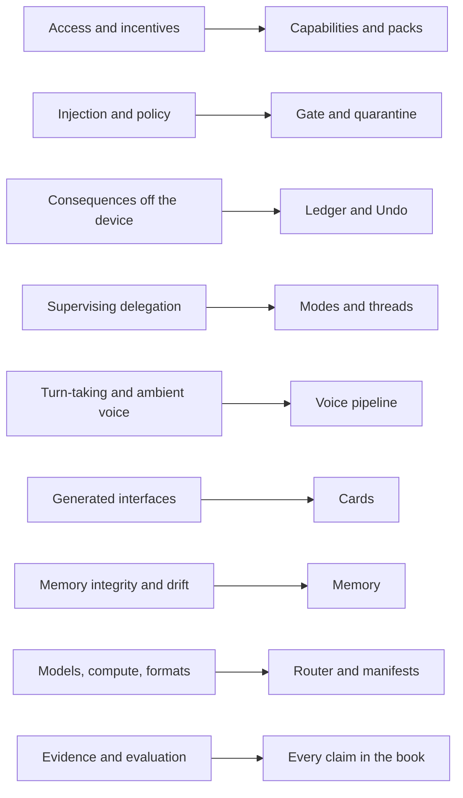
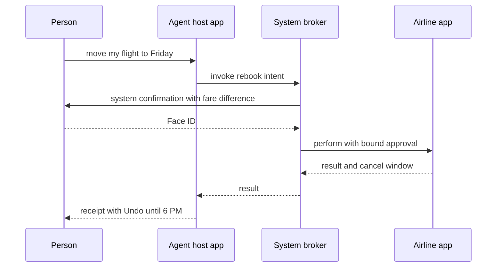

# 15. Open problems, and what Apple could do

This book has proposed a phone where the home screen is a conversation, called **the Line**. Apps become **capabilities** with declared **effect classes**. Deterministic code, **the Gate**, stands between the model and every action. Every change lands in a **ledger** with an Undo. Much of that design rests on questions nobody can answer yet.

This chapter collects those questions. They come from the open-question lists in the four research files behind the book: prior art, architecture, interaction, and build paths. Where the files ask the same thing in different words, the questions are merged and grouped by the part of the design they threaten. After that come specific requests to Apple, each mapped to a technology Apple already ships, and a shorter list for Google. The chapter ends with a closing for the whole book.

## 1. Access: will anyone let the agent in?

The agentic phone is only as useful as the capabilities it can call. Every earlier attempt ran into the same wall. Viv and Facebook M failed on [coverage of third-party services and on unit economics](https://techcrunch.com/2018/01/08/facebook-is-shutting-down-its-standalone-personal-assistant-m/). Language understanding was not what stopped them.

- **Will super-apps, marketplaces and banks accept agent access, and on what terms?** ByteDance's first Doubao phone drove apps through system-level input injection. WeChat, Alipay and banks [locked it out within days](https://www.yicaiglobal.com/news/wechat-some-chinese-banking-apps-reportedly-restrict-devices-with-bytedances-new-ai-voice-assistant). The second generation, launched this month, calls MCP and A2A interfaces first. It falls back to the screen under a published opt-out protocol, SAEP, which [reportedly](https://pandaily.com/bytedance-doubao-phone-agent-mcp-a2a-gui-fallback) gives apps 30 days' notice and a machine-readable way to decline. Reports say only three apps had opened MCP interfaces at launch. Nobody knows what these apps will demand in exchange for access: a revenue share, attribution, sponsored placement, or per-transaction fees.
- **Will the platform owners open their privileged paths?** On Android, both the AppFunctions caller allowlist and Computer Control are reserved for preloaded or allowlisted assistants as of September 2026 ([Chapter 13](13-building-it.md)). On iOS, Siri is the only planner that can call other apps' App Intents. Two things might loosen that, and it's unknown whether they will: the reported iOS 27 "Extensions" system, and the EU's Digital Markets Act, which has already [delayed Siri AI in the EU](https://www.apple.com/newsroom/2026/06/due-to-dma-siri-ai-delayed-in-eu-for-ios-27-and-ipados-27/).
- **Will a structured intent registry scale?** Siri AI shipped last week as an opt-in beta, with App Intents as its action layer. It is the first test of a typed intent registry at the scale of a billion devices. The question is whether it avoids the coverage gap that sank Viv, Alexa skills and SiriKit.
- **How should an agent identify itself to outside services?** The candidates are a declared user-agent string, a cryptographic agent identity, or mandates issued per user. Amazon's suit alleged that Perplexity's Comet [disguised itself as Chrome](https://www.paymentsdive.com/news/amazon-sues-perplexity-ai-shopping-agents/804923/). The Ninth Circuit [vacated the injunction](https://law.justia.com/cases/federal/appellate-courts/ca9/26-1444/26-1444-2026-08-04.html), holding that the access was by the user, who was using the assistant as a tool. That gives legal cover. It does not make the platforms cooperate.
- **Who is liable when the agent is wrong?** Consider a wrong purchase, a misdirected message, or a privacy breach. The court ruling above addressed computer-access law. Consumer-protection and banking rules remain open.
- **Which business model keeps the agent neutral?** The options are hardware margin, subscription, transaction fees, or ads inside answers. Each one pulls the agent toward someone's interest. The book's cost research estimates cloud inference at $1 to $40 per active user per month, which rules out "free and neutral" unless most turns run on the device. [Chapter 12](12-developers.md) takes this further.
- **How will integrity-checking apps treat agent sessions?** This applies to banking apps and apps that rely on Play Integrity verdicts or bot detection, on forks and on stock Android alike. WeChat's reaction to Doubao is the only large data point.

## 2. Security: can the Gate hold?

The design's central bet is that deterministic checks around an untrusted model can be made strong enough and cheap enough for everyday use. The research supports the structure of that bet. It doesn't support a claim that the problem is solved.

- **Is prompt injection solvable at all?** OpenAI has said AI browsers [may always be vulnerable](https://techcrunch.com/2025/12/22/openai-says-ai-browsers-may-always-be-vulnerable-to-prompt-injection-attacks/). On phones, the AgentHazard study found that third-party content such as ads and user posts [misled every agent it tested](https://huggingface.co/papers/2507.04227), open-source and commercial, 42.0% of the time in dynamic tests and 36.1% in static ones. So can screen-driven fallback ever be safe while untrusted content is visible? Or must high-stakes domains accept typed capabilities only? The book leans toward typed-only for money and messages, but the evidence for that line is thin.
- **Can policy be low-effort and deterministic at once?** A 2026 survey of 21 agent permission systems [found none](https://arxiv.org/abs/2607.13718) that combines low user overhead, formally grounded policies and deterministic enforcement. Commercial agents mostly offer approval of every action, or opaque LLM auto-reviewers. **Grants** in this book assume that "never text my ex" or "nothing over $50" can be compiled reliably into a structured rule and explained back by voice. Nobody has shown that yet.
- **What is the right plan language?** The candidates are restricted Python, as in [CaMeL](https://arxiv.org/abs/2503.18813), a typed DSL, or a dataflow graph. Whichever it is, its interpreter needs to be small and auditable enough to be the trusted core. The book doesn't specify one.
- **How does data leave the phone without approval fatigue?** Take sharing an excerpt of a document with a new contact. Both CaMeL and [FIDES](https://arxiv.org/abs/2505.23643) name user fatigue as the weak point of their release step.
- **Can capability manifests be reviewed at App Store scale?** Every manifest carries a natural-language description that the model reads. That description is a prompt-injection channel of its own (tool-description poisoning). Nobody knows how to review it.
- **How do you tell a lay user that the agent may have been steered?** Suppose hostile text in an email or web page shaped a plan. The warning has to be one a lay user can act on. Generated cards add a related risk: polished UI built from attacker-supplied content could itself be used for phishing.

## 3. Consequences: can Undo be honest?

The ledger promises an Undo on every reversible action. That promise is easy to keep for settings on the phone and hard to keep for anything that leaves it.

- **How do you compensate across services that have no undo?** Sagas give the pattern: each step is paired with a compensating step. Most third-party services expose no compensator. Should capabilities without one face stricter gating? Or should the OS require hold-then-commit or escrow for spending and messaging?
- **What OS and API contract would make undo real beyond the device?** Candidates include transactional intents with declared compensations, commit windows and cancellation deadlines. The research found no platform that ships one.
- **Is an approval still valid when the action commits?** In a controlled test suite, [262 of 270 agent runs reached the visible goal, but only 55 were authorized commits](https://arxiv.org/abs/2607.10487). The rest acted on approvals or state that had gone stale. The book's Gate assumes that approvals are bound to exact arguments and re-checked at commit time. That needs atomic check-and-commit support from the services underneath, which most don't offer.

## 4. People: how much delegation can a person supervise?

**Modes** and **threads** assume people can supervise a few things at once and approve the right things. The evidence is thin.

- **How do you set pause thresholds?** They need to fit each user and each level of stakes without flooding people. Morae, which pauses at decision points for blind users, improved outcomes. Its pause detector reached [59.7% precision and 69.8% recall](https://arxiv.org/abs/2508.21456), against a 94% human upper bound.
- **When does rubber-stamping set in?** Cognitive forcing reduces overreliance, but people [rate it least favorably](https://arxiv.org/abs/2102.09692). Nobody knows the approval frequency at which consumers stop reading. Nor is it known whether a guardian classifier can legitimately stand in for a human, or who is accountable when it errs.
- **How many background agents can a non-expert supervise?** And how should conflicts surface, for example two runs touching the same calendar? Coding tools have an [agent view](https://code.claude.com/docs/en/agent-view) for experts. The research found no test of one with non-experts.
- **How do you present a multi-step plan eyes-free?** Through earbuds, the person needs chunking, navigation and revision without overloading working memory.
- **How do people discover what the agent can do?** Without an app grid, the Line faces the blank-prompt problem that hurt Alexa skills and Humane.
- **Who arbitrates between agents?** The system agent, third-party agents reached over A2A, and agents embedded in apps will compete for the same capabilities, context and attention.

## 5. Voice: turn-taking and the ambient microphone

- **Can the phone tell an interruption from an "uh-huh"?** The system must decide reliably whether to yield or keep talking. That has to hold in noise, for accented, atypical, dysarthric and older speech, and with bystanders talking. 2026 benchmarks treat this as [unsolved](https://arxiv.org/abs/2609.17360). [Chapter 8](08-voice.md) relies on a physical stop as the fallback. Whether that fallback is enough is untested.
- **What latency is acceptable when a rich card takes a minute?** Fully generated interfaces [take a minute or two](https://arxiv.org/abs/2604.09577), and streaming cuts that by about half. The component catalog in [Chapter 7](07-cards.md) is the answer for everyday turns. The budget for anything richer is open.
- **What are the privacy norms for ambient context?** Examples include a camera or screen share that is always available, and earbuds that listen, including to bystanders who never consented.

## 6. Cards: how far can a catalog go?

- **Where is the line between a component catalog and generated code?** Can a catalog cover charts, maps, editors and simulations well enough to avoid code generation for most turns? Who governs the catalog?
- **How do you make per-prompt UI accessible?** It has to work with VoiceOver, Dynamic Type and localization, and be tested before anyone sees it.
- **When should a throwaway card become a permanent tool?** And how do cards stay consistent enough for spatial memory while still being personalized? The research found no study that compares ephemeral and persistent generated UI directly.

## 7. Memory: relief or drift?

- **Should memory across contexts be on by default?** For disabled users, memory [is an accessibility feature](https://arxiv.org/abs/2609.22720): seven of twelve participants welcomed it. The same study recorded disclosures drifting into unrelated contexts. Four of the eight people who discussed per-message memory controls declined them.
- **How do you defend memory against adaptive attackers?** GhostWriter's memory-poisoning attack [achieved about 98% injection and 60% activation](https://arxiv.org/abs/2607.06595) across five memory systems. The proposed defense was tested only against attackers who don't adapt. There is still no integrity model for memories distilled from sources of mixed trust.

## 8. Models, compute and formats

- **Can a small local model route the whole day?** It would need to choose reliably among 50 to 200 typed capabilities over multi-turn sessions, within phone RAM and thermal limits, from morning to night. The published phone numbers for E2B- and E4B-class models are short bursts. Sustained load and battery data are missing.
- **Which verbs belong on the device, and how is the boundary shown?** The question is which verbs can run in under a second locally and which should go to a private cloud enclave. Then, how does the person see where each ran? Can information-flow labels travel into [Private Cloud Compute](https://security.apple.com/blog/private-cloud-compute/) and back with guarantees someone can verify?
- **Is Computer Control in the public Android 17 source?** If it isn't, anyone forking Android has to reimplement virtual-display automation.
- **What is the cross-platform manifest?** Options include AppFunctions schemas, App Intents schemas, MCP tool lists paired with A2UI catalogs, or a new neutral format. [Appendix A](appendix-a-manifest.md) proposes fields, not a standard.

## 9. Evidence and evaluation

- **Who is missing from the evidence?** Studies of agents with older adults, people with cognitive disabilities, and people with speech or motor impairments are few. The accessibility studies that exist are small (8 to 16 participants), skewed young, in English only, and on desktop or web rather than phones. [A11y-CUA](https://arxiv.org/abs/2602.09310), for example, had 16 participants aged 20 to 60. A voice-first phone is often pitched as good for exactly these groups. The book can't show that it is.
- **What should an agentic OS report?** Endpoint success is not authorized success. Benchmarks should report authorized completion, unauthorized commits, safe non-completion, energy per task and memory integrity. The best framework on MobileWorld [completes 51.7% of cross-app tasks](https://tongyi-mai.github.io/MobileWorld/). That number doesn't say how many of the failures were safe.

## What Apple could do

Apple already has most of the parts. Siri AI plans over App Intents. App schemas give those intents standard shapes. `IndexedEntity` puts app data in a system index. Confirmation, authentication, undo and long-running execution are all protocols in the App Intents framework. Foundation Models supplies on-device and private-cloud models behind one session API, and Apple's WWDC26 security guidance [cites the lethal trifecta](https://developer.apple.com/videos/play/wwdc2026/347/) and prescribes deterministic gates before model-level defenses.

What's missing is mostly permission, plus a few contracts that are implicit today. The asks below are written against the iOS 27 SDK. Each names the existing API it would extend.

| Ask | Builds on | What it unlocks in this book's design |
|---|---|---|
| 1. System settings as schema intents | App schema domains, Shortcuts' Set Volume, Set Bluetooth and Set Wi-Fi actions | `audio.setVolume`, `bluetooth.setPower`, `wifi.setPower` as real capabilities |
| 2. A user-chosen agent host | `AppIntent(schema:)`, `requestConfirmation`, `authenticationPolicy`, `OwnershipProvidingEntity` | Third-party capabilities called by an agent other than Siri, gated by the system |
| 3. Effect classes and system Undo | Schema risk metadata, `UndoableIntent`, `CancellableIntent` | Effect classes and receipts with Undo |
| 4. Bound confirmations | `requestConfirmation(conditions:actionName:dialog:)`, `authenticationPolicy` | Authorization at commit time |
| 5. A system action log | Siri AI's conversation history, `UndoableIntent` | The ledger |
| 6. A Gate and a quarantine in Foundation Models | `Tool`, `onToolCall(perform:)`, `historyTransform(_:)` | The Gate and quarantine for every app's agent |
| 7. Indexed context with provenance | `IndexedEntity` | Memory with provenance |
| 8. Threads that can ask | `LongRunningIntent`, `CancellableIntent`, Live Activities | Runs as threads with a "needs you" state |
| 9. The side button everywhere | The `.assistant` schema's `activate` intent | Voice entry to the Line |
| 10. Private cloud past the threshold | `PrivateCloudComputeLanguageModel` | An attested private cloud for the Router at any size |

**1. Publish system settings as schema intents.** Today [`outputVolume`](https://developer.apple.com/documentation/avfaudio/avaudiosession/outputvolume) is read-only, and no public API toggles Bluetooth or Wi-Fi. Apple's own Shortcuts app already has Set Volume, Set Bluetooth and Set Wi-Fi actions. The [app schema domains](https://developer.apple.com/documentation/appintents/app-schema-domains) cover Audio, Clock, Messages and nine others, but there is no domain for device settings. The ask is a settings domain whose intents carry Apple's side-effect risk metadata. An app holding a user grant could call them, and the system would log every call. The risk is that a malicious app could switch off Wi-Fi or turn the volume down to hide an alert. Scoping the grant to a single capability and logging every call limits that.

**2. Let a user-chosen agent call app-schema intents through the system.** Today only Siri can plan across apps. The ask is an entitlement for an "agent host" the person picks, with the same user choice as the Japan side-button assistant. The host can list other apps' intents that conform to schemas and invoke them through a system broker. The broker enforces each intent's `authenticationPolicy` and the confirmations that [`OwnershipProvidingEntity`](https://developer.apple.com/documentation/appintents/ownershipprovidingentity) triggers for shared or public entities, exactly as it does for Siri. The agent proposes the call. The system draws the confirmation. The target app performs the action.

The risk is a new confused deputy: a prompt-injected host with reach into every app. The mitigation is that the host never renders or answers confirmations itself, and the system can revoke the entitlement.

**3. Make effect classes and undo explicit.** Apple already derives risk automatically from schema side-effect metadata, and developers [can only make it stricter](https://developer.apple.com/videos/play/wwdc2026/347/). [`UndoableIntent`](https://developer.apple.com/documentation/appintents/undoableintent) (iOS 26) hands an intent an `UndoManager` for tasks "someone might want to undo from your app's interface". The ask has three parts:

- Expose the derived risk as a public, readable field on every intent: read, reversible, consequential or irreversible.
- Require an `UndoableIntent` conformance or a declared compensating intent for anything marked reversible.
- Let the system invoke that undo from a receipt, outside the app's own interface.

[`CancellableIntent`](https://developer.apple.com/documentation/appintents/cancellableintent) already lets Siri, Live Activities and Shortcuts cancel a running intent, so the system-level plumbing exists for one direction.

**4. Bind confirmations to exact arguments.** [`requestConfirmation(conditions:actionName:dialog:)`](https://developer.apple.com/documentation/appintents/appintent/requestconfirmation(conditions:actionname:dialog:)) "returns normally if they confirm the operation, but throws an error if they cancel it". The ask is to have it return a token bound to the confirmed values: payee, amount, recipient, entity version. The system re-checks the token when the effect commits and fails closed if anything changed. Combined with [`authenticationPolicy`](https://developer.apple.com/documentation/appintents/appintent/authenticationpolicy) set to require authentication, this is the book's irreversibility floor with Face ID. Today that policy defaults to `alwaysAllowed`, "including when the device is locked".

**5. Keep a system action log.** Siri AI already keeps a [conversation history synced over iCloud](https://www.apple.com/newsroom/2026/09/siri-ai-a-profoundly-more-capable-and-personal-assistant-is-here/). The ask is a readable log of every intent executed by any agent. Each entry records who acted (the person, Siri, or which agent host), which intent, the arguments, the confirmation, the result, and the undo handle while it lasts. That is the ledger from [Chapter 9](09-trust.md), kept by the OS so no app can edit it.

**6. Put a Gate and a quarantine in Foundation Models.** In iOS 27, [`onToolCall(perform:)`](https://developer.apple.com/documentation/foundationmodels/languagemodelsession/dynamicprofile/ontoolcall(perform:)) runs whenever a tool is called. If its closure throws, the error propagates to the caller. `historyTransform(_:)` rewrites the transcript before the model sees it, for spotlighting and redaction. Every developer currently writes their own policy on top of these. The ask has two parts:

- **A declarative effect class on [`Tool`](https://developer.apple.com/documentation/foundationmodels/tool).** The framework checks it against the person's mode and grants before `call(arguments:)` runs, and renders approvals in system chrome.
- **A quarantined-reader profile.** It would be a session profile with no tools that can only return `@Generable` typed values. That makes the dual-LLM pattern a one-line choice.

**7. Offer indexed context with provenance.** [`IndexedEntity`](https://developer.apple.com/documentation/appintents/indexedentity) puts app entities in the Spotlight index, where Apple Intelligence can find them. The ask is a mediated query API for agent hosts, granted by the person. It returns entities labeled with their source app and freshness, and shows the person what an agent read. That is the provenance rule of [Chapter 10](10-memory.md), applied to data Apple already indexes.

**8. Let threads pause and ask.** [`LongRunningIntent`](https://developer.apple.com/documentation/appintents/longrunningintent) extends background time past the 30-second default, as long as the intent keeps reporting progress. The ask is a standard "needs you" state, similar to the `input_required` result in the [MCP 2026-07-28 spec](https://modelcontextprotocol.io/specification/2026-07-28). A long-running intent could pause for an approval that the system renders on the lock screen or in a Live Activity, then resume. That is a **thread** from [Chapter 4](04-the-line.md) built from parts Apple already ships.

**9. Open the side button everywhere.** The [`.assistant` domain's `activate` intent](https://developer.apple.com/documentation/appintents/launching-your-voice-based-conversational-app-from-the-side-button-of-iphone) lets a voice app take the side button's long-press. It is limited to iPhone in Japan and requires the Side Button Access entitlement, an Apple Account set to Japan, and physical presence in Japan. The code and the review process exist. The ask is to drop the region check. Of all ten asks, this one would cost Apple the least.

**10. Keep the private cloud past the threshold.** [`PrivateCloudComputeLanguageModel`](https://developer.apple.com/documentation/foundationmodels/privatecloudcomputelanguagemodel) is free for Small Business Program developers with fewer than 2 million first-time downloads. They must [migrate within six months](https://developer.apple.com/documentation/foundationmodels/adding-server-side-intelligence-with-private-cloud-compute) of crossing that threshold. For an agent host, that means Private Cloud Compute's privacy guarantees vanish at the moment the app succeeds. The ask is a paid tier with the same stateless, attested design, so the Router's private-cloud option doesn't depend on staying small.

None of these asks requires Apple to change its model of who is in charge. The system still draws confirmations, enforces authentication, and holds the log. What changes is that a planner other than Siri can sit on top.

## What Google could do

Google's gaps are narrower, because Android already lets an app be the home screen and the assistant.

- **Let the user-chosen assistant call AppFunctions.** Let whoever holds `ROLE_ASSISTANT` call [AppFunctions](https://developer.android.com/ai/appfunctions), with the same consent the preinstalled assistant gets. Today the caller allowlist is enforced at runtime.
- **Open Computer Control to user-chosen assistants.** Keep its consent dialog, six-app cap, single session and hand-back. Say publicly whether [Computer Control](https://developer.android.com/ai/computer-control) is part of AOSP.
- **Add effect metadata to AppFunction schemas.** A caller's Gate could then read an effect class without guessing from the function name.
- **Offer system-confirmed radio toggles for the assistant role.** `ACTION_REQUEST_ENABLE` shows a system screen that turns Bluetooth on. There is no matching public request to turn it off. The [Wi-Fi panel](https://developer.android.com/reference/android/provider/Settings.Panel) shows the controls but leaves the switch to the person. The ask is a one-tap system confirmation that names the change and then makes it.
- **Give Advanced Protection an assistant category.** Android 17's Advanced Protection [reportedly treats assistants and launchers as non-accessibility tools](https://www.androidauthority.com/android-17-beta-2-advanced-protection-mode-accessibility-apps-3648860/). Assistants that act only through typed functions have no need for accessibility access. They should get a category of their own instead of simply being blocked.
- **Ship a stable AppFunctions library.** It was at [1.0.0-alpha12](https://developer.android.com/jetpack/androidx/releases/appfunctions) as of September 23, 2026.

Both companies, and the MCP and A2UI communities, would benefit from one manifest shape that an App Intents schema, an AppFunctions schema and an MCP tool list could all be generated from.

## Closing

This book began with a complaint. The iPhone is static, and Siri is bottlenecked by the old model: apps that make you take step after step through their screens. The response was a design for a phone whose home screen is a conversation. Everything you can do is a typed capability with a declared effect class. A deterministic Gate, not the model, decides what needs your approval. Every change goes into a ledger with an Undo.

Almost every part of that design exists somewhere today:

- **Typed intents.** Apple's App Intents schemas and Siri AI's planner, and Google's AppFunctions.
- **Portable capabilities with UI.** MCP and MCP Apps.
- **Catalog-rendered cards.** A2UI.
- **Security that holds even when the model is fooled.** CaMeL and FIDES.
- **Attested private inference.** Private Cloud Compute.
- **Supervised automation of other apps.** Computer Control's virtual display.
- **The grammar of delegation.** Modes, plans, checkpoints and background threads, from coding agents.

Two pieces are missing. One is permission: a conversation needs the right to sit at the top of the phone and reach the system and other apps. Only platform owners can grant that. The other is discipline: deterministic code has to stand between the model and every action. Anyone can build that part today. [The simulator](../prototype/) does it in a few hundred lines of JavaScript.

Reliability is the remaining technical gap. Realistic cross-app tasks still fail about half the time. The research points to typed capabilities as the way through. On-device typed tools [cut completion time by 94.9%](https://arxiv.org/abs/2607.13027) compared with GUI automation, and they give the Gate something it can check.

Some findings would show the book wrong:

- people stop using the Line as their home screen after two weeks
- nobody finds a confirmation design that avoids both fatigue and rubber-stamping
- the apps people depend on never expose capabilities, even when asked politely and paid

[Chapter 13](13-building-it.md) lays out how to find out, one path at a time. The cheapest start is to open the simulator and say "Set an alarm for sleep", then "Undo".

## Assumptions and unknowns

- **The Apple asks assume Apple wants planners other than Siri operating at Siri's level.** Its current design makes Siri the planner and third-party apps the tools. Nothing public says that will change.
- **Every ask widens the attack surface.** A user-chosen agent host is a new confused-deputy target. Bound confirmations and a system log reduce the risk but don't remove it.
- **Some asks may already be in progress.** Apple doesn't pre-announce APIs. The reported iOS 27 Extensions system, for example, is unconfirmed for developers.
- **The grouping of open questions is this book's.** The four research files phrase them differently and sometimes overlap. Where they overlapped, this chapter merged them.
- **Several figures come from single studies with small samples.** These include the Morae pause detector, memory preferences among disabled users, and COMMITGUARD's authorized-commit counts. The book treats them as signals, not settled numbers.
- **The Doubao gen 2 and SAEP details come from secondary coverage.** The same goes for the count of three MCP apps at launch. They may change as the launch settles.

## Sources

- Access and incentives: [TechCrunch on Facebook M](https://techcrunch.com/2018/01/08/facebook-is-shutting-down-its-standalone-personal-assistant-m/), [TechCrunch on Viv](https://techcrunch.com/2016/10/05/samsung-acquires-viv-a-next-gen-ai-assistant-built-by-creators-of-apples-siri), [Yicai on Doubao gen 1](https://www.yicaiglobal.com/news/wechat-some-chinese-banking-apps-reportedly-restrict-devices-with-bytedances-new-ai-voice-assistant), [Pandaily on Doubao gen 2](https://pandaily.com/bytedance-doubao-phone-agent-mcp-a2a-gui-fallback), [TechNode on NaviX Ultra](https://technode.com/2026/09/17/nubia-navix-ultra-second-generation-doubao-phone-launches/), [Apple on the DMA delay](https://www.apple.com/newsroom/2026/06/due-to-dma-siri-ai-delayed-in-eu-for-ios-27-and-ipados-27/), [Apple on Siri AI's release](https://www.apple.com/newsroom/2026/09/siri-ai-a-profoundly-more-capable-and-personal-assistant-is-here/), [Payments Dive on Amazon v. Perplexity](https://www.paymentsdive.com/news/amazon-sues-perplexity-ai-shopping-agents/804923/), [Ninth Circuit opinion](https://law.justia.com/cases/federal/appellate-courts/ca9/26-1444/26-1444-2026-08-04.html)
- Security: [TechCrunch on OpenAI and prompt injection](https://techcrunch.com/2025/12/22/openai-says-ai-browsers-may-always-be-vulnerable-to-prompt-injection-attacks/), [AgentHazard](https://huggingface.co/papers/2507.04227), [How Agents Ask for Permission](https://arxiv.org/abs/2607.13718), [CaMeL](https://arxiv.org/abs/2503.18813), [FIDES](https://arxiv.org/abs/2505.23643), [COMMITGUARD](https://arxiv.org/abs/2607.10487), [GhostWriter](https://arxiv.org/abs/2607.06595), [WWDC26 session 347](https://developer.apple.com/videos/play/wwdc2026/347/)
- People and voice: [Morae](https://arxiv.org/abs/2508.21456), [cognitive forcing](https://arxiv.org/abs/2102.09692), [Claude Code agent view](https://code.claude.com/docs/en/agent-view), [ECHO](https://arxiv.org/abs/2609.17360), [Generative UI](https://arxiv.org/abs/2604.09577), [memory and disabled users](https://arxiv.org/abs/2609.22720), [A11y-CUA](https://arxiv.org/abs/2602.09310)
- Models, protocols and evaluation: [Private Cloud Compute security](https://security.apple.com/blog/private-cloud-compute/), [MCP 2026-07-28 spec](https://modelcontextprotocol.io/specification/2026-07-28), [MobileWorld](https://tongyi-mai.github.io/MobileWorld/), [PalmClaw](https://arxiv.org/abs/2607.13027)
- Apple APIs: [app schema domains](https://developer.apple.com/documentation/appintents/app-schema-domains), [OwnershipProvidingEntity](https://developer.apple.com/documentation/appintents/ownershipprovidingentity), [UndoableIntent](https://developer.apple.com/documentation/appintents/undoableintent), [CancellableIntent](https://developer.apple.com/documentation/appintents/cancellableintent), [requestConfirmation(conditions:actionName:dialog:)](https://developer.apple.com/documentation/appintents/appintent/requestconfirmation(conditions:actionname:dialog:)), [authenticationPolicy](https://developer.apple.com/documentation/appintents/appintent/authenticationpolicy), [IndexedEntity](https://developer.apple.com/documentation/appintents/indexedentity), [LongRunningIntent](https://developer.apple.com/documentation/appintents/longrunningintent), [side button in Japan](https://developer.apple.com/documentation/appintents/launching-your-voice-based-conversational-app-from-the-side-button-of-iphone), [Tool](https://developer.apple.com/documentation/foundationmodels/tool), [onToolCall(perform:)](https://developer.apple.com/documentation/foundationmodels/languagemodelsession/dynamicprofile/ontoolcall(perform:)), [PrivateCloudComputeLanguageModel](https://developer.apple.com/documentation/foundationmodels/privatecloudcomputelanguagemodel), [Private Cloud Compute for developers](https://developer.apple.com/documentation/foundationmodels/adding-server-side-intelligence-with-private-cloud-compute), [outputVolume](https://developer.apple.com/documentation/avfaudio/avaudiosession/outputvolume)
- Google APIs: [AppFunctions](https://developer.android.com/ai/appfunctions), [AppFunctions releases](https://developer.android.com/jetpack/androidx/releases/appfunctions), [Computer Control](https://developer.android.com/ai/computer-control), [Settings.Panel](https://developer.android.com/reference/android/provider/Settings.Panel), [Android Authority on Advanced Protection](https://www.androidauthority.com/android-17-beta-2-advanced-protection-mode-accessibility-apps-3648860/)
