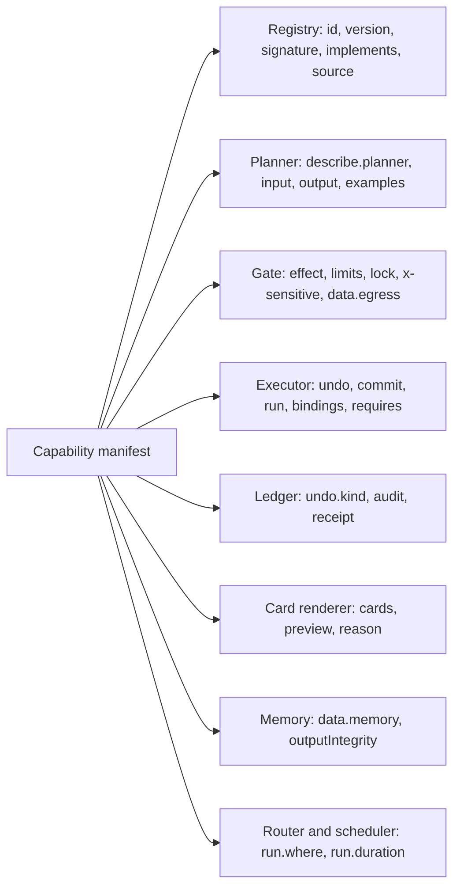

# Appendix A. Capability manifest reference

This appendix collects, in one place, the fields of a **capability** manifest, the effect-class rules, and the decision table of **the Gate**. It proposes fields, not a standard. [Chapter 6](06-capabilities.md) explains why each field exists, [Chapter 9](09-trust.md) explains how the Gate and the executor use them, and [Chapter 13](13-building-it.md) shows how one manifest binds to different platforms.

Every table has a **Simulator** column. [The simulator](../prototype/) implements a simplified manifest and Gate in `agentic-os/prototype/os.js`: each `cap(id, {...})` call declares `title`, `risk`, `provider`, `description` and `params`, optionally `riskFor`, `whyRisky`, `check` and `preview`, and a `run` function that returns `summary`, `result`, `undo`, `card` and sometimes `undoWindowSec`. `decide()` is its Gate. The column says which full-manifest field each of those stands for, and "no" where the simulator has nothing equivalent.

Conventions: field paths use dots (`undo.via`). "Required" means the registry rejects a manifest without it. Durations are ISO 8601 (`PT2M` is two minutes). Expressions in `raiseWhen`, `limits.hard` and `lock` are written in a small, side-effect-free rule language that the Gate evaluates over the call's arguments and over entity attributes the OS resolves itself. They are data, never pack code. The JSON is illustrative.

## A.1 Who reads which field



The planner reads the fewest fields, and none of the ones that decide what is allowed.

## A.2 Pack manifest

A **capability pack** is what an app becomes: a signed bundle of capabilities, card templates, entity types and, optionally, a **surface**.

| Field | Type | Req. | Meaning and rules | Simulator |
|---|---|---|---|---|
| `pack` | reverse-DNS id | yes | Unique id. Capability ids inside the pack may be written relative to it. | no; no packs |
| `version` | semver | yes | Pack version. Each capability also has its own. | no |
| `publisher` | `{name, id}` | yes | Shown in every card's provenance line. | `provider` string, e.g. "Music (capability pack)" |
| `signature` | signature over the canonical manifest | yes | Checked at install and at load. A revoked pack is denied at the Gate's first step. | no |
| `capabilities` | list of capability manifests | yes | See A.3. | the `cap()` calls |
| `entityTypes` | list of type ids | no | Entity types the pack contributes to the personal index, the way Apple's `IndexedEntity` puts app entities into Spotlight ([Apple](https://developer.apple.com/documentation/appintents/indexedentity)). | no |
| `cardTemplates` | list of template ids | no | Declarative trees of catalog components, reviewed with the pack ([Chapter 7](07-cards.md)). | no; a fixed catalog of 11 components in `ui.js` |
| `surfaces` | list of `{id, reasons}` | no | Full-screen UIs the Line may open ([Chapter 4](04-the-line.md)). Actions taken inside a surface are capability calls like any other. | no |
| `sinks` | list of endpoints | no | Every network destination the pack's code may reach. Undeclared egress is blocked and logged. | no |
| `automation` | policy object (A.10) | no | Whether and where the agent may operate the app's own screens. | no |

## A.3 Capability manifest fields

### Identity and description

| Field | Type | Req. | Meaning and rules | Closest existing field | Simulator |
|---|---|---|---|---|---|
| `id` | string | yes | System ids use reserved namespaces (`audio`, `bluetooth`, `wallet`...). Third-party ids start with the publisher's reverse domain. | MCP tool `name`; App Intent type; AppFunction name | `id` |
| `version` | semver | yes | Approvals bind to `id@version`, grants to `id@major`. Version rules are in [Chapter 6](06-capabilities.md). | none | no |
| `implements` | standard verb | no | The verb this capability provides (`order.place`). Sets a minimum class and required companion verbs. | `AppIntent(schema:)` ([Apple](https://developer.apple.com/documentation/appintents/app-schema-domains)) | no |
| `title` | localized string | yes | Short name for people. | MCP `title`; intent title | `title` |
| `describe.person` | localized string | yes | Shown in "what can you do?" and in the capability list. | none | `description` (one field for both) |
| `describe.planner` | string, at most about 300 characters | yes | What the planner reads. Reviewed and linted for text aimed at the model. Can't affect the Gate. | MCP `description`; AppFunctions KDoc | `description` |
| `examples` | list of requests | no | Used by discovery and by retrieval. | Apple schema example phrases | no; phrasing lives in `planner.js` rules |

### Schemas

| Field | Type | Req. | Meaning and rules | Closest existing field | Simulator |
|---|---|---|---|---|---|
| `input` | JSON Schema | yes | Validated before the Gate's other checks. | MCP `inputSchema`; AppFunctions schema; `@Parameter` | `params` (type, enum, minimum, maximum, description); not validated before `run` |
| `input.*.$entity` | entity type | no | The argument is an entity the OS resolves ("Mom", "the car"), not free text. | `AppEntity` | no; `findContact` and `findDevice` resolve names in code |
| `input.*.x-sensitive` | `recipient`, `payee`, `amount`, `device`, `address`, `url` | no | The Gate checks where this value came from. A low-integrity value here triggers a one-time release. | none | no |
| `input.*.x-freeText` | boolean | no | Stored text keeps the label of its source, so it stays untrusted when read back later. | none | no |
| `output` | JSON Schema | yes | Typed result the planner and cards may use. Free-text fields carry `data.outputIntegrity`. | MCP `outputSchema` | `run()` returns an untyped `result` |

### Effect

| Field | Type | Req. | Meaning and rules | Closest existing field | Simulator |
|---|---|---|---|---|---|
| `effect.class` | `read`, `reversible`, `consequential`, `irreversible` | yes | The declared class. The registry raises it to the highest minimum of `implements` and `effect.kinds`. | Apple schema side-effect metadata ([WWDC26 session 347](https://developer.apple.com/videos/play/wwdc2026/347/)); MCP annotations, as hints only | `risk` |
| `effect.kinds` | list from A.5 | yes | What the capability does. Each kind has a minimum class and may trigger the floor. | none | no |
| `effect.raiseWhen` | list of `{when, class, addKinds}` | no | Rules that raise the class for some arguments. They can never lower it. | `OwnershipProvidingEntity` confirmation for shared entities ([Apple](https://developer.apple.com/documentation/appintents/ownershipprovidingentity)) | `riskFor(args)`, a function |
| `reason` | template | yes unless `read` | The one-line reason on an approval card, written by the capability and never by the model. | `requestConfirmation(... dialog:)` | `whyRisky(args)` |

### Undo

| Field | Type | Req. | Meaning and rules | Closest existing field | Simulator |
|---|---|---|---|---|---|
| `undo.kind` | `exact`, `window`, `compensable`, `none` | yes unless `read` | What the receipt may promise. See A.6. | none | implied: an `undo` function means exact, `undoWindowSec` means window, no `undo` means none |
| `undo.via` | capability id | for `compensable`; for `exact` on pack-owned state | The inverse or compensating capability. It has its own manifest and passes the Gate. | `UndoableIntent` ([Apple](https://developer.apple.com/documentation/appintents/undoableintent)); Messages `unsendMessage` ([Apple](https://developer.apple.com/documentation/appintents/app-schema-domain-messages)) | the `undo` closure returned by `run()` |
| `undo.windowSec` | integer | for `window` | How long the executor holds the effect before it leaves the phone. | none | `undoWindowSec` (10 for `messages.send`) |
| `undo.deadline` | duration or expression | for `compensable` | Until when the compensator works ("PT2M", "departure minus 2 h"). | none | no |
| `undo.cost` | `free` or fee expression | for `compensable` | Shown on the approval card and in the receipt. | none | no |

### Commit-time authorization

| Field | Type | Req. | Meaning and rules | Closest existing field | Simulator |
|---|---|---|---|---|---|
| `commit.witnesses` | list of paths | for `consequential` and above | Values that must still hold when the effect happens (a quote, a cart version and total, an event revision). A stale witness refuses the approval token. | COMMITGUARD's witnesses ([COMMITGUARD](https://arxiv.org/abs/2607.10487)) | no |
| `commit.conditional` | boolean or `unknown` | yes for `consequential` and above | Whether the service supports conditional writes (ETag, lease, hold). `false` or `unknown` marks the capability unbound. | none | no |
| `commit.tokenTtlSec` | integer | no | How long an approval stays valid. Proposed defaults: 120 for consequential, 300 for irreversible, 60 for unbound irreversible. | none | no; approvals are used at once |
| `commit.idempotent` | `true`, `false` or `key` | no | Whether a retry is safe, and whether the executor must attach an idempotency key. | MCP `idempotentHint`, as a hint only | no |
| `commit.status` | capability id | for `write-remote` and `spend` | Answers "did that go through?" when a reply is lost. The executor never blindly retries. | Agent libOS prepare, dispatch, settle ([Agent libOS](https://arxiv.org/abs/2606.03895)) | no |

### Access and limits

| Field | Type | Req. | Meaning and rules | Closest existing field | Simulator |
|---|---|---|---|---|---|
| `lock` | `allowed`, `unlock`, `faceID`, or rules | yes | What is needed on a locked phone. Defaults: `allowed` for non-private reads and device settings, `unlock` for personal data and consequential calls, `faceID` for the floor. A pack can make it stricter only. | `IntentAuthenticationPolicy`: `alwaysAllowed`, `requiresAuthentication`, `requiresLocalDeviceAuthentication` ([Apple](https://developer.apple.com/documentation/appintents/intentauthenticationpolicy)) | no; there is no lock screen |
| `limits.hard` | list of `{when, deny}` | no | Denials checked before anyone is asked, with the message to show. Caps you set in Settings are referenced by name. | none | `check(args)`, e.g. the $50 cap in `wallet.pay` |
| `limits.rate` | rate expression | no | For example "5/hour". Over the rate is a denial. | none | no |

### Data

| Field | Type | Req. | Meaning and rules | Closest existing field | Simulator |
|---|---|---|---|---|---|
| `data.egress` | list of `{sink, fields, labels}` | yes (may be empty) | Every destination and which fields go there. Sinks must appear in the pack's `sinks`. The Gate's flow check uses it. | Agent libOS host-owned sink registry; Fuchsia routed capabilities ([Fuchsia](https://fuchsia.dev/fuchsia-src/concepts/components/v2/component_manifests)) | no; nothing leaves the page |
| `data.outputIntegrity` | `system`, `pack`, `untrusted` | yes | Integrity label on results. Free-text output is always low. Remote and automation results are `untrusted`. | none | no; the live planner marks incoming messages as untrusted in its prompt |
| `data.memory` | `none` or `{remember, retentionDays, attributed}` | yes | Which result fields memory may keep, for how long, and whether as attributed claims ([Chapter 10](10-memory.md)). | none | no |

### Execution, presentation and reach

| Field | Type | Req. | Meaning and rules | Closest existing field | Simulator |
|---|---|---|---|---|---|
| `run.where` | `device`, `privateCloud`, `remote` | yes | Where the effect runs. The router and the ledger record it. | none | everything runs in the page |
| `run.duration` | `instant`, `seconds`, `task` | yes | `task` returns a handle and becomes a thread. | MCP Tasks ([MCP 2026-07-28](https://blog.modelcontextprotocol.io/posts/2026-07-28/)); `LongRunningIntent` ([Apple](https://developer.apple.com/documentation/appintents/longrunningintent)); A2A task states ([A2A](https://github.com/a2aproject/A2A/blob/main/docs/specification.md)) | no |
| `run.cancel` | boolean | no | Whether a running task can be stopped. | MCP `tasks/cancel`; `CancellableIntent` | no |
| `cards.result` | template id | yes unless the result is text only | Card for the result, keyed to `output` (`system.audio/volume`). | A2UI catalogs; MCP Apps `ui://` resources ([MCP Apps](https://blog.modelcontextprotocol.io/posts/2026-01-26-mcp-apps/)); `SnippetIntent` | the `card` object returned by `run()`, with `bind` for live controls |
| `cards.progress` | template id | for `task` | Card for a thread in progress. | none | no |
| `preview` | template id | yes for `consequential` and above | The draft, cart or before-and-after shown on the approval card. The OS draws it. | `draftMessage` required with `sendMessage` ([WWDC26 session 240](https://developer.apple.com/videos/play/wwdc2026/240/)) | `preview(args)` |
| `receipt` | template | yes | The one-line receipt in the Line and the ledger. | none | `summary` returned by `run()` |
| `speak` | template | no | Spoken summary for voice turns. | none | no; replies are spoken as written |
| `requires` | list of `{capability, scope}` | no | Capabilities the pack's own code may call, attenuated. Shown at install. | Fuchsia `use` declarations | no |
| `bindings` | map of platform to binding | yes | How each platform carries it out ([Chapter 13](13-building-it.md)). | none | `run()` is the only binding |
| `audit` | `{log, redact}` | no | Which fields the ledger keeps and which it masks. | none | the ledger keeps all arguments |

### Set by the OS, not the developer

| Field | Meaning |
|---|---|
| `source` | `system`, `pack`, `mcp`, `a2a` or `automation` |
| `minClass` | The computed minimum from `implements` and `effect.kinds` |
| `review` | Review status and date; a model-facing description that fails linting blocks install |
| `integrity` | The integrity level assigned to the pack or server |
| `cache` | For remote capabilities, the `ttlMs` and `cacheScope` from the list response |

## A.4 Effect classes

| Class | Meaning | Examples | Undo kinds allowed | Locked phone, by default | Can a grant lift the ask? |
|---|---|---|---|---|---|
| read | No change | `calendar.list`, `device.status`, `weather.today` | none needed | allowed for non-private state; unlock for personal data | not needed |
| reversible | A change with an exact undo | `audio.setVolume`, `focus.set`, `alarms.create`, reconnecting paired AirPods | `exact` | allowed for device settings | not needed in Auto or Autopilot |
| consequential | Reaches other people or the outside world; can't be fully taken back | `messages.send`, `phone.call`, pairing a new device, `booking.change` | `window`, `compensable`, `exact` on the phone's side | unlock | yes, except on the floor |
| irreversible | Money, deletion, legal commitment | `wallet.pay`, `order.place`, permanent deletion, accepting terms | `compensable` or `none` | Face ID | never |

## A.5 Effect kinds and minimum classes

| Kind | Meaning | Minimum class | Floor (Face ID in every mode) when |
|---|---|---|---|
| `read` | Observes only | read | never |
| `write-local` | Changes state on the phone that the OS can snapshot | reversible | never |
| `write-remote` | Changes state on a service | consequential, or reversible with a reviewed exact inverse | never by itself |
| `communicate` | Reaches a person: message, call, email, invite | consequential | the recipient has never been contacted |
| `share` | Gives a person or device standing access: pairing, sharing location, adding a payee | consequential | the recipient is new, or the data is location or health |
| `physical` | Acts on the physical world: a lock, a car, an appliance | consequential | the device is not yours |
| `spend` | Moves money or commits to pay | irreversible | always |
| `delete` | Removes data with no recovery (moving to a recoverable trash is `write-local`) | irreversible | always |
| `legal` | Accepts terms, signs, consents | irreversible | always |
| `security` | Changes passwords, recovery contacts, passkeys or permissions | consequential | always |

Installing a pack, or widening what an installed one `requires`, is also on the floor ([Chapter 9](09-trust.md)).

## A.6 Undo kinds

| `undo.kind` | Fields | Receipt shows | Simulator |
|---|---|---|---|
| `exact` | `undo.via`, or none for OS-owned state (snapshot) | `[Undo]` | the `undo` closure, e.g. volume, alarms, Focus |
| `window` | `undo.windowSec` | `[Undo · 10 s]`, counting down | `undoWindowSec: 10` on `messages.send` |
| `compensable` | `undo.via`, `undo.deadline`, `undo.cost` | `[Cancel order · until 7:05 PM]` | no |
| `none` | nothing | "Can't be undone" | `wallet.pay` and `phone.call` return no `undo` |

## A.7 Example: a system capability

The system's `bluetooth.connect`, the capability [Chapter 14](14-the-simulator.md) walks through in the simulator, as a full manifest. The same capability is reversible for a paired device and consequential for a new one.

```json
{
  "id": "bluetooth.connect",
  "version": "2.0.1",
  "publisher": "system",
  "title": "Connect a Bluetooth device",
  "describe": {
    "person": "Connects your headphones, speakers or car.",
    "planner": "Connect a paired or nearby Bluetooth device by name or kind (headphones, car, speaker). Pairing a new device needs approval."
  },
  "examples": ["connect my AirPods", "play this on the kitchen speaker"],
  "input": {
    "type": "object",
    "properties": {
      "device": { "$entity": "std.BluetoothDevice", "x-sensitive": "device" }
    },
    "required": ["device"]
  },
  "output": {
    "type": "object",
    "properties": {
      "connected": { "$entity": "std.BluetoothDevice" },
      "newlyPaired": { "type": "boolean" }
    }
  },
  "effect": {
    "class": "reversible",
    "kinds": ["write-local"],
    "raiseWhen": [
      { "when": "device.paired == false", "class": "consequential", "addKinds": ["share"] }
    ]
  },
  "reason": "Pairing a new device ({device.name}) lets it connect again later without asking.",
  "undo": { "kind": "exact" },
  "commit": { "idempotent": true },
  "lock": [
    { "when": "device.paired == false", "lock": "unlock" },
    { "lock": "allowed" }
  ],
  "limits": { "rate": "30/hour" },
  "data": { "egress": [], "outputIntegrity": "system", "memory": "none" },
  "run": { "where": "device", "duration": "seconds", "cancel": true },
  "cards": { "result": "system.bluetooth/device", "choose": "system.bluetooth/list" },
  "preview": "system.bluetooth/pair",
  "receipt": { "default": "Connected {connected.name}", "newlyPaired": "Paired and connected {connected.name}" },
  "speak": "Connected to {connected.name}.",
  "bindings": {
    "agenticPhone": { "service": "system.bluetooth", "call": "connect" },
    "linux": { "dbus": "org.bluez.Device1", "methods": ["Pair", "Connect"] },
    "simulator": { "file": "prototype/os.js", "cap": "bluetooth.connect" }
  },
  "audit": { "log": ["device.name", "newlyPaired"] }
}
```

How the simulator's version lines up with this:

| Full manifest | `os.js` |
|---|---|
| `title`, `describe.*` | `title: 'Connect a Bluetooth device'`, one `description` |
| `effect.class` | `risk: 'reversible'` |
| `effect.raiseWhen` | `riskFor: (a) => d && !d.paired ? 'consequential' : 'reversible'` |
| `reason` | `whyRisky` returns "Pairing a new device (JBL Flip 6) lets it connect again later without asking." |
| `input` | `params: { device: { type: 'string' } }`, resolved by `findDevice()` |
| `undo.kind: exact` | `run()` returns `undo: () => { state.bluetooth = before; }` |
| `cards.result` | `run()` returns `card: { type: 'device', ... }` with a Disconnect action |
| `receipt` | `summary`: "Paired and connected JBL Flip 6" |
| `bindings.linux` | none; BlueZ exposes `Pair()` and `Connect()` on `org.bluez.Device1` ([BlueZ](https://github.com/bluez/bluez/blob/master/doc/org.bluez.Device.rst)) |

## A.8 Example: a third-party capability

Corner Pizza, a fictional local restaurant, ships a pack with six capabilities. The pack manifest, with capability ids written relative to the pack:

```json
{
  "pack": "com.cornerpizza",
  "version": "1.3.0",
  "publisher": { "name": "Corner Pizza", "id": "dev.cornerpizza" },
  "signature": "MEUCIQ…",
  "capabilities": ["menu.search", "menu.usual", "cart.build", "order.place", "order.status", "order.cancel"],
  "entityTypes": ["com.cornerpizza.Order", "com.cornerpizza.MenuItem"],
  "cardTemplates": ["com.cornerpizza/menu"],
  "sinks": ["https://api.cornerpizza.example"],
  "automation": { "default": "deny", "prefer": "com.cornerpizza.order.place" }
}
```

Because the pack implements `order.place`, the registry requires `order.status` and `order.cancel` too. The `order.place` manifest:

```json
{
  "id": "com.cornerpizza.order.place",
  "version": "1.3.0",
  "implements": "order.place",
  "publisher": { "name": "Corner Pizza", "id": "dev.cornerpizza" },
  "title": "Place an order",
  "describe": {
    "person": "Orders from Corner Pizza for delivery or pickup.",
    "planner": "Place an order for a cart built with cart.build. Needs the cart id and the total the person saw."
  },
  "examples": ["order my usual from Corner Pizza"],
  "input": {
    "type": "object",
    "properties": {
      "cart": { "type": "string" },
      "total": { "type": "number", "x-sensitive": "amount" },
      "deliverTo": { "$entity": "std.Place", "x-sensitive": "address" }
    },
    "required": ["cart", "total", "deliverTo"]
  },
  "output": {
    "type": "object",
    "properties": {
      "order": { "$entity": "com.cornerpizza.Order" },
      "eta": { "type": "string" }
    }
  },
  "effect": { "class": "irreversible", "kinds": ["spend", "write-remote"] },
  "reason": "Corner Pizza starts cooking after 2 minutes. After that, the charge stands.",
  "undo": {
    "kind": "compensable",
    "via": "com.cornerpizza.order.cancel",
    "deadline": "PT2M",
    "cost": "free"
  },
  "commit": {
    "witnesses": ["cart.version", "cart.total"],
    "conditional": true,
    "tokenTtlSec": 300,
    "idempotent": "key",
    "status": "com.cornerpizza.order.status"
  },
  "lock": "faceID",
  "limits": { "rate": "5/hour" },
  "data": {
    "egress": [
      {
        "sink": "https://api.cornerpizza.example/orders",
        "fields": ["cart", "deliverTo", "contact.phone"],
        "labels": ["personal:address", "personal:phone"]
      }
    ],
    "outputIntegrity": "pack",
    "memory": { "remember": ["order.items"], "retentionDays": 180, "attributed": true }
  },
  "run": { "where": "remote", "duration": "task", "cancel": false },
  "cards": { "result": "system.commerce/order", "progress": "system.progress/delivery" },
  "preview": "system.commerce/checkout",
  "receipt": "Ordered · arriving {eta}",
  "speak": "Ordered. It should arrive {eta}.",
  "requires": [
    { "capability": "wallet.authorize", "scope": { "merchant": "Corner Pizza", "maxAmount": "input.total" } }
  ],
  "bindings": {
    "agenticPhone": { "pack": "com.cornerpizza", "entry": "OrderService.place" },
    "android": { "appFunction": "com.cornerpizza.PlaceOrder" },
    "mcp": { "server": "https://mcp.cornerpizza.example", "tool": "place_order" }
  },
  "audit": { "log": ["order.id", "total", "order.items"], "redact": ["contact.phone"] }
}
```

Things to notice:

- The pack never touches payment details. It `requires` a Wallet authorization scoped to this merchant and at most this total, and the Wallet's payment sheet does the rest.
- `total` is marked `x-sensitive: amount`. If the total came from somewhere other than the cart the person saw, the flow check would stop it.
- The witnesses and `conditional: true` let the executor refuse a stale approval if the cart changed after the tap ([Chapter 9](09-trust.md) shows the sequence).
- `memory` lets the phone learn "my usual" as an attributed fact from Corner Pizza, kept for 180 days.
- Nothing in the manifest lets the pack lower the class, skip Face ID, or draw the approval card.

## A.9 Example: a remote MCP tool, as the registry sees it

A remote server sends an ordinary MCP tool definition. Its annotations are hints, and the MCP schema says "clients should never make tool use decisions based on ToolAnnotations received from untrusted servers" ([MCP schema](https://github.com/modelcontextprotocol/modelcontextprotocol/blob/main/schema/2025-06-18/schema.ts)):

```json
{
  "name": "change_booking",
  "title": "Change a booking",
  "description": "Move a booking to another flight.",
  "inputSchema": {
    "type": "object",
    "properties": { "booking": { "type": "string" }, "flight": { "type": "string" }, "quote": { "type": "string" } },
    "required": ["booking", "flight", "quote"]
  },
  "annotations": { "readOnlyHint": false, "destructiveHint": false, "idempotentHint": true }
}
```

The registry wraps it in a derived manifest. The class, the compensator and the raise rule come from the standard verb `booking.change`, which the server claims and whose parameters the tool's schema must match. They don't come from the hints:

```json
{
  "id": "com.harborair.booking.change",
  "source": "mcp",
  "implements": "booking.change",
  "effect": {
    "class": "consequential",
    "kinds": ["write-remote"],
    "raiseWhen": [{ "when": "quote.fareDifference > 0", "class": "irreversible", "addKinds": ["spend"] }]
  },
  "undo": { "kind": "compensable", "via": "com.harborair.booking.cancel" },
  "commit": { "witnesses": ["quote"], "conditional": "unknown", "idempotent": false, "status": "com.harborair.booking.get" },
  "data": { "outputIntegrity": "untrusted" },
  "cache": { "ttlMs": 600000 }
}
```

`idempotentHint: true` doesn't make retries safe; `commit.idempotent` stays false until review says otherwise. `conditional: "unknown"` marks the capability unbound, which shortens its approval tokens. If a refreshed tool list changes the schema in a way that would be a major version, the registry treats it as a new capability.

## A.10 Automation policy

The `automation` block lets an app say whether the agent may operate its screens when no capability fits. It follows the idea of ByteDance's SAEP, which by Pandaily's account lets apps declare readable pages, automatable actions and off-limits areas, with a 30-day notice period ([Pandaily](https://pandaily.com/bytedance-doubao-phone-agent-mcp-a2a-gui-fallback)). [Chapter 6](06-capabilities.md) explains the design.

| Field | Type | Meaning |
|---|---|---|
| `default` | `allow` or `deny` | What happens on screens not listed. With no policy at all, the OS allows supervised reading and navigation only. |
| `allow` | list of `{screens, actions}` | Screens by the app's own labels; actions from `read`, `tap`, `type`, `scroll` |
| `never` | list of screen labels | Off-limits, whatever `allow` says. Login, payment and one-time-code screens are always off, even if unlisted. |
| `identify` | boolean | The session tells the app it is an agent acting for its user. The OS sets this to true whatever the app declares. |
| `noticeDays` | integer | How long a policy change waits before it takes effect |
| `prefer` | capability id | The capability the app would rather the agent use |

## A.11 Grants and approval tokens

**Grant** fields ([Chapter 9](09-trust.md) has the rules):

| Field | Meaning | Simulator |
|---|---|---|
| `capability` | Capability id, bound to its major version | `cap` |
| `match` | Constraints on arguments (`to = Mom`, `amount ≤ 25`) | `match`, a case-insensitive exact match per argument |
| `until` | Expiry; default seven days | no; grants last for the session |
| `uses` | Optional count | no |
| `origin` | Your words or the card you confirmed, and when | `label` only |
| `id` | Written into every ledger entry the grant allows | `id` |

Grants apply only to consequential calls, never to the floor or to irreversible ones.

**Approval token** fields, minted by the Gate when you approve and checked by the executor at commit: capability `id@version`, a hash of the exact arguments, the witnesses' values, the run, the grant if any, and an expiry from `commit.tokenTtlSec`. The simulator has no tokens. It runs the approved call right away.

## A.12 The Gate decision table

The Gate is deterministic code between the planner and every capability. It evaluates checks in this order, and each must pass before the next runs:

| Step | Check | Fields read | If it fails |
|---|---|---|---|
| 1 | Capability registered, signature valid, pack not revoked | `id`, `version`, signature | deny |
| 2 | The run holds a handle for this capability and these arguments | `requires`, the run's handles | deny |
| 3 | No deny rule matches ("never text Alex after 11") | your rules | deny |
| 4 | Arguments validate against the schema | `input` | deny |
| 5 | Flow check: no low-integrity value in an `x-sensitive` argument; no private data to a new or undeclared sink | `x-sensitive`, `data.egress`, value labels | ask for a one-time release that names the source |
| 6 | Hard limits, caps and rates | `limits.hard`, `limits.rate`, your caps | deny, with the reason and where to change it |
| 7 | The floor: class is irreversible, or a floor condition from A.5 holds | `effect`, entity novelty | ask with Face ID |
| 8 | Mode and grants, from the table below | `effect.class`, mode, grants | allow or ask |

Hard limits come before the floor on purpose. You are never asked to approve something that will be refused anyway.

With the effect class computed (declared class, raised by `raiseWhen` and kinds), the outcome for each mode:

| Effect class | Situation | Ask me | Auto | Autopilot |
|---|---|---|---|---|
| any | Unknown, unsigned or revoked capability, outside the run's reach, or a deny rule matches | deny | deny | deny |
| any | Over a hard limit or cap | deny | deny | deny |
| read | | allow | allow | allow |
| reversible | | ask | allow, with Undo | allow, with Undo |
| consequential | No grant covers it | ask | ask | allow, within the run's reach |
| consequential | A grant covers it | allow | allow | allow |
| consequential | On the floor (new recipient, security change, new location or health share, pack install) | ask + Face ID | ask + Face ID | ask + Face ID |
| irreversible | Grants never apply | ask + Face ID | ask + Face ID | ask + Face ID |

Notes on the table:

- **The floor can't be lowered.** No mode, grant or setting removes the Face ID ask for irreversible calls or floor conditions. You can raise it: "ask me before any message to my boss" is a rule that holds in Autopilot.
- **Autopilot is not a bypass.** It allows consequential calls only because step 2 has already confined the run to the reach your request implies. A step that needs more reach needs a new plan.
- **The mode is the one in force for the capability's domain.** Per-domain overrides ("Autopilot for home and media") change which column applies, not the rules ([Chapter 9](09-trust.md)).
- **A locked phone adds an unlock.** If `lock` requires `unlock` or `faceID` and the phone is locked, an allow waits for unlock and an ask shows only after it.
- **Flow checks produce asks, not denials.** Sometimes you do want to pay the plumber whose account number came by email. The ask names where the value came from.
- **A guardian model may add asks.** It can turn an allow into an ask and must say so on the card. It never removes an ask and never touches steps 1 to 7.
- **Mandates are an open question.** [Chapter 9](09-trust.md) describes delegated purchases through signed mandates ("up to $120 each when tickets go on sale"). The mandate itself is created on the floor with Face ID. Whether a purchase inside a mandate may then run without a second Face ID is not settled in this design.

### The simulator's Gate

The simulator's `decide()` in `os.js`, exactly as written:

```js
  /** Deterministic: the model never decides whether its own action is safe. */
  function decide(capId, args) {
    const c = capabilities[capId];
    if (!c) return { verdict: 'deny', reason: `Unknown capability ${capId}` };
    const risk = riskOf(capId, args);
    // Hard limits are checked before anyone is asked: a request over the cap is refused, not offered for approval.
    const why = c.check && c.check(args);
    if (why) return { verdict: 'deny', risk, reason: why };
    if (risk === 'irreversible') return { verdict: 'ask', faceId: true, risk, reason: (c.whyRisky && c.whyRisky(args)) || 'This can’t be undone.' };
    if (RISK[risk] <= MODES[mode].autoUpTo) return { verdict: 'allow', risk, reason: `${risk} · allowed in ${MODES[mode].label} mode` };
    const g = risk === 'consequential' && grantFor(capId, args);
    if (g) return { verdict: 'allow', risk, reason: `${risk} · you allowed “${g.label}” for this session` };
    return { verdict: 'ask', risk, reason: (c.whyRisky && c.whyRisky(args)) || `${risk} action` };
  }
```

`MODES` sets each mode's ceiling: Ask me allows up to read, Auto up to reversible, Autopilot up to consequential. `riskOf` returns `riskFor(args)` when a capability has one and `risk` otherwise. In the simulator, try "Pay Sam $20 for pizza" in Autopilot: it still asks for Face ID. "Pay Sam $80" is refused before any ask, because `check` enforces the $50 cap.

How it compares with the full table:

| Step | Full design | Simulator |
|---|---|---|
| 1. Registered and signed | yes | unknown id is denied; no signatures |
| 2. Within the run's reach | yes | no; any registered capability can be called |
| 3. Deny rules | yes | no |
| 4. Schema validation | yes | no; `run()` throws on bad input after the Gate allows |
| 5. Flow check | yes | no; the live planner is told in its prompt that message text is data |
| 6. Hard limits before asking | yes | yes, via `check` |
| 7. Floor | irreversible plus floor conditions | irreversible only |
| 8. Mode ceiling | per domain | one global mode |
| 8. Grants | scoped, with expiry and uses | exact argument match, for the session, consequential only |
| Approval tokens | bound, re-checked at commit | none; the call runs on approval |

## Assumptions and unknowns

- **The field list is a proposal.** It merges MCP tool definitions, Apple's app schemas, AppFunctions, A2A Agent Cards, Fuchsia manifests, Agent libOS and COMMITGUARD. Nobody has shipped a manifest with all of these fields, and some will turn out to be unnecessary or missing.
- **The rule language is unspecified.** `raiseWhen`, `limits.hard` and `lock` rules need a small, verifiable expression language over arguments and entity attributes. This appendix assumes one exists.
- **Standard verbs need an owner.** Minimum classes, required companions and fixed parameters depend on someone governing the verb list across platforms.
- **Token lifetimes and rate defaults are guesses.** The numbers in A.3 are starting points, not measured values.
- **Mandates versus the floor.** See the note in A.12.
- **Remote manifests are derived.** A remote server can claim a standard verb falsely. Schema matching and review catch some of that. Runtime behavior that doesn't match the verb (a `booking.change` that also charges a card) needs detection that doesn't exist yet.

## Sources

- [Apple, App schema domains](https://developer.apple.com/documentation/appintents/app-schema-domains)
- [Apple, Messages schema domain](https://developer.apple.com/documentation/appintents/app-schema-domain-messages)
- [Apple IndexedEntity](https://developer.apple.com/documentation/appintents/indexedentity)
- [Apple IntentAuthenticationPolicy](https://developer.apple.com/documentation/appintents/intentauthenticationpolicy)
- [Apple UndoableIntent](https://developer.apple.com/documentation/appintents/undoableintent)
- [Apple LongRunningIntent](https://developer.apple.com/documentation/appintents/longrunningintent)
- [Apple OwnershipProvidingEntity](https://developer.apple.com/documentation/appintents/ownershipprovidingentity)
- [Apple WWDC26 session 240](https://developer.apple.com/videos/play/wwdc2026/240/)
- [Apple WWDC26 session 347](https://developer.apple.com/videos/play/wwdc2026/347/)
- [MCP 2026-07-28 release](https://blog.modelcontextprotocol.io/posts/2026-07-28/)
- [MCP schema, 2025-06-18 (tool annotations)](https://github.com/modelcontextprotocol/modelcontextprotocol/blob/main/schema/2025-06-18/schema.ts)
- [MCP Apps](https://blog.modelcontextprotocol.io/posts/2026-01-26-mcp-apps/)
- [A2A specification](https://github.com/a2aproject/A2A/blob/main/docs/specification.md)
- [Fuchsia component manifests](https://fuchsia.dev/fuchsia-src/concepts/components/v2/component_manifests)
- [Agent libOS](https://arxiv.org/abs/2606.03895)
- [COMMITGUARD: commit-time authorization](https://arxiv.org/abs/2607.10487)
- [BlueZ Device API](https://github.com/bluez/bluez/blob/master/doc/org.bluez.Device.rst)
- [Pandaily on Doubao gen 2 and SAEP](https://pandaily.com/bytedance-doubao-phone-agent-mcp-a2a-gui-fallback)
