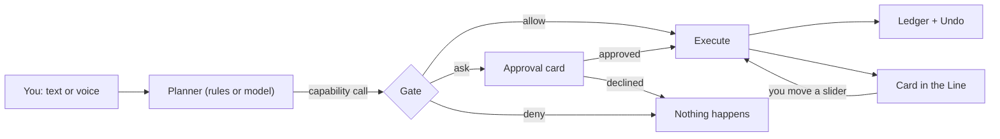

# The Line: a simulator of the agentic phone

A browser prototype of the home screen described in [The Agentic Phone](../README.md). The phone's home screen is one conversation. You type or say what you want, a planner turns it into typed capability calls, a fixed policy (the Gate) decides what runs and what asks, and every action lands in a ledger with an undo.

<p align="center"></p>

## Run it

Open `index.html` in a browser. There's no build step and nothing to install. Everything runs locally, and nothing touches your real device.

If your browser blocks scripts on `file://` pages, serve the folder instead:

```sh
cd agentic-os/prototype && python3 -m http.server 8000
# then open http://localhost:8000
```

Voice input uses the browser's speech recognition (Chrome, Edge and Safari have it). Replies to voice requests are spoken back.

## Two planners

| Planner | What it is | When to use it |
|---|---|---|
| **Rules · offline** | About 40 hand-written intent rules in `planner.js`. It splits compound requests ("turn it down a bit and dim the screen"), parses times and amounts, and resolves "the headphones" to a paired device. | Always available. Deterministic, so it's good for demos and tests. |
| **Model · live** | A language model that sees every capability as a tool. Each tool call it makes goes through the same Gate as the offline plan. | When the page runs as a claude.ai artifact with the `sample` capability. It uses the viewer's Claude usage and only runs when you send a request. |

The planner switch sits at the top right. If live mode isn't available in the current view, the page says so and stays on rules.

## Things to try

| Say or type | What it shows |
|---|---|
| Set an alarm for sleep | A vague request turned into a plan: the phone reads tomorrow's calendar, picks a wake time and turns on Sleep Focus. The whole request has one **Undo this request**. |
| Change the headphone level | Ambiguity. The phone connects the AirPods, then shows a volume slider instead of guessing a number. |
| Connect to Bluetooth | No device named, so the phone lists nearby devices. Pairing the new speaker counts as a consequential action. |
| Text Mom I'm running late | A consequential action. You get an editable draft, and nothing is sent until you tap Send. **Always allow messages to Mom** creates a grant. |
| Pay Sam $20 for pizza | An irreversible action. It always asks and needs Face ID, whatever the mode. |
| Pay Sam $80 | Over the $50 per-payment cap. The Gate refuses before asking, so there's no approval prompt to talk your way through. |
| Turn it down a bit and dim the screen | Two calls from one sentence, each with its own Undo. |
| Order a pizza | No capability matches, so the phone says it can't, rather than pretending. |
| Goodnight · I'm driving | Routines: one phrase, several capabilities. |

The buttons under the phone simulate the outside world. You can drain the battery, connect AirPods, get a message from Mom, or get **a message with hidden instructions** (a prompt-injection attempt). The Line treats incoming text as data: the Trace tab shows what the quarantined reader extracted, and nothing runs.

Commands: type `/` for the list. `/undo` rolls back the last request, `/mode` cycles the autonomy mode, `/ledger`, `/grants` and `/caps` open inspector tabs, and `/reset` restores the phone. **Shift+Tab** changes the mode, as in coding-agent CLIs. **Esc** stops a live run.

## How it's built



| File | What's in it |
|---|---|
| `os.js` | Device state (volume, Bluetooth, alarms, calendar, contacts, wallet...), the **capability registry** (28 capabilities, each with an effect class, parameters and an undo), the **Gate** (`decide()`), grants, and the **ledger** with per-action and per-request undo. |
| `planner.js` | The offline rule planner and the live planner. The live planner builds a tool per capability (or one router tool if the view allows fewer tools), and adds a system prompt with device state and quarantined notifications. |
| `ui.js` | The Line (turns, step lines, cards, approval cards with Face ID and grants), voice, slash commands, simulated events, and the inspector. |
| `index.html` | Layout and styles. The phone keeps one dark look; the page follows the system theme. |

### Effect classes and the Gate

Every capability declares an effect class, and the Gate decides from that class plus the mode. The model never decides.

| Effect class | Ask me | Auto (default) | Autopilot |
|---|---|---|---|
| read | runs | runs | runs |
| reversible | asks | runs, with Undo | runs, with Undo |
| consequential | asks | asks (unless granted) | runs |
| irreversible | Face ID | Face ID | Face ID |

Hard limits are checked before anyone is asked. For example, a payment over the per-payment cap is refused outright.

### Add a capability

Capabilities are plain objects. Here is a complete one:

```js
cap('display.setNightShift', {
  title: 'Night Shift', risk: 'reversible', provider: 'System · Display',
  description: 'Turns Night Shift (warmer colors) on or off.',
  params: { on: { type: 'boolean' } },
  run: (a) => {
    const before = state.display.nightShift;
    state.display.nightShift = !!a.on;
    return {
      summary: `Night Shift ${a.on ? 'on' : 'off'}`,
      result: { nightShift: !!a.on },
      undo: () => { state.display.nightShift = before; },
      card: { type: 'toggle', icon: 'sun', title: 'Night Shift', on: !!a.on,
              bind: { cap: 'display.setNightShift', arg: 'on' } },
    };
  },
});
```

Add it to `os.js` and the live planner can use it at once, because tools come from the registry. The offline planner needs a rule in `planner.js`. The Gate, ledger, Undo and inspector need nothing extra.

## What it doesn't do

- **Nothing is real.** No messages are sent, no devices pair, and no money moves. The clock is frozen at Thursday 21:40.
- **The offline planner is small on purpose.** It covers the phrasings in the table above and some variations, not open-ended language. Live mode handles the rest.
- **Quarantine is shown, not enforced by a second model.** Incoming messages are never fed to the offline planner. In live mode they reach the model marked as untrusted data, and anything it tries is still gated. A real phone would read untrusted content with a separate model that has no tools (see Chapter 9).
- **Memory, background threads and third-party capability packs** are described in the book but not simulated.

The book's [Chapter 14](../chapters/14-the-simulator.md) walks through the code.
