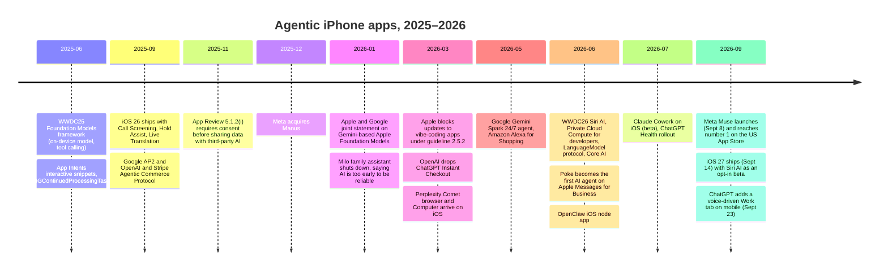

[← Back to the atlas](../README.md)

# The landscape, September 2026

A snapshot of who is building agentic iPhone apps, on what, and how it's going. It's the evidence behind the **Being built now** tier. Sources are linked inline. Where a claim rests on press coverage rather than a primary source, the link goes to the press.

## The short version

- **Apple split the job in two.** Siri AI (iOS 27) is Apple's own agent that works across apps. Third-party apps take part only as tools it can call, through App Intents. Separately, Apple gave developers a much stronger toolkit for building agents *inside* their own app.
- **The heavy agents live in the cloud.** Meta's Muse, ChatGPT agent, Gemini Spark, Perplexity Computer, Manus and Grok Bot all run their loop on servers. The iPhone is where you brief the agent, watch it and approve its steps.
- **Vertical agents are uneven.** Phone-call errand agents, price-watch buying and money autopilots are working. Family logistics and in-chat checkout have stumbled.
- **Trust is the bottleneck, not capability.** People let agents advise but hesitate to let them spend. Only 20% of AI users have given an agent access to a financial account, versus 36% for email ([Menlo Ventures, 2026](https://menlovc.com/perspective/2026-the-state-of-consumer-ai/)).

## Timeline

## Apple: an orchestrator plus a toolkit

**Siri AI** was announced at WWDC26 and shipped with iOS 27 on September 14, 2026 ([Apple Newsroom](https://www.apple.com/newsroom/2026/09/siri-ai-a-profoundly-more-capable-and-personal-assistant-is-here/)). It combines personal context, on-screen awareness and actions that chain across apps. It launched as an opt-in beta with a waitlist, in English only, on iPhone 15 Pro and later. On iPhone it isn't available in the EU or China. It reaches third-party apps only through [App Intents and app schemas](https://developer.apple.com/documentation/appintents/app-schema-domains), so its reach depends on each developer adopting them.

**The toolkit for building agents inside your app** grew a lot in iOS 27:

| Piece | What it gives an agent builder |
|---|---|
| [Foundation Models](https://developer.apple.com/documentation/foundationmodels) | The on-device model with tool calling and guided generation. Free and offline, with a small per-session context (4,096 tokens in Apple's docs; Apple's [WWDC26 sample](https://developer.apple.com/videos/play/wwdc2026/241/) shows the rebuilt iOS 27 model at 8,192). Now on watchOS 27 too. |
| [`PrivateCloudComputeLanguageModel`](https://developer.apple.com/documentation/foundationmodels/privatecloudcomputelanguagemodel) | Apple's server model, 32K context, reasoning levels, per-user daily quota. [Free for small developers](https://developer.apple.com/private-cloud-compute/) under 2M first-time downloads. |
| [`LanguageModel` protocol](https://developer.apple.com/documentation/foundationmodels/languagemodel) | Plug other models into the same session API. Anthropic ships [ClaudeForFoundationModels](https://github.com/anthropics/ClaudeForFoundationModels); Google has a Gemini package through Firebase; MLX and Core AI cover local models. |
| [`LongRunningIntent`](https://developer.apple.com/documentation/appintents/longrunningintent) | Lets an App Intent run past 30 seconds in the background, as long as it keeps reporting progress. |
| [`UndoableIntent`](https://developer.apple.com/documentation/appintents/undoableintent) | Register undo for actions an intent performed (iOS 26). |
| [`BGContinuedProcessingTask`](https://developer.apple.com/documentation/backgroundtasks/bgcontinuedprocessingtask) | User-started work that keeps going in the background, with progress shown in a Live Activity (iOS 26). |
| Live Activities | The standard "agent at work" status surface on the Lock Screen, Dynamic Island, Watch and CarPlay. |

**Apple is also shipping its own vertical agents:** Call Screening and Hold Assist in the Phone app (iOS 26), and a Passwords feature that changes compromised passwords for you (iOS 27, reported by [9to5Mac](https://9to5mac.com/2026/08/27/ios-27s-passwords-app-can-change-your-passwords-for-you-automatically/)). None of these is open to third parties.

**What Apple didn't ship:** an agent payments API, MCP support for App Intents (MCP arrived only in Xcode, as a bridge for coding agents, starting with Xcode 26.3), and a live developer API for third-party model "Extensions" to Siri. Apple's AI health coach was delayed and reportedly scaled back ([9to5Mac](https://9to5mac.com/2026/05/24/apple-improving-heart-rate-tracking-in-watchos-27-mulberry-health-coach-delays/)).

## The general-purpose agents on iPhone

| Product | What it does for you | Where the work happens |
|---|---|---|
| [Muse from Meta](https://about.fb.com/news/2026/09/introducing-muse-personal-ai-agent/) | Email, travel booking, forms, purchases with one-time cards, phone calls to businesses. Launched September 8, 2026; number 1 free iPhone app in the US ten days later. | Meta's cloud computer |
| [ChatGPT](https://help.openai.com/en/articles/11752874-chatgpt-agent) | Agent mode with a cloud browser; scheduled tasks; personal finance through Plaid; a health area connected to Apple Health; a voice-driven Work tab on mobile (September 2026). | OpenAI's cloud |
| [Gemini Spark](https://gemini.google/overview/agent/spark/) | A 24/7 agent across Gmail, Docs and signed-in websites (Google I/O, May 2026). Hands payments and passwords back to you. | Google's cloud |
| [Claude](https://support.claude.com/en/articles/11869619-use-claude-with-ios-apps) | Creates Calendar events and Reminders, drafts Messages and Mail, reads Apple Health (beta). Cowork on iOS runs server-hosted sessions; Dispatch sends tasks to your desktop. | On device for iOS actions; cloud and desktop for long runs |
| [Perplexity](https://www.macrumors.com/2026/03/18/perplexity-comet-browser-iphone/) | An iOS assistant that acts through apps (Uber, OpenTable up to the final tap), the Comet browser, and Computer for longer tasks. | Mixed |
| [Manus](https://apps.apple.com/us/app/manus-ai-agent-automation/id6740909540) | A general agent with its own virtual computer; the app shows every step. Now owned by Meta. | Cloud |

The lesson: **the phone has become the remote control and the approval screen.** Nobody is fighting the sandbox head-on.

## Vertical agents: what's working and what isn't

**Working, or at least growing:**

- **Phone-call errand agents.** [Pine](https://www.19pine.ai/) negotiates bills and cancels subscriptions by calling for you. Genspark's Call for Me and Google's agentic calling phone businesses from the cloud. Muse added calls in September 2026.
- **Price-watch buying.** Amazon's Alexa for Shopping buys when a price drops to your target, and "Buy for Me" buys on other sites ([CNBC](https://www.cnbc.com/2026/05/13/amazon-ditches-rufus-ai-chatbot-in-favor-of-alexa-shopping-agent.html)). Google's agentic checkout does the same through Google Pay.
- **Money autopilots.** Cleo Autopilot moves money within limits you set ([Cleo](https://web.meetcleo.com/blog/introducing-autopilot)).
- **Meeting capture.** Granola on iPhone and Apple Watch; Plaud's recorder with an iPhone app.
- **Messaging-native agents.** [Poke](https://techcrunch.com/2026/06/04/apple-approves-poke-as-the-first-ai-agent-on-its-messages-for-business-platform/) runs inside iMessage through Apple Messages for Business. OpenClaw's self-hosted agent has an iPhone app for approvals.

**Struggling:**

- **Family logistics.** Milo shut down in January 2026. Its founder said small extraction errors (the wrong date from a school email) compounded into more work for families.
- **In-chat checkout.** OpenAI dropped Instant Checkout after it converted worse than sending shoppers to the store's own site.
- **Calendar and inbox agents on iPhone.** The strong ones are desktop-first. Motion needs a laptop to auto-schedule; Reclaim has no iOS app.
- **Apps that build apps on the phone.** App Review's 2.5.2 enforcement in March 2026 forced vibe-coding apps to change course.

## The builder's stack

The open-source layer under iOS agents is mature; the agent frameworks on top of it are not.

- **Models on device:** [MLX Swift](https://github.com/ml-explore/mlx-swift), [llama.cpp](https://github.com/ggml-org/llama.cpp), [WhisperKit](https://github.com/argmaxinc/argmax-oss-swift), Core AI (iOS 27).
- **Model routing:** Apple's `LanguageModel` protocol, Hugging Face's [AnyLanguageModel](https://github.com/huggingface/AnyLanguageModel), Apple's [foundation-models-utilities](https://github.com/apple/foundation-models-utilities).
- **Tools:** the official [MCP Swift SDK](https://github.com/modelcontextprotocol/swift-sdk). On iOS an app can be an MCP client over HTTP, not over stdio.
- **Agent frameworks in Swift:** small projects with tens of GitHub stars. There's no dominant Swift runtime with durable runs, checkpoints, approvals and retries. That gap is itself an idea in this atlas.

## The research frontier

Research on phone agents has split into two tracks:

1. **Agents that tap screens.** Android benchmarks are nearly saturated. The first native iOS benchmark, CMU's [iOSWorld](https://huggingface.co/papers/2606.09764), had to build its own 26 apps and drive them in the simulator. The best setup reached 52% overall and 37% on multi-app tasks. On real iPhones, third-party agents can't do this at all.
2. **Agents that call typed tools.** This is where iOS is going: App Intents, app schemas and Foundation Models tool calling. A July 2026 framework, [PalmClaw](https://huggingface.co/papers/2607.13027), shows typed device tools beating GUI-driving on phones.

The open problems are safety and memory. Prompt injection through email and notifications, memory poisoning ([GhostWriter](https://huggingface.co/papers/2607.06595)), and context leaking to the wrong recipient ([Agent CI Bench](https://huggingface.co/papers/2606.23189)) are all unsolved. None of the mobile agent safety benchmarks targets iOS.

## Demand

- AI use is nearly flat (64% of US adults) while spending tripled, and 41% of AI users have tried an agent ([Menlo Ventures, 2026](https://menlovc.com/perspective/2026-the-state-of-consumer-ai/)).
- Menlo names money, health care and family logistics as problems people "still haven't handed off to AI" ([2025 report](https://menlovc.com/perspective/2025-the-state-of-consumer-ai/)).
- Shoppers want approval gates, spend caps and easy returns before an agent buys ([Retail Dive](https://www.retaildive.com/news/retail-shoppers-warm-up-agentic-ai-purchases/827563/)).
- Half of Americans are more concerned than excited about AI in daily life ([Pew](https://www.pewresearch.org/science/2025/09/17/how-americans-view-ai-and-its-impact-on-people-and-society/)).

## Five patterns that keep showing up

1. **Loop in the cloud, controls on the phone.** Briefing, watching and approving happen on the iPhone; the work happens elsewhere.
2. **Money and passwords go back to the human.** Nearly every agent stops before the final "Pay".
3. **Messaging is a channel, not just an app.** On mobile, people mostly reach agents by text message, not through dedicated apps ([a16z](https://a16z.com/100-gen-ai-apps-6/)).
4. **Reliability beats capability.** Small extraction errors, like a wrong date from a school email, helped end Milo. An agent that's right 95% of the time can be worse than no agent.
5. **Apple wants agents as typed tools.** App Intents, schemas, confirmations and undo are the shape Apple is pushing, and the App Store rules follow it.
