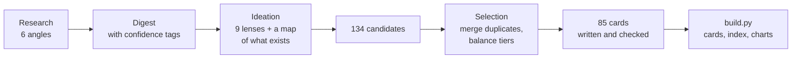

[← Back to the atlas](../README.md)

# How this atlas was made

This page explains where the ideas came from, how they were scored and checked, and the limits of this snapshot.

## The pipeline

1. **Research (September 2026).** Six passes, each with live web search: Apple platform capabilities in iOS 26 and 27; shipped consumer agent apps on iPhone; startups, indie developers and open source; the research frontier and agent protocols; the walls (App Review, sandboxing, background limits, regulation); and demand signals from surveys, forums and underserved groups. Each finding is tagged `verified`, `likely` or `uncertain` with its sources. The raw findings are in [`research/`](../research/).
2. **Ideation.** Nine lenses produced 12 ideas each: life admin and money; health and care; work and small business; the physical world; accessibility and inclusion; family, social and civic life; learning, memory and mind; the agent economy and its second-order effects; and hard-tech moonshots. A separate pass mapped the categories already being built. All 134 candidates are kept in [`data/candidates/`](../data/candidates/).
3. **Selection.** Near-duplicates were merged: for example, three separate "agent memory" ideas became one moonshot. The result is 85 ideas across three tiers, with 8 flagships. The mapping from final IDs to source candidates is in [`data/selection.json`](../data/selection.json).
4. **Card writing and checking.** Each card was written from its candidate, the research digest and the notes on the walls. Every iOS framework or API named on a card was looked up in Apple's documentation with [`scripts/appledoc.py`](../scripts/appledoc.py). Anything that couldn't be verified was either removed or noted in the card's "Research notes" section.
5. **Build.** [`scripts/build.py`](../scripts/build.py) turns [`data/ideas.json`](../data/ideas.json) into the cards, the index and the charts, and CI checks that the generated files are up to date.

This was an AI-assisted research and writing process with live web search and documentation lookups, organized and edited by the maintainer.

## Tiers

| Tier | Test |
|---|---|
| **B · Being built now** | Real products are shipping or clearly in development in 2025–2026. The card is a *category*, with named examples and an honest note on how it's going. |
| **W · Whitespace** | Buildable with today's iOS APIs and models, and a search turned up nothing that does it well. The card lists the nearest things and why they fall short. |
| **M · Moonshot** | Worth wanting, but blocked by a specific wall: a missing iOS API, liability, unsolved research, hardware, or regulation. The card names the wall, what would have to change, and a partial version buildable today. |

## Scores

All scores are integers from 1 to 5 and are judgment calls. Disagreement is welcome in issues and pull requests.

- **Difficulty**: 1 is a weekend with App Intents and a hosted model. 5 needs breakthroughs, platform changes, or partnerships you can't count on.
- **Novelty**: 1 means many apps already do this well. 5 means nobody seems to be doing it.
- **Buildable on iOS today**: 5 means every API exists and App Review would likely approve it. 1 means iOS blocks it.
- **Impact**: how much better life gets for the people it serves, weighted by how many people that is.

## Limits of this snapshot

- **It's a snapshot.** It reflects the week after iOS 27 and Siri AI launched (September 2026). Some Moonshots may move tiers at WWDC 2027.
- **Some sources couldn't be opened.** The research environment blocked many news sites, so some claims rest on search-result summaries. Those are tagged `likely` or `uncertain` in the research files, and the cards say "reported" where it matters.
- **It leans US.** Health, benefits, legal and consumer-protection details are mostly US-specific. The walls page covers the EU, Japan and Brazil where their rules differ.
- **Product facts change fast.** Launch dates, prices, user counts and features of named products are as reported at the time and weren't independently verified unless the card says so.
- **Nothing here is legal, medical or financial advice.** Cards in those areas name their safety lines.
