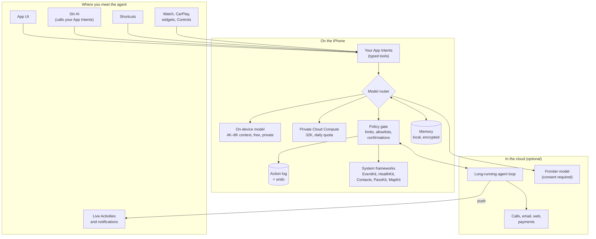
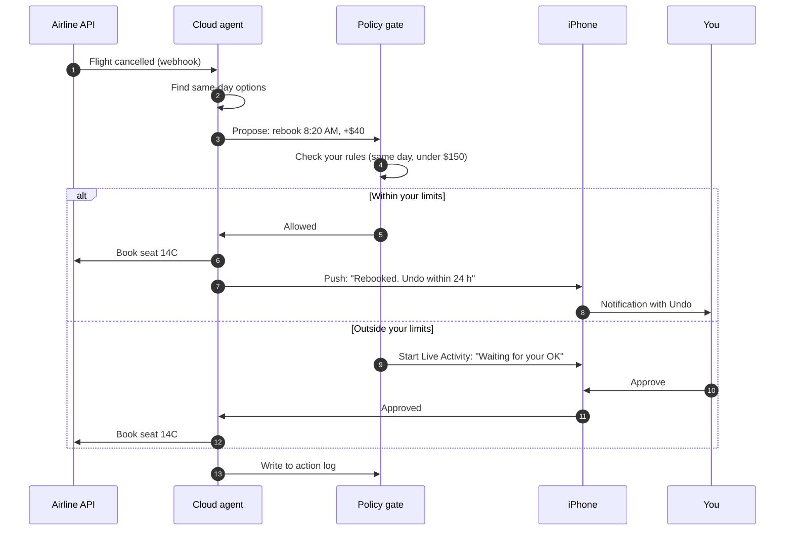
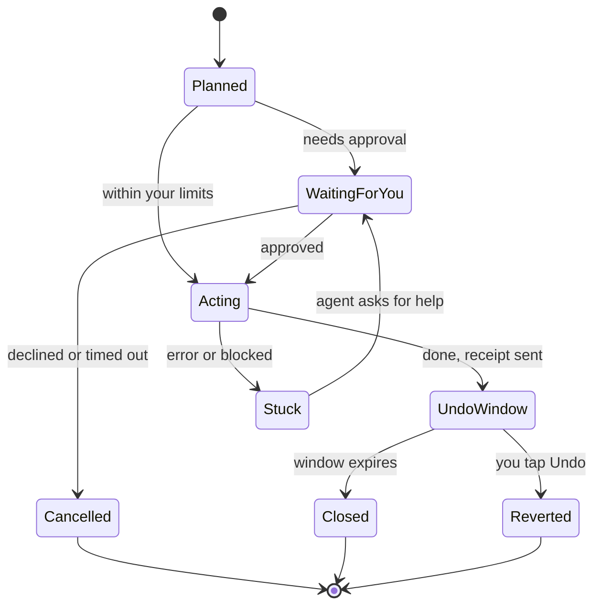
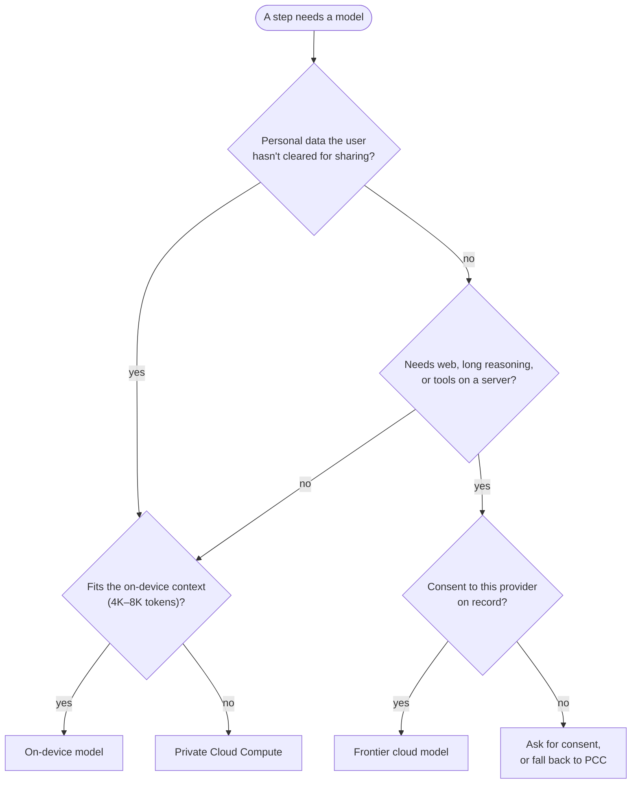

[← Back to the atlas](../README.md)

# Reference architecture

How to build an agentic iPhone app that fits inside [the walls](the-walls.md). This is a pattern, not a framework. Most ideas in this atlas are some version of it.

## The shape

Five parts do the real work:

1. **Typed tools, not screen-tapping.** Every action the agent can take is an App Intent or a Swift function compiled into the app. That's what App Review expects (guideline 2.5.2), what Siri AI can call, and what keeps prompt injection contained.
2. **A model router.** Send private, short tasks to the on-device model. Send longer reasoning to Private Cloud Compute. Send the rest to a frontier model, but only after the user has agreed to share that data with that provider (guideline 5.1.2(i)). The `LanguageModel` protocol in iOS 27 lets all three sit behind the same session API.
3. **A policy gate between the model and the world.** The model proposes; deterministic code decides. Spend caps, recipient allowlists, "always ask before paying", rate limits. The model never gets to decide whether its own action is safe.
4. **An action log with undo.** Every side effect is recorded with the reason, the data it used, and how to reverse it. [`UndoableIntent`](https://developer.apple.com/documentation/appintents/undoableintent) exists for exactly this.
5. **A cloud loop when the job outlives the phone's background limits.** Waiting on hold, watching an inbox for three weeks, retrying a refund. The phone gets push updates and approval requests.

## An action with receipts and undo

A worked example at autonomy level L3, "acts inside your limits, then reports": your flight gets cancelled overnight.

## The life of a task

## Choosing a model for each step

Plan for the failure cases too:

- **Older iPhones.** Apple Intelligence (and so the on-device model and PCC) needs an iPhone 15 Pro or later. Decide what the app does on everything else.
- **Quota reached.** PCC has a per-user daily quota and throws [`quotaLimitReached`](https://developer.apple.com/documentation/foundationmodels/adding-server-side-intelligence-with-private-cloud-compute) when it runs out.
- **Model drift.** The on-device model changes with OS releases. Keep an evaluation set and rerun it on every iOS beta.

## Design rules

These come from the research behind this atlas: Apple's WWDC26 security guidance, agent safety papers, consumer trust surveys, and the failures of shipped products.

1. **Name the provider before sending anything.** A consent sheet that says which model provider gets which data, shown before the first call.
2. **Only compiled, typed tools.** No generated code runs on the phone.
3. **Deterministic confirmation for side effects.** Payments, messages to new people, deletions and public posts go through code-level checks and OS-rendered confirmations, not a question the model writes.
4. **Receipts for everything.** Say what was done, why, with what data, and how to reverse it.
5. **Undo windows.** A reversible action with a 24-hour undo is often better than an approval prompt.
6. **Per-user policies.** "Pay utilities under $200. Never message my boss." A survey of agent permission systems finds most apply the same policy to every user ([paper](https://huggingface.co/papers/2607.13718)).
7. **Mark untrusted content.** Email bodies, web pages and calendar invites are data, never instructions. Label them as untrusted before they reach the model.
8. **Don't render remote links or images in agent output.** That's how EchoLeak-style exfiltration works.
9. **Pause at real choices.** If three options tie, ask. Research with blind users found agents silently picking one ([Morae](https://huggingface.co/papers/2508.21456)).
10. **Check the recipient.** Agents leak personal context, including to the wrong recipient, in most tests ([Agent CI Bench](https://huggingface.co/papers/2606.23189)). Before anything leaves the phone, check who it's going to.
11. **A kill switch and an export.** One tap stops everything. The action log can be exported.
12. **Be boring about reliability.** Small extraction errors, like a wrong date from a school email, helped end a funded startup. Show your sources, and ask when confidence is low.
