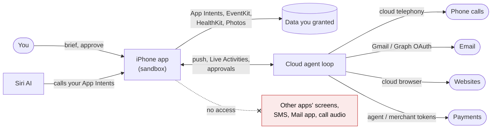

[← Back to the atlas](../README.md)

# The walls

iOS is the most walled platform to build an agent on. Some walls are technical (the sandbox). Some are contractual (App Review). Some are commercial (who pays for the model, who is liable when the agent is wrong). Every idea card in this atlas names the walls it runs into. This page collects them in one place, each with the workaround builders actually use.

Status as of **iOS 27, September 2026**. Where a claim comes from press reports rather than Apple's documentation, it says so.

## The one-sentence version

A third-party iPhone app can't see or drive other apps. It can only act through doors Apple provides. So most serious agents run their loop on a server and use the iPhone to brief the agent, show what it's doing, and ask for approval.

## Technical walls

| Wall | What it means for an agent | What builders do instead |
|---|---|---|
| **No cross-app UI automation** | iOS has no equivalent of Android's AccessibilityService, so an app can't read another app's screen or tap its buttons. Android is going the other way with [AppFunctions](https://developer.android.com/ai/appfunctions) and a computer-control API for preloaded assistants. | Universal links and URL schemes, share and action extensions, [App Intents](https://developer.apple.com/documentation/appintents), user-built Shortcuts, server-side APIs, automating websites inside your own `WKWebView`. |
| **Only Siri calls other apps' intents** | In iOS 27, Siri AI plans across apps using [App Intents and app schemas](https://developer.apple.com/documentation/appintents/app-schema-domains). A third-party agent can be one of Siri's tools, but it can't call another app's intents itself. | Adopt app schemas and donate interactions, so Siri routes tasks to you. |
| **No always-on background loop** | Background refresh is opportunistic. Apple advises sending [no more than two or three silent pushes per hour](https://developer.apple.com/documentation/usernotifications/pushing-background-updates-to-your-app), and each wake gets about 30 seconds. Faking audio or location to stay alive gets an app rejected (guideline 2.5.4). | Run the loop on a server and push to the phone. |
| **Long jobs must be user-started** | [`BGContinuedProcessingTask`](https://developer.apple.com/documentation/backgroundtasks/bgcontinuedprocessingtask) (iOS 26) and [`LongRunningIntent`](https://developer.apple.com/documentation/appintents/longrunningintent) (iOS 27) let work continue in the background. The user has to start it, progress is shown, and the system can cancel it. | Design agent jobs as visible batches ("process these 40 receipts") with honest progress. |
| **Live Activities are bounded** | A Live Activity lasts at most [8 hours active and 12 hours on the Lock Screen](https://developer.apple.com/documentation/activitykit/displaying-live-data-with-live-activities). Since June 2026, guideline 4.5.3 bans using them for spam. | Use them for bounded tasks (a booking in progress, a call on hold). Start a new one for multi-day work. |
| **No SMS or iMessage reading** | Apps can prefill a message with [`MFMessageComposeViewController`](https://developer.apple.com/documentation/messageui/mfmessagecomposeviewcontroller), but the user must tap Send. SMS filter extensions can sort unknown senders but can't act. | Be the messaging service yourself, or run as an agent on Apple Messages for Business (Poke was the first approved AI agent there, June 2026). EU only: become the default SMS/RCS app. |
| **No Mail app API** | [MailKit](https://developer.apple.com/documentation/mailkit) is macOS-only. On iOS an app can't read the Mail app's inbox. | Connect to Gmail or Microsoft Graph over OAuth on a server. Or build your own mail client that users set as default. |
| **No cellular call audio** | No public API records, transcribes or screens cellular calls. Call Screening and Hold Assist (iOS 26) are Apple-only. Recording needs explicit consent and a clear visual or audible indicator (guideline 2.5.14). | Place calls from the cloud (Twilio and similar), or own the audio path in a VoIP app with [CallKit](https://developer.apple.com/documentation/callkit). |
| **Partial personal data** | Users can grant [limited contacts](https://developer.apple.com/documentation/contacts/cnauthorizationstatus/limited), [limited photos](https://developer.apple.com/documentation/photos/phauthorizationstatus/limited), and write-only calendar access. | Ask for access at the moment it's needed. Design agents that work with incomplete context. |
| **Screen Time data can't leave** | Device activity reports run in an extension sandbox that [can't make network requests](https://developer.apple.com/documentation/deviceactivity/deviceactivityreport). A "digital wellbeing agent" can't send usage data to a model in the cloud. | On-device rules and shields; coaching based on what the user tells it. |
| **Small on-device model** | Apple's docs give the on-device model [a 4,096-token context window per session](https://developer.apple.com/documentation/foundationmodels/managing-the-context-window); Apple's [WWDC26 sample](https://developer.apple.com/videos/play/wwdc2026/241/) shows the rebuilt iOS 27 model reporting 8,192, so read `contextSize` on the device. Tool schemas, tool outputs and history all count. Model behavior changes with OS versions. | Split tasks across sessions, retrieve instead of stuffing context, run [Evaluations](https://developer.apple.com/documentation/evaluations) per OS version, escalate to Private Cloud Compute (32K tokens) or a cloud model. |
| **Memory, heat, battery** | Big local models hit per-process memory limits, heat the phone and drain the battery. Background Neural Engine use needs its own entitlement in iOS 27. | Download models with Background Assets, use Core AI or Foundation Models adapters, check thermal state, offload heavy planning. |

## Policy walls (App Review)

| Rule | What it says | Why it matters for agents |
|---|---|---|
| **5.1.2(i)**, November 2025 | Apps must ["clearly disclose where personal data will be shared with third parties, including with third-party AI, and obtain explicit permission before doing so."](https://developer.apple.com/news/?id=ey6d8onl) | Every agent that sends email, photos, calendar or messages to OpenAI, Anthropic or Google needs a consent screen that names the provider *before* the first call. Apple's own on-device model and Private Cloud Compute are presumably not "third-party AI", but Apple hasn't said so explicitly. |
| **2.5.2** and **4.2.6** | Apps may not download or run code that adds or changes features (2.5.2). Apps made with an app-generation service must be submitted by the provider of the app's content (4.2.6). | An agent may fill in parameters for tools that are compiled into the app. It may not write and run new app logic. Apple blocked updates to vibe-coding apps under 2.5.2 in March 2026 (press reports: [MacRumors](https://www.macrumors.com/2026/03/18/apple-blocks-updates-for-vibe-coding-apps/)). |
| **4.7** | Mini apps, chatbots and plug-ins inside an app need content filtering, an index, age gating, and [explicit consent "in each instance"](https://developer.apple.com/app-store/review/guidelines/) before sharing data with any one of them. | An in-app "skills store" or MCP-connector catalog carries all these duties. |
| **5.2.2** | An app that uses a third-party service must be permitted to under that service's terms. | Agents that scrape or drive airline, retail or bank websites risk rejection. Partner APIs are safer. |
| **5.1.1(ix)** | Apps in highly regulated fields (banking, health care, air travel, crypto) should be submitted by the legal entity that provides the service. | A finance or health agent may need a licensed partner as the publisher. |
| **HealthKit rules** | Health data can't be used for ads or data mining, and [can be shared only with a third party that also provides a health or fitness service](https://developer.apple.com/documentation/healthkit/protecting-user-privacy). | Sending HealthKit data to a general-purpose model API is risky. Prefer on-device inference or a health-service vendor. |
| **3.1.1** and US link-outs | Digital subscriptions still use in-app purchase. Since the 2025 Epic v. Apple ruling, US storefront apps may link to web checkout. | Protect model-cost margins with a US web checkout and metered credits. |

## Money walls

- **Apple Pay has no agent API.** Every Apple Pay payment needs the user to authenticate on the payment sheet. The route to pre-authorized charges is [merchant tokens](https://developer.apple.com/documentation/passkit/pkrecurringpaymentrequest) (recurring, deferred or automatic reload payment requests), where your agent service is the merchant charging within agreed terms.
- **The agent-payment rails exist, but not on Apple's side.** Mastercard Agent Pay, Visa Intelligent Commerce, Google's AP2 and Universal Commerce Protocol, and OpenAI and Stripe's Agentic Commerce Protocol all shipped in 2025–2026. None has an Apple Pay integration.
- **Checkout inside the agent has retreated.** OpenAI dropped ChatGPT Instant Checkout in March 2026 after Walmart saw in-chat checkout convert about 3× worse than a click-through (reported by [MacRumors](https://www.macrumors.com/2026/03/25/chatgpt-revamps-shopping-features/)). Gemini Spark loads the checkout page but won't press Pay.
- **Liability is unsettled.** When an agent buys the wrong thing, who pays? Card-network token rules, chargebacks and consumer-protection law haven't caught up.
- **Private Cloud Compute is free, with limits.** Apple's server model is free for [developers in the Small Business Program with fewer than 2 million first-time downloads](https://developer.apple.com/private-cloud-compute/). Each user has a daily quota. Cross the threshold and you have six months to move to another provider.

## Regional doors

Regulation is opening doors one region at a time:

- **EU (Digital Markets Act):** a default SMS/RCS app can send and receive messages, a default dialer can place calls without a confirmation prompt, and accessory apps can receive forwarded notifications ([Accessory Notifications](https://developer.apple.com/documentation/accessorynotifications), iOS 26.5). Siri AI isn't available on iPhone in the EU at launch.
- **Japan (Mobile Software Competition Act):** since [iOS 26.2](https://developer.apple.com/support/app-distribution-in-japan/), users can put a third-party voice assistant on the side button.
- **Brazil:** alternative app marketplaces and payments from iOS 26.5.

## Security walls

Prompt injection is the unsolved problem. An agent that reads untrusted content (email, web pages, calendar invites, notifications) and can also act or send is exposed.

- [EchoLeak (CVE-2025-32711)](https://huggingface.co/papers/2509.10540): one crafted email made Microsoft 365 Copilot leak internal data with zero clicks.
- A 2026 study of OpenClaw found that poisoning the agent's stored state raised attack success from 24.6% to 64–74% ([paper](https://huggingface.co/papers/2604.04759)).
- [Agent CI Bench](https://huggingface.co/papers/2606.23189): most of the 15 frontier computer-use agents tested leaked personal context in more than half the scenarios, including by sending it to the wrong recipient.
- Apple's WWDC26 guidance is to put deterministic checks in front of risky tool calls (the Foundation Models `onToolCall` hook), mark untrusted content, and require authentication for sensitive App Intents.

iOS's lack of UI automation shrinks this attack surface as a side effect. An agent that can't tap buttons in your banking app can't be tricked into tapping them.

## What would change the picture

Things to watch. Any one of these would move ideas from the Moonshot tier toward Whitespace:

1. **MCP or an equivalent for App Intents.** Code in the iOS 26.1 beta hinted at it ([9to5Mac](https://9to5mac.com/2025/09/22/macos-tahoe-26-1-beta-1-mcp-integration/)). In iOS 27, Apple shipped MCP only as a developer bridge in Xcode.
2. **Third-party model "Extensions" for Siri.** Reported for iOS 27 but, as of September 2026, only ChatGPT is live.
3. **An agent payment primitive in Apple Pay.** Nothing announced.
4. **A public call-handling API.** Hold Assist and Call Screening show Apple can do it. Third parties can't yet.
5. **EU-style interoperability spreading.** The DMA and Japan's law show regulators can force doors open, one country at a time.
