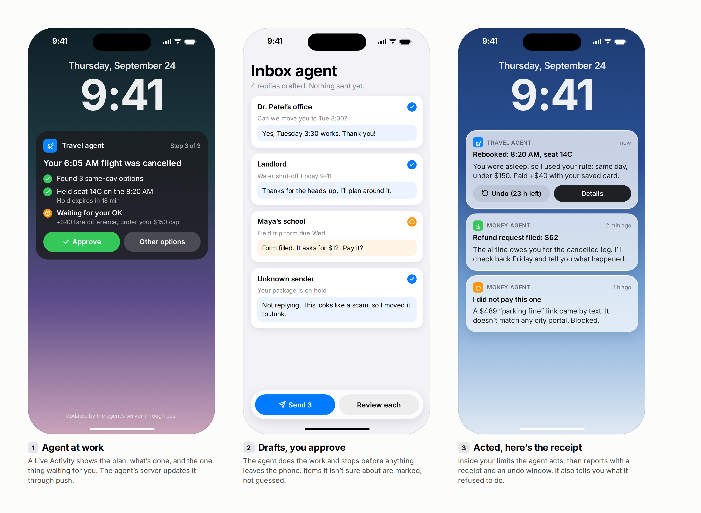

[← Back to the atlas](../README.md)

# Agent UI patterns for iPhone

Agents need a few screens that ordinary apps don't: one that shows the agent working, one where you approve its work, and one that reports what it did and lets you undo it. These three patterns, plus the eight flagship mockups, show how those screens can look on iOS 27.

The designs live in the Figma file [Agentic iOS Apps — Idea Atlas](https://www.figma.com/design/FWoProYYQvSGluivc9NX5m) (pages "Agent UI patterns" and "Flagship mockups"). The PNGs in this repo are rendered from a local copy of the same layouts by [`scripts/mockups/render.mjs`](../scripts/mockups/render.mjs), so they can be regenerated without Figma. Mockups use Inter as a stand-in for SF Pro.

## Which pattern goes with which rung

| Autonomy rung | Pattern | iOS surface | Key APIs |
|---|---|---|---|
| L1 · Suggests | A nudge with one clear action | Notification, widget, Spotlight | [UserNotifications](https://developer.apple.com/documentation/usernotifications), [WidgetKit](https://developer.apple.com/documentation/widgetkit) |
| L2 · Drafts, you approve | **Drafts, you approve** | In-app sheet, Siri interactive snippet | [`SnippetIntent`](https://developer.apple.com/documentation/appintents/snippetintent), `requestConfirmation` in App Intents |
| L3 · Acts, then reports | **Acted, here's the receipt** | Notification with actions | Notification actions, [`UndoableIntent`](https://developer.apple.com/documentation/appintents/undoableintent) |
| L3–L4 · Long-running work | **Agent at work** | Live Activity, Dynamic Island, Watch Smart Stack | [ActivityKit](https://developer.apple.com/documentation/activitykit) with push updates, [`LongRunningIntent`](https://developer.apple.com/documentation/appintents/longrunningintent) |

## 1 · Agent at work

A Live Activity shows the plan, the steps that are done, and the one thing waiting for you. The agent's server updates it through ActivityKit push notifications, so the app doesn't need to be running.

- **Do** show progress as a short list of steps with their state, not a spinner.
- **Do** put the single decision the agent needs in the activity itself, with the cost and the rule it's under ("+$40, under your $150 cap").
- **Don't** use it for anything that isn't a bounded task. A Live Activity lasts at most 8 hours active (12 on the Lock Screen), and since June 2026 App Review guideline 4.5.3 bans using Live Activities for spam.

## 2 · Drafts, you approve

The agent does the work and stops before anything leaves the phone. It marks what it isn't sure about instead of guessing, and it says so when it chose *not* to do something ("Not replying. This looks like a scam").

- **Do** make bulk approval possible ("Send 3") while keeping the uncertain items out of it.
- **Do** show the draft itself, not a summary of it.
- **Don't** let the model write its own confirmation question. Put the check in code and show it in UI the system or your app controls. Apple's WWDC26 guidance on securing agentic features makes the same point.

## 3 · Acted, here's the receipt

Inside the limits you set, the agent acts and then reports: what it did, which rule allowed it, what it cost, and how long you have to undo it. It also reports what it refused to do. That builds trust faster than anything it did do.

- **Do** attach Undo to the receipt with a visible deadline.
- **Do** name the rule that authorized the action.
- **Don't** hide failures and refusals in a log. They belong in the same stream as successes.

## Flagship mockups

One screen per flagship idea, showing the moment the agent earns its keep.

| | Idea | What the screen shows |
|---|---|---|
| B-05 | [Trip rebooking](../ideas/building-now/B-05-trip-rebooking-agents.md) | Three options ranked against your rule, one held and recommended |
| B-18 | [Scam-call guardian](../ideas/building-now/B-18-scam-call-guardians.md) | A screened call, a family "is it really you?" check, and a note to a relative |
| W-01 | [Denial Clock](../ideas/whitespace/W-01-denial-clock.md) | The insurer's legal deadline as a countdown, the case timeline, a drafted appeal |
| W-02 | [Night-Before Check](../ideas/whitespace/W-02-night-before-check.md) | Tomorrow's plans re-checked against their source messages, one mismatch caught |
| W-03 | [Agent Control Tower](../ideas/whitespace/W-03-agent-control-tower.md) | Every agent's pending approvals in one list, with undo and a pause-all button |
| M-01 | [Seconds-Ahead Hazard Voice](../ideas/moonshot/M-01-seconds-ahead-hazard-voice.md) | A high-contrast warning that arrives before the hazard |
| M-02 | [Household Spending Constitution](../ideas/moonshot/M-02-household-spending-constitution.md) | Spending rules signed with Face ID that every agent must follow |
| M-03 | [Fading Whisper](../ideas/moonshot/M-03-fading-whisper.md) | A conversation prompter whose help level drops each week |
