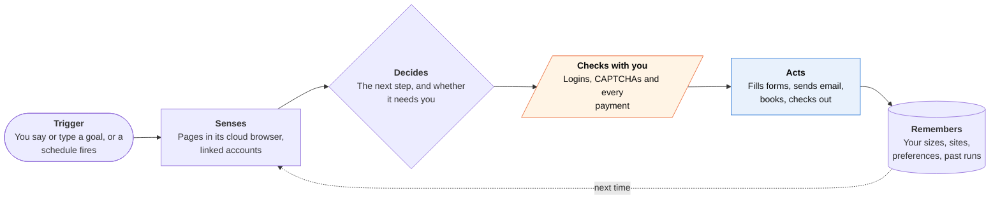

<!-- Generated by scripts/build.py from data/ideas.json. Edit the JSON, then run the script. -->

[← All ideas](../README.md) · **Being built now** · Life admin

# B-01 · Cloud-computer errand agents

> Tell one app a goal; it works in a cloud browser and pings your iPhone for logins and the Pay button.

| Difficulty | Novelty | Buildable on iOS today | Impact if it works | Horizon | Autonomy |
|---|---|---|---|---|---|
| `●●●●○` 4/5 | `●○○○○` 1/5 | `●●●●○` 4/5 | `●●●●○` 4/5 | Buildable now | L2 · Drafts, you approve |

## The moment

It is Sunday night and you have three errands: return a jacket, book a haircut, renew a parking permit. You dictate them into one app, lock the phone, and a Live Activity ticks through each one while the agent works in its own cloud browser. It stops twice: once for a password, once before paying.

## The problem

Small online errands each take ten minutes of logins, forms and hunting for the right page, and they pile up. Chat assistants can explain how to do them but not do them. An iPhone app cannot operate Safari or other apps, so any agent that clicks through websites has to run somewhere else and still needs you at the risky moments.

## How the agent works

## iOS building blocks

- **ActivityKit (Live Activities, push-to-start)** — shows each step of a cloud run on the Lock Screen, started by the server
- **UserNotifications (UNNotificationAction)** — approval prompts with Approve and Decline buttons
- **App Intents (App Shortcuts, SnippetIntent)** — start an errand from Siri or the Action button and confirm it in an interactive snippet
- **AuthenticationServices (ASWebAuthenticationSession)** — OAuth into mail, calendar and store accounts without handing over passwords
- **LocalAuthentication** — Face ID before a payment or a shared login
- **CryptoKit (SecureEnclave)** — signs each approval so the server can prove it came from your phone

## What makes it hard

- Long runs break. Sites change layouts, time out and throw CAPTCHAs; CNN's test of Muse saw a purchase stall at a store that required a professional licence.
- Logins. Many sites block cloud-browser traffic or send 2FA codes by SMS, which a third-party iOS app cannot read, so the user has to relay codes or approve each sign-in by hand.
- The phone cannot host the loop. Every state change has to come back by push, and a Live Activity lasts at most 8 hours, so multi-day errands fall back to plain notifications.
- Cost. A long run on a frontier model in a cloud VM costs real money per task, while Meta, OpenAI and Google bundle the same thing into free or $20 plans.

## Risks and failure modes

- Prompt injection: a page or email the agent reads can tell it to send data or buy something. Confirmations must be drawn by the app from the real action, not written by the model.
- One service holds sessions and cookies for many accounts, so one breach exposes all of them.
- Many sites forbid automated access in their terms, and App Review guideline 5.2.2 expects apps to have permission to use the third-party services they act on.

## Unsaid assumptions

_What this idea quietly depends on being true. Check these before you build._

- People will hand one company the logins to many services, as long as money and passwords still need their tap.
- Websites keep tolerating agent traffic instead of blocking it or demanding agent-only APIs.
- The cost of a 30-step run keeps falling fast enough to fit inside a consumer subscription.

## Unknown unknowns

_Open questions nobody has good answers to yet._

- Who pays when the agent submits the wrong form or buys the wrong item?
- Will Apple ever let a third-party agent act in Safari, the way its own Passwords agent changes passwords?
- Does one general agent keep winning once each errand type has a specialist app?

## Prior art and who's building

- [Meta Muse](https://9to5mac.com/2026/09/17/meta-ai-launches-muse-personal-agent-including-a-new-mobile-app-for-iphone/) — Email, travel, forms, checkout with one-time cards and business calls from Meta's cloud computer; US and 18+ only.
- [ChatGPT agent and Work tab](https://techcrunch.com/2026/09/23/chatgpt-mobile-app-gets-voice-based-agentic-features/) — Cloud-browser tasks started by voice on iPhone since Sept 23, 2026; Work tab is for Plus and Pro.
- [Gemini Spark](https://support.google.com/gemini/answer/17094507?hl=en&co=GENIE.Platform%3DiOS) — 24/7 agent across Gmail, Docs and signed-in sites; loads checkout pages but hands payment back to you. Pro and Ultra only.
- [Manus](https://apps.apple.com/us/app/manus-ai-agent-automation/id6740909540) — Virtual-computer agent whose iPhone app shows every step; bought by Meta in December 2025.
- [Genspark Super Agent](https://apps.apple.com/us/app/genspark-super-ai-agent/id6739554054) — 80+ tools including Call for Me; strong on documents and research, less on logged-in errands.

## Smallest useful first version

Pick one errand family with stable web flows, such as returns and exchanges at the 50 biggest US retailers. Run it in a cloud browser, stream each step to a Live Activity, and stop for login and a Face ID approval before any submit. Keep a replayable screenshot log of every run.

Research notes: what we could and couldn't verify

Muse download and chart figures come from 9to5Mac and other press, not Apple. The CNN Muse test (https://www.cnn.com/2026/09/23/tech/meta-muse-ai-agent) is cited from the research notes; I did not open it. The Manus price (reported $2B+) is unconfirmed.

## Related ideas

- [B-25 · Pocket supervision of work agents](../building-now/B-25-pocket-agent-supervision.md)
- [W-03 · Agent Control Tower](../whitespace/W-03-agent-control-tower.md)
- [W-09 · Pause-and-Ask Errands](../whitespace/W-09-pause-and-ask-errands.md)
