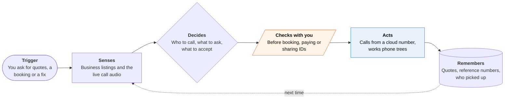

<!-- Generated by scripts/build.py from data/ideas.json. Edit the JSON, then run the script. -->

[← All ideas](../README.md) · **Being built now** · Life admin

# B-02 · Phone-call errand agents

> An agent phones businesses from a cloud number to get quotes, hold slots and wait on hold, then reports back.

| Difficulty | Novelty | Buildable on iOS today | Impact if it works | Horizon | Autonomy |
|---|---|---|---|---|---|
| `●●●○○` 3/5 | `●○○○○` 1/5 | `●●●●○` 4/5 | `●●●●○` 4/5 | Buildable now | L3 · Acts in guardrails, reports back |

## The moment

Your car needs brakes and you hate calling around. You give the agent the car, your zip code and a budget. Twenty minutes later you have three shop quotes and a Thursday slot on hold, and you never dialed.

## The problem

Many small businesses still give quotes and bookings only by phone. Calling around eats an afternoon of phone trees, hold music and repeating your details. iOS gives third-party apps no way to place or listen to cellular calls, and Apple's own Hold Assist only waits; it never talks.

## How the agent works

## iOS building blocks

- **MapKit (MKLocalSearch)** — finds nearby businesses and their phone numbers to build the call list
- **ActivityKit (Live Activities)** — shows dialing, on hold and talking states on the Lock Screen
- **UserNotifications** — delivers results and asks before the agent commits to anything
- **App Intents** — start a call task from Siri or the Action button
- **LiveCommunicationKit** — lets you join the cloud call over VoIP when the business insists on the customer

## What makes it hard

- Calls have to come from cloud telephony (Genspark runs on Twilio), so caller ID shows an unknown number that busy shops ignore or that carriers may label as spam.
- Handoff. When a clerk needs the customer, the agent has to bridge you in over VoIP within seconds or the call is lost.
- Identity checks. Account PINs, last-four digits and 'are you the account holder?' stop the agent cold unless the user is patched in.
- Recording and transcription rules differ by US state, and some states require every party to agree before a call is recorded.

## Risks and failure modes

- The agent must say it is an AI calling for a customer. Letting it pass as the customer invites fraud claims and angry businesses.
- Accidental commitments: a 'hold' turns into a booking with a cancellation fee. Keep holding and booking as separate, approved steps.
- Businesses may start blocking agent calls or answering with their own AI, turning calls into bot-to-bot loops.

## Unsaid assumptions

_What this idea quietly depends on being true. Check these before you build._

- Businesses keep answering calls from AI agents instead of blocking them or putting their own AI receptionist on the line.
- Real-time voice stays cheap enough to spend 30 minutes on hold for one task.

## Unknown unknowns

_Open questions nobody has good answers to yet._

- Will carrier spam labeling start flagging agent calls at scale?
- How often does a call end up needing the human after all, and do users pick up when patched in?
- Will Apple ever open Hold Assist or call audio to third-party apps?

## Prior art and who's building

- [Google 'Let Google Call'](https://blog.google/products-and-platforms/products/shopping/how-to-agentic-calling-let-google-call/) — Calls local businesses about prices and availability from Search; grew out of the 'Ask for Me' Labs test. Information calls only.
- [Genspark Call for Me](https://www.genspark.ai/helpcenter/call-for-me) — Multilingual outbound calls for bookings and customer service, on Twilio Programmable Voice.
- [Meta Muse calls](https://9to5mac.com/2026/09/17/meta-ai-launches-muse-personal-agent-including-a-new-mobile-app-for-iphone/) — Outbound calls to US businesses switched on around Sept 17, 2026, inside a general agent.
- [Assindo](https://assindo.com/news/never-wait-on-hold-ai-phone-calls) — Consumer call agent that waits on hold and works IVR menus on iOS, Android and web; claims are from its own site.

## Smallest useful first version

Quote calls only. The user names a service and an area; the agent calls up to five local shops from a cloud number with a fixed script and returns a comparison table. It never books; it only asks a shop to hold a slot for an hour, with a one-tap VoIP join if the shop wants the customer.

Research notes: what we could and couldn't verify

The Muse call launch date (about Sept 17, 2026) comes from 9to5Mac. Assindo's features are self-described. The Genspark and Twilio link comes from a Business Wire release listed in the research notes.

## Related ideas

- [B-08 · Bill-fighting and cancel agents](../building-now/B-08-bill-fighting-agents.md)
- [W-07 · Deaf-First Call Agent](../whitespace/W-07-deaf-first-call-agent.md)
- [M-16 · Mid-Call Voice Stand-In](../moonshot/M-16-mid-call-voice-stand-in.md)
