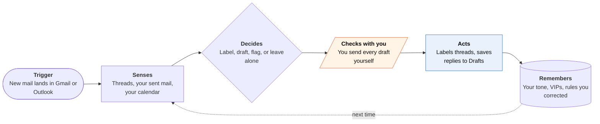

<!-- Generated by scripts/build.py from data/ideas.json. Edit the JSON, then run the script. -->

[← All ideas](../README.md) · **Being built now** · Work & business

# B-03 · Inbox triage-and-draft agents

> An agent sorts your mail, writes replies in your voice and leaves them in Drafts for you to send.

| Difficulty | Novelty | Buildable on iOS today | Impact if it works | Horizon | Autonomy |
|---|---|---|---|---|---|
| `●●○○○` 2/5 | `●○○○○` 1/5 | `●●●●○` 4/5 | `●●●●○` 4/5 | Buildable now | L2 · Drafts, you approve |

## The moment

You open your mail app at 7am and 14 replies are already drafted in your tone. You fix one sentence, send nine, and see that the agent filed the newsletters and flagged the one invoice that needs you.

## The problem

Email is a stream of small decisions: reply, file, pay or ignore. Most AI mail features summarize and leave the work to you. On iPhone, no app can read Mail.app (MailKit is macOS-only), so an inbox agent must connect to Gmail or Outlook servers directly or be your mail client.

## How the agent works

## iOS building blocks

- **AuthenticationServices (ASWebAuthenticationSession)** — OAuth sign-in to Gmail or Microsoft Graph for the server-side agent
- **UserNotifications** — pushes only the few threads that need you
- **App Intents mail schema (AppSchema.MailIntent: createDraft, sendDraft)** — lets Siri AI act on drafts, but only if the app is itself the mail client
- **WidgetKit** — a Home Screen count of drafts waiting and threads that need you

## What makes it hard

- Gmail's read and draft scopes are restricted: Google requires app verification and a recurring third-party security assessment before a public app can read mail.
- Sounding like you. Drafts need your sent mail as examples and a way to learn from your edits without mixing in anyone else's mail.
- Prompt injection through mail. An incoming message can carry instructions; the EchoLeak flaw (CVE-2025-32711) showed one crafted email could make Microsoft 365 Copilot leak data.
- No iOS mail hook. The agent runs on a server and writes into your mailbox; the phone only gets pushes and a review screen.

## Risks and failure modes

- A draft that promises something you never agreed to, sent in a hurry. Sending should stay a human tap by default.
- Mail holds password resets and bank alerts, so a breach of the agent is an account-takeover risk.
- App Review guideline 5.1.2(i) requires naming the AI provider and getting consent before mail content goes to a third-party model.

## Unsaid assumptions

_What this idea quietly depends on being true. Check these before you build._

- Google and Microsoft keep granting broad read-and-draft API scopes to third-party agents.
- People actually read drafts before sending instead of rubber-stamping them.

## Unknown unknowns

_Open questions nobody has good answers to yet._

- Will Gmail's own AI Inbox make third-party triage redundant for most people?
- What share of drafts get sent unedited, and does it hold after the first month?

## Prior art and who's building

- [Superhuman Go](https://www.grammarly.com/blog/company/superhuman-go-new-partner-agents/) — Directs first-party and partner agents (Box, Gamma and others) and has an iOS app; built for heavy email users.
- [Gmail AI Inbox](https://fortune.com/2026/01/08/google-ai-inbox-gmail-gemini-3-integration-email-new-view-features/) — Summaries, topics and to-dos inside Gmail; went to trusted testers first in January 2026.
- [Fyxer](https://tldv.io/blog/fyxer-ai-review/) — Sorts and drafts inside Gmail and Outlook; no iPhone app, but its drafts show up in any mail app.
- [Shortwave](https://www.usecarly.com/blog/fyxer-vs-shortwave/) — AI-native Gmail client with a multi-step assistant; web-first.

## Smallest useful first version

A server-side Gmail connector that sorts each new thread into four buckets and drafts replies only to people you have written to before. The iPhone app shows a morning stack of drafts to send, edit or discard with a swipe. The agent never sends anything itself.

Research notes: what we could and couldn't verify

Fyxer and Shortwave details come from review blogs, not the companies. I did not re-check the current terms of Google's restricted-scope security assessment (CASA); the wording is kept general on purpose.

## Related ideas

- [B-04 · Scheduling negotiator agents](../building-now/B-04-scheduling-negotiators.md)
- [B-13 · Messaging-native personal agents](../building-now/B-13-messaging-native-agents.md)
- [W-05 · Dread Opener](../whitespace/W-05-dread-opener.md)
