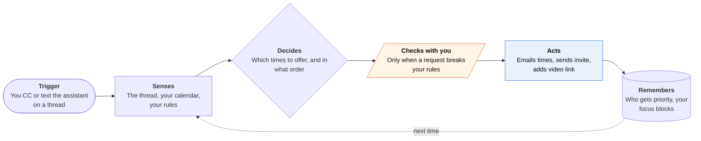

<!-- Generated by scripts/build.py from data/ideas.json. Edit the JSON, then run the script. -->

[← All ideas](../README.md) · **Being built now** · Work & business

# B-04 · Scheduling negotiator agents

> CC or text an assistant; it trades times with the other side, sends the invite and chases replies.

| Difficulty | Novelty | Buildable on iOS today | Impact if it works | Horizon | Autonomy |
|---|---|---|---|---|---|
| `●●○○○` 2/5 | `●●○○○` 2/5 | `●●●●○` 4/5 | `●●●○○` 3/5 | Buildable now | L3 · Acts in guardrails, reports back |

## The moment

A client emails asking to meet next week. You reply-all, copy your scheduling assistant with 'find 30 minutes', and go back to your run. By lunch the invite is on both calendars with a video link and a note about the time zone.

## The problem

Finding a time takes three to six messages, and each one waits on somebody. Booking links push the work onto the other person, and some find them rude. AI calendars that rearrange your week mostly plan on a laptop, and their iPhone apps only view and edit.

## How the agent works

## iOS building blocks

- **EventKit (EKEventStore)** — reads free time and writes the final event to the phone's calendars
- **App Intents calendar schema (AppSchema.CalendarIntent: createEvent, updateEvent)** — lets Siri AI hand scheduling requests to the app
- **UserNotifications** — asks rule-clash questions with quick-answer buttons
- **AuthenticationServices (ASWebAuthenticationSession)** — OAuth to Google Calendar or Microsoft Graph for server-side availability

## What makes it hard

- Replies arrive while the phone sleeps, so the agent has to run on a server against Google or Microsoft calendars; on-device EventKit is only a mirror.
- Time zones, travel time and soft holds are where these agents embarrass you. One wrong offer costs more than five manual emails.
- The other side is more and more often an agent too. Two assistants can loop, double-book or each wait for the other to propose.
- Texting is gated: a native iMessage thread for a business agent needs Apple Messages for Business approval (Poke was the first AI agent approved, in June 2026).

## Risks and failure modes

- Leaking your schedule: offered times, event titles or other attendees reveal more than you meant to share.
- Commitments in your name to the wrong person or at the wrong hour, especially across time zones.

## Unsaid assumptions

_What this idea quietly depends on being true. Check these before you build._

- The other side accepts negotiating with an assistant, and will more and more often be one.
- People keep their calendars accurate enough for an agent to trust what looks free.

## Unknown unknowns

_Open questions nobody has good answers to yet._

- When both sides have agents, who proposes, and what shared protocol will they use?
- Will Siri AI's calendar actions turn standalone scheduling assistants into a feature instead of a product?

## Prior art and who's building

- [Howie](https://howie.com/) — Scheduling assistant with its own email address and phone number; negotiates over email and iMessage. Reports 1,000+ paying customers.
- [Motion](https://efficient.app/compare/motion-vs-reclaim) — Auto-scheduling calendar; its iPhone app views and edits while the planning engine runs on desktop.
- [Reclaim.ai](https://get-alfred.ai/blog/best-ai-calendar-assistants) — Habit and focus-time blocking; no native iOS app.
- [Claude on iOS (Calendar)](https://support.claude.com/en/articles/11869619-use-claude-with-ios-apps) — Creates and edits Calendar events on the phone, but does not negotiate with other people.
- [Clockwise](https://get-alfred.ai/compare/motion-vs-clockwise) — Team calendar optimizer, reportedly shut down in March 2026.

## Smallest useful first version

An email address you CC. It reads the thread, checks your Google Calendar over the API, offers three times in one reply and sends the invite when the other side picks one. The iPhone app lists open negotiations and asks you only when a request breaks a rule you set.

Research notes: what we could and couldn't verify

The Clockwise shutdown and its purchase by Salesforce come from a comparison blog and are unconfirmed. Howie's customer and meeting counts are self-reported. The candidate said Reclaim is owned by Dropbox; I did not re-verify that, so I left it out.

## Related ideas

- [B-03 · Inbox triage-and-draft agents](../building-now/B-03-inbox-triage-drafts.md)
- [B-12 · Family logistics agents](../building-now/B-12-family-logistics-agents.md)
- [B-13 · Messaging-native personal agents](../building-now/B-13-messaging-native-agents.md)
