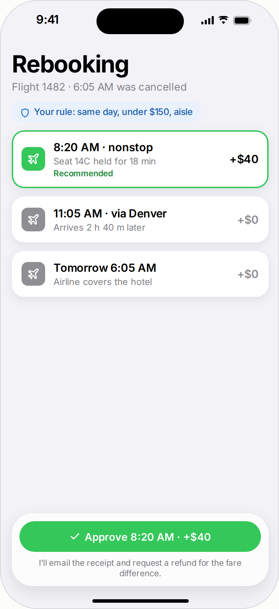
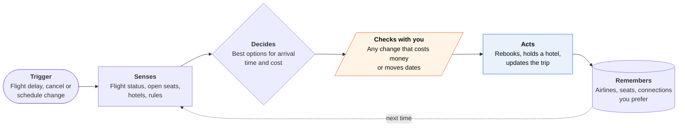
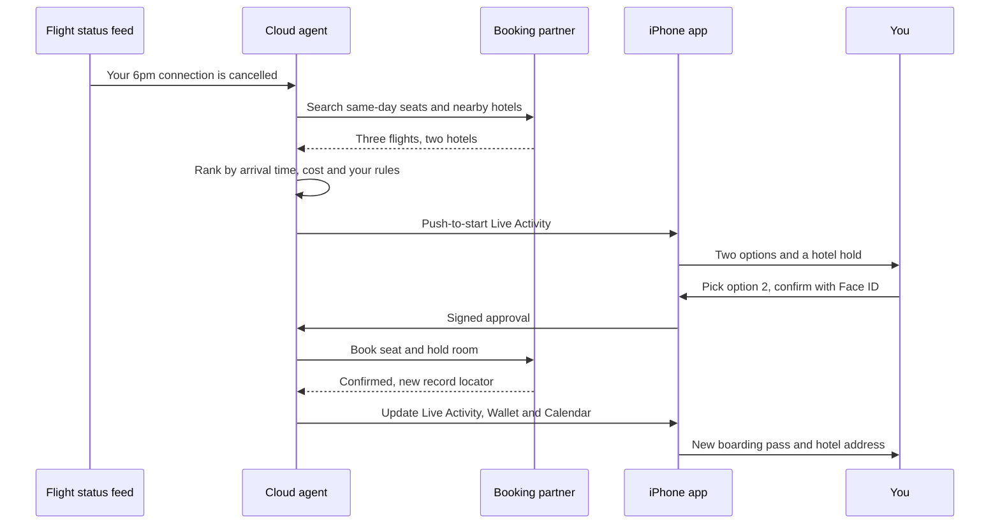

<!-- Generated by scripts/build.py from data/ideas.json. Edit the JSON, then run the script. -->

[← All ideas](../README.md) · **Being built now** · Physical world

# B-05 · Trip booking and rebooking agents

> Agents that search and book trips and, when a flight dies, propose a rebooking before you reach the desk.

| Difficulty | Novelty | Buildable on iOS today | Impact if it works | Horizon | Autonomy |
|---|---|---|---|---|---|
| `●●●○○` 3/5 | `●●○○○` 2/5 | `●●●○○` 3/5 | `●●●○○` 3/5 | Buildable now | L2 · Drafts, you approve |

## The moment

Your 6pm connection is cancelled while you are still in the air. When you land, a notification already lists two rebooking options and a hotel hold near the airport. You tap the second one, confirm with Face ID, and walk past the rebooking line.

## The problem

Booking a trip is a solved search problem; fixing one that breaks is not. After a cancellation you race hundreds of other passengers through a phone queue, the airline app and the desk. Travel apps tell you the flight is cancelled but rarely hold a seat or a room, and the airline's automatic rebooking picks what suits the airline.

## How the agent works

## Deep dive

Trip disruption is the clearest case of the pattern most iPhone agents now follow. A server watches and does the work. The phone is where you see the problem and say yes. The window to act is short and a wrong move costs a night in an airport, so every weak spot in the design shows.

The phone never hosts the loop. iOS will not keep an app running for hours, so the agent lives on a server that follows flight status. The phone gets a push-to-start Live Activity, which appears even when the app is not running. After Face ID, the app signs the approval with a Secure Enclave key, so the server can prove the yes came from this phone and not from a stolen session.

### What the first 90 days look like

- Weeks 1-4: import trips from forwarded confirmation emails and watch every leg. Measure how many minutes ahead of the airline's own alert you spot a problem.
- Weeks 5-8: on a cancellation or long delay, show ranked options with deep links to the airline's rebooking page, and hold a hotel room through a booking partner. The traveller still makes the ticket change in the airline's app.
- Weeks 9-12: sign an agency partner that can change tickets for one or two carriers, and turn on one-tap rebooking for them. Track how often travellers take the first option, and how often the airline's automatic rebooking was better.

### The hardest engineering problem

Keeping one true version of the trip while three parties change it. The airline often rebooks you on its own within minutes. Your agent is proposing something else. The traveller may be at the desk doing a third thing. The agent has to reconcile all of that before it books, or someone ends up with two tickets or none. That takes idempotent booking calls, holds that expire on a timer, a fresh check of the ticket right before any change, and a log of which record locator is live. The agent also has to know when not to act. Under US rules, accepting a new flight after a cancellation can mean giving up the cash refund the traveller was owed, so "take the refund and book elsewhere" must stay on the menu.

### How it makes money

- Booking commissions and hotel affiliate fees on the rebooked flight and the emergency room.
- A yearly subscription for frequent travellers, priced like a lounge pass.
- Deals with card issuers and travel insurers, which pay out less when stranded travellers are rebooked fast.

## iOS building blocks

- **ActivityKit (Live Activities, push-to-start)** — a disruption card on the Lock Screen and Watch with options and countdowns
- **UserNotifications (time-sensitive interruption level)** — breaks through Focus when a flight is cancelled
- **LocalAuthentication** — Face ID on any change that costs money
- **CryptoKit (SecureEnclave)** — signs the approval so the server can verify it came from your phone
- **PassKit (PKPass, PKDeferredPaymentRequest)** — updates boarding passes in Wallet and sets up an Apple Pay hotel hold
- **EventKit** — moves flight and hotel events when the plan changes
- **App Intents (AppEntity, IndexedEntity)** — exposes trips and legs to Siri AI, as Tripsy does

## What makes it hard

- Write access. Changing a ticket needs airline or agency access (NDC or a GDS). A plain consumer app can only relay the carrier's offer or deep-link into its app.
- Speed. Seats go within minutes of a mass cancellation, so the agent needs status and inventory faster than the airline's own push.
- App Review guideline 5.1.1(ix) says apps in regulated fields such as air travel must be submitted by the entity that provides the service, so a booking agent must be, or partner with, a licensed seller.
- The airline often rebooks you automatically first, and the agent has to reconcile that before proposing anything.

## Risks and failure modes

- Two tickets or none, if the agent books a new flight without cleanly releasing the old one.
- Under US rules, accepting a rebooking after a cancellation can waive the cash refund the traveller was owed; the agent must show that trade-off.
- The agent turns into a messenger for the airline's offer and misses better fixes, such as another airline or a train.

## Unsaid assumptions

_What this idea quietly depends on being true. Check these before you build._

- Airlines will let a third-party agent change a ticket rather than routing every change through their own app.
- Stressed travellers will trust one Face ID tap to spend money on a new plan.

## Unknown unknowns

_Open questions nobody has good answers to yet._

- Will airlines expose rebooking offers to outside agents through NDC or agent protocols?
- Who is liable when the agent's rebooking breaks a connection the airline would have protected?
- Will 'self-healing' trips come from booking platforms like Expedia, or from independent agents?

## Prior art and who's building

- [Expedia + Layla](https://ir.expediagroup.com/news-and-events/news/news-details/2026/Expedia-Group-acquires-Layla-accelerating-its-AI-powered-trip-planning-and-booking-strategy/default.aspx) — Conversational planner and booker bought in July 2026; 'self-healing' trips are planned, not shipped, and tied to Expedia inventory.
- [Google AI Mode hotel booking](https://skift.com/2026/08/27/googles-agentic-hotel-booking-tool-comes-to-ai-mode/) — Agentic hotel booking in Search since August 2026; booking, not disruption handling.
- [Meta Muse travel](https://www.phocuswire.com/news/technology/meta-launches-ai-agent-travel-booking) — Books flights through the Duffel API inside a general agent; no reported disruption monitoring.
- [Hopper HTS Assist](https://venturebeat.com/infrastructure/hoppers-ai-agent-can-book-flights-and-cancel-trips-without-human-help) — Cancels, refunds and rebooks through airline systems without a human, but is sold to travel businesses rather than working for the traveller.

## Smallest useful first version

Watch flights the user forwards by email. On a cancellation or long delay, pull same-day options from a flight data API, rank them by arrival time, and push a Live Activity with two choices and deep links to the airline's own rebooking page. Add a one-tap hotel hold through a booking partner before attempting any ticket changes.

Research notes: what we could and couldn't verify

That Muse uses Duffel comes from PhocusWire; I did not check it independently. Expedia's 'self-healing' trips wording comes from Expedia and Skift coverage. Hopper HTS Assist details come from VentureBeat. The US refund point describes DOT's general cancellation-refund rule and is not tied to one source in the research notes.

## Related ideas

- [B-01 · Cloud-computer errand agents](../building-now/B-01-cloud-errand-agents.md)
- [W-24 · Coverage Clock](../whitespace/W-24-coverage-clock.md)
- [M-21 · Bot-to-Bot Dispute Desk](../moonshot/M-21-bot-to-bot-dispute-desk.md)
