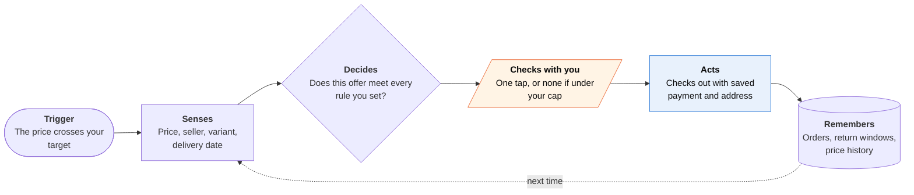

<!-- Generated by scripts/build.py from data/ideas.json. Edit the JSON, then run the script. -->

[← All ideas](../README.md) · **Being built now** · Money & commerce

# B-06 · Price-watch auto-buy agents

> Set a target price once; the agent watches the item and buys when it drops, within a budget you set.

| Difficulty | Novelty | Buildable on iOS today | Impact if it works | Horizon | Autonomy |
|---|---|---|---|---|---|
| `●●○○○` 2/5 | `●○○○○` 1/5 | `●●●●○` 4/5 | `●●●○○` 3/5 | Buildable now | L3 · Acts in guardrails, reports back |

## The moment

You want a specific stroller, but not at $480. You tell the shopping agent 'buy it at 30% off, black, ship to home.' Three weeks later a notification says it bought it for $329 and shows the return window.

## The problem

Prices on big purchases swing, and the best price can last only hours. Price-alert apps tell you about a drop, but by the time you look the deal may be gone, and you still have to check the seller, the color and the delivery date. A standing order that buys on your terms takes the watching off your plate.

## How the agent works

## iOS building blocks

- **Visual Intelligence (IntentValueQuery, SemanticContentDescriptor)** — snap a product with the camera to start tracking it
- **Share extension (NSExtensionContext)** — send a product link from Safari or another app to the watch list
- **PassKit (Apple Pay, PKPaymentAuthorizationController)** — user-confirmed checkout; Apple Pay needs a Face ID tap per purchase
- **UserNotifications** — 'price hit' and 'bought it' alerts with approve and cancel actions
- **WidgetKit** — tracked items and their current prices on the Home Screen
- **App Intents** — 'watch this price' from Siri and Shortcuts

## What makes it hard

- Apple has no agent-payment API. True auto-buy on iPhone runs on a store's saved card (Amazon), Google Pay, one-time cards (Stripe Link) or card-network agent tokens, not Apple Pay.
- Matching the exact item. Variant, condition, seller rating and delivery date all have to match, or the 'deal' is a different product.
- Buying on stores you don't control. Buy for Me-style checkout breaks on login walls, bot checks and redesigns, and merchant protocols such as UCP and ACP cover only some stores.

## Risks and failure modes

- The agent ranks results for the store, not for you, when the platform that sells is also the one running the agent.
- A stale rule fires months later after your needs changed. Rules need expiry dates and a spend cap.
- Price-glitch or marketplace-fraud listings that trigger a buy the merchant later cancels, leaving holds on your card.

## Unsaid assumptions

_What this idea quietly depends on being true. Check these before you build._

- The agent works for you and not for the store whose search results it ranks.
- Stores treat agent-placed orders and returns the same as human ones.

## Unknown unknowns

_Open questions nobody has good answers to yet._

- Will Apple add spend limits or agent mandates to Apple Pay?
- Do people with auto-buy rules end up spending more, not less?

## Prior art and who's building

- [Amazon Alexa for Shopping (Auto Buy, Buy for Me)](https://www.cnbc.com/2026/05/13/amazon-ditches-rufus-ai-chatbot-in-favor-of-alexa-shopping-agent.html) — Replaced Rufus in May 2026; buys at your target price and checks out on other sites. Works for Amazon's own catalog first.
- [Google agentic checkout and Universal Cart](https://blog.google/products-and-platforms/products/shopping/agentic-checkout-holiday-ai-shopping/) — Buys through Google Pay at your target price after you confirm; limited to participating merchants.
- [ChatGPT Instant Checkout (discontinued)](https://www.digitalcommerce360.com/2026/03/06/openai-shifts-checkout-plans-agentic-commerce-strategy/) — In-chat buying dropped in March 2026 after Walmart saw it convert about 3x worse than a click-through to its site.
- [Meta Muse checkout](https://about.fb.com/news/2026/09/introducing-muse-personal-ai-agent/) — Pays with one-time Stripe Link cards inside a general agent; no standing price rules reported.

## Smallest useful first version

A share-sheet 'watch this' for any product link, with a target price, a variant check and an expiry date. When the price hits, send a time-sensitive notification that opens a prefilled Apple Pay sheet, so buying takes one Face ID tap. Offer true auto-buy only at merchants that support an agent checkout protocol.

Research notes: what we could and couldn't verify

The 3x conversion figure is Walmart's measurement as reported by Digital Commerce 360. Visa and Mastercard agent-token rollout details come from secondary sources in the research notes.

## Related ideas

- [B-22 · Safari shopping-extension agents](../building-now/B-22-safari-shopping-extensions.md)
- [M-02 · Household Spending Constitution](../moonshot/M-02-household-spending-constitution.md)
- [B-01 · Cloud-computer errand agents](../building-now/B-01-cloud-errand-agents.md)
