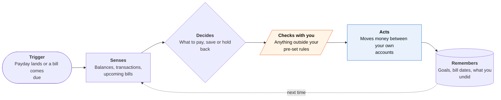

<!-- Generated by scripts/build.py from data/ideas.json. Edit the JSON, then run the script. -->

[← All ideas](../README.md) · **Being built now** · Money & commerce

# B-07 · Money autopilot agents

> Link your accounts; the agent plans goals and moves money within your limits, then texts you what it did.

| Difficulty | Novelty | Buildable on iOS today | Impact if it works | Horizon | Autonomy |
|---|---|---|---|---|---|
| `●●●○○` 3/5 | `●●○○○` 2/5 | `●●●●○` 4/5 | `●●●●○` 4/5 | Buildable now | L3 · Acts in guardrails, reports back |

## The moment

Payday lands on a Friday. Before you check your balance, the agent has paid the card in full, moved $180 to your trip fund and texted: 'Held back $60 because your car insurance renews Tuesday. Undo?'

## The problem

Most people know they should pay the card in full, save for the trip and keep a buffer for bills, but doing it every payday takes attention. Budgeting apps draw charts and leave the moves to you. Bank auto-transfers move fixed amounts and ignore what is about to come due.

## How the agent works

## iOS building blocks

- **FinanceKit (FinanceStore, BackgroundDeliveryExtension)** — reads Apple Card, Apple Cash and Savings data on device and wakes when it changes (iOS 26); needs a managed entitlement
- **UserNotifications** — 'held back $60, undo?' messages with an undo action
- **App Intents (UndoableIntent)** — registers undo for each money move so it can be reversed from the app or Siri
- **LocalAuthentication** — Face ID to change rules or raise caps
- **WidgetKit** — a safe-to-spend number on the Home Screen

## What makes it hard

- Moving money needs a licensed bank or payments partner and account-to-account rails; the app cannot move funds by itself.
- Data coverage. FinanceKit covers Apple's own card products and requires Apple's approval; other banks come through aggregators such as Plaid, with gaps and delays.
- Timing. Transfers take days and bills post late, so a plan built on today's balance can overdraw tomorrow.
- Undo is not really undo. Reversing a transfer means a new transfer, which can also take days.

## Risks and failure modes

- Safety line: never make a move that could overdraw an account or miss a bill, and never move money to third parties without a fresh approval.
- Recommending investments, loans or insurance can become regulated financial advice.
- A stolen phone or hijacked account turns the autopilot into a drain; rule changes need Face ID and a cooling-off delay.

## Unsaid assumptions

_What this idea quietly depends on being true. Check these before you build._

- Regulators keep treating an agent that moves money between your own accounts as a feature, not as financial advice.
- Aggregator data stays accurate and timely enough to act on.

## Unknown unknowns

_Open questions nobody has good answers to yet._

- How much will people let an agent move before they stop trusting the undo button?
- Will US open-banking rules (CFPB section 1033) settle in a form that gives agents stable data access?

## Prior art and who's building

- [Cleo Autopilot](https://web.meetcleo.com/blog/introducing-autopilot) — Plans goals and acts within user-set limits since February 2026; US-focused, mostly moves between the user's own accounts.
- [ChatGPT finances](https://techcrunch.com/2026/05/15/openai-launches-chatgpt-for-personal-finance-will-let-you-connect-bank-accounts/) — Plaid-linked dashboard and Q&A across 12,000+ institutions for US Plus and Pro users; explains, does not move money.
- [Rocket Money Rowan](https://www.pymnts.com/news/artificial-intelligence/2026/this-ai-agent-ends-subscriptions-without-a-phone-call/) — Reportedly texts savings opportunities and takes text instructions; details come from one trade report.

## Smallest useful first version

Read-only first: connect accounts, forecast the next 30 days of bills, and on each payday propose three moves with amounts that the user approves with one tap. After four weeks of approvals, offer to make the same moves automatically under a cap, with undo.

Research notes: what we could and couldn't verify

Rowan's details come from one PYMNTS report and are unconfirmed. Cleo's capabilities come from its own blog and press release. The Menlo 2026 figures (20% of AI users have given an agent a financial account, 36% email) are from the research notes. FinanceKit country availability was not verified.

## Related ideas

- [B-08 · Bill-fighting and cancel agents](../building-now/B-08-bill-fighting-agents.md)
- [M-02 · Household Spending Constitution](../moonshot/M-02-household-spending-constitution.md)
- [W-16 · Ulysses Money Pact](../whitespace/W-16-ulysses-money-pact.md)
