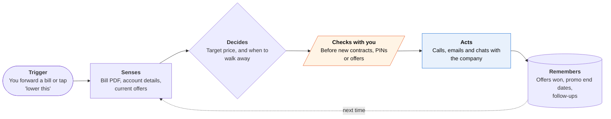

<!-- Generated by scripts/build.py from data/ideas.json. Edit the JSON, then run the script. -->

[← All ideas](../README.md) · **Being built now** · Money & commerce

# B-08 · Bill-fighting and cancel agents

> An agent calls, emails and chats with companies to lower bills, cancel subscriptions and chase refunds.

| Difficulty | Novelty | Buildable on iOS today | Impact if it works | Horizon | Autonomy |
|---|---|---|---|---|---|
| `●●●○○` 3/5 | `●○○○○` 1/5 | `●●●●○` 4/5 | `●●●○○` 3/5 | Buildable now | L3 · Acts in guardrails, reports back |

## The moment

Your internet bill jumped $25 when the promo ended. You forward the bill and tap 'negotiate.' Two days later the agent reports it waited 40 minutes on hold, got a $20-a-month credit, and needs your OK before accepting a 12-month term.

## The problem

Companies make cancelling and negotiating slow: long holds, retention menus and 'call during business hours'. People who push get discounts, and most people don't have the time. Services that negotiate for a cut of the savings have existed for years, but they cover a short list of providers.

## How the agent works

## iOS building blocks

- **Share extension (NSExtensionContext)** — forward a bill PDF or screenshot from Mail, Files or Photos
- **VisionKit (VNDocumentCameraViewController)** — scan a paper bill
- **Vision OCRTool with Foundation Models** — reads amounts, dates and the account number on device before anything is uploaded
- **ActivityKit (Live Activities)** — hold and progress status during a long call
- **UserNotifications** — 'accept this offer?' approvals
- **EventKit** — a reminder to recheck before the new promo ends

## What makes it hard

- Account verification. Providers ask for PINs, last-four digits or the account holder, so the agent needs the user pre-authorized on the account or patched into the call.
- Retention desks push new contracts, bundles and equipment swaps. The agent has to tell which 'savings' cost more over 12 months.
- Follow-through. Credits show up on the next bill or not at all, so the agent must check the next statement and call back.
- Calls come from cloud telephony because iOS gives apps no access to cellular calls.

## Risks and failure modes

- Signing the user up for a contract, early-termination fee or price lock they didn't want.
- A third party holding account PINs and ID numbers; a breach makes SIM-swap fraud easier.
- Fees based on a share of savings can reward small cuts that come with long contracts.

## Unsaid assumptions

_What this idea quietly depends on being true. Check these before you build._

- Retention desks keep offering discounts once most of their callers are agents that never give up.
- Providers keep accepting an authorized third party acting on the account.

## Unknown unknowns

_Open questions nobody has good answers to yet._

- After a US court struck down the FTC's click-to-cancel rule in 2025, will state laws make cancelling easy enough that agents aren't needed?
- What success rate do these agents reach across providers, beyond self-reported numbers?

## Prior art and who's building

- [Pine AI](https://www.19pine.ai/) — Calls, emails and web tasks to negotiate bills, cancel and file refunds. Claims $300+ average yearly savings; an independent test saw 2 of 3 tasks succeed in 48 hours.
- [Rocket Money Rowan](https://www.pymnts.com/news/artificial-intelligence/2026/this-ai-agent-ends-subscriptions-without-a-phone-call/) — Reportedly cancels subscriptions by text instruction; unconfirmed.
- [Meta Muse](https://the-decoder.com/muse-can-shop-write-emails-and-negotiate-prices-for-users-all-through-whatsapp/) — Negotiates prices and bills, including through WhatsApp, as one feature of a general agent.
- [Cleo Autopilot](https://www.prnewswire.com/news-releases/cleo-launches-autopilot-automating-your-money-moves-302679691.html) — Bill negotiation is on the 2026 roadmap, not shipped.

## Smallest useful first version

Cancellations only, for the 30 most common subscriptions and a few big US cable and phone providers. The user forwards a bill; the agent cancels through the cheapest channel (web, chat, email, then phone) and reports a confirmation number. Add negotiation once cancelling is reliable.

Research notes: what we could and couldn't verify

Pine's 93% success rate and $300+ savings are self-reported; the 2-of-3 test comes from a third-party review listed in the research notes, which I did not open. Rowan is unconfirmed. The FTC click-to-cancel point is from general knowledge (the Eighth Circuit vacated the rule in July 2025), not from the research notes.

## Related ideas

- [B-02 · Phone-call errand agents](../building-now/B-02-phone-call-errand-agents.md)
- [B-24 · Medical-bill dispute tools](../building-now/B-24-medical-bill-dispute.md)
- [W-27 · Leak Bill Detective](../whitespace/W-27-leak-bill-detective.md)
