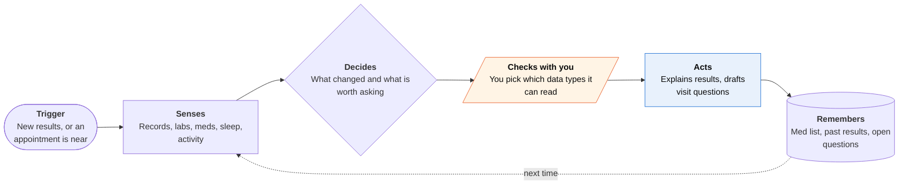

<!-- Generated by scripts/build.py from data/ideas.json. Edit the JSON, then run the script. -->

[← All ideas](../README.md) · **Being built now** · Health & body

# B-09 · Health-record reading assistants

> Assistants that read Apple Health and medical records to explain labs and prep you for appointments.

| Difficulty | Novelty | Buildable on iOS today | Impact if it works | Horizon | Autonomy |
|---|---|---|---|---|---|
| `●●●○○` 3/5 | `●●○○○` 2/5 | `●●●●○` 4/5 | `●●●●○` 4/5 | Buildable now | L1 · Suggests, you act |

## The moment

Your yearly bloodwork posts to the patient portal at 9pm. You ask the assistant what changed; it pulls last year's labs and your sleep and activity trends, and drafts three questions for Thursday's appointment.

## The problem

Lab results often arrive before the doctor explains them, as a wall of numbers and red flags. Records are split across portals, the Health app and paper. Patient portals show results but don't compare them over time or connect them to how you sleep and move.

## How the agent works

## iOS building blocks

- **HealthKit (HKClinicalRecord)** — reads FHIR labs, conditions and medications downloaded from providers; read-only
- **HealthKit Medications API (HKUserAnnotatedMedication, HKMedicationDoseEvent)** — reads the med list and logged doses (iOS 26)
- **Foundation Models (PrivateCloudComputeLanguageModel)** — summarizes on Apple's servers with a 32K context, without sending records to a third-party AI
- **EventKit** — finds the next appointment and attaches the questions
- **UserNotifications** — a prep reminder the evening before a visit

## What makes it hard

- HealthKit rules. Data may go only to services that provide health or fitness services to the user, never to ads or data mining, and App Review 5.1.2(i) requires consent that names any third-party AI.
- Coverage. Health Records only work when the user's provider supports the download, and coverage varies by provider and country.
- Context size. A few years of FHIR labs plus daily sleep data overflow the 4,096-token on-device model; it needs summarizing or PCC's 32K context.
- The Health store is encrypted while the phone is locked, so a background job cannot read new records until the user next opens the phone.

## Risks and failure modes

- Safety line: explain and compare, never diagnose or suggest changing a medication, and send urgent values straight to a clinician.
- Records in a chatbot company's cloud may fall outside HIPAA, which mostly covers providers and insurers, not consumer apps.
- Features that interpret results for treatment can become a regulated medical device, and Apple now asks health apps to declare regulated-device status.

## Unsaid assumptions

_What this idea quietly depends on being true. Check these before you build._

- People trust a chatbot company with their records more than their hospital's own portal.
- Providers keep sending records into Apple Health in a usable FHIR format.

## Unknown unknowns

_Open questions nobody has good answers to yet._

- Will Apple's own Health app summaries, previewed in the iOS 27.2 beta, make third-party readers redundant?
- Does reading records change health outcomes, or mostly lower anxiety before visits?

## Prior art and who's building

- [ChatGPT Health](https://www.macrumors.com/2026/07/23/chatgpt-apple-health-integration/) — Apple Health plus medical records, lab comparisons and visit prep; US rollout began July 23, 2026. Reads and explains, rarely acts.
- [Claude Apple Health integration](https://www.macrumors.com/2026/01/22/claude-ai-adds-apple-health-connectivity/) — Apple Health analysis in beta for US Pro and Max users since January 2026.
- [Apple Health AI coach (shelved)](https://livity-app.com/en/blog/apple-health-ai-coach-shelved) — Apple's own coach (Project Mulberry) was delayed and scaled back, leaving the field to chatbot companies.

## Smallest useful first version

An on-device lab diff. Read clinical lab records from HealthKit, show what changed since last time with plain-language notes and reference ranges, and add three draft questions to the next appointment in Calendar. Nothing leaves the phone except through Apple's Private Cloud Compute.

Research notes: what we could and couldn't verify

The redesigned Health app and Readiness score in the iOS 27.2 beta are reported, not confirmed. The Mulberry shelving comes from press reports. The regulated-device declaration (Health & Fitness and Medical apps, since March 2026) comes from the research notes.

## Related ideas

- [W-20 · Chart Check](../whitespace/W-20-chart-check.md)
- [B-10 · Wearable-driven training coaches](../building-now/B-10-wearable-training-coaches.md)
- [M-20 · Exam Room Advocate](../moonshot/M-20-exam-room-advocate.md)
