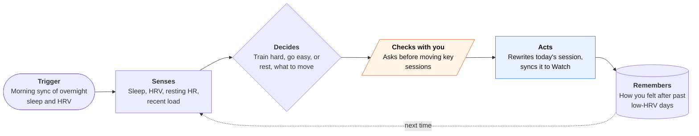

<!-- Generated by scripts/build.py from data/ideas.json. Edit the JSON, then run the script. -->

[← All ideas](../README.md) · **Being built now** · Health & body

# B-10 · Wearable-driven training coaches

> Coaches that rewrite today's workout from last night's sleep, HRV and strain, then nudge you on the wrist.

| Difficulty | Novelty | Buildable on iOS today | Impact if it works | Horizon | Autonomy |
|---|---|---|---|---|---|
| `●●○○○` 2/5 | `●○○○○` 1/5 | `●●●●●` 5/5 | `●●●○○` 3/5 | Buildable now | L3 · Acts in guardrails, reports back |

## The moment

You slept five hours and your HRV is well below your normal. At 6:30am your coach swaps the interval run for an easy 30 minutes, moves the hard session to Thursday, and tells you why in two lines. The easy run is already on your Watch when you lace up.

## The problem

Training plans are written weeks ahead. They don't know you slept badly, caught a cold or had a brutal week at work. Wearables collect the signals but mostly hand you a score and leave the decision to you. The job is turning last night's data into today's session and moving the rest of the week around it, without you rebuilding the plan by hand.

## How the agent works

## iOS building blocks

- **HealthKit (HKObserverQuery, background delivery)** — wakes the app when new sleep, HRV and resting heart rate samples arrive
- **HealthKit workout zones (HKWorkoutZoneGroup, iOS 27)** — reads time in each heart-rate zone to measure real training load
- **WorkoutKit (WorkoutScheduler)** — puts the rewritten interval or easy session on Apple Watch
- **Foundation Models (SystemLanguageModel, PrivateCloudComputeLanguageModel)** — writes the two-line reason and answers questions, on watchOS 27 too
- **WidgetKit (Smart Stack widget)** — shows today's outlook on the wrist and Lock Screen
- **EventKit** — finds a free slot when a hard session moves to another day

## What makes it hard

- Readiness data is noisy. HRV moves with alcohol, a late meal, illness or a loose band, so the coach needs weeks of your own baseline and must take 'I feel fine' seriously.
- HealthKit encrypts its store while the phone is locked, and background delivery for some data types is capped at hourly. The 6:30am decision has to cope with data that arrives late or not at all.
- Hardware-neutral is harder than it sounds. Oura, WHOOP, Garmin and Apple Watch each write different subsets of their data to Apple Health, with different delays and sleep staging.
- The plan needs real coaching rules underneath (build, taper, coming back from injury). A language model that improvises the plan week to week will drift.

## Risks and failure modes

- Safety line: it is a training coach, not a doctor. Chest pain, fainting or a resting heart rate far above normal must stop the plan and point to medical care, never just an easier workout.
- Health data rules: App Review 5.1.3 bars using HealthKit data for ads and storing personal health data in iCloud, and 5.1.2(i) requires explicit consent before sending it to a third-party model.
- People may hand their judgment to a score: skipping sessions they could do, or pushing through pain because the number looks good.

## Unsaid assumptions

_What this idea quietly depends on being true. Check these before you build._

- That a readiness score reflects how you actually feel well enough to justify changing your plan.
- That people wear the device to bed every night, so the morning decision has data.
- That a two-line explanation is enough for people to trust a skipped workout.

## Unknown unknowns

_Open questions nobody has good answers to yet._

- Does adjusting daily training from HRV actually improve results for recreational athletes, or does it just feel smarter?
- If Apple ships the Readiness score and coaching it is testing for the Health app, is there room left for a third-party coach?
- Can a hardware-neutral coach make money when Google, Oura and WHOOP bundle a coach with the device subscription?

## Prior art and who's building

- [Google Health / Fitbit Gemini coach](https://www.macrumors.com/2026/02/10/google-fitbit-ai-health-coach-ios/) — Builds training plans that adapt to sleep, heart rate and readiness. Reached iOS in February 2026; the Fitbit app became Google Health in May 2026.
- [Oura Advisor](https://www.androidcentral.com/wearables/oura-ring/oura-rolls-out-its-ai-powered-personal-trainer) — Sleep- and readiness-focused coach with memories of your patterns. Needs the ring.
- [WHOOP Coach](https://wwd.com/beauty-industry-news/wellness/wearable-wellness-devices-oura-whoop-artificial-intelligence-coaching-1236562338/) — Recovery- and strain-based coaching tied to the WHOOP strap and membership.
- [Apple's delayed Health coach](https://9to5mac.com/2026/05/24/apple-improving-heart-rate-tracking-in-watchos-27-mulberry-health-coach-delays/) — Apple's own AI coach (Mulberry) was delayed and reportedly scaled back, leaving Watch owners without a first-party coach.

## Smallest useful first version

An iPhone and Watch app that reads HealthKit each morning and compares HRV and sleep to your own 30-day baseline. It picks one of three versions of today's planned session (as written, easier, rest), sends it to the Watch with WorkoutKit, and explains the choice in two lines. You can override with one tap, and it asks how you felt afterwards.

Research notes: what we could and couldn't verify

Apple's scaled-back coach and the Readiness score in the iOS 27.2 beta come from press reports (9to5Mac), not Apple. The candidate's WHOOP quote ('someone to tell me what to do') was not independently verified, so it is left out of the card.

## Related ideas

- [B-09 · Health-record reading assistants](../building-now/B-09-health-record-readers.md)
- [B-21 · Apple's built-in agents](../building-now/B-21-apple-built-in-agents.md)
