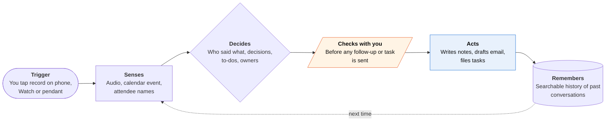

<!-- Generated by scripts/build.py from data/ideas.json. Edit the JSON, then run the script. -->

[← All ideas](../README.md) · **Being built now** · Learning & memory

# B-11 · Meeting and memory capture

> Your phone, Watch or a pendant records the conversation; the agent writes notes, to-dos and follow-ups.

| Difficulty | Novelty | Buildable on iOS today | Impact if it works | Horizon | Autonomy |
|---|---|---|---|---|---|
| `●●○○○` 2/5 | `●○○○○` 1/5 | `●●●●●` 5/5 | `●●●○○` 3/5 | Buildable now | L2 · Drafts, you approve |

## The moment

You walk out of a hallway meeting with a supplier. You tapped record on your Watch when it started, and by the elevator the notes sit under the calendar event with three action items and a drafted follow-up email. You fix one date and send it.

## The problem

Notes from in-person meetings, site visits and phone calls get lost or never written. Meeting bots only join video calls, so the hallway, the job site and the doctor's office go uncaptured. The job isn't a transcript. It's the decisions, the to-dos and the follow-up email that should exist ten minutes after the meeting ends.

## How the agent works

## iOS building blocks

- **App Intents (AudioRecordingIntent)** — starts capture from the Action button or Control Center with the system recording indicator
- **ActivityKit (Live Activities)** — required while an AudioRecordingIntent records; shows elapsed time on the Lock Screen
- **AVFAudio (AVAudioSession)** — keeps recording after the screen locks
- **Speech (SpeechAnalyzer, SpeechTranscriber)** — on-device transcription, iOS 26 and later
- **BackgroundTasks (BGContinuedProcessingTask)** — finishes processing a long recording after you leave the app
- **Foundation Models (@Generable)** — pulls decisions, to-dos and owners into structured fields
- **EventKit** — files notes under the matching calendar event and its attendees
- **WatchConnectivity** — moves Watch recordings to the phone

## What makes it hard

- Consent: many US states and countries require everyone's permission to record, and App Review 2.5.14 requires consent plus a visible or audible indicator. An all-day pendant runs straight into this.
- Telling speakers apart in a noisy hallway, or when people talk over each other, still fails often. A to-do given to the wrong person is worse than none.
- An hour of transcript is too long for the on-device model's context, so summaries need chunking or a server model. A third-party model also needs explicit consent under App Review 5.1.2(i).
- Acting on the notes means OAuth into each task tool and email account plus a reliable review step. That is why most products stop at suggested to-dos.

## Risks and failure modes

- Recording people who didn't agree, especially with always-on pendants. It needs a clear indicator and a one-tap 'off the record'.
- A searchable archive of every conversation is a target for breaches, subpoenas and workplace disputes.
- Vendor churn: Meta stopped selling Limitless after buying it, so users need a real export or they can lose their archive.

## Unsaid assumptions

_What this idea quietly depends on being true. Check these before you build._

- That everyone else in the room is fine with being recorded.
- That people review and send the drafted follow-ups instead of letting them pile up.
- That transcripts get names, numbers and dates right, which is where errors hurt most.

## Unknown unknowns

_Open questions nobody has good answers to yet._

- Does a lifetime conversation memory get used after the first month, or is the value only in same-day follow-ups?
- How will courts and employers treat AI meeting summaries as records?
- Will Apple grow its own recording and summary features into follow-up actions and squeeze the independents?

## Prior art and who's building

- [Granola](https://apps.apple.com/us/app/granola-ai-meeting-notes/id6739429409) — Bot-free meeting notes. The iPhone app captures in-person meetings and links notes to calendar events; one-tap Apple Watch capture since July 2026.
- [Plaud NotePin S](https://www.plaud.ai/blogs/news/plaud-unveils-notepins-and-desktop) — Clip-on recorder (January 2026) with an iPhone app and desktop capture; Plaud reports more than 2.5M users.
- [Amazon Bee](https://www.layer3labs.io/gear/reviews/bee-ai-pendant) — Pendant or wristband that records all day, extracts to-dos and builds a searchable memory; free to use since Amazon bought it.
- [Otter Meeting Agent](https://otter.ai/blog/otter-meeting-agent-your-new-collaborative-teammate) — Otter's agent pitched as a teammate inside meetings, not only a transcriber.
- [Limitless (discontinued)](https://legendmemory.ai/blogs/the-archive/limitless-pendant-discontinued-the-best-alternatives-in-2026) — Memory pendant whose sales stopped after Meta bought the company in December 2025; shows the archive risk.

## Smallest useful first version

An iPhone and Watch app that starts recording from the Action button, transcribes on device, and files notes under the matching calendar event. It pulls out decisions and to-dos with owners, and drafts one follow-up email that you edit and send from your own mail app.

Research notes: what we could and couldn't verify

Plaud user counts, Bee pricing and the Granola Watch launch date come from company pages and press summarized in the research digest. Otter Meeting Agent's feature set is described only from the blog title.

## Related ideas

- [B-03 · Inbox triage-and-draft agents](../building-now/B-03-inbox-triage-drafts.md)
- [M-09 · Decade Memory That Moves](../moonshot/M-09-decade-memory.md)
