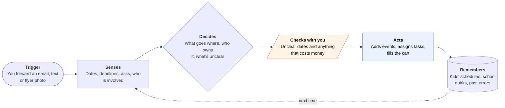

<!-- Generated by scripts/build.py from data/ideas.json. Edit the JSON, then run the script. -->

[← All ideas](../README.md) · **Being built now** · Family & care

# B-12 · Family logistics agents

> A household agent that turns school emails, flyers and texts into shared calendars, chores and grocery orders.

| Difficulty | Novelty | Buildable on iOS today | Impact if it works | Horizon | Autonomy |
|---|---|---|---|---|---|
| `●●●○○` 3/5 | `●●○○○` 2/5 | `●●●●○` 4/5 | `●●●●○` 4/5 | Buildable now | L2 · Drafts, you approve |

## The moment

The school sends a PDF about picture day, a field-trip form and a bake sale. You forward it to the family agent. It puts the dates on both parents' calendars, assigns the form to your partner, adds eggs to the grocery order, and asks you one thing: 'The flyer says the bake sale is Friday the 14th and Thursday the 13th. Which is it?'

## The problem

Family plans arrive as school emails, PDFs, group texts and paper flyers, and one parent usually carries the job of turning them into a schedule. Calendar and list apps store plans but don't read the mess. Chatbots can read it but make small date errors, and one missed pickup costs more trust than months of saved minutes.

## How the agent works

## iOS building blocks

- **Share extension (NSExtensionContext)** — takes a forwarded email, PDF or screenshot from any app
- **VisionKit (VNDocumentCameraViewController)** — scans paper flyers and permission slips
- **Foundation Models (@Generable)** — extracts dates, places and asks on device, keeping the source sentence
- **EventKit** — writes events to a shared family calendar and tasks to Reminders
- **CloudKit (CKShare)** — shares the household's task list and status between parents
- **User Notifications (UNNotificationAction)** — asks a clarifying question with tap-to-answer buttons
- **App Intents** — answers 'What's on tomorrow?' from Siri or Shortcuts

## What makes it hard

- Extraction accuracy is the product. School emails say 'next Friday', repeat last year's dates and send corrections in a later thread. Milo shut down in January 2026 because small errors made scheduling more work, not less.
- iOS apps can't read your Mail or Messages, so everything has to be forwarded, shared or photographed, or pulled through Gmail or Outlook OAuth that a parent must set up.
- Split custody, grandparents and carpools mean the agent must know whose week it is and must not leak one household's details to the other.
- Grocery ordering depends on partner integrations (Ohai uses Instacart), and substitutions still need a person.

## Risks and failure modes

- A wrong pickup time or a missed permission slip lands on a child. Every date the agent is unsure about must be shown with its source, not guessed.
- School messages hold minors' names, health notes and locations. Keep extraction on device where possible and get explicit consent before sending anything to a third-party model (App Review 5.1.2(i)).
- It can quietly shift the mental load onto whichever parent gets the approval pings.

## Unsaid assumptions

_What this idea quietly depends on being true. Check these before you build._

- That one wrong date costs less trust than the agent saves in time. Milo found the opposite.
- That parents will forward things consistently instead of handling them on the spot.
- That both parents accept one shared system.

## Unknown unknowns

_Open questions nobody has good answers to yet._

- What error rate will parents tolerate before they stop trusting the calendar?
- Will schools and their messaging vendors ever publish structured event feeds, making extraction unnecessary?
- Can a family agent charge $10 a month when Apple, Google and Amazon bundle household assistants?

## Prior art and who's building

- [Ohai 'O'](https://apps.apple.com/us/app/ohai-ai-household-assistant/id6477802468) — Household manager through an app and SMS: shared lists, tasks, meal plans and Instacart orders for $9.99/month. Mostly lists and groceries so far.
- [Milo (shut down)](https://getsense.ai/blog/posts/milo-shutting-down-alternative-2026) — SMS family assistant backed by OpenAI and YC; closed in January 2026 after its founder said AI was too early to be reliable for family scheduling.
- [Poke](https://techcrunch.com/2026/06/04/apple-approves-poke-as-the-first-ai-agent-on-its-messages-for-business-platform/) — General iMessage agent with calendar and email access; not built around family roles or co-parent coordination.

## Smallest useful first version

A share extension and forwarding address that turns one school email, PDF or flyer photo into proposed calendar events and tasks, each showing the sentence it came from. Nothing lands on the family calendar until a parent taps confirm, and anything ambiguous comes back as a question.

Research notes: what we could and couldn't verify

Ohai's price and founder (Care.com's Sheila Lirio Marcelo) and Milo's shutdown reasons come from the research digest, tagged likely rather than verified.

## Related ideas

- [W-02 · Night-Before Check](../whitespace/W-02-night-before-check.md)
- [W-15 · Two-House Handoff](../whitespace/W-15-two-house-handoff.md)
- [B-13 · Messaging-native personal agents](../building-now/B-13-messaging-native-agents.md)
