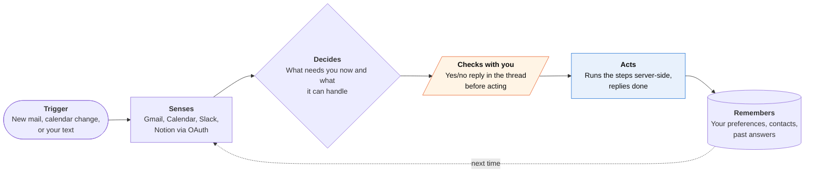

<!-- Generated by scripts/build.py from data/ideas.json. Edit the JSON, then run the script. -->

[← All ideas](../README.md) · **Being built now** · Social & communication

# B-13 · Messaging-native personal agents

> A personal agent you text in iMessage or WhatsApp; it watches your accounts and texts you first.

| Difficulty | Novelty | Buildable on iOS today | Impact if it works | Horizon | Autonomy |
|---|---|---|---|---|---|
| `●●○○○` 2/5 | `●●○○○` 2/5 | `●●●●○` 4/5 | `●●●●○` 4/5 | Buildable now | L2 · Drafts, you approve |

## The moment

At 6:10am a text arrives from your agent: 'Your 9am moved to 9:30 and check-in for your flight is open. Check you in and tell Sam you'll be late?' You reply 'yes both' and put the phone down. A minute later: 'Done. Boarding pass is in your email, and Sam has your note.'

## The problem

People check their messages hundreds of times a day but open a new app only when they remember to. Most assistants wait to be asked, live in their own app and can't reach the accounts where the work is. The job is an agent that watches mail and calendar, notices what needs doing, and asks in the thread you already read.

## How the agent works

## iOS building blocks

- **Apple Messages for Business** — Apple's registered business-chat channel, so the agent can be the other side of an iMessage thread (a service, not an SDK)
- **AuthenticationServices (ASWebAuthenticationSession)** — connects Gmail, Outlook, Slack and Notion with OAuth in the companion app
- **App Intents (messages schema: sendMessage, draftMessage)** — lets Siri AI hand a request to the agent's companion app
- **Suggested Actions (SuggestedActionsView, iOS 27)** — offers Calendar and Reminders actions under the agent's messages in its own app
- **User Notifications** — fallback alerts for users who don't use a messaging channel

## What makes it hard

- iOS apps can't read your iMessages, so the agent has to be the other side of the conversation: Messages for Business, its own phone number or WhatsApp. Apple approved Poke as the first AI agent on Messages for Business only in June 2026.
- Prompt injection: the agent reads mail and invites written by strangers and then acts. A crafted invite can tell it to forward files, so it must treat that content as data only and confirm anything that sends, shares or pays.
- A text thread is a weak approval screen. 'Yes' to a two-part question is ambiguous, and there is no Face ID step in a chat bubble.
- Watching many accounts means server-side webhooks or polling and a model call per event, which costs money before the user sees any value.

## Risks and failure modes

- A spoofed or hijacked thread becomes a remote control for your email and calendar. Forwarded or quoted text must never count as approval.
- An agent that texts first can turn into the notification noise it was meant to cut.
- Platform dependence: Apple or Meta can change what automated business messaging may do.

## Unsaid assumptions

_What this idea quietly depends on being true. Check these before you build._

- That Apple keeps Messages for Business open to general-purpose agents, not just airlines and banks.
- That people will give one startup OAuth access to their email, calendar and work tools.
- That short yes/no replies give the agent enough context to act correctly.

## Unknown unknowns

_Open questions nobody has good answers to yet._

- How do you add a strong approval step (Face ID, a spend limit) to a chat-only agent without sending people to an app?
- Will Siri AI's cross-app actions make a separate texting agent unnecessary for iPhone owners?
- Who is liable when an agent acts on a 'yes' that was meant for a different question?

## Prior art and who's building

- [Poke (The Interaction Company)](https://techcrunch.com/2026/06/04/apple-approves-poke-as-the-first-ai-agent-on-its-messages-for-business-platform/) — Proactive agent used entirely by text. Watches Gmail, Calendar, Outlook, Notion, Slack and GitHub; first AI agent approved on Messages for Business (June 2026).
- [Meta Muse in WhatsApp](https://the-decoder.com/muse-can-shop-write-emails-and-negotiate-prices-for-users-all-through-whatsapp/) — Meta's personal agent, usable inside WhatsApp, that shops, writes email and negotiates.
- [OpenClaw](https://openclaw.ai/) — Open-source, self-hosted agent reachable from iMessage, WhatsApp, Telegram, Signal and other channels. Setup needs Terminal skills.
- [Howie](https://howie.com/) — Scheduling assistant with its own email address and number; works over email and iMessage, but only for scheduling.

## Smallest useful first version

One narrow job done in a text thread: watch Gmail and Google Calendar, text you when a meeting moves or a check-in opens, and make the fix only after you reply yes. Start on its own phone number or WhatsApp while applying for Messages for Business.

Research notes: what we could and couldn't verify

Poke's 'about 100M messages relayed' is a company claim reported by TechCrunch and is left out of the card. Suggested Actions (iOS 27) works in a messaging app's own chat view, not in Apple's Messages app. Messages for Business has no public iOS framework in current docs; it is listed as a service.

## Related ideas

- [B-14 · Self-hosted agents, iPhone as node](../building-now/B-14-self-hosted-agent-node.md)
- [B-03 · Inbox triage-and-draft agents](../building-now/B-03-inbox-triage-drafts.md)
- [W-03 · Agent Control Tower](../whitespace/W-03-agent-control-tower.md)
