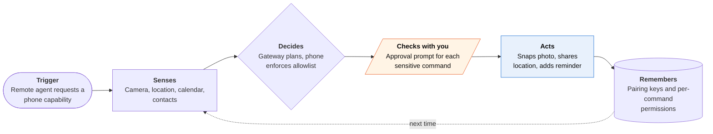

<!-- Generated by scripts/build.py from data/ideas.json. Edit the JSON, then run the script. -->

[← All ideas](../README.md) · **Being built now** · Life admin

# B-14 · Self-hosted agents, iPhone as node

> Run your own agent on a home server; the iPhone app lends it the camera, location and your approvals.

| Difficulty | Novelty | Buildable on iOS today | Impact if it works | Horizon | Autonomy |
|---|---|---|---|---|---|
| `●●●○○` 3/5 | `●●○○○` 2/5 | `●●●○○` 3/5 | `●●○○○` 2/5 | Buildable now | L2 · Drafts, you approve |

## The moment

Your agent runs on a Mac mini at home. In the store it pings you through the iPhone app: 'Snap the shelf so I can check prices against your list?' You open the app, approve, and take the photo. A minute later it replies in Telegram with what to buy here and what's cheaper online.

## The problem

Some people want a capable agent without handing their email and files to a startup, so they run one on their own machine. But a home server can't see where you are, take a photo or ask you a quick question on the go. The phone has to act as the agent's eyes, location and approval button without becoming a hole into your home network.

## How the agent works

## iOS building blocks

- **Foundation (URLSessionWebSocketTask)** — holds the link to the self-hosted gateway while the app is open
- **User Notifications (UNNotificationAction)** — approve or deny a gateway request from the Lock Screen
- **AVFoundation (AVCapturePhotoOutput)** — takes the photo the agent asked for, in the foreground only
- **Core Location (CLMonitor, significant-change service)** — geofence and presence events that still run in the background
- **EventKit, Contacts, PhotoKit** — calendar, reminder, contact and photo commands, each behind its own iOS permission
- **LocalAuthentication** — Face ID before high-risk commands such as sharing contacts

## What makes it hard

- iOS suspends the app and its socket in the background. OpenClaw documents camera, screen and talk commands as blocked there; only location events and presence keep working. Most requests need a push that brings you back into the app.
- Reaching a home machine from a cellular connection needs a tunnel or VPN, on top of a setup that already needs Terminal skills.
- Memory poisoning is a live threat: the GhostWriter study (2026) got hidden payloads into personal agents' long-term memory about 98% of the time. A phone node adds camera and location to whatever an attacker can steer.
- Approval prompts have to say exactly what and why ('photo of the shelf, for the grocery task'), or people approve blindly.

## Risks and failure modes

- A hijacked gateway can ask the phone for photos, location or contacts. Per-command approval, short-lived grants and a visible log are the main defenses.
- Approval fatigue: after fifty prompts a day, people stop reading them.
- No company stands behind the security; fixes depend on volunteers and on each user updating.

## Unsaid assumptions

_What this idea quietly depends on being true. Check these before you build._

- That people who self-host an agent also secure it, now that a phone node makes it more powerful.
- That App Review keeps approving a thin client that takes orders from an agent Apple never reviews.
- That users keep a home machine running all the time.

## Unknown unknowns

_Open questions nobody has good answers to yet._

- Can a zero-setup version exist (a hosted gateway with the same privacy) without becoming just another cloud agent?
- Will Apple ever let a paired agent call App Intents on the phone, the way Siri can?
- How should approvals scale when an agent needs the phone dozens of times a day?

## Prior art and who's building

- [OpenClaw iOS node app](https://github.com/openclaw/openclaw) — Open-source self-hosted agent gateway (about 390k GitHub stars). Its iPhone, iPad and Watch app (late June 2026) is a node the agent can call, with approvals.
- [OpenClaw mobile nodes coverage](https://www.marktechpost.com/2026/06/29/openclaw-releases-ios-and-android-companion-node-apps-that-connect-a-phone-to-a-self-hosted-ai-agent-gateway/) — Explains how the phone pairs with the gateway and what it can do in the foreground versus the background.
- [Hermes Agent (Nous Research)](https://www.truefoundry.com/blog/openclaw-vs-hermes) — Self-hosted alternative used from phone chat apps; compared with OpenClaw here. No dedicated iPhone node.
- [PalmClaw (research)](https://huggingface.co/papers/2607.13027) — July 2026 framework that exposes phone capabilities as typed tools instead of screen taps; research code, not a consumer app.

## Smallest useful first version

A node app that pairs with one self-hosted gateway by QR code and offers three commands: current location, a camera snap and adding a reminder. Every call shows an approval notification saying what was asked and why, and the app keeps a log where you can revoke any permission.

Research notes: what we could and couldn't verify

The candidate cites a 2026 study where poisoning OpenClaw's state raised attack success from 24.6% to 64-74%; no source URL was available, so the card uses the GhostWriter figure from the digest instead. OpenClaw's iOS release date appears as both June 24 and June 29, 2026 in sources; the card says 'late June'.

## Related ideas

- [B-13 · Messaging-native personal agents](../building-now/B-13-messaging-native-agents.md)
- [B-25 · Pocket supervision of work agents](../building-now/B-25-pocket-agent-supervision.md)
- [W-03 · Agent Control Tower](../whitespace/W-03-agent-control-tower.md)
