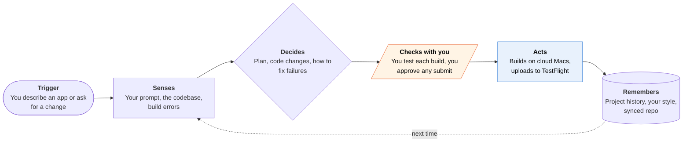

<!-- Generated by scripts/build.py from data/ideas.json. Edit the JSON, then run the script. -->

[← All ideas](../README.md) · **Being built now** · Creativity & media

# B-15 · On-phone app builders

> Describe an app on your iPhone; an agent writes it, builds it on cloud Macs and sends it to TestFlight.

| Difficulty | Novelty | Buildable on iOS today | Impact if it works | Horizon | Autonomy |
|---|---|---|---|---|---|
| `●●●○○` 3/5 | `●●○○○` 2/5 | `●●●○○` 3/5 | `●●○○○` 2/5 | Buildable now | L2 · Drafts, you approve |

## The moment

On the train you describe a tip-splitting app for your climbing group. The agent writes SwiftUI, builds it on a cloud Mac, and 20 minutes later a TestFlight invite arrives. You try it, say 'make the buttons bigger', and a new build lands before your stop.

## The problem

People with an idea for a small app can't write Swift, and a Mac with Xcode is a big first step. Chat tools can write code but can't compile, sign or ship it. The job is going from a sentence to an app on your own phone, and later to the App Store, with building, signing and review steps handled for you.

## How the agent works

## iOS building blocks

- **SwiftUI** — the UI framework the agent writes for native apps
- **App Store Connect API** — manages builds, TestFlight testers and submission steps from the cloud
- **AuthenticationServices (ASWebAuthenticationSession)** — signs in to GitHub for repo sync
- **Speech (SpeechAnalyzer)** — turns spoken app ideas into prompts
- **ActivityKit (push-updated Live Activity)** — shows build progress on the Lock Screen while a cloud Mac compiles
- **User Notifications** — says when a TestFlight build is ready to try

## What makes it hard

- App Review 2.5.2 bans apps that download or run code that changes features. Apple blocked updates for Replit and Vibecode and pulled Anything in March 2026. The builders that survived moved previews to an external browser and compiling to cloud Macs.
- App Review 4.2.6 rejects apps made by an app-generation service unless the content owner submits them, so each app has to ship under the user's own developer account.
- macOS builds must run on Apple hardware, so every build minute costs real Mac time and fleets are slow to scale.
- Generated apps break in quiet ways (state bugs, missing privacy strings, crashes on older phones) that a non-coder can't diagnose.

## Risks and failure modes

- A flood of near-identical apps that App Review rejects as spam (4.3), wasting users' time and money.
- Generated apps that touch health, money or kids' data can ship without the privacy handling the rules require, and the user, not the builder, is the developer of record.
- One App Review interpretation can freeze the product, as March 2026 showed.

## Unsaid assumptions

_What this idea quietly depends on being true. Check these before you build._

- That Apple keeps tolerating builders as long as the generated code runs anywhere except inside the reviewed app.
- That non-developers will pay Apple's $99 yearly developer fee to ship their app.
- That most people want a personal tool on their own phone more than an App Store listing.

## Unknown unknowns

_Open questions nobody has good answers to yet._

- Will Apple ever offer a sanctioned path for personal, unreviewed apps beyond TestFlight?
- Can generated apps be kept working a year later when iOS changes, or do they rot?
- Does agentic coding inside Xcode 27 turn phone-first builders into a niche?

## Prior art and who's building

- [Bitrig](https://9to5mac.com/2026/03/06/ai-powered-coding-platform-bitrig-gets-a-mac-app-for-building-iphone-apps/) — From ex-Apple engineers: prompt-to-SwiftUI on iPhone (October 2025) with TestFlight export; added a Mac app in March 2026.
- [Rork Max](https://rork.com/max) — Generates native Swift from prompts and compiles it on a fleet of cloud Macs, with a short path to App Store submission.
- [Vibecode](https://www.vibecodeapp.com/) — Builds mobile and web apps from prompts; during Apple's enforcement it was reportedly told to stop generating software for Apple devices.
- [Apple's 2.5.2 enforcement](https://www.macrumors.com/2026/03/18/apple-blocks-updates-for-vibe-coding-apps/) — Apple blocked updates for vibe-coding apps, saying it was enforcing a rule against apps changing behavior after review.

## Smallest useful first version

An iPhone app where you describe a one-screen utility, see a web preview in Safari, and get a native TestFlight build from a cloud Mac under your own developer account. Each change is a chat message, and every build is a Git commit you can roll back.

Research notes: what we could and couldn't verify

Rork Max's cloud-Mac compile and quick submission are from Rork's own site. Whether Vibecode still generates Apple-platform apps after the March 2026 dispute is unclear. Guideline numbers 2.5.2, 4.2.6 and 4.3 were checked against the App Review Guidelines text in the scratchpad.

## Related ideas

- [B-25 · Pocket supervision of work agents](../building-now/B-25-pocket-agent-supervision.md)
- [B-01 · Cloud-computer errand agents](../building-now/B-01-cloud-errand-agents.md)
