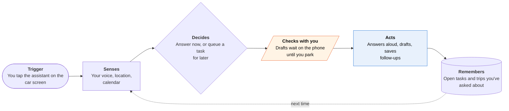

<!-- Generated by scripts/build.py from data/ideas.json. Edit the JSON, then run the script. -->

[← All ideas](../README.md) · **Being built now** · Physical world

# B-16 · CarPlay voice agents

> Talk to an AI assistant through CarPlay; it answers, drafts and plans, then hands follow-ups to your phone.

| Difficulty | Novelty | Buildable on iOS today | Impact if it works | Horizon | Autonomy |
|---|---|---|---|---|---|
| `●●○○○` 2/5 | `●●○○○` 2/5 | `●●●●○` 4/5 | `●●○○○` 2/5 | Buildable now | L2 · Drafts, you approve |

## The moment

You are 40 minutes from home and remember the dentist form due tomorrow. You tap the assistant on the car screen and ask it to draft the email to the office and remind you to print the form when you get home. The draft is waiting in the app when you park.

## The problem

Drive time is long, hands-busy and full of things you remember but can't act on. Siri handles short commands, and until 2026 other assistants weren't allowed on the car screen. The job is a spoken conversation that turns 'I need to deal with X' into drafts, plans and reminders waiting on your phone when you stop.

## How the agent works

## iOS building blocks

- **CarPlay (CPVoiceControlTemplate)** — shows listening and working states on the car screen; voice-conversation apps need a CarPlay entitlement from Apple
- **AVFAudio (AVAudioSession)** — two-way audio that ducks music and handles call interruptions
- **ActivityKit (Live Activities on the CarPlay Dashboard)** — a glanceable list of what it queued for later
- **Core Location** — route- and place-aware answers
- **EventKit** — turns 'remind me when I get home' into a location-based reminder
- **App Intents** — picks up a queued draft on the phone after you park

## What makes it hard

- Apple's limits: voice only, no wake word, and no control of the car or iPhone functions. The app can't send a message itself; it has to queue the task for later.
- Answers must be short and interruptible, and anything that needs reading or tapping has to wait until you're parked.
- Tunnels and rural roads drop the cloud model mid-sentence, so it needs a graceful 'I'll finish this when you're back online'.
- ChatGPT, Perplexity, Grok and Meta AI already ship general assistants in CarPlay, so a newcomer needs a specific job: an EV road-trip planner, a field-service log or a trip concierge.

## Risks and failure modes

- Driver distraction: long or emotional conversations pull attention off the road even when they're eyes-free.
- Confident wrong answers about roads, closures or local laws at speed.
- The mic hears everyone in the car, so it needs a clear indicator and no silent keeping of passengers' speech (App Review 2.5.14).

## Unsaid assumptions

_What this idea quietly depends on being true. Check these before you build._

- That drivers want a general chatbot more than an agent that knows this particular trip.
- That in-car conversations stay short enough to be safe.
- That Apple keeps widening what CarPlay voice apps may do instead of reserving actions for Siri.

## Unknown unknowns

_Open questions nobody has good answers to yet._

- Will Apple allow a wake word or steering-wheel button for third-party assistants?
- Do drivers use these assistants every week, or was it a launch novelty?
- How will regulators treat in-car AI conversations under distracted-driving rules?

## Prior art and who's building

- [ChatGPT Voice in CarPlay](https://www.engadget.com/ai/openai-brings-chatgpts-voice-mode-to-carplay-191422297.html) — First assistant in the CarPlay voice-conversation category (April 2026). Voice only, tap to start, no car or phone control.
- [Apple opening CarPlay to chatbots](https://techcrunch.com/2026/02/06/apple-is-working-to-make-carplay-compatible-with-ai-chatbots-like-chatgpt) — Early report on the iOS 26.4 change that let conversational AI apps into CarPlay.
- [WWDC26 session 212 (CarPlay)](https://developer.apple.com/videos/play/wwdc2026/212/) — Apple's session on voice-conversational apps and the Voice Control template for every CarPlay app category in iOS 27.

## Smallest useful first version

A CarPlay voice app for one job, such as an EV road-trip planner or a field-service log. You tap to talk, get short spoken answers, and every follow-up lands on the phone as a draft or reminder. A Live Activity on the Dashboard shows what's queued.

Research notes: what we could and couldn't verify

Could not confirm the exact entitlement key for CarPlay voice-conversation apps: the CarPlay entitlements page returned by the doc tool predates it. The category and template rules rest on WWDC26 session 212 and press. Gemini and Claude in CarPlay are reported, not confirmed.

## Related ideas

- [B-20 · Voice home-and-errands agents](../building-now/B-20-voice-home-errands-agents.md)
- [B-21 · Apple's built-in agents](../building-now/B-21-apple-built-in-agents.md)
