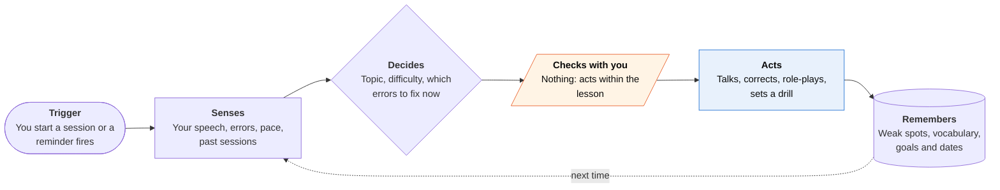

<!-- Generated by scripts/build.py from data/ideas.json. Edit the JSON, then run the script. -->

[← All ideas](../README.md) · **Being built now** · Learning & memory

# B-17 · AI conversation tutors

> Speak with an AI character that adapts mid-conversation; strong at talk, weak at planning your practice week.

| Difficulty | Novelty | Buildable on iOS today | Impact if it works | Horizon | Autonomy |
|---|---|---|---|---|---|
| `●●○○○` 2/5 | `●○○○○` 1/5 | `●●●●●` 5/5 | `●●●○○` 3/5 | Buildable now | L1 · Suggests, you act |

## The moment

Before your trip to Madrid you do a ten-minute video call with an AI tutor. She notices you avoid the past tense, steers the chat to your weekend, and corrects you gently without stopping the flow. It feels like practice with a patient friend.

## The problem

Speaking is the hardest skill to practice alone, and human tutors cost money and need scheduling. AI tutors now hold a real conversation and adapt within it. But they stop when the call ends: they don't plan your week, tie practice to your trip date, or push you toward real conversations with people.

## How the agent works

## iOS building blocks

- **AVFAudio (AVAudioEngine, AVAudioSession)** — low-latency two-way voice
- **Speech (SpeechTranscriber)** — on-device transcripts to mark errors after a session
- **Translation** — shows a quick translation when you get stuck
- **Foundation Models (@Generable)** — turns a session transcript into a structured list of errors to drill
- **EventKit** — books short practice sessions before a trip or exam date
- **User Notifications** — reminds you of the next session

## What makes it hard

- Latency: a pause of more than a beat breaks the feel of conversation, so most tutors stream audio to cloud speech models, which costs money every minute.
- Correcting without killing flow: too many corrections stop learners talking; too few let errors set in.
- Speech recognition does worse on learners' accented, halting speech, which makes pronunciation feedback hard to trust.
- The agentic step (planning the week, tying practice to a date, setting up real conversations with people) needs calendar access and matching with other people, and none of the leaders has built it.

## Risks and failure modes

- Children use these apps. Voice recordings of minors need short retention and parental consent.
- False fluency: learners do well with a patient AI and then freeze with fast, impatient native speakers.
- Streaks and engagement numbers can replace real progress as the thing the product optimizes.

## Unsaid assumptions

_What this idea quietly depends on being true. Check these before you build._

- That fluency comes from more minutes of AI conversation rather than from being pushed into real conversations with people.
- That learners are willing to speak aloud to a phone at home or in public.
- That per-minute voice model costs keep falling fast enough for cheap tiers.

## Unknown unknowns

_Open questions nobody has good answers to yet._

- Do AI conversation minutes carry over to real conversations, and how would anyone measure it?
- What would an agentic tutor that arranges real-world practice look like without the safety problems of meeting strangers?
- Will on-device speech models get good enough to cut the per-minute cloud cost?

## Prior art and who's building

- [Duolingo Video Call](https://blog.duolingo.com/video-call/) — Real-time AI conversation with the character Lily. Moved from Max to Super in February 2026, reaching about 10x more learners. Adapts inside the call only.
- [Speak](https://www.forbes.com/sites/rashishrivastava/2025/11/12/this-startup-is-racing-duolingo-to-replace-human-language-tutors-with-ai/) — Structured AI speaking curriculum competing to replace human tutors.
- [Praktika](https://resources.rework.com/tools/ai-tools/best-ai-tools-for-language-learning-2026) — Avatar-led AI tutors, listed in a 2026 roundup of AI language tools.

## Smallest useful first version

Add one agentic layer to a conversation tutor. You enter a trip or exam date; it books three short sessions a week on your calendar, aims each at the errors from your last call, and ends the week with a small real-world task (order a coffee, ask for directions) that you report back on.

Research notes: what we could and couldn't verify

Duolingo's figures (about 10x reach, words spoken more than doubled) are company claims from its blog and May 2026 shareholder letter as summarized in the digest. The Praktika link is a roundup page, not Praktika's own site. This category is conversational more than agentic; the card says so plainly.

## Related ideas

- [W-22 · Errand Immersion](../whitespace/W-22-errand-immersion.md)
- [B-26 · Offline on-device LLM apps](../building-now/B-26-offline-on-device-llm.md)
