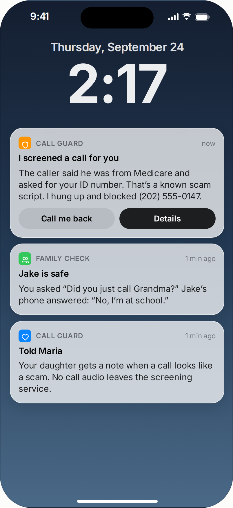
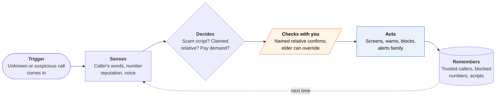
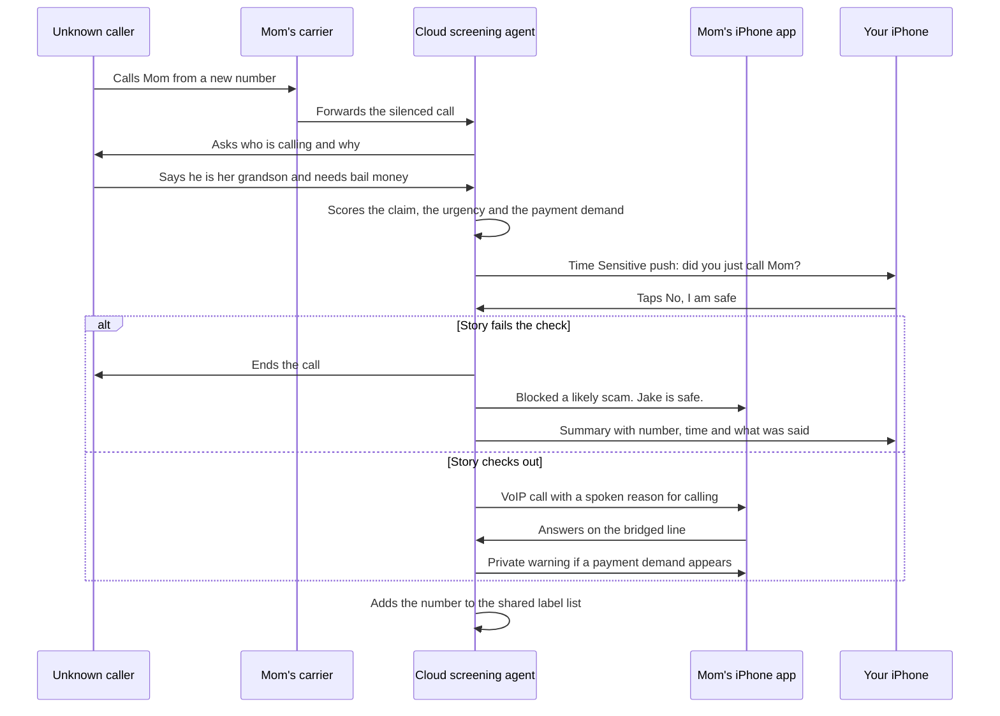

<!-- Generated by scripts/build.py from data/ideas.json. Edit the JSON, then run the script. -->

[← All ideas](../README.md) · **Being built now** · Safety & civic

# B-18 · Scam-call guardian agents

> An AI screens unknown callers, flags scam scripts and cloned voices, and alerts family before money moves.

| Difficulty | Novelty | Buildable on iOS today | Impact if it works | Horizon | Autonomy |
|---|---|---|---|---|---|
| `●●●○○` 3/5 | `●●○○○` 2/5 | `●●●○○` 3/5 | `●●●●○` 4/5 | Buildable now | L3 · Acts in guardrails, reports back |

## The moment

Your mother gets a call from 'her grandson', crying, who needs bail money today. Because unknown calls route through the guardian's screening line, the agent hears the claim and the payment demand before she does. It pings you: 'Did you just call Mom?' You tap No, and her screen says in large type: 'Blocked a likely scam. Jake is safe.'

## The problem

Scam calls now use scripts tuned for panic and, more and more, cloned voices of relatives. Carrier labels and blocklist apps catch known robocall numbers but not a fresh number with a convincing story. Older adults are targeted most, and the family usually hears about the call after the money is gone. The job is to catch the script, not just the number, and pull in someone who can confirm the story fast.

## How the agent works

## Deep dive

On iPhone, a third-party app never hears a cellular call, and it can't plug into Apple's Call Screening. Even the EU-only default dialer role in LiveCommunicationKit (iOS 26) lets an app place calls and read call history, not listen. So a guardian has to sit where the audio travels: in the network. The workable design has three layers.

1. **Number layer, no audio.** A Call Directory extension and Live Caller ID Lookup label or block known scam numbers on the system call screen. Cheap and private, but useless against a fresh number.
2. **Screening line.** With the family's help, the elder turns on Silence Unknown Callers and, on carriers that allow it, points busy and no-answer forwarding at the guardian's cloud number. Unknown callers now reach an agent that asks who they are and why they're calling.
3. **Bridged call.** If the caller passes, the agent connects them to the elder's app as a VoIP call. The audio still runs through the screening line, so the agent can warn her mid-call.

### What the first 90 days look like

- **Weeks 1-4: listen, don't block.** Set-up happens with a family member on a video call. Contacts, doctors and the pharmacy become an allowlist. Every screened call goes through with a one-line summary. The only metric is missed real calls, and it must be zero.
- **Weeks 5-8: add the family check.** When a caller claims to be a relative, the police or a bank, the named relative gets a Time Sensitive push. Blocking starts only for calls that match a scam script and fail that check.
- **Weeks 9-13: mid-call warnings.** On bridged calls, the agent gives the elder a short private warning when a payment demand appears (gift cards, wire transfers, crypto, "don't tell anyone"). The family gets a weekly summary.

### The hardest engineering problem

Telling a scam from a real emergency while the call is live. Real callers are urgent too: a hospital, or a grandchild who really is stuck. PreScam (2026) found that LLMs track how a scam escalates only moderately well, and TeleAntiFraud 2.0 saw fraud classifiers fall to 0.65-0.68 macro-F1 against similar legitimate calls. Voice-clone detection over a compressed phone line is an arms race, so it counts as one weak signal. The fix is to shrink the model's job. It spots the claim ("I'm your grandson") and the demand ("send money now"), then hands the claim to the one person who can check it, and all of that has to happen on streaming speech within seconds. Spoofing is the other gap: a scammer showing a relative's real number skips the unknown-caller route, so the elder also needs a one-press "Is this really Jake?" check.

### How it makes money

A monthly family subscription, usually paid by an adult child, priced to cover telephony minutes and speech processing. Banks, card issuers and carriers are natural distribution partners because they deal with scam losses and complaints every day. It must never sell call data: App Review 2.5.12 limits call-blocking data to running the service, and trust is the whole product.

## iOS building blocks

- **CallKit (CXCallDirectoryProvider)** — labels or blocks known scam numbers on the system incoming-call screen
- **IdentityLookup (Live Caller ID Lookup)** — real-time caller labels from your server through private information retrieval; needs Apple's approval
- **IdentityLookup (ILMessageFilterExtension)** — filters the scam texts that set up or follow a call
- **LiveCommunicationKit, or CallKit with PushKit** — delivers screened calls as VoIP calls so the audio stays on the screening line
- **User Notifications (Time Sensitive)** — sends 'Did you just call Mom?' to the relative's phone
- **ActivityKit (push-to-start Live Activity)** — shows the relative that a flagged call is in progress
- **App Intents** — one press of the Action button asks 'Is this a scam?' during any call

## What makes it hard

- No call audio: iOS gives third-party apps no access to live cellular calls. The agent has to sit in the network (carrier forwarding to a cloud line, or its own VoIP line), which older adults must set up and keep turned on.
- Accuracy on real calls: PreScam (2026) found LLMs track scam escalation only moderately well, and TeleAntiFraud 2.0 saw classifiers drop to 0.65-0.68 macro-F1 against similar legitimate calls. Blocking a real doctor's office once can end trust.
- Spoofed known numbers: a scammer showing a relative's real number skips unknown-caller routing, so the design also needs a check the elder can start herself.
- Apple's free Call Screening (iOS 26) already answers unknown callers and asks their purpose, and Truecaller and RoboKiller already block numbers. A paid guardian has to add what they don't: family in the loop and the whole conversation watched.

## Risks and failure modes

- Safety line: it must never block emergency services, hospitals or allowlisted contacts, and it must not decide for the elder. It warns and asks, and she can always take the call.
- Routing calls through a cloud line means processing the other party's speech, which runs into two-party consent laws. The greeting has to disclose it.
- Dignity: an app set up by adult children can slide into monitoring a parent. The elder should see and control every alert rule, and call data must not be reused (App Review 2.5.12).

## Unsaid assumptions

_What this idea quietly depends on being true. Check these before you build._

- That older adults keep call forwarding and permissions turned on even after the app blocks a real doctor's office once.
- That a relative answers a verification ping within a minute or two, day or night.
- That carriers keep allowing conditional forwarding to third-party lines.

## Unknown unknowns

_Open questions nobody has good answers to yet._

- Can voice-clone detection over a phone-quality line stay ahead of cloning tools, or is it a losing race?
- Will Apple open call audio or Call Screening results to trusted guardian apps, the way it opened call translation to VoIP apps?
- Who is liable when the guardian lets a scam through, or blocks a real emergency call?

## Prior art and who's building

- [Apple Call Screening (iOS 26)](https://www.fastcompany.com/91349248/ios-26s-best-new-feature-iphone-better-phone-hold-contacts-unkown-number-hold-assist-call-screening) — Answers unknown numbers, asks who is calling and why, and shows a live transcript. Free and built in, but it doesn't alert family or judge the story.
- [Hiya AI Call Assistant](https://www.hiya.com/newsroom/press-releases/hiya-launches-first-ai-call-assistant-that-stops-live-and-deepfake-scams-in-real-time) — Screens calls and, per Hiya, flags live and deepfake scam calls in real time.
- [SeniorShield.ai](https://apps.apple.com/us/app/seniorshield-ai-scam-blocker/id6738144273) — Scam-blocking app for older adults on the App Store.
- [Scammer Guardian](https://www.scammerguardian.com/about/) — Ohio startup (founded 2025) that says it screens scam calls before they reach seniors; reports an iPhone launch in early 2026.
- [ZoraSafe](https://www.zorasafe.com/for-seniors) — Phishing and QR-code checks with family alerts; focused on texts and links more than live calls.

## Smallest useful first version

A family-plan app for one elder: guided carrier forwarding so unknown calls reach a cloud screener, a Contacts allowlist, and one rule. If a caller claims to be a relative or asks for money, the named relative gets a Time Sensitive 'Did you just call?' push and the elder gets a plain-language warning. No automatic blocking in the first release.

Research notes: what we could and couldn't verify

Hiya's product details come from its press-release title only; how it reaches iPhone call audio is unverified. Scammer Guardian's iPhone launch is the company's own claim. Truecaller and RoboKiller are named in the candidate but had no URLs in the research, so they appear in text only. Whether iPhone Call Screening and carrier no-answer forwarding interact cleanly on every carrier is untested. Mermaid sequence labels are quoted per the spec; Mermaid shows the quote marks literally in sequence diagrams.

## Related ideas

- [W-04 · Really-You Check](../whitespace/W-04-really-you-check.md)
- [W-16 · Ulysses Money Pact](../whitespace/W-16-ulysses-money-pact.md)
- [B-02 · Phone-call errand agents](../building-now/B-02-phone-call-errand-agents.md)
