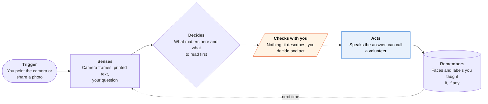

<!-- Generated by scripts/build.py from data/ideas.json. Edit the JSON, then run the script. -->

[← All ideas](../README.md) · **Being built now** · Accessibility

# B-19 · Blind-assist scene agents

> Point the camera and an AI reads, describes and answers questions, then hands off to a person if needed.

| Difficulty | Novelty | Buildable on iOS today | Impact if it works | Horizon | Autonomy |
|---|---|---|---|---|---|
| `●●○○○` 2/5 | `●○○○○` 1/5 | `●●●●●` 5/5 | `●●●●○` 4/5 | Buildable now | L1 · Suggests, you act |

## The moment

You are blind and a thick envelope arrives. You open Be My Eyes, point the camera, and Be My AI tells you it is a jury summons, reads out the date and the court address, and answers when you ask what to bring. Then you open the court's online response form, and the help stops: you are back to guessing at unlabeled buttons.

## The problem

Blind and low-vision people meet print, screens and places that were not designed for them many times a day. Description apps now read letters, labels and scenes well, and they answer follow-up questions. But the job rarely ends at knowing what something says. It ends at a form, a checkout or a support chat that VoiceOver can't get through, and consumer apps stop at describing.

## How the agent works

## iOS building blocks

- **AVFoundation (AVCaptureSession)** — live camera frames for scene and document capture
- **VisionKit (DataScannerViewController) and Vision (RecognizeDocumentsRequest)** — live text and document reading on the device
- **Foundation Models (Attachment, iOS 27)** — ask the on-device model questions about an image without uploading it
- **Visual Intelligence (IntentValueQuery, SemanticContentDescriptor)** — answer when the user points the system camera mode at something
- **Accessibility (AccessibilityNotification.Announcement)** — speak results through VoiceOver instead of a second voice
- **Core Haptics** — aiming cues so a user can frame a page they can't see

## What makes it hard

- Aiming comes first. A blind user can't see whether the page is in frame, so the app has to guide the camera with sound or haptics before any model runs.
- Confident mistakes are dangerous. A misread dose, date or amount sounds as sure as a correct one, so apps must say when text is cut off or blurry and offer a human check.
- Acting after the description is the wall. Third-party apps can't drive other apps on iOS, and computer-use agents do worse under assistive-tech conditions: in the A11y-CUA dataset one agent's success fell from 78.3% by default to 28.3% under magnifier conditions.
- Agents make choices silently. In the Morae field study, an agent asked to buy the cheapest sparkling water picked one of several equally priced items without telling the blind user the others existed.

## Risks and failure modes

- Photos of mail, medicine and faces (including bystanders) go to cloud models. Guideline 5.1.2(i) requires explicit consent before sending them to a third-party AI; iOS 27's on-device image input avoids that but may read dense print less well.
- Over-trust. The safety line: for medication labels, money and legal deadlines, the app flags uncertainty and suggests a second read or a human volunteer instead of sounding sure.
- The most agentic product here, Service AI, is sold to companies. A company's own support agent answers to the company, and may steer a blind customer toward what is cheapest to support.

## Unsaid assumptions

_What this idea quietly depends on being true. Check these before you build._

- That describing the world is still the bottleneck, when more and more it is the inaccessible form or checkout after the description.
- That blind users will keep pointing cameras at private mail and sharing it with a cloud model in exchange for speed and accuracy.
- That companies keep paying for accessible support agents rather than fixing their own apps and websites.

## Unknown unknowns

_Open questions nobody has good answers to yet._

- Can an agent that acts (fills a form, finishes a checkout) be made trustworthy for someone who can't glance at the screen to check its work?
- Will Apple ever give third parties anything like VoiceOver's view of other apps, or keep that inside VoiceOver and Siri?
- How well does iOS 27's on-device image model read long, dense documents compared with the cloud models these apps use now?

## Prior art and who's building

- [Be My Eyes / Be My AI](https://apps.apple.com/us/app/be-my-eyes/id905177575) — Free app: AI image description with follow-up questions, plus live sighted volunteers. Describes and explains; doesn't act.
- [Be My Eyes Service AI](https://www.bemyeyes.com/business/blog/the-future-of-ai-in-accessible-customer-service-for-blind-and-low%E2%80%91vision-customers/) — Sold to businesses such as Microsoft's Disability Answer Desk: reads a customer's screenshots and returns step-by-step accessible guidance for that company's product only.
- [Microsoft Seeing AI (with Be My Eyes compared)](https://www.brailleinstitute.org/find-services/offerings/explore-the-be-my-eyes-and-seeing-ai-applications/) — Reads short text, documents and products and describes scenes. Strong at describing, no help finishing a task.
- [A11y-CUA dataset (University of Michigan, UC Berkeley)](https://huggingface.co/papers/2602.09310) — Research: a computer-use agent that succeeded on 78.3% of tasks dropped to 41.67% keyboard-only and 28.3% under magnifier conditions.
- [Morae (CMU, Adobe, Berkeley)](https://huggingface.co/papers/2508.21456) — Research prototype that pauses a UI agent at decision points so a blind user makes the choice instead of the agent.

## Smallest useful first version

A document-first app: photograph a letter, get a short spoken summary read on the device, and turn any deadline, amount or phone number into a Calendar event or contact after a read-back. If the text is blurry or cut off, it says so and offers a human check instead of guessing.

Research notes: what we could and couldn't verify

Be My AI's 36-language support comes from a web search snippet of Be My Eyes' help pages; I dropped it from the card text to be safe. I used the digest's Service AI blog URL instead of the candidate's /business/bme-service-ai/ page, which I did not see. Envision, Aira and Lazarillo are named in the candidate but left without links. The Braille Institute URL comes from the candidate and I did not open it.

## Related ideas

- [W-09 · Pause-and-Ask Errands](../whitespace/W-09-pause-and-ask-errands.md)
- [M-04 · Agent That Reads VoiceOver's Map](../moonshot/M-04-voiceover-map-agent.md)
- [M-23 · Kiosk Hands](../moonshot/M-23-kiosk-hands.md)
