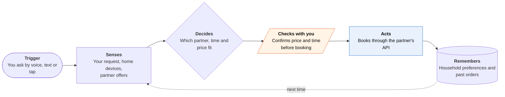

<!-- Generated by scripts/build.py from data/ideas.json. Edit the JSON, then run the script. -->

[← All ideas](../README.md) · **Being built now** · Physical world

# B-20 · Voice home-and-errands agents

> Say what you need and a voice assistant books the ride, the table or the repair through partner services.

| Difficulty | Novelty | Buildable on iOS today | Impact if it works | Horizon | Autonomy |
|---|---|---|---|---|---|
| `●●●○○` 3/5 | `●○○○○` 1/5 | `●●●●○` 4/5 | `●●●○○` 3/5 | Buildable now | L2 · Drafts, you approve |

## The moment

Your dishwasher is leaking onto the kitchen floor. You tell Alexa+ to find someone who can fix it this week. It gets quotes through a home-services partner, offers Thursday morning at a stated price, and books it when you say yes. The confirmation shows up in the Alexa app on your iPhone.

## The problem

Household errands are many small bookings spread across many apps: a ride, a table, a plumber, a haircut. Each one means opening an app, comparing options and typing the same details again. Older voice assistants answered questions but stalled at the booking. The new ones book, but only where the assistant's maker has signed a partner deal.

## How the agent works

## iOS building blocks

- **App Intents (AppShortcutsProvider)** — start a request from Siri, Spotlight, Shortcuts or the Action button
- **Speech (SpeechAnalyzer)** — on-device transcription when the user speaks inside the app
- **HomeKit and MatterSupport** — control and add the smart-home devices the assistant acts on
- **ActivityKit (Live Activities)** — ride, delivery or technician status on the Lock Screen and Dynamic Island
- **User Notifications** — booking confirmations, changes and follow-ups

## What makes it hard

- Coverage is a business-development job. Each partner (Expedia, Yelp, Angi and Square for Alexa+) is a hand-built integration, so the assistant can only book where a deal exists. That is slower to grow than a cloud browser but far more reliable.
- Voice is a poor place to compare options. Three quotes with different prices and time windows need a screen, so the phone app has to carry the comparison.
- On iPhone the assistant is a guest. Siri owns the side button everywhere except Japan (where iOS 26.2 lets users pick a third-party assistant), so other assistants are reached through App Intents, widgets and Shortcuts, not a wake word.
- The apps are still rough: Consumer Reports' review called the Alexa+ app 'still a mess'.

## Risks and failure modes

- Steering: an assistant that sits between you and every business can favor partners that pay it. Show why a provider was picked and what else was available.
- Wrong bookings cost money and time (a no-show fee, a technician at the wrong address). Read back price, time and place before every booking, and make cancelling easy.
- A speaker in the home hears guests and children. Voice history controls and per-person profiles need to be easy to find.

## Unsaid assumptions

_What this idea quietly depends on being true. Check these before you build._

- That partners stay willing to let one assistant sit between them and their customers.
- That people trust a spoken 'yes' to spend money on services.
- That the speaker-first habit carries over to the phone, where Siri AI now answers the same requests.

## Unknown unknowns

_Open questions nobody has good answers to yet._

- Will Siri AI, which can chain any app's App Intents, make a separate errands assistant unnecessary on iPhone?
- Who pays when a booked job goes wrong: the assistant, the marketplace or the tradesperson?
- Can partner-API coverage ever reach as many businesses as cloud-browser agents and phone-call agents do?

## Prior art and who's building

- [Alexa+](https://www.aboutamazon.com/news/devices/alexa-plus-available-free-prime-members-us) — Orders takeout, reserves tables, books rides and schedules repairs; runs on Amazon Nova and Anthropic models. Free with Prime in the US since February 2026.
- [Alexa+ booking integrations](https://www.aboutamazon.com/news/devices/alexa-plus-voice-booking-integrations) — Hotels via Expedia, home-service quotes and bookings via Yelp and Angi, salon bookings via Square, rolling out through 2026.
- [Consumer Reports review of Alexa+](https://www.consumerreports.org/electronics/digital-assistants/amazon-alexa-plus-ai-assistant-review-a1667486499/) — Independent review of Alexa+ in daily use; critical of the app.
- [Google AI Mode agentic booking](https://9to5google.com/2026/04/10/google-ai-mode-redesign/) — Books restaurants across reservation platforms from Search on iPhone; hotel booking followed in August 2026.
- [Poke](https://techcrunch.com/2026/06/04/apple-approves-poke-as-the-first-ai-agent-on-its-messages-for-business-platform/) — Text-message agent inside iMessage that also handles smart-home control; no voice-first booking network.

## Smallest useful first version

Pick one errand with a clean partner API, such as restaurant bookings or rides, and make it work end to end from the iPhone: ask, hear two options, confirm, and follow it in a Live Activity until it's done. Add a second errand only when the first one rarely fails.

Research notes: what we could and couldn't verify

Raised difficulty from the candidate's 2 to 3 because the category depends on partner deals. The 'still a mess' quote is from the research digest's summary of the Consumer Reports review; I did not open the review. I did not check whether the Expedia, Yelp, Angi and Square integrations have all launched.

## Related ideas

- [B-02 · Phone-call errand agents](../building-now/B-02-phone-call-errand-agents.md)
- [B-13 · Messaging-native personal agents](../building-now/B-13-messaging-native-agents.md)
- [B-21 · Apple's built-in agents](../building-now/B-21-apple-built-in-agents.md)
