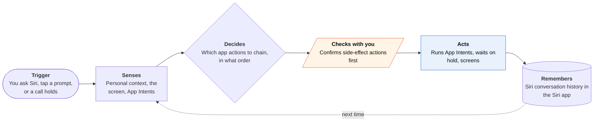

<!-- Generated by scripts/build.py from data/ideas.json. Edit the JSON, then run the script. -->

[← All ideas](../README.md) · **Being built now** · Life admin

# B-21 · Apple's built-in agents

> Siri AI chains app actions, the Phone app waits on hold and screens callers, and Passwords can reset logins.

| Difficulty | Novelty | Buildable on iOS today | Impact if it works | Horizon | Autonomy |
|---|---|---|---|---|---|
| `●●●●●` 5/5 | `●○○○○` 1/5 | `●●○○○` 2/5 | `●●●●●` 5/5 | Buildable now | L3 · Acts in guardrails, reports back |

## The moment

You call your airline and land in a long queue. Hold Assist offers to wait, mutes the hold music, and buzzes you when a person picks up. That evening you ask Siri to turn the recipe your sister emailed into a grocery list, and it pulls the ingredients from Mail into Reminders.

## The problem

Many phone chores cross apps or wait on other people: an email holds the details, another app holds the action, and a phone queue holds your afternoon. Classic Siri could run one command in one app. Apple now ships agents for these jobs, but they cover mostly Apple's own apps, run only on newer iPhones, and third-party apps can take part only as tools Siri calls.

## How the agent works

## iOS building blocks

- **App Intents (app schema domains, IndexedEntity)** — expose your app's content and actions so Siri AI can find and chain them
- **App Intents (OwnershipProvidingEntity, iOS 27)** — mark content private, shared or public so Siri asks before side effects
- **App Intents (IntentAuthenticationPolicy)** — block sensitive actions while the device is locked
- **Visual Intelligence (IntentValueQuery, SemanticContentDescriptor)** — return your app's matches for what the camera or a screenshot shows
- **App Intents (AppShortcutsProvider)** — make your actions building blocks in Shortcuts, including shortcuts built from a description

## What makes it hard

- Siri AI reaches third-party apps only through App Intents and app schemas. Apple's named partners were few (WhatsApp, Audible, Outlook, Notability, Tripsy), so anything outside Apple's own apps stays patchy until developers adopt the schemas.
- Access is gated. Siri AI shipped September 14, 2026 as an opt-in beta with a waitlist, English only, on iPhone 15 Pro and later, and not on iPhone in the EU or China. Press reports (AppleInsider, MacRumors) also describe daily usage caps, with a paid higher tier to come.
- The narrow agents are closed. There is no public API to wait on hold, screen a cellular call, or drive Safari through a password change, so third-party call agents place calls from cloud telephony instead.
- Passwords' automatic change needs a supported site's change flow and an Apple Intelligence device. 9to5Mac reported it appeared inconsistently across betas and may arrive in a later 27.x update.

## Risks and failure modes

- Prompt injection through what Siri reads (mail, messages, web pages). Apple's WWDC26 security session names indirect prompt injection and action poisoning, and asks apps to mark side-effecting intents so the system confirms them.
- Over-exposure: security firm NowSecure reported that about 1 in 4 apps it tested exposed functionality to Siri AI, which widens what a hijacked request could do.
- Privacy: EFF and press coverage report that on-screen awareness can't be blocked per app, so a sensitive chat on screen can be read if you invoke Siri over it.

## Unsaid assumptions

_What this idea quietly depends on being true. Check these before you build._

- That enough apps adopt App Intents schemas for Siri AI to feel general rather than a demo with a handful of partners.
- That people accept Apple's model as the planner and every other app as a tool it calls.
- That Apple keeps its narrow agents (hold, screening, passwords) closed rather than opening them as APIs.

## Unknown unknowns

_Open questions nobody has good answers to yet._

- When will the reported Apple Intelligence 'Extensions' let Claude or Gemini power Siri, and with what access to App Intents? Press reports say only ChatGPT is live so far.
- Will Apple ever let a third-party agent call other apps' App Intents, for example through MCP? So far Apple shipped MCP only in Xcode, as a bridge for coding agents (from Xcode 26.3).
- How much will waitlists, daily caps and the English-only launch slow real use of Siri AI in its first year?

## Prior art and who's building

- [Siri AI (Apple Newsroom)](https://www.apple.com/newsroom/2026/09/siri-ai-a-profoundly-more-capable-and-personal-assistant-is-here/) — Apple's launch post: personal context, on-screen awareness and actions across apps through App Intents, as an opt-in beta.
- [Hold Assist and Call Screening (iOS 26)](https://www.fastcompany.com/91349248/ios-26s-best-new-feature-iphone-better-phone-hold-contacts-unkown-number-hold-assist-call-screening) — Phone app features: waits on hold and alerts you when a person answers; asks unknown callers who they are and why. Not open to developers.
- [Visual Intelligence integration (WWDC26 session 297)](https://developer.apple.com/videos/play/wwdc2026/297/) — How apps return results for what the camera or a screenshot shows; in iOS 27 it moved into a Siri mode in the Camera app and can add events, contacts and health readings.
- [Passwords automatic password change (press report)](https://9to5mac.com/2026/08/27/ios-27s-passwords-app-can-change-your-passwords-for-you-automatically/) — 9to5Mac: one tap hands a weak or leaked password to Apple Intelligence and Safari, which sign in, change it and save the new one. Rollout reported as inconsistent.
- [Siri AI waitlist (press report)](https://9to5mac.com/2026/09/14/ios-27-has-a-waitlist-for-accessing-new-siri-ai/) — 9to5Mac on the waitlist that gates Siri AI at launch.

## Smallest useful first version

For an app developer, the smallest useful step is to adopt one app schema domain that fits your app, index your main entities with IndexedEntity, and mark side-effecting intents so the system confirms them. Test the actions in Shortcuts first, since Siri AI itself is behind a waitlist.

Research notes: what we could and couldn't verify

Scores read this card as 'build this yourself': only Apple can, so difficulty is 5 and feasibility 2. Plugging an app into it with App Intents is easy. Press-reported items are labeled in the text: Passwords auto-change (9to5Mac), daily caps and a paid tier (AppleInsider, MacRumors), the 'Extensions' system (MacRumors), and the EFF claim about on-screen awareness. The press-reported SiriKit deprecation is left out. The 'recipe in email to a Reminders list' example comes from the research digest's summary of Apple's materials. I replaced the candidate's June Newsroom URL with the September launch post that the research and landscape doc cite, and dropped the '18-month delay' framing.

## Related ideas

- [B-02 · Phone-call errand agents](../building-now/B-02-phone-call-errand-agents.md)
- [B-18 · Scam-call guardian agents](../building-now/B-18-scam-call-guardians.md)
- [B-20 · Voice home-and-errands agents](../building-now/B-20-voice-home-errands-agents.md)
