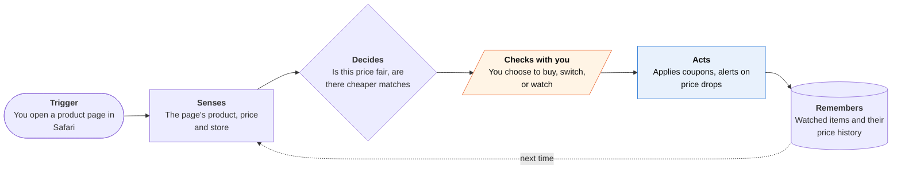

<!-- Generated by scripts/build.py from data/ideas.json. Edit the JSON, then run the script. -->

[← All ideas](../README.md) · **Being built now** · Money & commerce

# B-22 · Safari shopping-extension agents

> A Safari extension checks the product page you're on against new and resale prices, and applies coupons.

| Difficulty | Novelty | Buildable on iOS today | Impact if it works | Horizon | Autonomy |
|---|---|---|---|---|---|
| `●●○○○` 2/5 | `●○○○○` 1/5 | `●●●●●` 5/5 | `●●○○○` 2/5 | Buildable now | L1 · Suggests, you act |

## The moment

You are about to buy a $260 jacket in Safari on your phone. The shopping extension's panel shows the same jacket, barely worn, for $140 on a resale site, plus a price history for this store. You add it to your watch list instead, and a notification arrives when the price falls.

## The problem

The same item costs different amounts across stores, resale sites and weeks, and coupon codes are scattered and often expired. Checking all of that on a phone, mid-purchase, is too slow, so most people just pay. Browser extensions do the checking on the page where you already shop, but most earn money from the purchase, which bends their incentives.

## How the agent works

## iOS building blocks

- **Safari web extensions (SafariServices)** — read the product page and add a price panel or coupon step on sites the user allows
- **User Notifications** — price-drop alerts pushed from a server-side watcher
- **WidgetKit** — a watch-list widget with current prices
- **Share extension (NSExtensionContext)** — send a product link from any app into the watch list

## What makes it hard

- Matching the exact item across sites (size, color, condition, model year) is the core problem. A wrong match shows a 'cheaper' price for a different product.
- Safari asks users to grant an extension access site by site, and App Review guideline 4.4.2 says extensions should not claim access to more websites than they need. That pulls against a tool that has to work on every store.
- Price history and resale inventory need a large crawling backend. The extension on the phone is the thin part.
- None of these tools buy for you. Agents that do buy at a target price, such as Amazon's Auto Buy, run inside the retailer's own app, and Apple offers no agent payment API.

## Risks and failure modes

- Affiliate conflicts are the category's known failure. In July 2026 a Bloomberg investigation, reported by TechCrunch, accused Phia of 'cookie stuffing' (claiming affiliate credit for purchases it did not drive), and it was reportedly suspended from the Impact.com affiliate platform. PayPal Honey faced similar accusations and lawsuits from late 2024.
- Reading every product page you visit is sensitive browsing data. Match on the device where possible and say plainly what leaves the phone.
- A lower resale price can mislead if condition, seller rating and return policy aren't shown next to it.

## Unsaid assumptions

_What this idea quietly depends on being true. Check these before you build._

- That the extension's affiliate income never tilts which 'best price' it shows.
- That shoppers will grant a shopping extension access to every store site in Safari.
- That retailers keep tolerating automatic coupon entry rather than blocking it at checkout.

## Unknown unknowns

_Open questions nobody has good answers to yet._

- Will agentic browsers on iPhone (Perplexity Comet) or Siri AI reading the screen make a separate shopping extension unnecessary?
- Can an extension take the next step, buying at a target price, without any Apple Pay API for agents?
- How will affiliate networks police attribution after the Honey and Phia cases?

## Prior art and who's building

- [Phia](https://apps.apple.com/us/app/phia-shop-smarter-save-money/id6739351340) — App plus Safari extension from Phoebe Gates and Sophia Kianni: compares new and resale prices across 350M+ products, judges whether a price is fair, applies coupons, watches for drops. Raised a $35M Series A in January 2026 (TechCrunch).
- [Phia cookie-stuffing report (TechCrunch)](https://techcrunch.com/2026/07/10/phia-accused-of-cookie-stuffing-taking-affiliate-credit-on-purchases-it-didnt-earn/) — July 2026: accused of taking affiliate credit on purchases it didn't earn. Shows how the business model can work against the shopper and the store.
- [PayPal Honey](https://www.nerdwallet.com/finance/learn/browser-extensions-online-shopping) — Coupon extension for Safari and other browsers; applies codes at checkout. Leaves price comparison across resale sites to others.
- [Capital One Shopping](https://www.moneycrashers.com/capital-one-shopping-vs-honey/) — Price comparison and coupons through an extension and app; like the others, it stops before buying.
- [Perplexity Comet for iOS](https://www.perplexity.ai/hub/blog/meet-comet-for-ios) — Agentic browser on iPhone (March 2026) that can act on pages instead of only annotating them.

## Smallest useful first version

A Safari extension for one category with a strong resale market, such as designer clothing or cameras, that shows a checked same-item match and a price-history line on the product page. Label affiliate links on the panel and rank results by total price, not commission.

Research notes: what we could and couldn't verify

Web search confirmed Phia's Series A (TechCrunch, Jan 27, 2026, $35M; other outlets say $35.5M) and the July 2026 cookie-stuffing allegations (TechCrunch, July 10 and Aug 11, 2026). The Impact.com suspension comes from a search-result summary and is marked 'reportedly'. The Honey controversy (from December 2024) is from my general knowledge, with no URL on the card. I dropped the candidate's '220K+ sites' because sources disagree, and Capital One's '100K+ stores' because I couldn't verify it. The NerdWallet, MoneyCrashers and Perplexity URLs come from the candidate and I did not open them.

## Related ideas

- [B-06 · Price-watch auto-buy agents](../building-now/B-06-price-watch-auto-buy.md)
- [W-30 · Shelf Price Witness](../whitespace/W-30-shelf-price-witness.md)
- [B-01 · Cloud-computer errand agents](../building-now/B-01-cloud-errand-agents.md)
