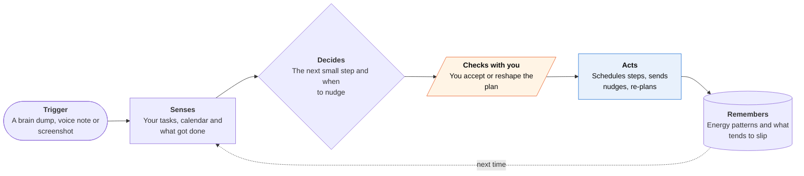

<!-- Generated by scripts/build.py from data/ideas.json. Edit the JSON, then run the script. -->

[← All ideas](../README.md) · **Being built now** · Mind & focus

# B-23 · ADHD task-breakdown planners

> Apps that turn a brain dump or a screenshot into small steps, well-timed reminders and check-ins.

| Difficulty | Novelty | Buildable on iOS today | Impact if it works | Horizon | Autonomy |
|---|---|---|---|---|---|
| `●○○○○` 1/5 | `●○○○○` 1/5 | `●●●●●` 5/5 | `●●●○○` 3/5 | Buildable now | L2 · Drafts, you approve |

## The moment

You screenshot a scary insurance letter and share it to your planner. It splits 'deal with this' into five ten-minute steps, puts the first one at 10 a.m. when you usually have energy, and at 4 p.m. a check-in asks whether you made the call. You didn't, so it moves that step to tomorrow and makes it smaller.

## The problem

For many people with ADHD, the hard part is starting: a vague, dreaded task has no obvious first step, and reminders get swiped away. Classic to-do apps store tasks but don't break them down or notice what slipped. AI planners now do both, but they stop at the plan. The call, the form and the email still wait for you.

## How the agent works

## iOS building blocks

- **Share extension (NSExtensionContext)** — take in screenshots, emails and links from any app
- **Foundation Models with Vision OCRTool (iOS 27)** — read a screenshot and split a task into steps on the device
- **EventKit** — place steps in Calendar and Reminders
- **User Notifications (time-sensitive interruption level)** — nudges that can break through Focus when the user allows it
- **AlarmKit** — alarm-style reminders for steps that must not be missed
- **ActivityKit (Live Activities)** — a visible timer for the current ten-minute step

## What makes it hard

- Nudge fatigue. Too many reminders get ignored and too few let tasks slip, so the app has to learn per person which nudges work, from very little data.
- Re-planning without shame. When steps slip, the plan has to shrink and move, not pile up as red overdue items.
- Doing the task is the missing half. The dreaded step is often a phone call or a form. Call agents such as Pine and Assindo exist but aren't built for this user, and iOS won't let a planner act inside other apps.
- Energy-aware scheduling needs signals such as sleep and calendar load. HealthKit data is tightly restricted, and many users won't want to share it.

## Risks and failure modes

- Health line: these apps must not claim to diagnose or treat ADHD or stand in for clinical care, and should say so.
- Accountability can slide into guilt. Streak pressure and shame copy are dark patterns for this audience; avoid them.
- Screenshots of letters and bills carry private data. Guideline 5.1.2(i) requires explicit consent before sending them to a third-party model; reading them on the device avoids that.

## Unsaid assumptions

_What this idea quietly depends on being true. Check these before you build._

- That breaking a task down is the hard part, when for many users it is the phone call at the end.
- That users will keep opening one more app instead of the notes and reminders they already use.
- That AI check-ins keep working after the novelty fades. Shelpful pairing its AI with human coaches suggests they may not work alone.

## Unknown unknowns

_Open questions nobody has good answers to yet._

- Does AI task breakdown improve follow-through over months, or only feel helpful in the first week? Little public evidence either way.
- Should the planner hand the dreaded step to a call or email agent, and how much control do users want to give up?
- Could this live inside Reminders and Siri AI through App Intents instead of as a separate app?

## Prior art and who's building

- [Shelpful](https://apps.apple.com/us/app/shelpful-ai-for-adhd-tasks/id6741499362) — AI planner paired with human coaches for follow-through. Coverage says it raised $3M. Organizes and checks in; doesn't do the task.
- [Neurolist](https://apps.apple.com/us/app/neurolist-ai-planner-for-adhd/id6468689182) — AI planner for ADHD that breaks tasks into steps and schedules them.
- [Saner.AI](https://www.saner.ai/) — Turns scattered notes, email and meetings into tasks; aimed at ADHD users.
- [ClearMindAI](https://apps.apple.com/np/app/clearmindai-ai-to-do-tasks/id6744586488) — AI to-do app that breaks tasks down; stops at the plan.

## Smallest useful first version

A share-sheet action that turns a screenshot or pasted email into three to five small steps, puts the first one on your calendar, and sends one check-in at a time you pick. No streaks, and one tap to shrink or postpone a step.

Research notes: what we could and couldn't verify

Shelpful's $3M raise is 'coverage says' in the digest; I didn't check the investor. Tiimo and Goblin.tools are named in the candidate and left off the card without links. Assindo appears only in the candidate set, with no digest entry. The Neurolist, Saner.AI and ClearMindAI URLs come from the candidate and I did not open them.

## Related ideas

- [W-05 · Dread Opener](../whitespace/W-05-dread-opener.md)
- [B-02 · Phone-call errand agents](../building-now/B-02-phone-call-errand-agents.md)
- [B-03 · Inbox triage-and-draft agents](../building-now/B-03-inbox-triage-drafts.md)
