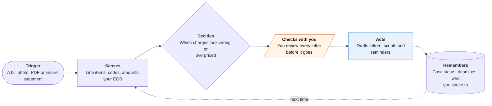

<!-- Generated by scripts/build.py from data/ideas.json. Edit the JSON, then run the script. -->

[← All ideas](../README.md) · **Being built now** · Health & body

# B-24 · Medical-bill dispute tools

> Photograph an itemized bill; the tool flags suspect charges and writes the dispute letter and call script.

| Difficulty | Novelty | Buildable on iOS today | Impact if it works | Horizon | Autonomy |
|---|---|---|---|---|---|
| `●●○○○` 2/5 | `●●○○○` 2/5 | `●●●●○` 4/5 | `●●●●○` 4/5 | Buildable now | L2 · Drafts, you approve |

## The moment

A $4,800 ER bill arrives. You ask the hospital for the itemized version, photograph it, and the tool flags a CT scan billed twice and a code priced far above typical rates. It drafts a letter asking for review and a script for the call to the billing office. You still make the call, and you have to remember to follow up.

## The problem

Medical bills are hard to read, often wrong, and say nothing about what a fair price would be. Checking codes against benchmarks, writing a dispute and chasing the billing office takes hours most people don't have. In one widely covered case a man used Claude to cut a $195,628 hospital bill to about $32,500 by researching Medicare rates. It took hours of hand work that consumer tools only partly cover.

## How the agent works

## iOS building blocks

- **VisionKit (VNDocumentCameraViewController)** — clean scans of multi-page bills
- **Vision OCRTool with Foundation Models (iOS 27)** — pull codes and amounts on the device before anything is uploaded
- **PDFKit** — read bills and insurer statements that arrive as PDFs
- **HealthKit clinical records (HKClinicalRecord)** — compare billed services with visit records the user chooses to share
- **MessageUI (MFMailComposeViewController)** — send the letter from the user's own email account
- **EventKit and User Notifications** — follow-up dates and response deadlines

## What makes it hard

- Telling a real error from a legitimate charge needs coding knowledge and payer context (the explanation of benefits, network status), not just a price lookup.
- Benchmarks disagree. Medicare rates, commercial fair-price data and a hospital's posted prices can differ a lot, and the letter must cite the one that fits the patient: insured, uninsured or out of network.
- Rules depend on the situation. The federal No Surprises Act covers surprise out-of-network bills and lets uninsured patients dispute bills well above a good-faith estimate; most other disputes run through the hospital's own process.
- Follow-through is where tools stop: calls, holds, promised callbacks, and bills sent to collections while a dispute is open. iOS gives apps no access to cellular calls, so the call needs cloud telephony or stays with the patient.

## Risks and failure modes

- Safety line: this is not legal or medical advice. Never tell a patient to ignore a bill or stop paying; a missed deadline can send a bill to collections.
- False flags waste the patient's time and can sour the relationship with a provider they still need. Show the evidence and a confidence level for each flag.
- Bills and records are health data. Keep extraction on the device, and get explicit consent (guideline 5.1.2(i)) before sending anything to a third-party model.

## Unsaid assumptions

_What this idea quietly depends on being true. Check these before you build._

- That hospitals respond to well-cited letters, not only to persistence on the phone.
- That patients can get an itemized bill and their insurer's explanation of benefits quickly.
- That the biggest savings come from errors and overpricing, rather than from financial assistance programs patients never applied for.

## Unknown unknowns

_Open questions nobody has good answers to yet._

- What share of disputes succeed from a letter alone, versus after calls? None of these tools publish it.
- Provider-side billing AI (Insight Health, Develop Health) is better funded. What happens when a patient's tool argues with the hospital's?
- Can a consumer tool act as the patient's representative on calls, and with what written authorization?

## Prior art and who's building

- [MyMedBill](https://mymedbill.co/) — Bill checks and dispute letters; claims 8,000+ users. Leaves the calls and tracking to the patient.
- [Medical Bill Negotiator: IQ (IQBill)](https://apps.apple.com/us/app/-/id6757212060) — iOS app that reviews bills and prepares negotiation material.
- [CareRoute Bill Defense](https://www.careroute.ai/bill-defense) — Works on contingency and takes on more of the process than letter-only tools.
- [MediSpute](https://www.medispute.com/) — Another consumer bill-dispute service in the same mold.
- [The $195k hospital bill case](https://nationaltoday.com/us/ny/dobbs-ferry/news/2026/02/13/ai-helps-patient-negotiate-163-000-off-hospital-bill/) — Coverage of a man who used a general chatbot and hours of work to cut a hospital bill by about $163,000. The category's best proof point is not a product.

## Smallest useful first version

Scan an itemized bill, flag duplicates and charges far above Medicare benchmarks with the evidence for each, and draft one letter the patient sends from their own email. Add a simple case timeline with a follow-up reminder and a log of every call.

Research notes: what we could and couldn't verify

The digest describes the $195,628 case as 'a man used Claude'; the candidate said 'a family'. I followed the digest and did not open the article. The No Surprises Act point is from my general knowledge; I left out its dollar threshold and deadlines. The digest does not describe MediSpute's exact offering, so its note is kept vague.

## Related ideas

- [W-01 · Denial Clock](../whitespace/W-01-denial-clock.md)
- [B-08 · Bill-fighting and cancel agents](../building-now/B-08-bill-fighting-agents.md)
- [W-20 · Chart Check](../whitespace/W-20-chart-check.md)
