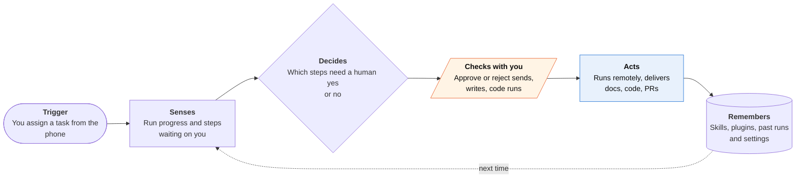

<!-- Generated by scripts/build.py from data/ideas.json. Edit the JSON, then run the script. -->

[← All ideas](../README.md) · **Being built now** · Work & business

# B-25 · Pocket supervision of work agents

> Hand a task to a work agent from your phone, watch it run elsewhere, and approve or reject risky steps.

| Difficulty | Novelty | Buildable on iOS today | Impact if it works | Horizon | Autonomy |
|---|---|---|---|---|---|
| `●●●○○` 3/5 | `●●○○○` 2/5 | `●●●●●` 5/5 | `●●●○○` 3/5 | Buildable now | L2 · Drafts, you approve |

## The moment

You're in a cab when a client asks for a revised forecast deck. From the Microsoft 365 Copilot app you hand the task to Cowork, watch it pull the numbers, and reject a step that would email the draft to the whole team. The deck is waiting for review when you reach your desk.

## The problem

Work agents now run for many minutes or hours on cloud machines or your desktop, and they stop to ask before sending mail, writing files or running code. If the only place to answer is your laptop, the agent sits idle while you're away. Phone apps fix that, but each vendor built its own approval inbox, so you juggle several.

## How the agent works

## iOS building blocks

- **User Notifications (UNNotificationAction, authenticationRequired)** — approve or reject from the Lock Screen, requiring Face ID or passcode for risky steps
- **ActivityKit (Live Activities)** — a run's progress on the Lock Screen, Dynamic Island and Apple Watch, updated by push
- **LocalAuthentication** — Face ID before approving a high-impact step
- **WidgetKit** — a glance at running and waiting tasks
- **App Intents** — start or check a task from Siri, Shortcuts or the Action button

## What makes it hard

- Approval fatigue. A stream of small yes-or-no prompts trains people to tap yes, so the agent must batch low-risk steps and stop only for ones that send, spend, delete or publish.
- A phone screen can't show a whole diff or spreadsheet. Each approval needs a short, honest summary of what will happen, plus a way to open the full detail.
- Nothing runs on the phone. iOS background limits put the agent in the cloud or on a desktop; Claude's Dispatch, for example, needs the desktop awake with the app open.
- Every vendor has its own inbox and notifications. No shared approval layer exists across Copilot, Claude, ChatGPT and Grok.

## Risks and failure modes

- Prompt injection. An agent reading email or web pages can be steered into a harmful step, and the phone approval is the last check, so it must show the real action and recipients, not the agent's own description.
- Work data on personal phones: approval prompts can put confidential content on the Lock Screen. Hide previews by default.
- Accountability blurs. When someone taps approve on a step they didn't read, it's unclear who owns the mistake.

## Unsaid assumptions

_What this idea quietly depends on being true. Check these before you build._

- That approving a step on a six-inch screen is a real review and not a reflex tap.
- That the risky steps are the ones the agent asks about.
- That employers allow work agents to be steered from personal devices.

## Unknown unknowns

_Open questions nobody has good answers to yet._

- What approval rate means real oversight rather than rubber-stamping? No vendor publishes it.
- Will a cross-vendor approval standard appear, or will each suite keep its own inbox?
- How much should an agent do before it checks in, and should that be set per task, per person or per company?

## Prior art and who's building

- [Microsoft Copilot Cowork](https://www.microsoft.com/en-us/copilot/blog/2026/05/05/copilot-cowork-from-conversation-to-action-across-skills-integrations-and-devices/) — Hand off tasks and approve or reject agent actions from the Microsoft 365 Copilot iOS app; plugins include HubSpot, Moody's and Notion.
- [Claude Cowork on mobile and Dispatch](https://support.claude.com/en/articles/13947068-assign-tasks-from-anywhere-in-claude-cowork) — Cowork reached iOS in beta in July 2026; Dispatch sends tasks from the phone to a desktop that must stay awake, with push notifications for approvals.
- [Claude Code on mobile](https://code.claude.com/docs/en/mobile) — The phone starts and steers cloud, remote or desktop coding sessions.
- [ChatGPT Work tab](https://techcrunch.com/2026/09/23/chatgpt-mobile-app-gets-voice-based-agentic-features/) — Voice-started agentic work in the mobile app for Plus and Pro users (September 23, 2026).
- [Grok Bot](https://www.macrumors.com/2026/08/11/grok-bot-macos-ios/) — Always-on cloud agents with their own computers, controlled from an iPhone and Mac app.

## Smallest useful first version

For one agent platform, a phone client that shows each run as a Live Activity and turns each pending step into an actionable notification: what it will do, to whom, with Approve, Reject and Open. Ask for Face ID only on steps that send, spend or delete.

Research notes: what we could and couldn't verify

The candidate names CCC and CodeAgents Mobile (indie coding-agent clients). I couldn't verify them, so they're left out. The Claude Code mobile doc URL comes from the candidate and I did not open it. The Copilot Cowork mobile details are 'likely' in the digest.

## Related ideas

- [W-03 · Agent Control Tower](../whitespace/W-03-agent-control-tower.md)
- [B-14 · Self-hosted agents, iPhone as node](../building-now/B-14-self-hosted-agent-node.md)
- [W-12 · Agent Janitor](../whitespace/W-12-agent-janitor.md)
