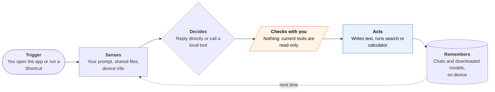

<!-- Generated by scripts/build.py from data/ideas.json. Edit the JSON, then run the script. -->

[← All ideas](../README.md) · **Being built now** · Learning & memory

# B-26 · Offline on-device LLM apps

> Run open models entirely on your iPhone; a few now add tool calling, Shortcuts actions and local APIs.

| Difficulty | Novelty | Buildable on iOS today | Impact if it works | Horizon | Autonomy |
|---|---|---|---|---|---|
| `●●○○○` 2/5 | `●●○○○` 2/5 | `●●●●●` 5/5 | `●●○○○` 2/5 | Buildable now | L1 · Suggests, you act |

## The moment

You're on a flight with no Wi-Fi and need to rewrite a tense email to your landlord. You open a local model app, load a 4B model you downloaded last week, and it redrafts the email offline. Nothing leaves the phone, though the phone gets warm.

## The problem

Cloud assistants need a connection and see everything you type. Some people want a model that works offline and keeps private text on the device. Local model apps deliver that, but most are chat windows. They rarely touch Calendar, Reminders, Files or other apps, so they aren't agents yet.

## How the agent works

## iOS building blocks

- **Foundation Models (SystemLanguageModel, LanguageModel protocol)** — Apple's free on-device model, or a local open model behind the same session and tool API
- **Core AI (iOS 27)** — run exported open models on the Neural Engine and GPU
- **MLX Swift (mlx-swift-lm, open-source package)** — load Hugging Face MLX models, including into Foundation Models sessions
- **Increased Memory Limit entitlement (com.apple.developer.kernel.increased-memory-limit)** — room for multi-GB weights on the devices that support it
- **Background Assets** — download large model files outside the app's first launch
- **BGContinuedProcessingTask with the Background Inference entitlement** — finish a long job on the Neural Engine after the user leaves the app
- **App Intents** — expose rewrite or summarize actions to Shortcuts and Siri

## What makes it hard

- Memory. 4B-class models need several GB of RAM. The increased-memory entitlement works only on some devices, and apps must check os_proc_available_memory before loading.
- Heat and battery. Long sessions throttle, so speed drops and the phone heats up. Agent loops with many tool calls make it worse.
- Downloads of 1-8 GB per model. App Review requires disclosing download size, and many users leave before the first answer.
- Small models are brittle at tool calling: they pick the wrong tool or malform arguments more often than cloud models. Agent features need strict schemas (guided generation) and only a few tools.

## Risks and failure modes

- Open models often ship with lighter safety tuning than hosted ones, and an offline app has no server-side filter. The app owns its outputs, including answers to health or legal questions.
- 'Private' claims have to be true. Analytics, crash logs or a silent cloud fallback can send prompts off the device.
- Apple's free on-device model and Private Cloud Compute tier may undercut paid local-model apps and leave them a hobbyist niche.

## Unsaid assumptions

_What this idea quietly depends on being true. Check these before you build._

- That privacy-minded users will accept a weaker model to keep their data on the phone.
- That iPhones keep gaining enough RAM for useful models, instead of vendors pushing everything to the cloud.
- That open-weight licenses (Gemma 4 is Apache 2.0) stay permissive enough to ship inside paid apps.

## Unknown unknowns

_Open questions nobody has good answers to yet._

- Can a 2-4B local model run a reliable multi-step tool loop over Calendar, Reminders and Files, or only single calls?
- Will Core AI and the LanguageModel protocol make 'bring your own model' a feature of every app rather than its own app category?
- How long can a phone sustain agent-style inference before thermal limits make it unusable?

## Prior art and who's building

- [PocketPal AI](https://github.com/a-ghorbani/pocketpal-ai) — Open-source local model app (about 8.4k GitHub stars). Mostly chat; no App Intents actions or background tasks.
- [fullmoon](https://github.com/mainframecomputer/fullmoon-ios) — Swift and MLX local chat app (about 2.3k stars). A clean base, not an agent.
- [Private LLM](https://privatellm.app/blog/run-local-gpt-on-ios-complete-guide) — Paid app with many on-device models and Siri and Shortcuts actions, one of the few that reach beyond chat.
- [Off Grid and other offline apps](https://dev.to/alichherawalla/how-to-run-llms-locally-on-your-iphone-in-2026-completely-offline-no-subscription-4b3a) — 2026 guide to offline iPhone model apps, including ones that added tool calling.
- [Gemma 4 E2B](https://huggingface.co/google/gemma-4-E2B-it) — Open model sized for phones, with image and audio input and native function calling.

## Smallest useful first version

Take an open-source local chat app and add three App Intents: rewrite, summarize, and pull dates into Calendar with a confirm step. Run them on Apple's on-device model by default and on an open model through the LanguageModel protocol when the user picks one. Everything works in airplane mode.

Research notes: what we could and couldn't verify

Star counts are approximate figures from the digest. I left out Private LLM's '140+ models' claim because I didn't open its page. On-phone speed figures for Gemma 4 are unverified, so none are given. The Off Grid details come from a dev.to article in the candidate that I did not open. Locally AI and MLC Chat are named in the candidate and left off the card without links.

## Related ideas

- [M-13 · Blackout Mode Agent](../moonshot/M-13-blackout-mode-agent.md)
- [M-15 · Zero-Cloud Exit Planner](../moonshot/M-15-zero-cloud-exit-planner.md)
- [B-14 · Self-hosted agents, iPhone as node](../building-now/B-14-self-hosted-agent-node.md)
