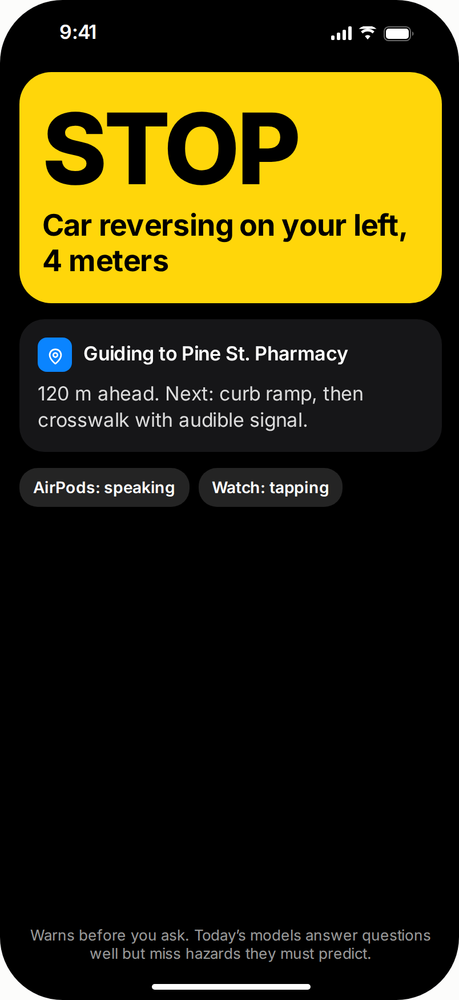
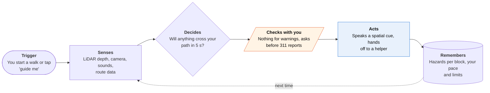
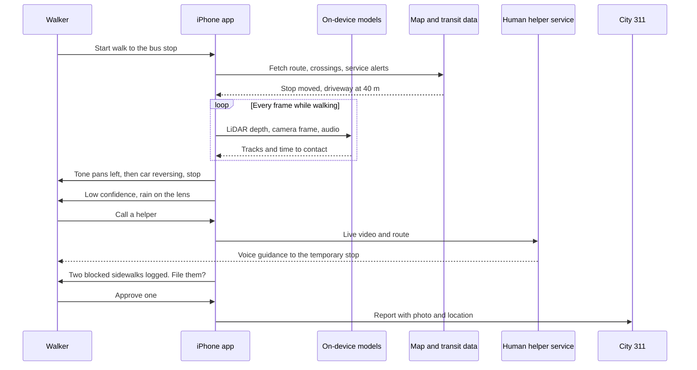

<!-- Generated by scripts/build.py from data/ideas.json. Edit the JSON, then run the script. -->

[← All ideas](../README.md) · **Moonshots** · Accessibility

# M-01 · Seconds-Ahead Hazard Voice

> Warns a blind walker about the reversing car or open trench before they reach it, not after they ask.

| Difficulty | Novelty | Buildable on iOS today | Impact if it works | Horizon | Autonomy |
|---|---|---|---|---|---|
| `●●●●●` 5/5 | `●●●○○` 3/5 | `●●○○○` 2/5 | `●●●●●` 5/5 | 3–5 years | L3 · Acts in guardrails, reports back |

## The moment

You're walking to the bus with your cane, iPhone in a chest harness, open-ear headphones on. Eight seconds before a driveway, a low tone pans to your left and a voice says 'car reversing, stop'. Two blocks later it tells you the stop moved for construction and guides you to the temporary one.

## The problem

Blind and low-vision walkers already have apps that answer questions: point the camera, ask what's there. Dangerous moments don't wait for a question: a car backing out, a bike on the sidewalk, a trench that wasn't there yesterday. A cane finds what's at ground level within reach, and guide dogs are scarce. No phone app decides on its own when to interrupt, and Apple says its own detection mode should not be relied on for navigation.

## How the agent works

## Deep dive

The warning loop has to run entirely on the phone, because a round trip to a server takes longer than a reversing car needs to close the gap. The cloud only does the slow work before and after the walk: fetching the route, service alerts and known sidewalk problems, and filing reports afterwards.

### What the first 90 days look like

Weeks 1 to 4: record walks with orientation-and-mobility instructors and blind volunteers, phone in a chest harness, and label every near-miss: driveways, bikes on the sidewalk, construction, head-height branches. This becomes the test set, and it matters more than any model. Weeks 5 to 8: ship a TestFlight build with only two camera warnings (vehicle entering your path, drop-off ahead) plus route warnings from transit service alerts, which need no camera at all. Walkers double-tap to flag a moment where it should have warned and didn't. Weeks 9 to 12: publish miss and false-alarm rates for each hazard type before adding any new class, and decide with the testers which hazards earn a spoken word and which only earn a tone.

### The hardest engineering problem

Deciding when to speak. Detection is the easier half: LiDAR depth and small detectors already find cars, poles and curbs. The hard half is a policy that turns a stream of tracked objects into very few interruptions. Will this car's path and yours meet in the next five seconds, and is it worth breaking the walker's concentration while they are also listening to traffic? The policy has to run at camera frame rate inside a heat budget, say out loud when the phone is throttling or the lens is wet rather than going quiet, and be judged on miss rate, not on average accuracy. VIABench suggests that general multimodal models are not the answer yet. For now, small specialized trackers plus a hand-tuned, testable policy probably are.

### How it makes money

Blind and low-vision people are a small market with many low incomes, so the core warning feature should be free or cheap. Money can come from a subscription for helper minutes, licensing the warning engine to remote-assistance services and glasses makers, and paid pilots with cities and transit agencies that want structured, geotagged reports of sidewalk barriers. Some rehabilitation and employment programs already buy assistive technology for clients, which is a route to paying for chest harnesses or glasses.

## iOS building blocks

- **ARKit (ARFrame.sceneDepth)** — per-frame LiDAR depth to measure drop-offs, poles and closing distance
- **Core AI and Vision** — run small custom detectors and trackers (vehicles, bikes, curbs) on the Neural Engine
- **SoundAnalysis (SNClassifySoundRequest)** — hear engines, horns and sirens before the camera sees them
- **PHASE** — place warning tones in space so direction is audible without words
- **AVSpeechSynthesizer** — short spoken warnings at the user's preferred rate
- **Core Location and MapKit** — route, heading and known crossings for warnings that need no camera
- **ProcessInfo.thermalState** — notice heat throttling and say out loud that warnings are degraded
- **Meta Wearables Device Access Toolkit (third-party SDK, developer preview)** — a head-height glasses camera stream instead of a chest-mounted phone

## What makes it hard

- The wall (research): the model must choose when to speak. VIABench (July 2026) shows current multimodal models do worst at exactly this: warning ahead of time about navigation-critical events. A safe system needs almost no misses on cars and drop-offs and few enough false alarms that people don't tune it out. Nobody has shown both at once.
- The wall (platform): third-party apps get camera frames only in the foreground, so the phone must stay awake, open and pointed forward for the whole walk. Hours of LiDAR plus neural inference heat the phone, and a throttled phone sees less, later. What would have to change: an accessibility entitlement for continuous camera use with a visible indicator, or a glasses camera path out of developer preview.
- The wall (liability): a missed car is an injury, and Apple's own Magnifier Detection Mode says not to rely on it for navigation. What would have to change: a clear legal framing as a supplement to cane or guide dog, published miss rates per hazard, and possibly a standards or medical-device route.
- Latency: detection, prediction and a warning must fit well under a second, and a spoken sentence itself takes a second or more. Tones have to carry most of the meaning.

## Risks and failure modes

- Over-trust is the safety line: a walker leans on it and stops scanning with the cane. It must never say a path is clear, only that something is coming, and silence must never mean safe.
- Alarm fatigue: too many warnings and people mute it, then miss the one that matters.
- Bystander privacy: it films streets all day. Frames stay on the phone, faces are never stored, and video goes to a human helper only when the walker asks.

## Unsaid assumptions

_What this idea quietly depends on being true. Check these before you build._

- Blind users will wear a chest-mounted phone or camera glasses in public for a whole walk.
- People will trust a device that sometimes stays silent when it should not, as long as it never replaces the cane.
- Crossing, driveway and construction data exists in usable form for the user's city.

## Unknown unknowns

_Open questions nobody has good answers to yet._

- What miss rate and false-alarm rate would orientation-and-mobility instructors accept, and how would anyone measure them outside a lab?
- Who is liable when a warning comes too late: the app maker, the model vendor, or nobody?
- Does a camera at eye level (glasses) or chest level (phone) catch more of the hazards that matter, such as head-height poles versus curb drop-offs?

## Prior art and who's building

- [Biped NOA](https://biped.ai/noa-chat) — A wearable with 3D cameras that predicts obstacle paths a few seconds ahead and gives audio cues. Dedicated hardware, not an iPhone agent.
- [VIABench](https://huggingface.co/papers/2607.14660) — Benchmark built from blind people's first-person video. Models struggle most with proactive warnings about navigation-critical events.
- [Apple Magnifier Detection Mode](https://support.apple.com/guide/iphone/detect-doors-around-you-iph35c335575/ios) — Detects people, doors and furniture with LiDAR on Pro iPhones and gives sound, speech and haptics. Reactive, few classes, and Apple says not to rely on it for navigation.
- [Meta Wearables Device Access Toolkit for iOS](https://github.com/facebook/meta-wearables-dat-ios) — Lets iPhone apps stream video from Meta's glasses, including in the background. Developer preview only.
- Be My Eyes, Aira and Seeing AI — Human help or scene description on request. The natural fallback when the agent's confidence drops, but none warns unprompted.

## Smallest useful first version

Partial version buildable today: a foreground app for Pro iPhones with three narrow, well-tested detectors (vehicles near driveways, drop-offs, head-height obstacles) using LiDAR depth, plus route warnings from map and transit alerts that need no camera. When light, rain or heat degrade it, it says so and offers a one-tap handoff to a human helper. Pilot it with orientation-and-mobility instructors walking alongside.

Research notes: what we could and couldn't verify

Mermaid sequence diagrams keep the double quotes as visible text when rendered (checked with the repo's Mermaid build in Chromium); strip them globally if that looks wrong. SoundAnalysis's built-in classifier covers vehicle and siren sounds, but I did not check whether it includes reversing beeps specifically, so the card says engines, horns and sirens.

## Related ideas

- [B-19 · Blind-assist scene agents](../building-now/B-19-blind-assist-scene-agents.md)
- [M-23 · Kiosk Hands](../moonshot/M-23-kiosk-hands.md)
- [W-29 · Step-Free Scout](../whitespace/W-29-step-free-scout.md)
