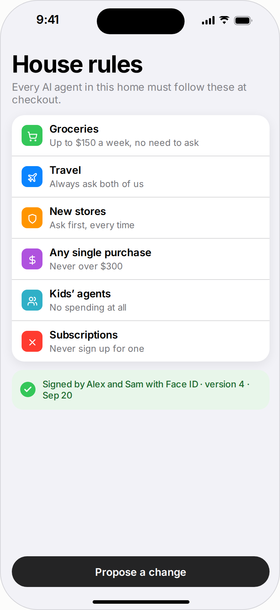
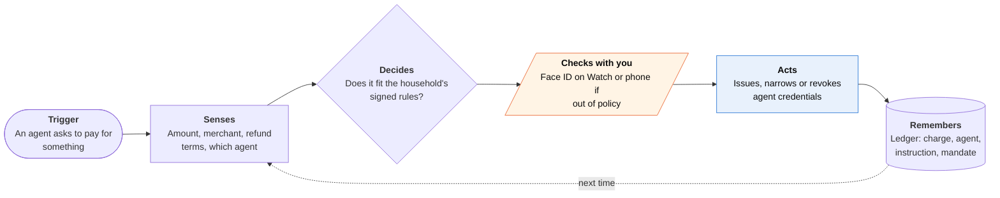
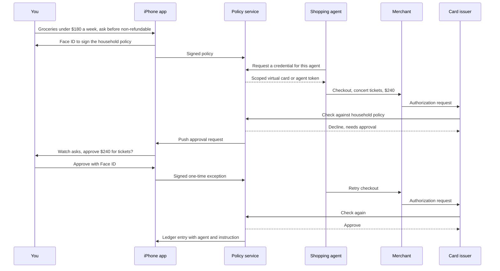

<!-- Generated by scripts/build.py from data/ideas.json. Edit the JSON, then run the script. -->

[← All ideas](../README.md) · **Moonshots** · Money & commerce

# M-02 · Household Spending Constitution

> One set of spending rules, signed with Face ID, that every AI agent in your home must follow at checkout.

| Difficulty | Novelty | Buildable on iOS today | Impact if it works | Horizon | Autonomy |
|---|---|---|---|---|---|
| `●●●●●` 5/5 | `●●●●○` 4/5 | `●●○○○` 2/5 | `●●●●○` 4/5 | 3–5 years | L3 · Acts in guardrails, reports back |

## The moment

Your partner shops through Alexa, you use Muse, and your teenager's school-trip agent books buses. You set one rule set: groceries under $180 a week, nothing over $50 from a new merchant, nothing non-refundable without asking. When one agent tries to buy non-refundable concert tickets, the charge is declined at authorization and your Watch offers a one-tap approval.

## The problem

Households now run several agents that can spend money: Amazon's Buy for Me and Auto Buy, Meta's Muse with one-time Stripe Link cards, Google's agentic checkout, card-network tokens inside ChatGPT. Each has its own limits in its own settings screen, and none knows what the others spent. Nobody can answer 'what did our agents buy this week, and on whose instruction?', and one hijacked agent can spend up to its own cap before anyone notices.

## How the agent works

## Deep dive

The design pulls apart three things that today's agents bundle together: who writes the rules (the household), who holds a credential (each agent), and who enforces the rules (the card issuer, at the moment of authorization). The phone is where rules get signed and exceptions get approved.

### What the first 90 days look like

Month 1: pick one card-issuing platform with real-time authorization webhooks and give ten test households one virtual card per agent. Rules start as plain fields: a weekly cap per category, a cap for new merchants, a list of always-allowed merchants such as the pharmacy. Month 2: add the plain-language rule editor (an on-device model turns sentences into the structured policy, and the app reads it back for confirmation), the Watch approval path, and a ledger that matches each charge to the agent's receipt email and to FinanceKit data where available. Month 3: run revocation drills ("this agent was prompt-injected, shut it off now") and count false declines per household per week. That number decides whether anyone keeps using it.

### The hardest engineering problem

Timing. An issuer's authorization webhook has to answer within a few seconds, but a human approval takes a minute. So an out-of-policy purchase is always declined first and retried after you approve with a signed one-time exception, and every agent has to handle "declined, retry later" without giving up or retrying in a loop. Some merchants flag a declined-then-retried card as fraud. The second problem is information: an authorization message carries an amount and a merchant category, not refund terms or which instruction caused it. Rules like "nothing non-refundable" need the agent to declare those facts in a signed mandate before checkout, and the ledger to check the receipt afterwards.

### How it makes money

A household subscription priced like a streaming service, plus a share of interchange on the issued cards. Longer term, issuers and card networks could license the policy engine as the consumer-facing control for their own agent tokens, the way businesses already pay for spend controls on corporate cards.

## iOS building blocks

- **CryptoKit (SecureEnclave.P256.Signing)** — signs the household policy and each exception with a key that never leaves the phone
- **LocalAuthentication (LAContext)** — Face ID before signing rules or approving an out-of-policy purchase
- **ActivityKit and LiveActivityIntent** — a Lock Screen approval card with Approve and Decline buttons
- **UserNotifications (time-sensitive, actionable)** — approval requests that also reach Apple Watch
- **FinanceKit** — reads Apple Card and Apple Cash transactions to reconcile charges (managed entitlement)
- **PassKit (PKRecurringPaymentRequest, PKDeferredPaymentRequest)** — the closest Apple Pay primitive today: merchant tokens for pre-agreed charges, with no agent delegation
- **Foundation Models** — turns plain-language rules into a structured policy on-device with @Generable
- **App Intents (IntentAuthenticationPolicy)** — lets Siri or Shortcuts query the ledger or pause an agent, with authentication required

## What makes it hard

- The wall (platform): Apple Pay and Wallet have no agent-delegation or mandate API in iOS 27, and every Apple Pay authorization needs the user present on the payment sheet. A consumer app can't sit between an agent and the cards in your Wallet.
- The wall (payment networks): enforcing a rule at authorization needs issuer or network cooperation. Mastercard's agentic tokens already bind a card to one agent, a merchant scope and a consent policy, but each token carries its own policy. Nothing evaluates a household rule like 'groceries under $180 a week across all agents'.
- No shared policy format: AP2 mandates, ACP delegated payments, UCP and the card-network tokens each describe consent differently, and 'refundable' or 'new merchant' is not a field any of them reliably carries at authorization.
- What would have to change: a Wallet API for agent tokens or signed mandates, issuer hooks that ask a customer's own policy engine before approving (as corporate-card spend controls already do for businesses), and a common policy schema across AP2, ACP, UCP and the card networks.

## Risks and failure modes

- A false decline strands a real need, such as a prescription or a ride home. Keep an always-allowed list and a one-tap override that is logged, not blocked.
- Control inside a household: one partner could use it to police the other. Each adult sets rules for their own agents, shared rules need both to sign, and nobody's purchases are hidden from them.
- Money safety line: it never moves or holds money itself. It only issues, narrows and revokes credentials, and every decision is logged with the rule that caused it.

## Unsaid assumptions

_What this idea quietly depends on being true. Check these before you build._

- Families want one policy over all their agents instead of trusting each vendor's own guardrails.
- Card networks and issuers will let a consumer app sit in, or next to, the authorization path.
- Agents will accept a credential they didn't issue, rather than insisting on their own wallet (Stripe Link cards, Google Pay, an Amazon account).

## Unknown unknowns

_Open questions nobody has good answers to yet._

- Who pays when a purchase fits the policy but is plainly wrong: the household, the agent maker or the issuer?
- Can refundability and 'recurring' be known reliably at authorization time, or only after checkout?
- If Apple builds agent controls into Wallet itself, is there room left for a third-party policy app?

## Prior art and who's building

- [Mastercard Agent Pay](https://www.mastercard.com/us/en/news-and-trends/press/2025/april/mastercard-unveils-agent-pay-pioneering-agentic-payments-technology-to-power-commerce-in-the-age-of-ai.html) — Agentic tokens bind a card to one agent, merchant scope and consent policy. Limits are per agent, not a household policy across agents and networks.
- [Google AP2 (Agent Payments Protocol)](https://cloud.google.com/blog/products/ai-machine-learning/announcing-agents-to-payments-ap2-protocol) — Signed intent, cart and payment mandates for human-present and human-not-present purchases. A mandate format, not a family rulebook.
- [Agentic Commerce Protocol](https://github.com/agentic-commerce-protocol/agentic-commerce-protocol) — OpenAI and Stripe's checkout and delegated-payment spec. Limits live inside each agent platform.
- [What's new in Wallet (WWDC26)](https://developer.apple.com/videos/play/wwdc2026/209/) — Pass features and Verify with Wallet. No agent-payment or mandate API.
- [Privacy.com merchant-locked cards](https://www.privacy.com/merchant-cards) — Virtual cards locked to one merchant with weekly or monthly limits. The closest thing today, but it knows nothing about agents, refundability or shared household rules.
- [How Agents Ask for Permission (survey)](https://huggingface.co/papers/2607.13718) — Reviews 21 permission proposals and five commercial agents. Most apply one product-level policy to every user and lack user-level rules.

## Smallest useful first version

Partial version buildable today: give each agent its own virtual card from a card-issuing platform with real-time authorization webhooks, and check every authorization against the household rules before approving. Out-of-policy charges are declined and a Live Activity or Watch notification asks you to allow a retry. Revoking an agent means closing its card, not yours, and it covers only agents that accept a card you give them.

Research notes: what we could and couldn't verify

The partial version names no specific issuing platform; Stripe Issuing and Lithic both offer real-time authorization decisions, but I did not re-check their current response-time limits, so the deep dive says 'a few seconds'. Mastercard agentic-token scope (agent, merchant scope, consent policy) is from the research digest and secondary explainers, not Mastercard's own documentation.

## Related ideas

- [W-03 · Agent Control Tower](../whitespace/W-03-agent-control-tower.md)
- [W-16 · Ulysses Money Pact](../whitespace/W-16-ulysses-money-pact.md)
- [M-12 · Household Agent Treaty](../moonshot/M-12-household-agent-treaty.md)
