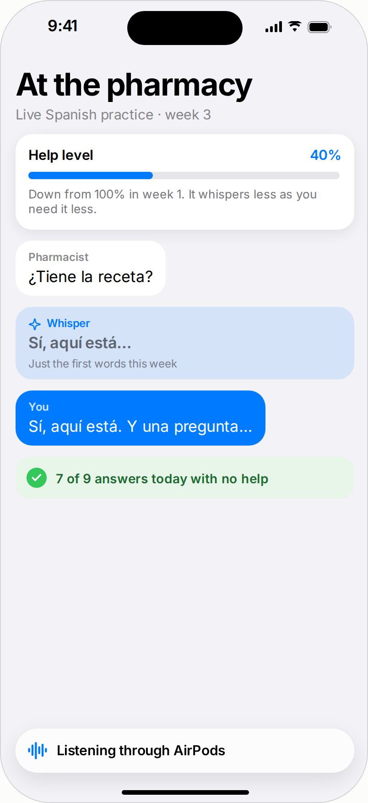
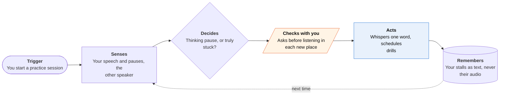
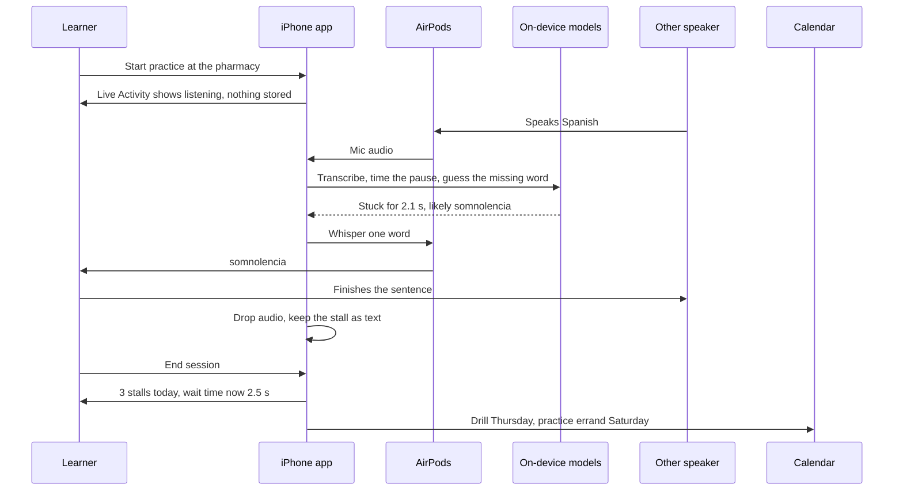

<!-- Generated by scripts/build.py from data/ideas.json. Edit the JSON, then run the script. -->

[← All ideas](../README.md) · **Moonshots** · Learning & memory

# M-03 · Fading Whisper

> An earbud prompter for real conversations in a new language that gives you less help every week.

| Difficulty | Novelty | Buildable on iOS today | Impact if it works | Horizon | Autonomy |
|---|---|---|---|---|---|
| `●●●●○` 4/5 | `●●●●●` 5/5 | `●●○○○` 2/5 | `●●●●○` 4/5 | 3–5 years | L3 · Acts in guardrails, reports back |

## The moment

You're at a pharmacy in Seville and stall on the word for 'drowsy'. After a two-second pause your AirPods whisper 'somnolencia', and nothing more. By month three it waits five seconds before helping, and most weeks it says nothing at all.

## The problem

Learners hit a wall when they move from apps to real conversations: they freeze on one missing word and switch to English or pull out a translator. Translation earbuds and AirPods Live Translation carry the conversation for you, which replaces your speaking instead of building it. AI tutors practice with a character, not with the pharmacist. Nothing gives just enough help inside a live conversation and then steps back.

## How the agent works

## Deep dive

The product is a control loop on the amount of help. Everything else serves that loop: how long to wait before whispering, how much to say, and when to say nothing at all. Success is measured by how rarely it speaks.

### What the first 90 days look like

Start with learners who already live or travel abroad and already wear AirPods. Weeks 1 to 4: only the simplest trigger. When you stall, you say the English word under your breath and it whispers the target word. No hesitation detection yet, and a weekly report of your stalls. Weeks 5 to 8: add automatic stall detection as a suggestion you confirm with a tap, which builds a labeled set of real stalls versus thinking pauses for each person. Weeks 9 to 12: turn on fading for volunteers, keep a control group on constant help, and compare how often each group still needs a hint by week 12. That comparison is the product's reason to exist, so it has to come early, not after launch.

### The hardest engineering problem

Telling thinking from stuck fast enough to matter, in a shop, with a phone in your pocket and a mic in your ear. Pause length alone fails: some people pause mid-sentence as a habit, others fill silence with "eh" or "este". It probably needs calibration to each person, prosody features and the half-finished sentence, so a model can guess which word is missing. That guess has to come from a model small enough to run on the phone, because a two-second budget leaves no room for a server in bad reception. The fade policy sits on top as a small, visible rule set: "waiting 3 seconds now, because you needed help 4 times last week, down from 11."

### How it makes money

A subscription priced like a language app, sold around a move or a long trip ("your first 90 days in Spain"). Employers that relocate staff and study-abroad programs could buy it per learner. The honest pitch is that success means the user stops needing it, so the price should cover a fixed course length rather than an open-ended subscription that profits from dependence.

## iOS building blocks

- **AVAudioSession and AVAudioEngine** — capture the mic and play the whisper into AirPods during a visible, user-started session
- **Speech (SpeechAnalyzer, SpeechTranscriber, SpeechDetector)** — on-device transcription and voice activity detection to time pauses
- **Translation (TranslationSession)** — on-device lookup of the one missing word or short phrase
- **Core AI or MLX Swift** — run a small local model that predicts which word you were reaching for
- **ActivityKit** — a 'listening' Live Activity shown for the whole session
- **AVSpeechSynthesizer** — speak the whispered word quietly in the target language
- **EventKit** — put next week's drills and practice errands on your calendar
- **Core Location (CLMonitor)** — offer, never start, a session when you arrive somewhere you practiced before

## What makes it hard

- The wall (research): nobody has a validated model of when a hint teaches and when it becomes a crutch. Fading help comes from classroom research on scaffolding, not live conversation. The app also has to tell a thinking pause from being stuck in under a second, in a noisy shop, next to a speaker it has never heard.
- The wall (latency): the path from hearing your stall to whispering a word must fit inside a pause of about two seconds, so it can't depend on a server. Full-duplex speech models now run on MLX Swift (Kyutai's moshi-swift), but no one has published iPhone performance numbers for them.
- The wall (law): processing a stranger's speech, even briefly and without storing it, can fall under two-party-consent recording laws in some US states and under GDPR in the EU. Apple's own Live Captions and Live Translation process other people's speech, but a third-party app has no settled legal footing. What would have to change: clear legal treatment of transient, on-device processing that stores nothing.
- The wall (platform): Apple's in-person Live Translation on AirPods is not open to apps, and the Call Translation API covers only VoIP calls. Background listening needs an active, visible audio session. What would have to change: an AirPods conversation-audio API for third parties, or a 'hint only' mode in Apple's own Live Translation.

## Risks and failure modes

- Dependence: if the fade schedule is wrong, it becomes the crutch it was meant to remove. Track how often it speaks and show the learner that number.
- Bystander privacy: the other person never agreed to be processed. Never store their audio or transcript, keep the indicator visible, and default off where recording rules are strict.
- Wrong word in a health or legal setting: a bad hint about a medicine can cause harm. At pharmacies and clinics, it should suggest confirming with the other person rather than supply the term with confidence.

## Unsaid assumptions

_What this idea quietly depends on being true. Check these before you build._

- A whisper at the right moment builds fluency rather than dependence. This scaffolding hypothesis is untested for live conversation.
- Learners will wear earbuds in a conversation without the other person finding it rude.
- Hesitation looks similar enough within one person that a model can learn it in a few sessions.

## Unknown unknowns

_Open questions nobody has good answers to yet._

- Which fade schedule works: fixed weeks, per-word mastery, or the learner's own choice?
- Is a transient, never-stored transcript of the other speaker a 'recording' under two-party-consent laws?
- Does hearing the right word once, in context and under pressure, stick better than a flashcard later?

## Prior art and who's building

- [LlamaPIE (proactive in-ear assistant)](https://arxiv.org/pdf/2505.04066) — Research prototype that decides when to offer short hints through earbuds during a conversation. General help, not language learning with fading.
- [moshi-swift (Kyutai)](https://github.com/kyutai-labs/moshi-swift) — Full-duplex Moshi and Hibiki speech translation ported to MLX Swift with an experimental iOS app. Shows the local pieces exist; no device benchmarks.
- [Timekettle earbuds in classrooms](https://wmich.edu/x/news/2025/05/ai-powered-earbuds) — Translation earbuds used in classes. They translate for you instead of helping you speak.
- [Duolingo Video Call](https://blog.duolingo.com/video-call/) — Real-time AI conversation practice. Practice with an AI character, not help inside real conversations.
- [AirPods Live Translation and the Call Translation API](https://developer.apple.com/forums/thread/789314) — Apple translates in-person speech on AirPods but opens translation to apps only for VoIP calls (CXSetTranslatingCallAction).

## Smallest useful first version

Partial version buildable today: a user-started 'practice errand' mode, with a Live Activity showing it's listening. When you stall, you say the English word under your breath and it whispers the target word. It keeps only your stalls as text, turns them into next week's drills, and fades on a schedule you can see.

Research notes: what we could and couldn't verify

The Apple forums URL is the digest's source for the Call Translation API; I found no Apple page for AirPods Live Translation itself. Whether a transient transcript counts as a recording under two-party-consent laws is a real open legal question, stated as such.

## Related ideas

- [B-17 · AI conversation tutors](../building-now/B-17-ai-conversation-tutors.md)
- [W-22 · Errand Immersion](../whitespace/W-22-errand-immersion.md)
