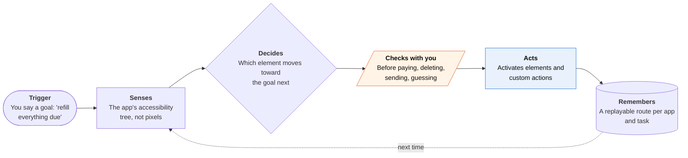

<!-- Generated by scripts/build.py from data/ideas.json. Edit the JSON, then run the script. -->

[← All ideas](../README.md) · **Moonshots** · Accessibility

# M-04 · Agent That Reads VoiceOver's Map

> An on-device agent that works any app through its accessibility tree, the way VoiceOver does, for blind users.

| Difficulty | Novelty | Buildable on iOS today | Impact if it works | Horizon | Autonomy |
|---|---|---|---|---|---|
| `●●●●●` 5/5 | `●●●●○` 4/5 | `●○○○○` 1/5 | `●●●●●` 5/5 | 3–5 years | L3 · Acts in guardrails, reports back |

## The moment

You're blind, and your pharmacy's app has no App Intents and takes about 40 VoiceOver swipes to refill a prescription. You say 'refill everything that's due'. The agent walks the app's accessibility elements itself, stops at an unlabeled button or a real choice, and tells you exactly what it did.

## The problem

VoiceOver makes most apps reachable, but reachable isn't the same as quick: a refill, a benefits form or a return can take dozens of swipes through badly labeled screens. Agents that could do this work drive screens by pixels, and they fail under assistive tech: in the A11y-CUA study, a computer-use agent's success fell from 78.3% to 28.3% under magnifier conditions. Siri AI acts only in apps that adopt App Intents, and the apps blind users struggle with most usually haven't.

## How the agent works

## iOS building blocks

- **UIAccessibility (accessibilityActivate, UIAccessibilityCustomAction)** — the actions the agent would perform; today they work only inside its own app
- **AccessibilityNotification** — announce what the agent did and hand VoiceOver focus back to you
- **App Intents (app schemas)** — the sanctioned route, tried first wherever an app has adopted intents
- **Foundation Models (onToolCall)** — plan the next step over the element list on-device, with a hard stop before risky actions
- **Core AI** — run a small UI-grounding model to guess what an unlabeled button is
- **WebKit (WKWebView)** — the partial version: read a website's accessibility attributes inside the app's own browser

## What makes it hard

- The wall (platform): iOS gives no third-party app access to another app's accessibility tree and no way to perform actions in it. There is no equivalent of Android's AccessibilityService, which malware has abused heavily, so Apple has good reason to keep it closed.
- What would have to change: a restricted 'assistive agent' entitlement with Switch Control-style consent and a visible indicator, or VoiceOver itself accepting goals from an agent the user picks. Apple's 2025 brain-computer interface protocol for Switch Control shows it will add new input classes for disability needs. In the EU, disability groups could ask for this under the Digital Markets Act's interoperability rule (Article 6(7)).
- The wall (research): agents must plan on accessibility semantics, not screenshots, and the hardest apps for blind users tend to be the worst labeled. A vision fallback helps (Ferret-UI Lite shows a 3B on-device model can ground UI elements) but it is still a guess.
- Even in research, iPhone agents are far from reliable: iOSWorld (June 2026) had to build 26 of its own apps and drive them from a Mac through XCUITest, and the best setup reached 52% overall and 37% on multi-app tasks.

## Risks and failure modes

- An agent that can drive any app is also ideal for malware and stalkerware, as Android showed. Access must be tied to accessibility settings, run locally, and be revocable at any time.
- Silent wrong choices: picking one of several equal options without saying so. It must pause at every real decision and read the options aloud.
- Payments, deletions and messages are never completed without explicit confirmation, even when the goal says 'everything'.

## Unsaid assumptions

_What this idea quietly depends on being true. Check these before you build._

- Apps are labeled well enough to plan on, when the apps hardest for blind users are usually the worst labeled.
- Blind users want to hand off whole tasks, not just speed up VoiceOver navigation.
- Apple would trust a third-party agent at the same level as its own assistive features.

## Unknown unknowns

_Open questions nobody has good answers to yet._

- If Siri AI gains actions in any app through on-screen awareness, will it pause at choices and return focus the way blind users need, or is a separate agent still required?
- How would an entitlement check that the user needs it, without creating a registry of disabled people?
- Would developers label their apps better once agents, not only VoiceOver users, depend on those labels?

## Prior art and who's building

- [mobile-mcp](https://github.com/mobile-next/mobile-mcp) — MCP server that reads the accessibility tree on simulators and USB-tethered iPhones for QA. Needs a Mac and a cable; no use to a blind person on the go.
- [iOSWorld benchmark](https://arxiv.org/html/2606.09764v1) — First native-iOS agent benchmark. Had to build its own apps and drive them from a Mac.
- [Apple Ferret-UI Lite](https://machinelearning.apple.com/research/ferret-ui) — Apple's on-device GUI agent research. Grounds UI elements well but still fails at multi-step navigation.
- [A11y-CUA dataset](https://huggingface.co/papers/2602.09310) — Traces from blind, low-vision and sighted users. Computer-use agent success drops sharply under assistive-tech conditions.
- [Morae](https://huggingface.co/papers/2508.21456) — Pauses UI agents at decision points so blind users choose. The interaction model this agent needs.
- [Apple's brain-computer interface protocol for Switch Control](https://www.idownloadblog.com/2025/05/13/apple-iphone-brain-computer-interfaces-details/) — May 2025: Apple added BCIs as a Switch Control input. A precedent for new assistive input classes, not an agent API.

## Smallest useful first version

Partial version buildable today: an agent with the same interaction model (goal in, pause at decisions, focus returned to the exact element) that works only through sanctioned routes. That means App Intents through Shortcuts, websites opened in its own WKWebView where it reads accessibility attributes, and services with APIs. It logs unlabeled controls to report to developers, building the planning and trust design while the platform stays closed.

Research notes: what we could and couldn't verify

The BCI protocol source is a press article (iDownloadBlog, May 13, 2025) found by search; Apple's newsroom post was not opened. The DMA Article 6(7) route is a possibility, not an existing request.

## Related ideas

- [B-19 · Blind-assist scene agents](../building-now/B-19-blind-assist-scene-agents.md)
- [M-05 · Assistive Agent Pass](../moonshot/M-05-assistive-agent-pass.md)
- [M-23 · Kiosk Hands](../moonshot/M-23-kiosk-hands.md)
