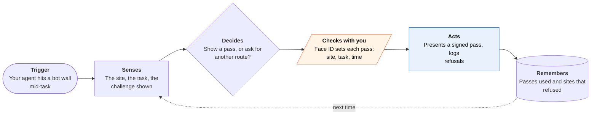

<!-- Generated by scripts/build.py from data/ideas.json. Edit the JSON, then run the script. -->

[← All ideas](../README.md) · **Moonshots** · Safety & civic

# M-05 · Assistive Agent Pass

> Lets a disabled person's agent past CAPTCHAs and bot walls, the way sites must already admit a screen reader.

| Difficulty | Novelty | Buildable on iOS today | Impact if it works | Horizon | Autonomy |
|---|---|---|---|---|---|
| `●●●●●` 5/5 | `●●●●●` 5/5 | `●●○○○` 2/5 | `●●●●○` 4/5 | 3–5 years | L3 · Acts in guardrails, reports back |

## The moment

You have limited hand movement, and your agent is renewing your disability parking permit on the city portal. Halfway through, a bot wall appears. Instead of failing, the agent presents a pass showing that a verified person authorized this session as an accessibility accommodation, and the portal lets it finish.

## The problem

Bot defenses get stricter as agent traffic grows, and they already hit disabled people hardest: audio CAPTCHAs, timed puzzles, press-and-hold challenges. For someone with limited hand movement or low vision, an agent is the accommodation, but to the site it looks like any other bot. New token schemes can say 'a human is here' or 'this is a known agent', but none says 'this agent is a person's accommodation', and nothing stops a site from blocking all agents.

## How the agent works

## iOS building blocks

- **DeviceCheck (DCAppAttestService)** — proves the pass was issued by a genuine app on a real iPhone
- **LocalAuthentication (LAContext)** — Face ID before each delegation
- **CryptoKit (SecureEnclave)** — signs the short-lived delegation token
- **AuthenticationServices (passkeys)** — ties the pass to your existing account where the site has one
- **PassKit (PKIdentityAuthorizationController)** — Verify with Wallet could confirm a real adult without revealing any disability (entitlement-gated)
- **ActivityKit** — shows the live agent session with a revoke button

## What makes it hard

- The wall (standards): Cloudflare's signed agents and Web Bot Auth identify an agent's operator, and PACT (proposed in June 2026 by Cloudflare with Chrome, Edge, Firefox and Shopify) would let browsers prove a human is in the loop. None has an 'assistive use' class, and PACT has no rollout date.
- The wall (regulation): no regulator has said that blocking an authorized assistive agent is disability discrimination under the ADA or the European Accessibility Act. What would have to change: guidance that treats such an agent like a screen reader, plus a duty to offer an accessible alternative route.
- The wall (privacy research): proving a need for accommodation without revealing the disability, or creating a registry of disabled people, needs anonymous credentials that aren't deployed anywhere.
- The wall (platform and abuse): Apple's Private Access Tokens serve the device's own browser, not a delegated cloud browser. And if a pass works, everyone will want one, so fraud controls (per-person issuance, tight scopes, instant revocation) are part of the wall, not an afterthought.

## Risks and failure modes

- An accidental disability registry: whoever issues passes learns who is disabled. Issuance must be unlinkable to use.
- Scalpers and scrapers will claim to be assistive. Tight scopes (one site, one task, 30 minutes) limit the damage.
- Sites may respond by blocking agents harder. Pair every refusal with a request for the accessible route and a documented complaint.

## Unsaid assumptions

_What this idea quietly depends on being true. Check these before you build._

- A need for accommodation can be proven without anyone learning what the disability is or who has one.
- Site owners care more about stopping abuse than about stopping agents as such.
- Disabled users want their agent treated as an accommodation, not as a separate class of user.

## Unknown unknowns

_Open questions nobody has good answers to yet._

- Who should issue the pass: a doctor, a disability agency, the phone maker, or self-attestation backed by rate limits?
- Does existing ADA or EAA law already cover assistive agents, and will a court decide before a regulator does?
- Will sites accept passes from any issuer, or only from agent platforms they have contracts with?

## Prior art and who's building

- [Cloudflare signed agents](https://blog.cloudflare.com/signed-agents/) — Agent operators sign requests so sites can allow known agents. Identifies the operator, not the person or their need.
- [Cloudflare PACT announcement](https://www.cloudflare.com/press/press-releases/2026/cloudflare-collaborates-with-leading-browsers-to-develop-a-privacy-first-protocol-for-the-global-internet/) — Proposed anonymous tokens that prove a human is in the loop, with Chrome, Edge, Firefox and Shopify. Not rolled out; no assistive class.
- [Amazon Bedrock AgentCore Browser Web Bot Auth](https://aws.amazon.com/about-aws/whats-new/2025/10/amazon-bedrock-agentcore-browser-web-bot-auth-preview) — A cloud browser that signs its requests so bot walls can recognize it. Built for enterprise agents, not accommodations.
- Apple Private Access Tokens — Device-attested tokens that let Safari skip some CAPTCHAs. They can't be handed to a cloud browser acting for you.

## Smallest useful first version

Partial version buildable today: log every bot wall the agent hits with a screenshot and timestamp, ask the site for its accessible route by email or support form, and build a complaint file when none exists. Where a site accepts Web Bot Auth, run the task in a signed cloud browser and attach a Face ID-signed statement of who authorized it. That builds the evidence and the delegation format a regulator would need.

Research notes: what we could and couldn't verify

Replaced the candidate's prosopo.io PACT link (blocked by the proxy, so unverified) with Cloudflare's own June 2026 press release, found by search. Search results say PACT has no rollout timeline; I did not confirm that on Cloudflare's page itself.

## Related ideas

- [M-04 · Agent That Reads VoiceOver's Map](../moonshot/M-04-voiceover-map-agent.md)
- [M-06 · Proxy Passport](../moonshot/M-06-proxy-passport.md)
- [B-01 · Cloud-computer errand agents](../building-now/B-01-cloud-errand-agents.md)
