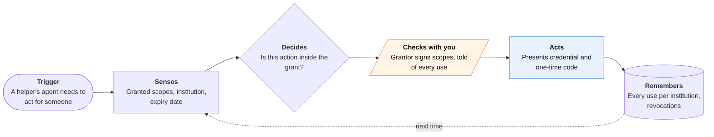

<!-- Generated by scripts/build.py from data/ideas.json. Edit the JSON, then run the script. -->

[← All ideas](../README.md) · **Moonshots** · Family & care

# M-06 · Proxy Passport

> A scoped, revocable 'you may act for me' credential your agent shows pharmacies, insurers and agencies.

| Difficulty | Novelty | Buildable on iOS today | Impact if it works | Horizon | Autonomy |
|---|---|---|---|---|---|
| `●●●●●` 5/5 | `●●●●○` 4/5 | `●●○○○` 2/5 | `●●●●●` 5/5 | 5+ years | L3 · Acts in guardrails, reports back |

## The moment

Your daughter has type 1 diabetes and turns 18 at midnight, and your patient-portal proxy access ends with it. She still wants you handling insulin refills and insurance fights, but not reading her therapy notes. She picks those scopes on her phone and signs with Face ID. The next day your agent calls the pharmacy and presents the credential, and she gets a Watch notice that it was used.

## The problem

Acting for someone else runs on paper: a proxy form at each patient portal, a HIPAA authorization for each insurer, SSA-1696 or IRS Form 2848 for agencies, and phone identity checks that fail Deaf, speech-disabled and older people. The same wall hits teenagers with chronic illness turning 18 and parents who can no longer manage alone. Agents can now call and fill in forms, but they can't prove whom they act for, and voice cloning makes phone identity checks weaker every month.

## How the agent works

## iOS building blocks

- **CryptoKit (SecureEnclave)** — signs the delegation with a key bound to the grantor's phone
- **LocalAuthentication (LAContext)** — Face ID to grant, narrow or revoke
- **PassKit (PKIdentityAuthorizationController)** — Verify with Wallet checks the grantor's ID once (entitlement-gated)
- **DeviceCheck (DCAppAttestService)** — proves the credential came from a genuine app instance
- **UserNotifications** — a use notice on the grantor's iPhone and Watch every time
- **HealthKit (HKClinicalRecord)** — the grantor's own records view, to choose what helpers may see
- **PDFKit** — fills each institution's own proxy or authorization form in the meantime
- **App Intents** — lets Siri answer 'who can act for me right now?' and revoke by voice

## What makes it hard

- The wall (institutions): every portal, pharmacy, insurer and agency has its own proxy process, and none has agreed to accept a portable, machine-checkable delegation. Agencies recognize representatives appointed on paper (SSA-1696, IRS Form 2848) and define no 'digital agent of the principal', or who is liable when it errs.
- The wall (law): powers of attorney and health-care proxies are state law in the US, with different witnessing rules, and a signed digital scope doesn't map neatly onto any of them.
- The wall (platform): Verify with Wallet checks government IDs. Wallet can't hold or present third-party delegation credentials.
- What would have to change: a FHIR or TEFCA-level proxy and consent standard that portals must honor, agency rules that accept a verifiable delegation, and Wallet support for third-party verifiable credentials.

## Risks and failure modes

- Elder financial abuse: a caregiver could pressure someone into granting broad scopes. Scopes default narrow and time-limited, the grantor sees every use, and broad or unusual scopes need a second trusted person.
- Loss of capacity: a parent who can no longer decide can't revoke, so the credential must sit under a real legal instrument (a power of attorney), not replace it.
- Health safety line: sensitive records (therapy notes, reproductive and substance-use records) stay excluded unless the grantor adds them one by one.

## Unsaid assumptions

_What this idea quietly depends on being true. Check these before you build._

- Institutions would rather verify a signed credential than keep paper forms and knowledge-based checks, even though that moves liability they now avoid.
- Grantors can understand scopes well enough to choose them.
- A key held on a phone is an acceptable basis for a legal delegation.

## Unknown unknowns

_Open questions nobody has good answers to yet._

- Who is liable when an agent acts inside a valid credential but causes harm?
- How does a credential survive the grantor losing their phone, or their capacity?
- Would HIPAA accept a scoped, machine-readable authorization in place of each institution's own form?

## Prior art and who's building

- [Verifiable credentials in healthcare](https://noworldborders.com/2026/06/16/verifiable-credentials-in-healthcare/) — Proposals to use verifiable credentials for consent and access rights. Not a deployed proxy system.
- [What's new in Wallet (WWDC26)](https://developer.apple.com/videos/play/wwdc2026/209/) — Verify with Wallet checks government IDs with an entitlement. No third-party delegation credentials.
- [Google AP2 agent payment mandates](https://cloud.google.com/blog/products/ai-machine-learning/announcing-agents-to-payments-ap2-protocol) — Signed mandates for agents that spend money. Nothing comparable exists for agents that speak for a person.
- [Authenticated Delegation and Authorized AI Agents](https://arxiv.org/pdf/2501.09674) — Research framework for delegating scoped authority to AI agents with verifiable credentials.
- Patient-portal proxy access (for example Epic MyChart) — Proxy access set up separately at each organization, with its own forms and age rules.

## Smallest useful first version

Partial version buildable today: a scope builder where the grantor picks what each helper may do and signs it with Face ID. The app fills each institution's own proxy form, HIPAA authorization or SSA-1696 from that one choice, tracks which were accepted, and warns before any expire. Revoking in the app drafts the revocation letters, and the signed credential rides along as an attachment, ready for the first institution willing to check it.

Research notes: what we could and couldn't verify

Merged 'Delegation Agencies Accept' (SSA and IRS paper representation, phone identity checks failing Deaf and older people, caregiver sub-delegation). Left out that source's claim about a September 2026 agent-related breach of an Australian Medicare database, which I could not verify. Feasibility set to 2 rather than 1 because iOS itself doesn't block it; the wall is institutional.

## Related ideas

- [W-10 · Co-Sign, Not Guardian](../whitespace/W-10-co-sign-not-guardian.md)
- [M-11 · Agent Will](../moonshot/M-11-agent-will.md)
- [M-05 · Assistive Agent Pass](../moonshot/M-05-assistive-agent-pass.md)
